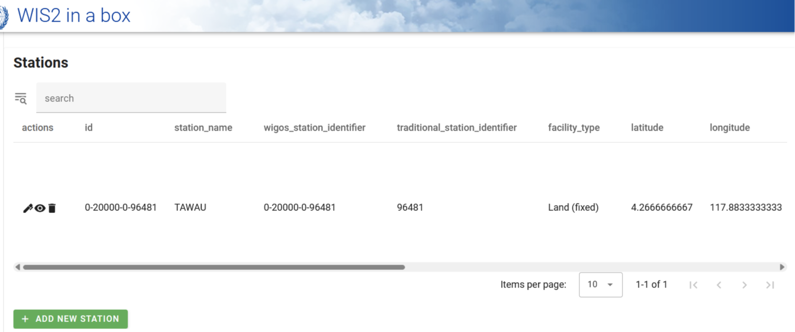

# تكوين البيانات الوصفية للمحطات

!!! abstract "مخرجات التعلم"

    بنهاية هذه الجلسة العملية، ستكون قادراً على:

    - إنشاء رمز تفويض لنقطة النهاية `collections/stations`
    - إضافة البيانات الوصفية للمحطات إلى wis2box
    - تحديث/حذف البيانات الوصفية للمحطات باستخدام **wis2box-webapp**

## مقدمة

لتبادل البيانات دولياً بين أعضاء المنظمة العالمية للأرصاد الجوية، من المهم وجود فهم مشترك للمحطات التي تنتج البيانات. يوفر النظام العالمي المتكامل للرصد التابع للمنظمة العالمية للأرصاد الجوية (WIGOS) إطاراً لدمج أنظمة الرصد وأنظمة إدارة البيانات. يُستخدم **معرف محطة WIGOS (WSI)** كمرجع فريد للمحطة التي أنتجت مجموعة محددة من بيانات الرصد.

يحتوي wis2box على مجموعة من البيانات الوصفية للمحطات التي تستخدم لوصف المحطات التي تنتج بيانات الرصد والتي يجب استردادها من **OSCAR/Surface**. تُستخدم البيانات الوصفية للمحطات في wis2box بواسطة أدوات تحويل BUFR للتحقق من أن البيانات المدخلة تحتوي على معرف محطة WIGOS صالح وتوفير تخطيط بين WSI والبيانات الوصفية للمحطة.

## إنشاء رمز تفويض لـ collections/stations

لتحرير المحطات عبر **wis2box-webapp**، ستحتاج أولاً إلى إنشاء رمز تفويض.

قم بتسجيل الدخول إلى VM الخاص بك وتأكد من أنك في دليل `wis2box`:

```bash
cd ~/wis2box
```

ثم قم بتسجيل الدخول إلى حاوية **wis2box-management** باستخدام الأمر التالي:

```bash
python3 wis2box-ctl.py login
```

داخل حاوية **wis2box-management** يمكنك إنشاء رمز تفويض لنقطة نهاية محددة باستخدام الأمر: `wis2box auth add-token --path <my-endpoint>`.

على سبيل المثال، لاستخدام رمز عشوائي تم إنشاؤه تلقائياً لنقطة النهاية `collections/stations`:

```{.copy}
wis2box auth add-token --path collections/stations
```

سيبدو الناتج كما يلي:

```{.copy}
Continue with token: 7ca20386a131f0de384e6ffa288eb1ae385364b3694e47e3b451598c82e899d1 [y/N]? y
Token successfully created
```

أو، إذا كنت تريد تحديد رمزك الخاص لنقطة النهاية `collections/stations`، يمكنك استخدام المثال التالي:

```{.copy}
wis2box auth add-token --path collections/stations DataIsMagic
```

الناتج:

```{.copy}
Continue with token: DataIsMagic [y/N]? y
Token successfully created
```

يرجى إنشاء رمز تفويض لنقطة النهاية `collections/stations` باستخدام التعليمات أعلاه.

## إضافة البيانات الوصفية للمحطات باستخدام **wis2box-webapp**

يوفر **wis2box-webapp** واجهة مستخدم رسومية لتحرير البيانات الوصفية للمحطات.

افتح **wis2box-webapp** في متصفحك عن طريق الانتقال إلى `http://YOUR-HOST/wis2box-webapp`، واختر المحطات:


عندما تنقر على 'إضافة محطة جديدة' سيُطلب منك تقديم معرف محطة WIGOS للمحطة التي تريد إضافتها:


!!! note "أضف البيانات الوصفية لـ 3 محطات أو أكثر"
    يرجى إضافة ثلاث محطات أو أكثر إلى مجموعة البيانات الوصفية للمحطات في wis2box الخاص بك.
      
    يرجى استخدام محطات من بلدك إذا كان ذلك ممكناً، خاصة إذا أحضرت بياناتك الخاصة.
      
    إذا لم يكن لدى بلدك أي محطات في OSCAR/Surface، يمكنك استخدام المحطات التالية لغرض هذا التمرين:

      - 0-20000-0-91334
      - 0-20000-0-96323 (لاحظ ارتفاع المحطة المفقود في OSCAR)
      - 0-20000-0-96749 (لاحظ ارتفاع المحطة المفقود في OSCAR)

عندما تنقر على البحث، يتم استرداد بيانات المحطة من OSCAR/Surface، يرجى ملاحظة أن هذا قد يستغرق بضع ثوانٍ.

راجع البيانات التي تم إرجاعها من OSCAR/Surface وأضف البيانات المفقودة حيثما كان ذلك مطلوباً. اختر موضوعاً للمحطة وقدم رمز التفويض الخاص بك لنقطة النهاية `collections/stations` وانقر على 'حفظ':


عد إلى قائمة المحطات وسترى المحطة التي أضفتها:



كرر هذه العملية حتى يكون لديك 3 محطات على الأقل مكونة.

!!! tip "استنتاج معلومات الارتفاع المفقودة"

    إذا كان ارتفاع محطتك مفقوداً، هناك خدمات عبر الإنترنت للمساعدة في البحث عن الارتفاع باستخدام بيانات الارتفاع المفتوحة. أحد الأمثلة على ذلك هو [Open Topo Data API](https://www.opentopodata.org).

    على سبيل المثال، للحصول على الارتفاع عند خط العرض -6.15558 وخط الطول 106.84204، يمكنك نسخ ولصق عنوان URL التالي في علامة تبويب جديدة للمتصفح:

    ```{.copy}
    https://api.opentopodata.org/v1/aster30m?locations=-6.15558,106.84204
    ```

    الناتج:

    ```{.copy}
    {
      "results": [
        {
          "dataset": "aster30m", 
          "elevation": 7.0, 
          "location": {
            "lat": -6.15558, 
            "lng": 106.84204
          }
        }
      ], 
      "status": "OK"
    }
    ```

## مراجعة البيانات الوصفية للمحطات الخاصة بك

يتم تخزين البيانات الوصفية للمحطات في الواجهة الخلفية لـ wis2box وإتاحتها عبر **wis2box-api**.

إذا فتحت متصفحاً وانتقلت إلى `http://YOUR-HOST/oapi/collections/stations/items` سترى البيانات الوصفية للمحطات التي أضفتها:


!!! note "مراجعة البيانات الوصفية للمحطات الخاصة بك"

    تحقق من أن المحطات التي أضفتها مرتبطة بمجموعة بياناتك عن طريق زيارة `http://YOUR-HOST/oapi/collections/stations/items` في متصفحك.

لديك أيضاً خيار عرض/تحديث/حذف المحطة في **wis2box-webapp**. لاحظ أنه يتعين عليك تقديم رمز التفويض الخاص بك لنقطة النهاية `collections/stations` لتحديث/حذف المحطة.

!!! note "تحديث/حذف البيانات الوصفية للمحطات"

    حاول وانظر ما إذا كان بإمكانك تحديث/حذف البيانات الوصفية لإحدى المحطات التي أضفتها باستخدام **wis2box-webapp**.

## تحميل البيانات الوصفية للمحطات بشكل جماعي

لاحظ أن wis2box لديه أيضاً القدرة على تنفيذ تحميل "جماعي" للبيانات الوصفية للمحطات من ملف CSV باستخدام سطر الأوامر في حاوية **wis2box-management**.

```bash
python3 wis2box-ctl.py login
wis2box metadata station publish-collection -p /data/wis2box/metadata/station/station_list.csv -th origin/a/wis2/centre-id/weather/surface-based-observations/synop
```

هذا يتيح لك تحميل عدد كبير من المحطات دفعة واحدة وربطها بموضوع محدد.

يمكنك إنشاء ملف CSV باستخدام Excel أو محرر نصوص ثم تحميله إلى wis2box-host-datadir لجعله متاحاً لحاوية **wis2box-management** في دليل `/data/wis2box/`.

بعد القيام بتحميل جماعي للمحطات، يوصى بمراجعة المحطات في **wis2box-webapp** للتأكد من تحميل البيانات بشكل صحيح.

راجع [وثائق wis2box الرسمية](https://docs.wis2box.wis.wmo.int) للحصول على مزيد من المعلومات حول كيفية استخدام هذه الميزة.

## الخاتمة

!!! success "تهانينا!"
    في هذه الجلسة العملية، تعلمت كيفية:

    - إنشاء رمز تفويض لنقطة النهاية `collections/stations` لاستخدامه مع **wis2box-webapp**
    - إضافة البيانات الوصفية للمحطات إلى wis2box باستخدام **wis2box-webapp**
    - عرض/تحديث/حذف البيانات الوصفية للمحطات باستخدام **wis2box-webapp**