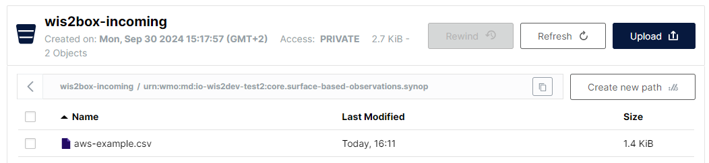

# تحويل بيانات CSV إلى BUFR

!!! abstract "نتائج التعلم"
    بنهاية هذه الجلسة العملية، ستكون قادرًا على:

    - استخدام **واجهة MinIO UI** لرفع ملفات بيانات CSV الإدخالية ومراقبة النتيجة
    - معرفة تنسيق بيانات CSV للاستخدام مع قالب محطة الطقس الأوتوماتيكية الافتراضية BUFR
    - استخدام محرر البيانات في **تطبيق wis2box الويبي** لإنشاء مجموعة بيانات لنشر رسائل DAYCLI
    - معرفة تنسيق بيانات CSV للاستخدام مع قالب DAYCLI BUFR
    - استخدام **تطبيق wis2box الويبي** للتحقق من صحة البيانات وتحويلها لمحطات AWS إلى BUFR (اختياري)

## مقدمة

غالبًا ما تُستخدم ملفات بيانات القيم المفصولة بفواصل (CSV) لتسجيل البيانات المراقبة وغيرها في تنسيق جدولي.
معظم أجهزة تسجيل البيانات المستخدمة لتسجيل إخراج الحساسات قادرة على تصدير الملاحظات في ملفات محددة، بما في ذلك في CSV.
بالمثل، عندما يتم استيعاب البيانات في قاعدة بيانات، من السهل تصدير البيانات المطلوبة في ملفات مُنسقة بتنسيق CSV.
للمساعدة في تبادل البيانات المخزنة أصلاً في تنسيقات بيانات جدولية تم تنفيذ محول من CSV إلى BUFR في
wis2box باستخدام نفس البرنامج المستخدم لـ SYNOP إلى BUFR.

في هذه الجلسة ستتعلم عن استخدام محول csv2bufr في wis2box للقوالب المدمجة التالية:

- **AWS** (aws-template.json) : قالب التعيين لتحويل بيانات CSV من ملف محطة الطقس الأوتوماتيكية المبسطة إلى تسلسل BUFR 301150, 307096"
- **DayCLI** (daycli-template.json) : قالب التعيين لتحويل بيانات المناخ اليومية CSV إلى تسلسل BUFR 307075

## التحضير

تأكد من أنه تم بدء تشغيل مجموعة wis2box-stack باستخدام `python3 wis2box.py start`

تأكد من أن لديك متصفح ويب مفتوح مع واجهة MinIO لنسختك عن طريق الذهاب إلى `http://<your-host>:9000`
إذا لم تتذكر بيانات اعتماد MinIO الخاصة بك، يمكنك العثور عليها في ملف `wis2box.env` في دليل `wis2box-1.0.0rc1` على VM الطالب الخاص بك.

تأكد من أن لديك MQTT Explorer مفتوحًا ومتصلًا بوسيطك باستخدام بيانات الاعتماد `everyone/everyone`.

## التمرين 1: استخدام csv2bufr مع قالب 'AWS'

يوفر قالب 'AWS' قالب تعيين محدد مسبقًا لتحويل بيانات CSV من محطات AWS لدعم متطلبات التقارير GBON.

يمكن العثور على وصف قالب AWS [هنا](/csv2bufr-templates/aws-template).

### مراجعة بيانات الإدخال aws-example

قم بتنزيل المثال لهذا التمرين من الرابط أدناه:

[aws-example.csv](/sample-data/aws-example.csv)

افتح الملف الذي قمت بتنزيله في محرر وافحص المحتوى:

!!! question
    عند فحص حقول التاريخ والوقت والتعريف (معرفات WIGOS والمعرفات التقليدية) ماذا تلاحظ؟ كيف سيتم تمثيل تاريخ اليوم؟

??? success "انقر لكشف الإجابة"
    يحتوي كل عمود على قطعة معلومات واحدة. على سبيل المثال، يتم تقسيم التاريخ إلى سنة وشهر ويوم، مما يعكس كيفية تخزين البيانات في BUFR. سيتم تقسيم تاريخ اليوم عبر الأعمدة "year"، "month" و "day". بالمثل، يحتاج الوقت إلى أن يتم تقسيمه إلى "hour" و "minute" ومعرف محطة WIGOS إلى مكوناته المعنية.

!!! question
    عند النظر إلى ملف البيانات كيف يتم ترميز البيانات المفقودة؟

??? success "انقر لكشف الإجابة"
    يتم تمثيل البيانات المفقودة داخل الملف بواسطة خلايا فارغة. في ملف CSV، سيتم ترميز ذلك بـ ``,,``. لاحظ أن هذه خلية فارغة وليست مرمزة كسلسلة ذات طول صفر، مثل ``,"",``.

!!! hint "البيانات المفقودة"
    من المعترف به أن البيانات قد تكون مفقودة لأسباب متنوعة، سواء بسبب فشل الحساس أو عدم مراقبة العامل. في هذه الحالات، يمكن ترميز البيانات المفقودة وفقًا للإجابة أعلاه، تظل البيانات الأخرى في التقرير صالحة.

!!! question
    ما هي معرفات محطة WIGOS للمحطات التي تقدم البيانات في ملف المثال؟ كيف يتم تعريفها في ملف الإدخال؟

??? success "انقر لكشف الإجابة"

    يتم تعريف معرف محطة WIGOS بواسطة 4 أعمدة منفصلة في الملف:

    - **wsi_series**: سلسلة معرف WIGOS
    - **wsi_issuer**: مُصدر معرف WIGOS
    - **wsi_issue_number**: رقم إصدار WIGOS
    - **wsi_local**: معرف WIGOS المحلي

    معرفات محطة WIGOS المستخدمة في ملف المثال هي `0-20000-0-60351`، `0-20000-0-60355` و `0-20000-0-60360`.	

### تحديث ملف المثال

قم بتحديث ملف المثال الذي قمت بتنزيله لاستخدام تاريخ ووقت اليوم وتغيير معرفات محطة WIGOS لاستخدام المحطات التي قمت بتسجيلها في تطبيق wis2box-webapp.

### رفع البيانات إلى MinIO والتحقق من النتيجة

انتقل إلى واجهة MinIO وقم بتسجيل الدخول باستخدام بيانات الاعتماد من ملف `wis2box.env`.

انتقل إلى **wis2box-incoming** وانقر على الزر "إنشاء مسار جديد":

أنشئ مجلدًا جديدًا في دلو MinIO يطابق معرف مجموعة البيانات للمجموعة التي أنشأتها باستخدام القالب='weather/surface-weather-observations/synop':

قم برفع ملف المثال الذي قمت بتنزيله إلى المجلد الذي أنشأته في دلو MinIO:

تحقق من لوحة التحكم Grafana على `http://<your-host>:3000` لمعرفة ما إذا كانت هناك أي تحذيرات أو أخطاء. إذا رأيت أيًا منها، حاول إصلاحها وكرر التمرين.

تحقق من MQTT Explorer لمعرفة ما إذا كنت تتلقى إشعارات بيانات WIS2.

إذا نجحت في استيعاب البيانات، يجب أن ترى 3 إشعارات في MQTT Explorer على الموضوع `origin/a/wis2/<centre-id>/data/weather/surface-weather-observations/synop` للمحطات الثلاث التي أبلغت عن بيانات لها:

## التمرين 2 - استخدام قالب 'DayCLI'

في التمرين السابق، استخدمنا المجموعة التي أنشأتها مع نوع البيانات='weather/surface-weather-observations/synop'، والتي تم تكوينها مسبقًا لتحويل قالب CSV إلى BUFR إلى قالب AWS.

في التمرين التالي، سنستخدم قالب 'DayCLI' لتحويل بيانات المناخ اليومية إلى BUFR.

يمكن العثور على وصف قالب DAYCLI [هنا](/csv2bufr-templates/daycli-template).

!!! Note "حول قالب DAYCLI"
    يرجى ملاحظة أن تسلسل DAYCLI BUFR سيتم تحديثه خلال عام 2025 ليشمل معلومات إضافية وعلامات QC المنقحة. سيتم تحديث قالب DAYCLI المضمّن في wis2box ليعكس هذه التغييرات. ستقوم WMO بالتواصل عندما يتم تحديث برنامج wis2box ليشمل قالب DAYCLI الجديد، للسماح للمستخدمين بتحديث أنظمتهم وفقًا لذلك.

### إنشاء مجموعة بيانات wis2box لنشر رسائل DAYCLI

انتقل إلى محرر المجموعة في تطبيق wis2box الويبي وأنشئ مجموعة بيانات جديدة. استخدم نفس معرف المركز كما في الجلسات العملية السابقة وحدد **نوع البيانات='climate/surface-based-observations/daily'**:

انقر على "CONTINUE TO FORM" وأضف وصفًا لمجموعة البيانات الخاصة بك، وحدد المربع الحدودي وقدم معلومات الاتصال لمجموعة البيانات. بمجرد الانتهاء من ملء جميع الأقسام، انقر على 'VALIDATE FORM' وتحقق من النموذج.

راجع الإضافات البيانية للمجموعات. انقر على "UPDATE" بجانب الإضافة باسم "بيانات CSV المحولة إلى BUFR" وسترى أن القالب مضبوط على **DayCLI**:

أغلق تكوين الإضافة وأرسل النموذج باستخدام رمز المصادقة الذي أنشأته في الجلسة العملية السابقة.

يجب أن يكون لديك الآن مجموعة بيانات ثانية في تطبيق wis2box الويبي مُعدة لاستخدام قالب DAYCLI لتحويل بيانات CSV إلى BUFR.

### مراجعة بيانات الإدخال daycli-example

قم بتنزيل المثال لهذا التمرين من الرابط أدناه:

[daycli-example.csv](/sample-data/daycli-example.csv)

افتح الملف الذي قمت بتنزيله في محرر وافحص المحتوى:

!!! question
    ما هي المتغيرات الإضافية المدرجة في قالب daycli؟

??? success "انقر لكشف الإجابة"
    يتضمن قالب daycli بيانات تعريفية هامة حول موقع