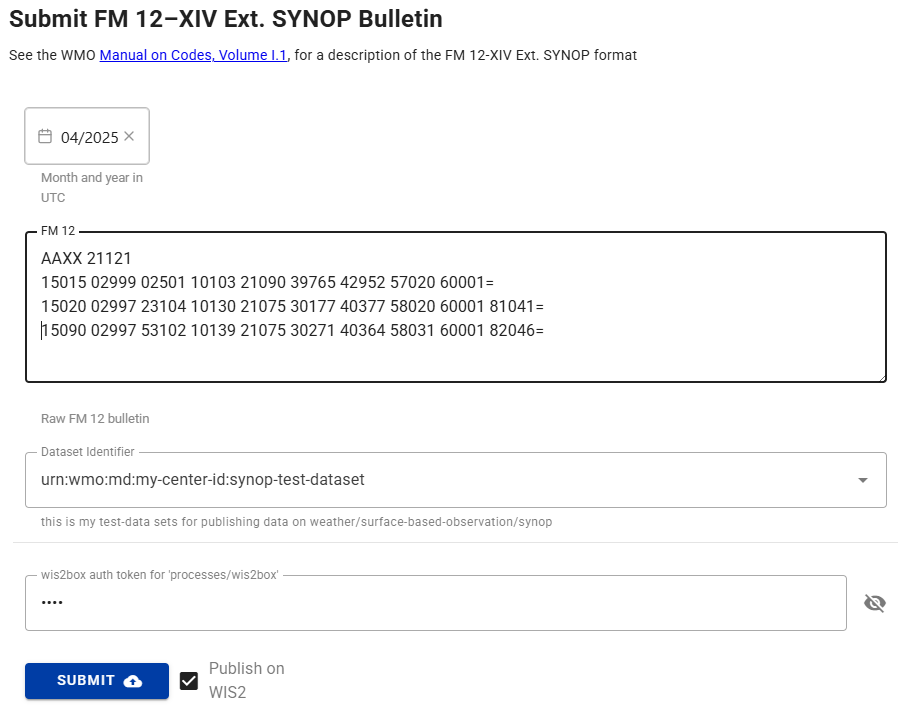

# أدوات تحويل البيانات

!!! abstract "نتائج التعلم"
    بنهاية هذه الجلسة العملية، ستكون قادرًا على:

    - الوصول إلى أدوات سطر الأوامر ecCodes داخل حاوية wis2box-api
    - استخدام أداة synop2bufr لتحويل تقارير SYNOP FM-12 إلى BUFR من سطر الأوامر
    - تفعيل تحويل synop2bufr عبر wis2box-webapp
    - استخدام أداة csv2bufr لتحويل بيانات CSV إلى BUFR من سطر الأوامر

## مقدمة

يجب أن تلبي البيانات المنشورة على WIS2 المتطلبات والمعايير التي حددتها مختلف مجتمعات الخبراء في تخصصات/مجالات نظام الأرض. لتقليل العقبات أمام نشر البيانات لملاحظات السطح الأرضي، يوفر wis2box أدوات لتحويل البيانات إلى تنسيق BUFR. تتوفر هذه الأدوات عبر حاوية wis2box-api ويمكن استخدامها من سطر الأوامر لاختبار عملية تحويل البيانات.

التحويلات الرئيسية المدعومة حاليًا بواسطة wis2box هي تقارير SYNOP FM-12 إلى BUFR وبيانات CSV إلى BUFR. يتم دعم بيانات FM-12 لأنها لا تزال تستخدم وتتبادل على نطاق واسع في مجتمع WMO، بينما يتم دعم بيانات CSV للسماح بتعيين البيانات التي تنتجها محطات الأرصاد الجوية الآلية إلى تنسيق BUFR.

### حول FM-12 SYNOP

تم الإبلاغ تاريخيًا عن تقارير الطقس السطحية من محطات السطح الأرضي كل ساعة أو في الساعات الرئيسية (00، 06، 12، و 18 بتوقيت UTC) والساعات الوسيطة (03، 09، 15، 21 بتوقيت UTC). قبل الانتقال إلى BUFR، تم ترميز هذه التقارير في نموذج رمز SYNOP FM-12 النصي العادي. بينما كان من المقرر أن يكتمل الانتقال إلى BUFR بحلول عام 2012، لا يزال عدد كبير من التقارير يتم تبادلها بتنسيق SYNOP FM-12 القديم. يمكن العثور على مزيد من المعلومات حول تنسيق FM-12 SYNOP في الدليل اليدوي لـ WMO على الرموز، المجلد I.1 (WMO-No. 306، المجلد I.1).

### حول ecCodes

مكتبة ecCodes عبارة عن مجموعة من المكتبات البرمجية والأدوات المساعدة المصممة لفك تشفير وترميز البيانات الجوية بتنسيقات GRIB وBUFR. تم تطويره بواسطة المركز الأوروبي للتنبؤات الجوية المتوسطة المدى (ECMWF)، انظر [وثائق ecCodes](https://confluence.ecmwf.int/display/ECC/ecCodes+documentation) لمزيد من المعلومات.

يتضمن برنامج wis2box مكتبة ecCodes في صورة الأساس لحاوية wis2box-api. هذا يسمح للمستخدمين بالوصول إلى أدوات سطر الأوامر والمكتبات من داخل الحاوية. تُستخدم مكتبة ecCodes ضمن مجموعة wis2box لفك تشفير وترميز رسائل BUFR.

### حول csv2bufr و synop2bufr

بالإضافة إلى ecCodes، يستخدم wis2box الوحدات النمطية بلغة Python التالية التي تعمل مع ecCodes لتحويل البيانات إلى تنسيق BUFR:

- **synop2bufr**: لدعم تنسيق SYNOP FM-12 التقليدي الذي استخدمه المراقبون اليدويون تقليديًا. تعتمد وحدة synop2bufr على بيانات تعريف المحطة الإضافية لترميز المعلمات الإضافية في ملف BUFR. انظر [مستودع synop2bufr على GitHub](https://github.com/World-Meteorological-Organization/synop2bufr)
- **csv2bufr**: لتمكين تحويل بيانات CSV التي تنتجها محطات الأرصاد الجوية الآلية إلى تنسيق BUFR. تُستخدم وحدة csv2bufr لتحويل بيانات CSV إلى تنسيق BUFR باستخدام قالب تعيين يحدد كيفية تعيين بيانات CSV إلى تنسيق BUFR. انظر [مستودع csv2bufr على GitHub](https://github.com/World-Meteorological-Organization/csv2bufr)

يمكن استخدام هذه الوحدات بشكل مستقل أو كجزء من مجموعة wis2box.

## التحضير

!!! warning "المتطلبات الأساسية"

    - تأكد من أن wis2box الخاص بك قد تم تكوينه وبدء تشغيله
    - تأكد من أنك قمت بإعداد مجموعة بيانات وقمت بتكوين محطة واحدة على الأقل في wis2box الخاص بك
    - الاتصال بوسيط MQTT لنسخة wis2box الخاصة بك باستخدام MQTT Explorer
    - افتح تطبيق الويب wis2box (`http://YOUR-HOST/wis2box-webapp`) وتأكد من تسجيل الدخول
    - افتح لوحة تحكم Grafana لنسختك بالانتقال إلى `http://YOUR-HOST:3000`

لكي تستخدم أدوات سطر الأوامر BUFR، ستحتاج إلى تسجيل الدخول إلى حاوية wis2box-api. ما لم يُذكر خلاف ذلك، يجب تشغيل جميع الأوامر على هذه الحاوية. ستحتاج أيضًا إلى أن يكون لديك MQTT Explorer مفتوحًا ومتصلاً بوسيطك.

أولاً، قم بالاتصال بجهاز الطالب الافتراضي الخاص بك عبر عميل SSH الخاص بك وانسخ مواد التمرين إلى حاوية wis2box-api:

```bash
docker cp ~/exercise-materials/data-conversion-exercises wis2box-api:/root
```

ثم قم بتسجيل الدخول إلى حاوية wis2box-api وانتقل إلى الدليل حيث توجد مواد التمرين:

```bash
cd ~/wis2box
python3 wis2box-ctl.py login wis2box-api
cd /root/data-conversion-exercises
```

تأكد من توفر الأدوات، بدءًا من ecCodes:

```bash
bufr_dump -V
```

يجب أن تحصل على الاستجابة التالية:

```
ecCodes Version 2.36.0
```

بعد ذلك، تحقق من إصدار synop2bufr:

```bash
synop2bufr --version
```

يجب أن تحصل على الاستجابة التالية:

```
synop2bufr, version 0.7.0
```

بعد ذلك، تحقق من csv2bufr:

```bash
csv2bufr --version
```

يجب أن تحصل على الاستجابة التالية:

```
csv2bufr, version 0.8.5
```

## أدوات سطر الأوامر ecCodes

توفر مكتبة ecCodes المضمنة في حاوية wis2box-api عددًا من أدوات سطر الأوامر للعمل مع ملفات BUFR.
توضح التمارين التالية كيفية استخدام `bufr_ls` و `bufr_dump` لفحص محتوى ملف BUFR.

### bufr_ls

في هذا التمرين الأول، ستستخدم الأمر `bufr_ls` لفحص رؤوس ملف BUFR وتحديد نوع محتويات الملف.

استخدم الأمر التالي لتشغيل `bufr_ls` على الملف `bufr-cli-ex1.bufr4`:

```bash
bufr_ls bufr-cli-ex1.bufr4
```

يجب أن ترى الإخراج التالي:

```bash
bufr-cli-ex1.bufr4
centre                     masterTablesVersionNumber  localTablesVersionNumber   typicalDate                typicalTime                numberOfSubsets
cnmc                       29                         0                          20231002                   000000                     1
1 of 1 messages in bufr-cli-ex1.bufr4

1 of 1 total messages in 1 file
```

يمكن تمرير خيارات مختلفة إلى `bufr_ls` لتغيير كل من التنسيق وحقول الرأس المطبوعة.

!!! question

    ما هو الأمر لإدراج الإخراج السابق بتنسيق JSON؟

    يمكنك تشغيل الأمر `bufr_ls` مع العلم `-h` لرؤية الخيارات المتاحة.

??? success "انقر للكشف عن الإجابة"
    يمكنك تغيير تنسيق الإخراج إلى JSON باستخدام العلم `-j`، أي
    ```bash
    bufr_ls -j bufr-cli-ex1.bufr4
    ```

    عند تشغيله، يجب أن تحصل على الإخراج التالي:
    ```
    { "messages" : [
      {
        "centre": "cnmc",
        "masterTablesVersionNumber": 29,
        "localTablesVersionNumber": 0,
        "typicalDate": 20231002,
        "typicalTime": "000000",
        "numberOfSubsets": 1
      }
    ]}
    ```

يمثل الإخراج المطبوع قيم بعض مفاتيح الرأس في ملف BUFR.

بمفرده، هذه المعلومات ليست معلوماتية للغاية، حيث يتم توفير معلومات محدودة فقط حول محتويات الملف.

عند فحص ملف BUFR، غالبًا ما نرغب في تحديد نوع البيانات الموجودة في الملف والتاريخ/الوقت النموذجي للبيانات في الملف. يمكن سرد هذه المعلومات باستخدام العلم `-p` لتحديد الرؤوس المراد إخراجها. يمكن تضمين رؤوس متعددة باستخدام قائمة مفصولة بفواصل.

يمكنك استخدام الأمر التالي لسرد فئة البيانات والفئة الفرعية الدولية والتاريخ النموذجي والوقت:
    
```bash
bufr_ls -p dataCategory,internationalDataSubCategory,typicalDate,typicalTime -j bufr-cli-ex1.bufr4
```

!!! question

    قم بتنفيذ الأمر السابق وتفسير الإخراج باستخدام [جدول الرموز المشترك C-13](https://github.com/wmo-im/CCT/blob/master/C13.csv) لتحديد فئة البيانات والفئة الفرعية.

    ما نوع البيانات (فئة البيانات والفئة الفرعية) الموجودة في الملف؟ ما هو التاريخ والوقت النموذجي للبيانات؟

??? success "انقر للكشف عن الإجابة"
    
    ```
    { "messages" : [
      {
        "dataCategory": 2,
        "internationalDataSubCategory": 4,
        "typicalDate": 20231002,
        "typicalTime": "000000"
      }
    ]}
    ```

    من هذا، نرى أن:

    - فئة البيانات هي 2، مما يشير إلى بيانات **"القياسات العمودية (غير الأقمار الصناعية)"**.
    - الفئة الفرعية الدولية هي 4، مما يشير إلى بيانات **"تقارير درجة الحرارة/الرطوبة/الرياح العلوية من محطات الأرض الثابتة (TEMP)"**.
    - التاريخ والوقت النموذجيان هما 2023-10-02 و00:00:00z، على التوالي.

### bufr_dump

يمكن استخدام الأمر `bufr_dump` لسرد وفحص محتويات ملف BUFR، بما في ذلك البيانات نفسها.

جرب تشغيل الأمر `bufr_dump` على الملف الثاني `bufr-cli-ex2.bufr4`:

```{.copy}
bufr_dump bufr-cli-ex2.bufr4
```

هذا ينتج JSON

يتطلب الوسيط `--metadata` ملف CSV باستخدام تنسيق محدد مسبقًا، ويتم توفير مثال عملي في الملف `station_list.csv`:

استخدم الأمر التالي لفحص محتويات ملف `station_list.csv`:

```bash
more station_list.csv
```

!!! question

    كم عدد المحطات المدرجة في قائمة المحطات؟ ما هي معرفات محطات WIGOS للمحطات؟

??? success "انقر للكشف عن الإجابة"

    يظهر المخرجات التالية:

    ```{.copy}
    station_name,wigos_station_identifier,traditional_station_identifier,facility_type,latitude,longitude,elevation,barometer_height,territory_name,wmo_region
    OCNA SUGATAG,0-20000-0-15015,15015,landFixed,47.7770616258,23.9404602638,503.0,504.0,ROU,europe
    BOTOSANI,0-20000-0-15020,15020,landFixed,47.7356532437,26.6455501701,161.0,162.1,ROU,europe
    ```

    يتوافق هذا مع بيانات المحطة لمحطتين: لمعرفات محطات WIGOS `0-20000-0-15015` و `0-20000-0-15020`.

### تحويل SYNOP إلى BUFR

بعد ذلك، استخدم الأمر التالي لتحويل رسالة FM-12 SYNOP إلى تنسيق BUFR:

```bash
synop2bufr data transform --metadata station_list.csv --output-dir ./ --year 2024 --month 09 synop_message.txt
```

!!! question
    كم عدد ملفات BUFR التي تم إنشاؤها؟ ماذا يعني رسالة التحذير في المخرجات؟

??? success "انقر للكشف عن الإجابة"
    تظهر المخرجات التالية:

    ```{.copy}
    [WARNING] Station 15090 not found in station file
    ```

    إذا قمت بفحص محتوى دليلك باستخدام الأمر `ls -lh`، يجب أن ترى تم إنشاء ملفين BUFR جديدين: `WIGOS_0-20000-0-15015_20240921T120000.bufr4` و `WIGOS_0-20000-0-15020_20240921T120000.bufr4`.

    تشير رسالة التحذير إلى أن المحطة ذات المعرف التقليدي للمحطة `15090` لم يتم العثور عليها في ملف قائمة المحطات `station_list.csv`. هذا يعني أن تقرير SYNOP لهذه المحطة لم يتم تحويله إلى تنسيق BUFR.

!!! question
    تحقق من محتوى ملف BUFR `WIGOS_0-20000-0-15015_20240921T120000.bufr4` باستخدام الأمر `bufr_dump`.

    هل يمكنك التحقق من أن المعلومات المقدمة في ملف `station_list.csv` موجودة في ملف BUFR؟

??? success "انقر للكشف عن الإجابة"
    يمكنك استخدام الأمر التالي لفحص محتوى ملف BUFR:

    ```bash
    bufr_dump -p WIGOS_0-20000-0-15015_20240921T120000.bufr4 | grep -v MISSING
    ```

    ستلاحظ المخرجات التالية:

    ```{.copy}
    wigosIdentifierSeries=0
    wigosIssuerOfIdentifier=20000
    wigosIssueNumber=0
    wigosLocalIdentifierCharacter="15015"
    blockNumber=15
    stationNumber=15
    stationOrSiteName="OCNA SUGATAG"
    stationType=1
    year=2024
    month=9
    day=21
    hour=12
    minute=0
    latitude=47.7771
    longitude=23.9405
    heightOfStationGroundAboveMeanSeaLevel=503
    heightOfBarometerAboveMeanSeaLevel=504
    ```

    لاحظ أن هذا يتضمن البيانات المقدمة من ملف `station_list.csv`.

### نموذج SYNOP في wis2box-webapp

يتم استخدام وحدة `synop2bufr` أيضًا في wis2box-webapp لتحويل بيانات FM-12 SYNOP إلى تنسيق BUFR باستخدام نموذج إدخال قائم على الويب.
لتجربة هذا، انتقل إلى `http://YOUR-HOST/wis2box-webapp` وقم بتسجيل الدخول.

اختر `SYNOP Form` من القائمة على اليسار وانسخ محتويات ملف `synop_message.txt`:

```{.copy}
AAXX 21121
15015 02999 02501 10103 21090 39765 42952 57020 60001=
15020 02997 23104 10130 21075 30177 40377 58020 60001 81041=
15090 02997 53102 10139 21075 30271 40364 58031 60001 82046=
```

في منطقة نص "SYNOP message":



!!! question
    هل يمكنك إرسال النموذج؟ ما هو النتيجة؟

??? success "انقر للكشف عن الإجابة"

    تحتاج إلى اختيار مجموعة بيانات وتقديم الرمز الخاص بـ "processes/wis2box" الذي أنشأته في التمرين السابق لإرسال النموذج.

    إذا قدمت رمزًا غير صالح، سترى:
    
    - النتيجة: غير مصرح به، يرجى تقديم رمز 'processes/wis2box' صالح

    إذا قدمت رمزًا صالحًا، سترى "تحذيرات: 3". انقر على "تحذيرات" لفتح القائمة المنسدلة التي ستظهر:

    - المحطة 15015 لم يتم العثور عليها في ملف المحطة
    - المحطة 15020 لم يتم العثور عليها في ملف المحطة
    - المحطة 15090 لم يتم العثور عليها في ملف المحطة

    لتحويل هذه البيانات إلى تنسيق BUFR، ستحتاج إلى تكوين المحطات المقابلة في wis2box الخاص بك والتأكد من أن المحطات مرتبطة بموضوع مجموعة البيانات الخاصة بك.

!!! note

    في التمرين لـ [ingesting-data-for-publication](ingesting-data-for-publication.md) قمت بإدخال الملف "synop_202412030900.txt" وتم تحويله إلى تنسيق BUFR بواسطة وحدة synop2bufr.

    في سير العمل الآلي في wis2box، يتم استخراج السنة والشهر تلقائيًا من اسم الملف واستخدامها لملء الوسيطات `--year` و `--month` المطلوبة بواسطة synop2bufr، بينما يتم استخراج بيانات المحطة تلقائيًا من تكوين المحطة في wis2box.

## تحويل csv2bufr

!!! note
    تأكد من أنك لا تزال مسجلاً الدخول في حاوية wis2box-api وفي الدليل `/root/data-conversion-exercises`، إذا خرجت من الحاوية في التمرين السابق، يمكنك تسجيل الدخول مرة أخرى على النحو التالي:

    ```bash
    cd ~/wis2box
    python3 wis2box-ctl.py login wis2box-api
    cd /root/data-conversion-exercises
    ```

الآن دعونا ننظر في كيفية تحويل بيانات CSV إلى تنسيق BUFR باستخدام وحدة `csv2bufr`. تم تثبيت الوحدة في حاوية wis2box-api ويمكن استخدامها من سطر الأوامر على النحو التالي:

```{.copy}
csv2bufr data transform \
    --bufr-template <bufr-mapping-template> \
    <input-csv-file>
```

يتم استخدام الوسيط `--bufr-template` لتحديد ملف قالب تعيين BUFR، الذي يوفر التعيين بين بيانات CSV الواردة وبيانات BUFR الناتجة المحددة في ملف JSON. تم تثبيت قوالب التعيين الافتراضية في الدليل `/opt/csv2bufr/templates` في حاوية wis2box-api.

### مراجعة ملف CSV المثال

راجع محتوى ملف CSV المثال `aws-example.csv`:

```bash
more aws-example.csv
```

!!! question
    كم عدد الصفوف الموجودة في ملف CSV؟ ما هو معرف محطة WIGOS للمحطات التي تقدم التقارير في ملف CSV؟

??? question "انقر للكشف عن الإجابة"

    تظهر المخرجات التالية:

    ```{.copy}
    wsi_series,wsi_issuer,wsi_issue_number,wsi_local,wmo_block_number,wmo_station_number,station_type,year,month,day,hour,minute,latitude,longitude,station_height_above_msl,barometer_height_above_msl,station_pressure,msl_pressure,geopotential_height,thermometer_height,air_temperature,dewpoint_temperature,relative_humidity,method_of_ground_state_measurement,ground_state,method_of_snow_depth_measurement,snow_depth,precipitation_intensity,anemometer_height,time_period_of_wind,wind_direction,wind_speed,maximum_wind_gust_direction_10_minutes,maximum_wind_gust_speed_10_minutes,maximum_wind_gust_direction_1_hour,maximum_wind_gust_speed_1_hour,maximum_wind_gust_direction_3_hours,maximum_wind_gust_speed_3_hours,rain_sensor_height,total_precipitation_1_hour,total_precipitation_3_hours,total_precipitation_6_hours,total_precipitation_12_hours,total_precipitation_24_hours
    0,20000,0,60355,60,355,1,2024,3,31,1,0,47.77706163,23.94046026,503,504.43,100940,101040,1448,5,298.15,294.55,80,3,1,1,0,0.004,10,-10,30,3,30,5,40,9,20,11,2,4.7,5.3,7.9,9.5,11.4
    0,20000,0,60355,60,355,1,2024,3,31,2,0,47.77706163,23.94046026,503,504.43,100940,101040,1448,5,25.,294.55,80,3,1,1,0,0.004,10,-10,30,3,30,5,40,9,20,11,2,4.7,5.3,7.9,9.5,11.4
    0,20000,0,60355,60,355,1,2024,3,31,3,0,47.77706163,23.94046026,503,504.43,100940,101040,1448,5,298.15,294.55,80,3,1,1,0,0.004,10,-10,30,3,30,5,40,9,20,11,2,4.7,5.3,7.9,9.5,11.4
    ```

    الصف الأول من ملف CSV يحتوي على رؤوس الأعمدة، والتي تستخدم لتحديد البيانات في كل عمود.

    بعد صف الرأس، هناك 3 صفوف من البيانات، تمثل 3 ملاحظات جوية من نفس المحطة بمعرف محطة WIGOS `0-20000-0-60355` في ثلاث طوابع زمنية مختلفة `2024-03-31 01:00:00`، `2024-03-31 02:00:00`، و `2024-03-31 03:00:00`.

### مراجعة القالب aws

تتضمن wis2box-api مجموعة من قوالب تعيين BUFR المحددة مسبقًا والمثبتة في الدليل `/opt/csv2bufr/templates`.

تحقق من محتوى الدليل `/opt/csv2bufr/templates`:

```bash
ls /opt/csv2bufr/templates
```
يجب أن ترى المخرجات التالية:

```{.copy}
CampbellAfrica-v1-template.json  aws-template.json  daycli-template.json
```

دعونا نتحقق من محتوى ملف `aws-template.json`:

```bash
cat /opt/csv2bufr/templates/aws-template.json
```

هذا يعيد ملف JSON كبير، يوفر التعيين لـ 43 عمود CSV.

!!! question
    أي عمود CSV معين لمفتاح eccodes `airTemperature`؟ ما هي القيم الدنيا والقصوى الصالحة لهذا المفتاح؟

??? success "انقر للكشف عن الإجابة"

    باستخدام الأمر التالي لتصفية المخرجات:

    ```bash
    cat /opt/csv2bufr/templates/aws-template.json | grep -i airTemperature
    ```
    يجب أن ترى المخرجات التالية:

    ```{.copy}
    {"eccodes_key": "#1#airTemperature", "value": "data:air_temperature", "valid_min": "const:193.15", "valid_max": "const:333.15"},
    ```

    القيمة التي سيتم ترميزها لمفتاح eccodes `airTemperature` ستؤخذ من البيانات في عمود CSV: **air_temperature**.

    القيم الدنيا والقصوى لهذا المفتاح هي `193.15

لم تحصل على نتيجة، مما يشير إلى أن القيمة للمفتاح `airTemperature` مفقودة في ملف BUFR `WIGOS_0-20000-0-60355_20240331T020000.bufr4`. رفض الأمر csv2bufr ترميز القيمة `25.0` من بيانات CSV لأنها خارج النطاق الصحيح من `193.15` إلى `333.15` كما هو محدد في قالب التخطيط.

لاحظ أن تحويل CSV إلى BUFR باستخدام أحد قوالب التخطيط BUFR المحددة مسبقًا له قيود:

- يجب أن يكون ملف CSV بالتنسيق المحدد في قالب التخطيط، أي يجب أن تتطابق أسماء أعمدة CSV مع الأسماء المحددة في قالب التخطيط
- يمكنك فقط ترميز المفاتيح المحددة في قالب التخطيط
- فحوصات التحكم في الجودة محدودة بالفحوصات المحددة في قالب التخطيط

للحصول على معلومات حول كيفية إنشاء واستخدام قوالب تخطيط BUFR المخصصة، راجع التمرين العملي التالي [csv2bufr-templates](./csv2bufr-templates.md).

## الخلاصة

!!! success "تهانينا!"
    في هذه الجلسة العملية قد تعلمت:

    - كيفية الوصول إلى أدوات سطر الأوامر ecCodes داخل حاوية wis2box-api
    - كيفية استخدام `synop2bufr` لتحويل تقارير FM-12 SYNOP إلى BUFR من سطر الأوامر
    - كيفية استخدام نموذج SYNOP في wis2box-webapp لتحويل تقارير FM-12 SYNOP إلى BUFR
    - كيفية استخدام `csv2bufr` لتحويل بيانات CSV إلى BUFR من سطر الأوامر