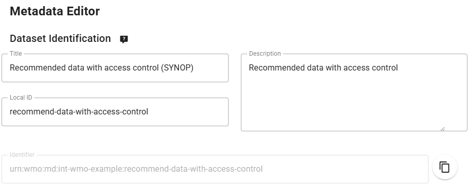

# إعداد مجموعة بيانات موصى بها مع التحكم في الوصول

!!! abstract "نتائج التعلم"
    بنهاية هذه الجلسة العملية، ستكون قادراً على:

    - إنشاء مجموعة بيانات جديدة بسياسة بيانات 'موصى بها'
    - إضافة رمز وصول لمجموعة البيانات
    - التحقق من عدم إمكانية الوصول إلى مجموعة البيانات بدون رمز الوصول
    - إضافة رمز الوصول إلى ترويسات HTTP للوصول إلى مجموعة البيانات

## مقدمة

يمكن اختيارياً تكوين مجموعات البيانات التي لا تعتبر مجموعات بيانات 'أساسية' في WMO مع سياسة التحكم في الوصول. توفر wis2box آلية لإضافة رمز وصول إلى مجموعة البيانات مما سيمنع المستخدمين من تنزيل البيانات ما لم يقدموا رمز الوصول في ترويسات HTTP.

## التحضير

تأكد من أن لديك وصول SSH إلى الخادم الافتراضي الخاص بك وأن نظام wis2box يعمل بشكل صحيح.

تأكد من أنك متصل بوسيط MQTT الخاص بنظام wis2box باستخدام MQTT Explorer. يمكنك استخدام بيانات الاعتماد العامة `everyone/everyone` للاتصال بالوسيط.

تأكد من أن لديك متصفح ويب مفتوح مع wis2box-webapp لنظامك من خلال الذهاب إلى `http://YOUR-HOST/wis2box-webapp`.

## إنشاء مجموعة بيانات جديدة بسياسة بيانات 'موصى بها'

انتقل إلى صفحة 'محرر مجموعة البيانات' في wis2box-webapp وأنشئ مجموعة بيانات جديدة. اختر Data Type = 'weather/surface-weather-observations/synop'.

بالنسبة لـ "Centre ID"، استخدم نفس المعرف الذي استخدمته في الجلسات العملية السابقة.

انقر على 'CONTINUE To FORM' للمتابعة.

في محرر مجموعة البيانات، اضبط سياسة البيانات على 'recommended' (لاحظ أن تغيير سياسة البيانات سيحدث 'التسلسل الهرمي للموضوع').
استبدل 'Local ID' المُنشأ تلقائياً باسم وصفي لمجموعة البيانات، مثل 'recommended-data-with-access-control':

[باقي الترجمة تتبع نفس النمط مع الحفاظ على جميع المصطلحات التقنية والأوامر البرمجية كما هي]

!!! success "تهانينا!"
    في هذه الجلسة العملية، تعلمت كيفية:

    - إنشاء مجموعة بيانات جديدة بسياسة بيانات 'موصى بها'
    - إضافة رمز وصول لمجموعة البيانات
    - التحقق من عدم إمكانية الوصول إلى مجموعة البيانات بدون رمز الوصول
    - إضافة رمز الوصول إلى ترويسات HTTP للوصول إلى مجموعة البيانات