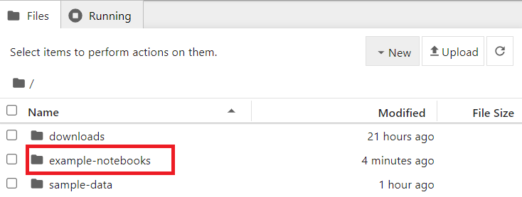
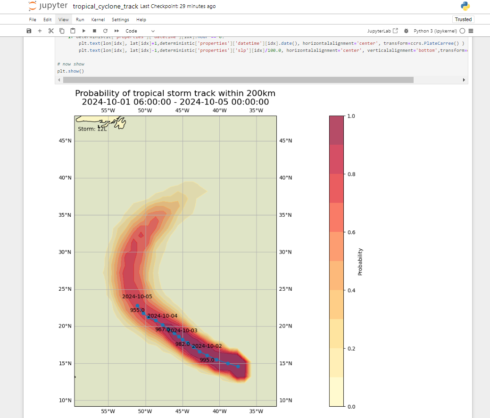

# فك تشفير البيانات من التنسيقات الثنائية الخاصة بـ WMO

!!! abstract "نتائج التعلم!"

    بنهاية هذه الجلسة العملية، ستكون قادرًا على:

    - تشغيل حاوية Docker باستخدام صورة "demo-decode-eccodes-jupyter"
    - تشغيل دفاتر Jupyter التجريبية لفك تشفير البيانات بتنسيقات GRIB2 وNetCDF وBUFR
    - التعرف على أدوات أخرى لفك تشفير وعرض التنسيقات المدفوعة بالجداول الخاصة بـ WMO (TDCF)

## المقدمة

تُستخدم التنسيقات الثنائية الخاصة بـ WMO مثل BUFR وGRIB على نطاق واسع في مجتمع الأرصاد الجوية لتبادل بيانات المراقبة والنماذج، وعادةً ما تتطلب أدوات متخصصة لفك تشفير البيانات وعرضها.

بعد تنزيل البيانات من WIS2، ستحتاج غالبًا إلى فك تشفير البيانات لاستخدامها بشكل أكبر.

تتوفر مكتبات برمجية متنوعة لكتابة سكربتات أو برامج لفك تشفير التنسيقات الثنائية الخاصة بـ WMO. كما توجد أدوات توفر واجهة مستخدم لفك تشفير البيانات وعرضها دون الحاجة إلى كتابة برامج.

في هذه الجلسة العملية، سنوضح كيفية فك تشفير 3 أنواع مختلفة من البيانات باستخدام دفتر Jupyter:

- GRIB2 يحتوي على بيانات لتنبؤ عالمي متعدد النماذج كما يتم بواسطة نظام CMA Global Regional Assimilation PrEdiction System (GRAPES)
- BUFR يحتوي على بيانات مسارات الأعاصير المدارية من نظام التنبؤات المتعددة الخاص بـ ECMWF
- NetCDF يحتوي على بيانات شذوذ درجات الحرارة الشهرية

## فك تشفير البيانات التي تم تنزيلها في دفتر Jupyter

لإظهار كيفية فك تشفير البيانات التي تم تنزيلها، سنبدأ حاوية جديدة باستخدام صورة 'decode-bufr-jupyter'.

ستقوم هذه الحاوية بتشغيل خادم دفتر Jupyter على مثيلك، والذي يتضمن مكتبة [ecCodes](https://sites.ecmwf.int/docs/eccodes) التي يمكنك استخدامها لفك تشفير بيانات BUFR.

سنستخدم دفاتر الأمثلة الموجودة في `~/exercise-materials/notebook-examples` لفك تشفير البيانات التي تم تنزيلها لمسارات الأعاصير.

لتشغيل الحاوية، استخدم الأمر التالي:

```bash
docker run -d --name demo-decode-eccodes-jupyter \
    -v ~/wis2-downloads:/root/downloads \
    -p 8888:8888 \
    -e JUPYTER_TOKEN=dataismagic! \
    ghcr.io/wmo-im/wmo-im/demo-decode-eccodes-jupyter:latest
```

إليك شرح للأمر أعلاه:

- `docker run -d --name demo-decode-eccodes-jupyter` يقوم بتشغيل حاوية جديدة في الوضع المنفصل (`-d`) ويسميها `demo-decode-eccodes-jupyter`
- `-v ~/wis2-downloads:/root/downloads` يقوم بربط دليل `~/wis2-downloads` على جهازك الظاهري بـ `/root/downloads` داخل الحاوية. هذا هو المكان الذي سيتم تخزين البيانات التي تم تنزيلها من WIS2 فيه بعد اتباع التعليمات في الجلسة العملية السابقة حول WIS2 Downloader.
- `-p 8888:8888` يقوم بتعيين المنفذ 8888 على جهازك الظاهري إلى المنفذ 8888 في الحاوية. هذا يجعل خادم دفتر Jupyter متاحًا من متصفح الويب الخاص بك على `http://YOUR-HOST:8888`
- `-e JUPYTER_TOKEN=dataismagic!` يحدد الرمز المطلوب للوصول إلى خادم دفتر Jupyter. ستحتاج إلى تقديم هذا الرمز عند الوصول إلى الخادم من متصفح الويب الخاص بك
- `ghrc.io/wmo-im/demo-decode-eccodes-jupyter:latest` يحدد الصورة المستخدمة بواسطة الحاوية والتي تتضمن مسبقًا دفاتر Jupyter التجريبية المستخدمة في التمارين التالية

!!! note "حول صورة demo-decode-eccodes-jupyter"

    تم تطوير صورة `demo-decode-eccodes-jupyter` لهذه الدورة التدريبية باستخدام صورة أساسية تتضمن مكتبة ecCodes وتضيف خادم دفتر Jupyter بالإضافة إلى حزم Python لتحليل البيانات وعرضها.

    يمكن العثور على الكود المصدري لهذه الصورة، بما في ذلك دفاتر الأمثلة، في [wmo-im/demo-decode-eccodes-jupyter](https://github.com/wmo-im/demo-decode-eccodes-jupyter).
    
بمجرد بدء تشغيل الحاوية، يمكنك الوصول إلى خادم دفتر Jupyter على جهازك الظاهري عن طريق الانتقال إلى `http://YOUR-HOST:8888` في متصفح الويب الخاص بك.

سترى شاشة تطلب منك إدخال "كلمة مرور أو رمز".

قدم الرمز `dataismagic!` لتسجيل الدخول إلى خادم دفتر Jupyter (ما لم تكن قد استخدمت رمزًا مختلفًا في الأمر أعلاه).

بعد تسجيل الدخول، يجب أن ترى الشاشة التالية التي تعرض الدلائل في الحاوية:



انقر نقرًا مزدوجًا على دليل `example-notebooks` لفتحه. يجب أن ترى الشاشة التالية التي تعرض دفاتر الأمثلة:


يمكنك الآن فتح دفاتر الأمثلة لفك تشفير البيانات التي تم تنزيلها.

### مثال فك تشفير GRIB2: بيانات GEPS من CMA GRAPES

افتح الملف `GRIB2_CMA_global_ensemble_prediction.ipynb` في دليل `example-notebooks`:


اقرأ التعليمات في دفتر الملاحظات وقم بتشغيل الخلايا لفك تشفير البيانات التي تم تنزيلها للتنبؤ العالمي متعدد النماذج. قم بتشغيل كل خلية بالنقر عليها ثم النقر على زر التشغيل في شريط الأدوات أو بالضغط على `Shift+Enter`.

بعد تنفيذ جميع الخلايا، يجب أن ترى تصورًا لـ "احتمالية شذوذ درجة الحرارة عند 850hPa أقل من -1.5 انحراف معياري":


!!! question 

    كيف يمكنك تحديث التصور في هذا الدفتر لعرض إحدى الرسائل الأخرى في ملف GRIB2؟

??? success "انقر للكشف عن الإجابة"

    في الخلية الأخيرة من دفتر الملاحظات، سترى الكود التالي:

    ```python
    # show visualization for message number 8 (Probability of 850hPa temperature anomaly below -1.5 standard deviations)
    show_map_visualization(grib_file, 8)
    ```

    يمكنك تغيير هذا السطر أو إضافة سطر آخر لعرض إحدى الرسائل الأخرى في ملف GRIB2 عن طريق تغيير رقم الرسالة:

    ```python
    # show visualization for message number 9
    show_map_visualization(grib_file, 9)
    ```

    ثم أعد تشغيل الخلايا في دفتر الملاحظات لرؤية الرسم المحدث.

### مثال فك تشفير BUFR: مسارات الأعاصير المدارية

افتح الملف `BUFR_tropical_cyclone_track.ipynb` في دليل `example-notebooks`:


اقرأ التعليمات في دفتر الملاحظات وقم بتشغيل الخلايا لفك تشفير البيانات التي تم تنزيلها لمسارات الأعاصير المدارية. قم بتشغيل كل خلية بالنقر عليها ثم النقر على زر التشغيل في شريط الأدوات أو بالضغط على `Shift+Enter`.

في النهاية، يجب أن ترى مخططًا لاحتمالية الضرب لمسارات الأعاصير المدارية:



!!! question 

    تعرض النتيجة الاحتمالية المتوقعة لمسار العاصفة المدارية ضمن 200 كم. كيف يمكنك تحديث الدفتر لعرض الاحتمالية المتوقعة لمسار العاصفة المدارية ضمن 300 كم؟

??? success "انقر للكشف عن الإجابة"

    لتحديث الدفتر لعرض الاحتمالية المتوقعة لمسار العاصفة المدارية ضمن مسافة مختلفة، يمكنك تحديث المتغير `distance_threshold` في كتلة الكود التي تحسب احتمالية الضرب.

    لعرض الاحتمالية المتوقعة لمسار العاصفة المدارية ضمن 300 كم:

    ```python
    # set distance threshold (meters)
    distance_threshold = 300000  # 300 km in meters
    ```

    ثم أعد تشغيل الخلايا في دفتر الملاحظات لرؤية الرسم المحدث.

!!! note "فك تشفير بيانات BUFR"

    التمرين الذي قمت به للتو قدم مثالًا محددًا حول كيفية فك تشفير بيانات BUFR باستخدام مكتبة ecCodes. قد تتطلب أنواع البيانات المختلفة خطوات فك تشفير مختلفة، وقد تحتاج إلى الرجوع إلى الوثائق الخاصة بنوع البيانات التي تعمل عليها.
    
    لمزيد من المعلومات، يرجى الرجوع إلى [وثائق ecCodes](https://confluence.ecmwf.int/display/ECC).

### مثال فك تشفير NetCDF: شذوذ درجات الحرارة الشهرية

افتح الملف `NetCDF4_monthly_temperature_anomaly.ipynb` في دليل `example-notebooks`:


اقرأ التعليمات في دفتر الملاحظات وقم بتشغيل الخلايا لفك تشفير البيانات التي تم تنزيلها لشذوذ درجات الحرارة الشهرية. قم بتشغيل كل خلية بالنقر عليها ثم النقر على زر التشغيل في شريط الأدوات أو بالضغط على `Shift+Enter`.

في النهاية، يجب أن ترى خريطة لشذوذ درجات الحرارة:


!!! note "فك تشفير بيانات NetCDF"

    NetCDF هو تنسيق مرن، والذي في هذا المثال أبلغ عن القيم للمتغير 'anomaly' المبلغ عنها على طول الأبعاد 'lat' و'lon'. يمكن لمجموعات بيانات NetCDF المختلفة استخدام أسماء متغيرات وأبعاد مختلفة.

## استخدام أدوات أخرى لعرض وفك تشفير التنسيقات الثنائية الخاصة بـ WMO

أظهرت دفاتر الأمثلة كيفية فك تشفير التنسيقات الثنائية الشائعة الاستخدام الخاصة بـ WMO باستخدام Python.

يمكنك أيضًا استخدام أدوات أخرى لفك تشفير وعرض التنسيقات المدفوعة بالجداول الخاصة بـ WMO دون الحاجة إلى كتابة برامج، مثل:

- [Panoply](https://www.giss.nasa.gov/tools/panoply/) - تطبيق متعدد الأنظمة الأساسية يقوم برسم المصفوفات الجغرافية المرجعية وغيرها من NetCDF وHDF وGRIB ومجموعات البيانات الأخرى
- [ECMWF Metview](https://confluence.ecmwf.int/display/METV/Metview) - تطبيق أرصاد جوية لتحليل البيانات وعرضها، يدعم تنسيقات GRIB وBUFR
- [Integrated Data Viewer (IDV)](https://www.unidata.ucar.edu/software/idv/) - إطار عمل مجاني قائم على Java لتحليل وعرض بيانات علوم الأرض، بما في ذلك دعم تنسيقات GRIB وNetCDF

## الخاتمة

!!! success "تهانينا!"

    في هذه الجلسة العملية، تعلمت كيفية:

    - تشغيل حاوية Docker باستخدام صورة "demo-decode-eccodes-jupyter"
    - تشغيل دفاتر Jupyter التجريبية لفك تشفير البيانات بتنسيقات GRIB2 وNetCDF وBUFR