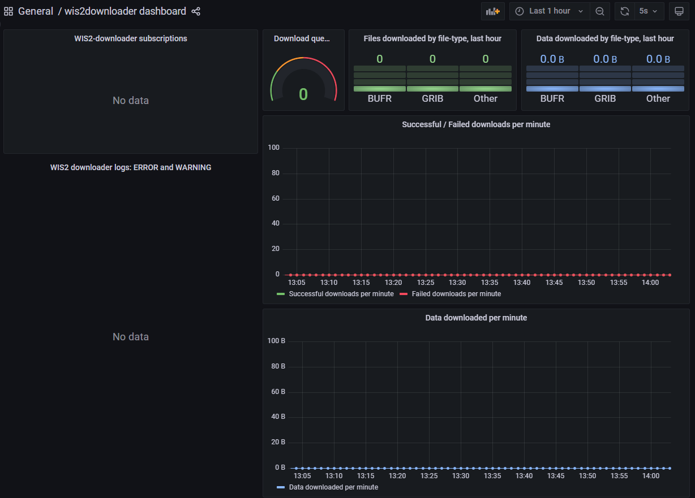

# تنزيل وفك تشفير البيانات من WIS2

!!! abstract "نتائج التعلم!"

    بنهاية هذه الجلسة العملية، ستكون قادرًا على:

    - استخدام "wis2downloader" للاشتراك في إشعارات بيانات WIS2 وتنزيل البيانات إلى نظامك المحلي
    - عرض حالة التنزيلات في لوحة تحكم Grafana
    - فك تشفير بعض البيانات المُنزلة باستخدام حاوية "decode-bufr-jupyter"

## مقدمة

في هذه الجلسة ستتعلم كيفية إعداد اشتراك لـ WIS2 Broker وتنزيل البيانات تلقائيًا إلى نظامك المحلي باستخدام خدمة "wis2downloader" المضمنة في wis2box.

!!! note "حول wis2downloader"
     
     يتوفر wis2downloader أيضًا كخدمة مستقلة يمكن تشغيلها على نظام مختلف عن النظام الذي ينشر إشعارات WIS2. راجع [wis2downloader](https://pypi.org/project/wis2downloader/) لمزيد من المعلومات حول استخدام wis2downloader كخدمة مستقلة.

     إذا كنت ترغب في تطوير خدمتك الخاصة للاشتراك في إشعارات WIS2 وتنزيل البيانات، يمكنك استخدام [شفرة المصدر wis2downloader](https://github.com/World-Meteorological-Organization/wis2downloader) كمرجع.

!!! Other tools for accessing WIS2 data

    يمكن استخدام الأدوات التالية أيضًا لاكتشاف والوصول إلى بيانات من WIS2:

    - [pywiscat](https://github.com/wmo-im/pywiscat) يوفر قدرة البحث فوق WIS2 Global Discovery Catalogue لدعم التقارير وتحليل كتالوج WIS2 وبيانات الاكتشاف المرتبطة به
    - [pywis-pubsub](https://github.com/World-Meteorological-Organization/pywis-pubsub) يوفر قدرة الاشتراك وتنزيل بيانات WMO من خدمات بنية WIS2

## التحضير

قبل البدء، يرجى تسجيل الدخول إلى VM الطالب الخاص بك وتأكد من أن نسخة wis2box الخاصة بك قيد التشغيل.

## عرض لوحة تحكم wis2downloader في Grafana

افتح متصفح ويب وانتقل إلى لوحة تحكم Grafana لنسخة wis2box الخاصة بك بالانتقال إلى `http://YOUR-HOST:3000`.

انقر على لوحات التحكم في القائمة اليسرى، ثم حدد **لوحة تحكم wis2downloader**.

يجب أن ترى اللوحة التالية:



تعتمد هذه اللوحة على المقاييس التي نشرتها خدمة wis2downloader وستعرض لك حالة التنزيلات الجارية حاليًا.

في الزاوية العلوية اليسرى، يمكنك رؤية الاشتراكات النشطة حاليًا.

احتفظ بهذه اللوحة مفتوحة حيث ستستخدمها لمراقبة تقدم التنزيل في التمرين التالي.

## مراجعة تكوين wis2downloader

يمكن تكوين خدمة wis2downloader التي بدأتها مجموعة wis2box باستخدام المتغيرات البيئية المحددة في ملف wis2box.env الخاص بك.

تستخدم المتغيرات البيئية التالية بواسطة wis2downloader:

    - DOWNLOAD_BROKER_HOST: اسم المضيف لوسيط MQTT الذي سيتم الاتصال به. القيمة الافتراضية هي globalbroker.meteo.fr
    - DOWNLOAD_BROKER_PORT: منفذ وسيط MQTT الذي سيتم الاتصال به. القيمة الافتراضية هي 443 (HTTPS لواجهات الويب)
    - DOWNLOAD_BROKER_USERNAME: اسم المستخدم للاتصال بوسيط MQTT. القيمة الافتراضية هي everyone
    - DOWNLOAD_BROKER_PASSWORD: كلمة المرور للاتصال بوسيط MQTT. القيمة الافتراضية هي everyone
    - DOWNLOAD_BROKER_TRANSPORT: واجهات الويب أو tcp، آلية النقل المستخدمة للاتصال بوسيط MQTT. القيمة الافتراضية هي واجهات الويب
    - DOWNLOAD_RETENTION_PERIOD_HOURS: فترة الاحتفاظ بالساعات للبيانات المُنزلة. القيمة الافتراضية هي 24
    - DOWNLOAD_WORKERS: عدد عمال التنزيل المستخدمين. القيمة الافتراضية هي 8. يحدد عدد التنزيلات المتوازية.
    - DOWNLOAD_MIN_FREE_SPACE_GB: الحد الأدنى للمساحة الحرة بالجيجابايت للحفاظ عليها في الحجم الذي يستضيف التنزيلات. القيمة الافتراضية هي 1.

لمراجعة التكوين الحالي لـ wis2downloader، يمكنك استخدام الأمر التالي:

```bash
cat ~/wis2box/wis2box.env | grep DOWNLOAD
```

!!! question "مراجعة تكوين wis2downloader"
    
    ما هو وسيط MQTT الافتراضي الذي يتصل به wis2downloader؟

    ما هي فترة الاحتفاظ الافتراضية للبيانات المُنزلة؟

??? success "انقر للكشف عن الإجابة"

    وسيط MQTT الافتراضي الذي يتصل به wis2downloader هو `globalbroker.meteo.fr`.

    فترة الاحتفاظ الافتراضية للبيانات المُنزلة هي 24 ساعة.

!!! note "تحديث تكوين wis2downloader"

    لتحديث تكوين wis2downloader، يمكنك تعديل ملف wis2box.env. لتطبيق التغييرات، يمكنك إعادة تشغيل الأمر البدء لمجموعة wis2box:

    ```bash
    python3 wis2box-ctl.py start
    ```

    وسترى خدمة wis2downloader تعيد التشغيل بالتكوين الجديد.

يمكنك الاحتفاظ بالتكوين الافتراضي لغرض هذا التمرين.

## إضافة اشتراكات إلى wis2downloader

داخل حاوية **wis2downloader**، يمكنك استخدام سطر الأوامر لإدراج الاشتراكات وإضافتها وحذفها.

لتسجيل الدخول إلى حاوية **wis2downloader**، استخدم الأمر التالي:

```bash
python3 wis2box-ctl.py login wis2downloader
```

ثم استخدم الأمر التالي لإدراج الاشتراكات النشطة حاليًا:

```bash
wis2downloader list-subscriptions
```

يعيد هذا الأمر قائمة فارغة نظرًا لعدم وجود اشتراكات نشطة حاليًا.

لغرض هذا التمرين، سنشترك في الموضوع التالي `cache/a/wis2/de-dwd-gts-to-wis2/#`، للاشتراك في البيانات التي نشرها بوابة GTS-to-WIS2 المستضافة من DWD وإشعارات التنزيل من Global Cache.

لإضافة هذا الاشتراك، استخدم الأمر التالي:

```bash
wis2downloader add-subscription --topic cache/a/wis2/de-dwd-gts-to-wis2/#
```

ثم اخرج من حاوية **wis2downloader** بكتابة `exit`:

```bash
exit
```

تحقق من لوحة تحكم wis2downloader في Grafana لرؤية الاشتراك الجديد المضاف. انتظر بضع دقائق ويجب أن ترى التنزيلات الأولى تبدأ. انتقل إلى التمرين التالي بمجرد تأكيد بدء التنزيلات.

## عرض البيانات المُنزلة

تقوم خدمة wis2downloader في مجموعة wis2box بتنزيل البيانات في دليل 'downloads' في الدليل الذي حددته كـ WIS2BOX_HOST_DATADIR في ملف wis2box.env الخاص بك. لعرض محتويات دليل التنزيلات، يمكنك استخدام الأمر التالي:

```bash
ls -R ~/wis2box-data/downloads
```

لاحظ أن البيانات المُنزلة مخزنة في دلائل باسم الموضوع الذي نُشرت عليه إشعارات WIS2.

## إزالة الاشتراكات من wis2downloader

بعد ذلك، سجل الدخول مرة أخرى إلى حاوية wis2downloader:

```bash
python3 wis2box-ctl.py login wis2downloader
```

وأزل الاشتراك الذي قمت به من wis2downloader، باستخدام الأمر التالي:

```bash
wis2downloader remove-subscription --topic cache/a/wis2/de-dwd-gts-to-wis2/#
```

واخرج من حاوية wis2downloader بكتابة `exit`:
    
```bash
exit
```

تحقق من لوحة تحكم wis2downloader في Grafana لرؤية الاشتراك المزال. يجب أن ترى التنزيلات تتوقف.

## تنزيل وفك تشفير البيانات لمسار إعصار استوائي

في هذا التمرين، ستشترك في WIS2 Training Broker الذي ينشر بيانات تدريبية كمثال. ستقوم بإعداد اشتراك لتنزيل البيانات لمسار إعصار استوائي. ثم ستقوم بفك تشفير البيانات المُنزلة باستخدام حاوية "decode-bufr-jupyter".

### الاشتراك في wis2training-broker وإعداد اشتراك جديد

هذا يوضح كيفية الاشتراك في وسيط ليس الوسيط الافتراضي وسيسمح لك بتنزيل بعض البيانات التي نشرها WIS2 Training Broker.

عدل ملف wis2box.env وغير DOWNLOAD_BROKER_HOST إلى `wis2training-broker.wis2dev.io`، غير DOWNLOAD_BROKER_PORT إلى `1883` وغير DOWNLOAD_BROKER_TRANSPORT إلى `tcp`:

```copy
# إعدادات التنزيل
DOWNLOAD_BROKER_HOST=wis2training-broker.wis2dev.io
DOWNLOAD_BROKER_PORT=1883
DOWNLOAD_BROKER_USERNAME=everyone
DOWNLOAD_BROKER_PASSWORD=everyone
# آلية نقل التنزيل (tcp أو واجهات الويب)
DOWNLOAD_BROKER_TRANSPORT=tcp
```

ثم قم بتشغيل الأمر 'start' مرة أخرى لتطبيق التغييرات:

```bash
python3 wis2box-ctl.py start
```

تحقق من سجلات wis2downloader لمعرفة ما إذا كان الاتصال بالوسيط الجديد ناجحًا:

```bash
docker logs wis2downloader
```

يجب أن ترى رسالة السجل التالية:

```copy
...
INFO - Connecting...
INFO - Host: wis2training-broker.wis2dev.io, port: 1883
INFO - Connected successfully
```

الآن سنقوم بإعداد اشتراك جديد لتنزيل بيانات مسار الإعصار من WIS2 Training Broker.

سجل الدخول إلى حاوية **wis2downloader**:

```bash
python3 wis2box-ctl.py login wis2downloader
```

ونفذ الأمر التالي (انسخ والصق هذا لتجنب الأخطاء):

```bash
wis2downloader add-subscription --topic origin/a/wis2/int-wis2-training/data/core/weather/prediction/forecast/medium-range/probabilistic/trajectory
```

اخرج من حاوية **wis2downloader** بكتابة `exit`.

انتظر حتى ترى التنزيلات تبدأ في لوحة تحكم wis2downloader في Grafana.

!!! note "تنزيل البيانات من WIS2 Training Broker"

    WIS2 Training Broker هو وسيط اختبار يُستخدم لأغراض التدريب وقد لا ينشر البيانات طوال الوقت.

    خلال جلسات التدريب الشخصية، سيضمن المدرب المحلي أن WIS2 Training Broker سينشر البيانات لك لتنزيلها.

    إذا كنت تقوم بهذا التمرين خارج جلسة تدريب، قد لا

اقرأ التعليمات في الدفتر وشغّل الخلايا لفك تشفير البيانات المحملة لمسارات الأعاصير المدارية. قم بتشغيل كل خلية بالنقر على الخلية ثم النقر على زر التشغيل في شريط الأدوات أو بالضغط على `Shift+Enter`.

في النهاية يجب أن ترى رسمًا بيانيًا لاحتمالية الإصابة لمسارات الأعاصير المدارية:


!!! question 

    تعرض النتيجة احتمالية التنبؤ بمسار العاصفة المدارية ضمن 200 كم. كيف يمكنك تحديث الدفتر لعرض احتمالية التنبؤ بمسار العاصفة المدارية ضمن 300 كم؟

??? success "انقر لكشف الإجابة"

    لتحديث الدفتر لعرض احتمالية التنبؤ بمسار العاصفة المدارية ضمن مسافة مختلفة، يمكنك تحديث متغير `distance_threshold` في الكتلة البرمجية التي تحسب احتمالية الإصابة.

    لعرض احتمالية التنبؤ بمسار العاصفة المدارية ضمن 300 كم، 

    ```python
    # تعيين حد المسافة (بالأمتار)
    distance_threshold = 300000  # 300 كم بالأمتار
    ```

    ثم أعد تشغيل الخلايا في الدفتر لرؤية الرسم البياني المحدث.

!!! note "فك تشفير بيانات BUFR"

    التمرين الذي قمت به للتو قدم مثالًا محددًا عن كيفية فك تشفير بيانات BUFR باستخدام مكتبة ecCodes. قد تتطلب أنواع البيانات المختلفة خطوات فك تشفير مختلفة وقد تحتاج إلى الرجوع إلى التوثيق الخاص بنوع البيانات الذي تعمل معه.
    
    لمزيد من المعلومات يرجى الرجوع إلى [توثيق ecCodes](https://confluence.ecmwf.int/display/ECC).


## الخاتمة

!!! success "تهانينا!"

    في هذه الجلسة العملية، تعلمت كيفية:

    - استخدام 'wis2downloader' للاشتراك في WIS2 Broker وتحميل البيانات إلى نظامك المحلي
    - مشاهدة حالة التحميلات في لوحة تحكم Grafana
    - فك تشفير بعض البيانات المحملة باستخدام حاوية 'decode-bufr-jupyter'