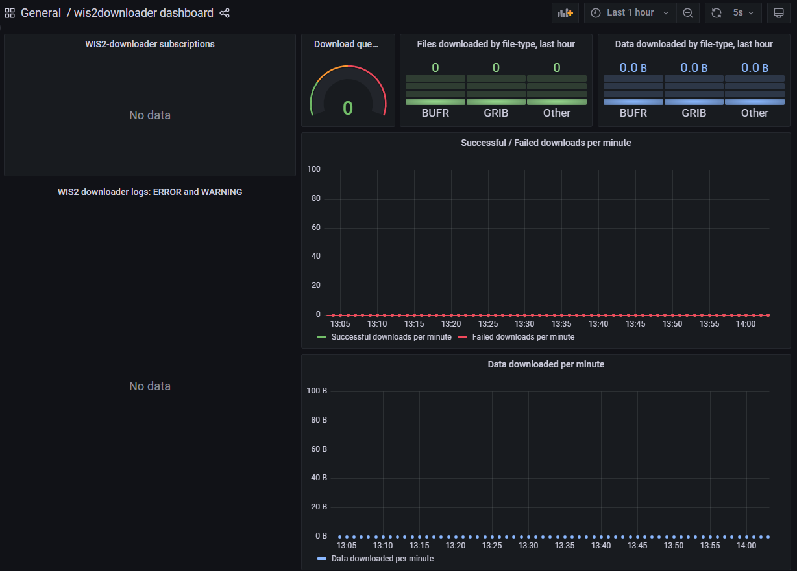

# تنزيل البيانات من WIS2 باستخدام wis2downloader

!!! abstract "نتائج التعلم!"

    بنهاية هذه الجلسة العملية، ستكون قادرًا على:

    - استخدام "wis2downloader" للاشتراك في إشعارات بيانات WIS2 وتنزيل البيانات إلى نظامك المحلي
    - عرض حالة التنزيلات في لوحة تحكم Grafana
    - تعلم كيفية تكوين wis2downloader للاشتراك في وسيط غير افتراضي

## المقدمة

في هذه الجلسة، ستتعلم كيفية إعداد اشتراك في وسيط WIS2 وتنزيل البيانات تلقائيًا إلى نظامك المحلي باستخدام خدمة "wis2downloader" المضمنة في wis2box.

!!! note "حول wis2downloader"
     
     يتوفر wis2downloader أيضًا كخدمة مستقلة يمكن تشغيلها على نظام مختلف عن النظام الذي ينشر إشعارات WIS2. راجع [wis2downloader](https://pypi.org/project/wis2downloader/) لمزيد من المعلومات حول استخدام wis2downloader كخدمة مستقلة.

     إذا كنت ترغب في تطوير خدمتك الخاصة للاشتراك في إشعارات WIS2 وتنزيل البيانات، يمكنك استخدام [كود مصدر wis2downloader](https://github.com/World-Meteorological-Organization/wis2downloader) كمرجع.

## التحضير

قبل البدء، يرجى تسجيل الدخول إلى جهاز الطالب الافتراضي الخاص بك والتأكد من أن مثيل wis2box الخاص بك يعمل.

## أساسيات wis2downloader

يتم تضمين wis2downloader كحاوية منفصلة في wis2box كما هو محدد في ملفات Docker Compose. يتم تكوين حاوية Prometheus في wis2box لجمع المقاييس من حاوية wis2downloader، ويمكن عرض هذه المقاييس من خلال لوحة تحكم في Grafana.

### عرض لوحة تحكم wis2downloader في Grafana

افتح متصفح الويب وانتقل إلى لوحة تحكم Grafana لمثيل wis2box الخاص بك عن طريق الذهاب إلى `http://YOUR-HOST:3000`.

انقر على لوحات التحكم في القائمة الجانبية:


ثم اختر **لوحة تحكم wis2downloader**:


يجب أن ترى لوحة التحكم التالية:



تعتمد هذه اللوحة على المقاييس التي تنشرها خدمة wis2downloader وستعرض لك حالة التنزيلات التي تجري حاليًا.

في الزاوية العلوية اليسرى، يمكنك رؤية الاشتراكات النشطة حاليًا.

احتفظ بهذه اللوحة مفتوحة حيث ستستخدمها لمراقبة تقدم التنزيل في التمرين التالي.

### مراجعة تكوين wis2downloader

يمكن تكوين خدمة wis2downloader في wis2box باستخدام متغيرات البيئة المحددة في ملف `wis2box.env` الخاص بك.

تُستخدم متغيرات البيئة التالية بواسطة wis2downloader:

    - DOWNLOAD_BROKER_HOST: اسم المضيف لوسيط MQTT للاتصال به. الافتراضي هو globalbroker.meteo.fr
    - DOWNLOAD_BROKER_PORT: المنفذ الخاص بوسيط MQTT للاتصال به. الافتراضي هو 443 (HTTPS للويب سوكيت)
    - DOWNLOAD_BROKER_USERNAME: اسم المستخدم للاتصال بوسيط MQTT. الافتراضي هو everyone
    - DOWNLOAD_BROKER_PASSWORD: كلمة المرور للاتصال بوسيط MQTT. الافتراضي هو everyone
    - DOWNLOAD_BROKER_TRANSPORT: websockets أو tcp، آلية النقل المستخدمة للاتصال بوسيط MQTT. الافتراضي هو websockets
    - DOWNLOAD_RETENTION_PERIOD_HOURS: فترة الاحتفاظ بالبيانات التي تم تنزيلها بالساعات. الافتراضي هو 24
    - DOWNLOAD_WORKERS: عدد عمال التنزيل المستخدمين. الافتراضي هو 8. يحدد عدد التنزيلات المتوازية.
    - DOWNLOAD_MIN_FREE_SPACE_GB: الحد الأدنى للمساحة الحرة بالجيجابايت للحفاظ عليها على وحدة التخزين التي تستضيف التنزيلات. الافتراضي هو 1.

لمراجعة التكوين الحالي لـ wis2downloader، يمكنك استخدام الأمر التالي:

```bash
cat ~/wis2box/wis2box.env | grep DOWNLOAD
```

!!! question "مراجعة تكوين wis2downloader"
    
    ما هو وسيط MQTT الافتراضي الذي يتصل به wis2downloader؟

    ما هي فترة الاحتفاظ الافتراضية للبيانات التي تم تنزيلها؟

??? success "انقر لعرض الإجابة"

    وسيط MQTT الافتراضي الذي يتصل به wis2downloader هو `globalbroker.meteo.fr`.

    فترة الاحتفاظ الافتراضية للبيانات التي تم تنزيلها هي 24 ساعة.

!!! note "تحديث تكوين wis2downloader"

    لتحديث تكوين wis2downloader، يمكنك تعديل ملف wis2box.env. لتطبيق التغييرات، يمكنك إعادة تشغيل الأمر الخاص بتشغيل wis2box-stack:

    ```bash
    python3 wis2box-ctl.py start
    ```

    وسترى خدمة wis2downloader تُعاد تشغيلها بالتكوين الجديد.

يمكنك الاحتفاظ بالتكوين الافتراضي للتمرين التالي.

### واجهة سطر الأوامر لـ wis2downloader

للوصول إلى واجهة سطر الأوامر الخاصة بـ wis2downloader داخل wis2box، يمكنك تسجيل الدخول إلى حاوية **wis2downloader** باستخدام الأمر التالي:

```bash
python3 wis2box-ctl.py login wis2downloader
```

استخدم الأمر التالي لعرض قائمة الاشتراكات النشطة حاليًا:

```bash
wis2downloader list-subscriptions
```

يعيد هذا الأمر قائمة فارغة، حيث لم يتم إعداد أي اشتراكات بعد.

## تنزيل بيانات GTS باستخدام وسيط WIS2 العالمي

إذا احتفظت بالتكوين الافتراضي لـ wis2downloader، فإنه متصل حاليًا بوسيط WIS2 العالمي المستضاف من قبل Météo-France.

### إعداد الاشتراك

استخدم الأمر التالي `cache/a/wis2/de-dwd-gts-to-wis2/#` للاشتراك في البيانات المنشورة بواسطة بوابة GTS-to-WIS2 المستضافة من قبل DWD، والمتاحة من خلال Global Caches:

```bash
wis2downloader add-subscription --topic cache/a/wis2/de-dwd-gts-to-wis2/#
```

ثم اخرج من حاوية **wis2downloader** عن طريق كتابة `exit`:

```bash
exit
```

### التحقق من البيانات التي تم تنزيلها

تحقق من لوحة تحكم wis2downloader في Grafana لرؤية الاشتراك الجديد المضاف. انتظر بضع دقائق ويجب أن ترى التنزيلات الأولى تبدأ. انتقل إلى التمرين التالي بمجرد تأكيدك أن التنزيلات قد بدأت.

تقوم خدمة wis2downloader في wis2box بتنزيل البيانات في دليل 'downloads' في الدليل الذي حددته كـ `WIS2BOX_HOST_DATADIR` في ملف `wis2box.env` الخاص بك. لعرض محتويات دليل التنزيلات، استخدم الأمر التالي:

```bash
ls -R ~/wis2box-data/downloads
```

لاحظ أن البيانات التي تم تنزيلها يتم تخزينها في أدلة مسماة بناءً على الموضوع الذي تم نشر إشعار WIS2 عليه.

!!! question "عرض البيانات التي تم تنزيلها"

    ما هي الأدلة التي تراها في دليل التنزيلات؟

    هل يمكنك رؤية أي ملفات تم تنزيلها في هذه الأدلة؟

??? success "انقر لعرض الإجابة"
    يجب أن ترى بنية دليل تبدأ بـ `cache/a/wis2/de-dwd-gts-to-wis2/` تحتها سترى المزيد من الأدلة المسماة بناءً على رؤوس نشرات GTS للبيانات التي تم تنزيلها.

    بناءً على وقت بدء الاشتراك، قد ترى أو لا ترى أي ملفات تم تنزيلها في هذا الدليل حتى الآن. إذا لم ترَ أي ملفات بعد، انتظر بضع دقائق أخرى وتحقق مرة أخرى.

تحقق من لوحة تحكم wis2downloader في Grafana لرؤية تقدم التنزيل، سترى الاشتراك الذي أضفته في الزاوية العلوية اليسرى من اللوحة، وعدد التنزيلات يزداد مع تنزيل البيانات:


### إزالة الاشتراك والبيانات التي تم تنزيلها

لنقم بتنظيف الاشتراك والبيانات التي تم تنزيلها قبل الانتقال إلى التمرين التالي.

سجل الدخول مرة أخرى إلى حاوية wis2downloader:

```bash
python3 wis2box-ctl.py login wis2downloader
```

وقم بإزالة الاشتراك الذي قمت به من wis2downloader باستخدام الأمر التالي:

```bash
wis2downloader remove-subscription --topic cache/a/wis2/de-dwd-gts-to-wis2/#
```

قم بزيارة لوحة تحكم Grafana لتأكيد أن الاشتراك قد تمت إزالته وأن التنزيلات قد توقفت، يجب أن ترى الاشتراك يختفي من الزاوية العلوية اليسرى من اللوحة.

**انتظر بضع دقائق حتى تظهر اللوحة أن التنزيلات قد توقفت.**

أخيرًا، يمكنك إزالة البيانات التي تم تنزيلها باستخدام الأمر التالي في حاوية wis2downloader:

```bash
rm -rf app/data/downloads/*
```

!!! note
    
    الدليل `app/data/downloads` في حاوية wis2downloader يتم ربطه بدليل `downloads` في `WIS2BOX_HOST_DATADIR` كما هو محدد في ملف `wis2box.env`. الأمر أعلاه يزيل جميع البيانات التي تم تنزيلها.

اخرج من حاوية wis2downloader عن طريق كتابة `exit`:
    
```bash
exit
```

تحقق من أن دليل التنزيلات على المضيف الخاص بك فارغ مرة أخرى:

```bash
ls -R ~/wis2box-data/downloads
```

!!! note "حول بوابات GTS-to-WIS2"
    هناك حاليًا بوابتان GTS-to-WIS2 تنشران البيانات من خلال وسيط WIS2 العالمي وGlobal Caches:

- DWD (ألمانيا): centre-id=*de-dwd-gts-to-wis2*  
- JMA (اليابان): centre-id=*jp-jma-gts-to-wis2*  

إذا قمت في التمرين السابق باستبدال `de-dwd-gts-to-wis2` بـ `jp-jma-gts-to-wis2`، ستتلقى الإشعارات والبيانات التي ينشرها بوابة JMA GTS-to-WIS2.

!!! note "المواضيع الأصلية مقابل مواضيع التخزين المؤقت"

عند الاشتراك في موضوع يبدأ بـ `origin/`، ستتلقى إشعارات تحتوي على عنوان URL قانوني يشير إلى خادم بيانات يوفره مركز WIS الذي ينشر البيانات.

عند الاشتراك في موضوع يبدأ بـ `cache/`، ستتلقى إشعارات متعددة لنفس البيانات، واحدة لكل Global Cache. كل إشعار سيحتوي على عنوان URL قانوني يشير إلى خادم بيانات Global Cache المعني. سيقوم wis2downloader بتنزيل البيانات من أول عنوان URL قانوني يمكن الوصول إليه.

## تنزيل بيانات مثال من WIS2 Training Broker

في هذا التمرين، ستشترك في WIS2 Training Broker الذي ينشر بيانات مثال لأغراض التدريب.

### تغيير إعدادات wis2downloader

يوضح هذا كيفية الاشتراك في وسيط ليس الوسيط الافتراضي وسيسمح لك بتنزيل بعض البيانات المنشورة من WIS2 Training Broker.

قم بتحرير ملف `wis2box.env` وقم بتغيير `DOWNLOAD_BROKER_HOST` إلى `wis2training-broker.wis2dev.io`، و`DOWNLOAD_BROKER_PORT` إلى `1883`، و`DOWNLOAD_BROKER_TRANSPORT` إلى `tcp`:

```copy
# إعدادات التنزيل
DOWNLOAD_BROKER_HOST=wis2training-broker.wis2dev.io
DOWNLOAD_BROKER_PORT=1883
DOWNLOAD_BROKER_USERNAME=everyone
DOWNLOAD_BROKER_PASSWORD=everyone
# آلية نقل التنزيل (tcp أو websockets)
DOWNLOAD_BROKER_TRANSPORT=tcp
```

تحقق جيدًا من أن التغييرات التي أجريتها تطابق ما ورد أعلاه عن طريق تشغيل:

```bash
cat ~/wis2box/wis2box.env | grep DOWNLOAD
```

ثم قم بتشغيل أمر 'restart' لتطبيق التغييرات:

```bash
python3 wis2box-ctl.py restart
```

تحقق من سجلات wis2downloader لمعرفة ما إذا كان الاتصال بالوسيط الجديد ناجحًا:

```bash
docker logs wis2downloader
```

يجب أن ترى رسالة السجل التالية:

```copy
...
INFO - Connecting...
INFO - Host: wis2training-broker.wis2dev.io, port: 1883
INFO - Connected successfully
```

### إعداد اشتراكات جديدة

الآن سنقوم بإعداد اشتراك جديد في الموضوع لتنزيل بيانات مسار الأعاصير من WIS2 Training Broker.

قم بتسجيل الدخول إلى حاوية **wis2downloader**:

```bash
python3 wis2box-ctl.py login wis2downloader
```

وقم بتنفيذ الأمر التالي (انسخ والصق هذا لتجنب الأخطاء الإملائية):

```bash
wis2downloader add-subscription --topic origin/a/wis2/int-wis2-training/data/core/weather/prediction/forecast/medium-range/probabilistic/trajectory
```

اخرج من حاوية **wis2downloader** بكتابة `exit`.

### التحقق من البيانات التي تم تنزيلها

انتظر حتى ترى بدء التنزيلات في لوحة تحكم wis2downloader في Grafana.

تحقق من أن البيانات قد تم تنزيلها عن طريق التحقق من سجلات wis2downloader مرة أخرى باستخدام:

```bash
docker logs wis2downloader
```

يجب أن ترى رسالة سجل مشابهة لما يلي:

```copy
[...] INFO - Message received under topic origin/a/wis2/int-wis2-training/data/core/weather/prediction/forecast/medium-range/probabilistic/trajectory
[...] INFO - Downloaded A_JSXX05ECEP020000_C_ECMP_...
```

تحقق من محتويات دليل التنزيلات مرة أخرى:

```bash
ls -R ~/wis2box-data/downloads
```

يجب أن ترى دليلًا جديدًا باسم `origin/a/wis2/int-wis2-training/data/core/weather/prediction/forecast/medium-range/probabilistic/trajectory` يحتوي على البيانات التي تم تنزيلها.

!!! question "مراجعة البيانات التي تم تنزيلها"

    ما هو تنسيق الملفات للبيانات التي تم تنزيلها؟

??? success "انقر لعرض الإجابة"

    البيانات التي تم تنزيلها بتنسيق BUFR كما هو موضح بامتداد الملف `.bufr`.

بعد ذلك، حاول إضافة اشتراكين آخرين لتنزيل بيانات شذوذ درجة حرارة السطح الشهرية وبيانات التنبؤ العالمية من المواضيع التالية:

- `origin/a/wis2/int-wis2-training/data/core/weather/prediction/forecast/medium-range/probabilistic/global`
- `origin/a/wis2/int-wis2-training/data/core/climate/experimental/anomalies/monthly/surface-temperature`

انتظر حتى ترى بدء التنزيلات في لوحة تحكم wis2downloader في Grafana.

تحقق من محتويات دليل التنزيلات مرة أخرى:

```bash
ls -R ~/wis2box-data/downloads
```

يجب أن ترى الأدلة الجديدة المقابلة للمواضيع التي اشتركت فيها، تحتوي على البيانات التي تم تنزيلها.

## الخاتمة

!!! success "تهانينا!"

    في هذه الجلسة العملية، تعلمت كيفية:

    - استخدام 'wis2downloader' للاشتراك في WIS2 Broker وتنزيل البيانات إلى نظامك المحلي
    - عرض حالة التنزيلات في لوحة تحكم Grafana
    - كيفية تغيير الإعداد الافتراضي لـ wis2downloader للاشتراك في وسيط مختلف
    - كيفية عرض البيانات التي تم تنزيلها على نظامك المحلي