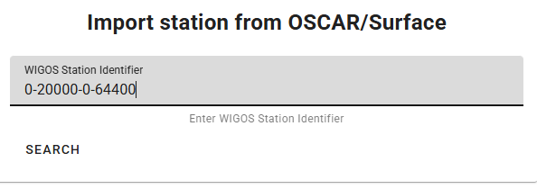

# إدخال البيانات للنشر

!!! abstract "نتائج التعلم"

    بنهاية هذه الجلسة العملية، ستكون قادرًا على:
    
    - تشغيل سير عمل wis2box عن طريق تحميل البيانات إلى MinIO باستخدام سطر الأوامر، واجهة الويب MinIO، SFTP، أو سكريبت Python.
    - الوصول إلى لوحة تحكم Grafana لمراقبة حالة إدخال البيانات وعرض سجلات نسختك من wis2box.
    - عرض إشعارات بيانات WIS2 التي نشرتها نسختك من wis2box باستخدام MQTT Explorer.

## مقدمة

في WIS2، يتم مشاركة البيانات في الوقت الفعلي باستخدام إشعارات بيانات WIS2 التي تحتوي على رابط "قياسي" يمكن من خلاله تنزيل البيانات.

لتشغيل سير عمل البيانات في عقدة WIS2 باستخدام برنامج wis2box، يجب تحميل البيانات إلى الدلو **wis2box-incoming** في **MinIO**، والذي يبدأ سير عمل wis2box. يؤدي هذا الإجراء إلى نشر البيانات عبر إشعار بيانات WIS2. اعتمادًا على تعيينات البيانات المكونة في نسختك من wis2box، قد يتم تحويل البيانات إلى تنسيق BUFR قبل نشرها.

في هذا التمرين، سنستخدم ملفات بيانات عينة لتشغيل سير عمل wis2box و**نشر إشعارات بيانات WIS2** لمجموعة البيانات التي قمت بتكوينها في الجلسة العملية السابقة.

خلال التمرين، سنراقب حالة إدخال البيانات باستخدام **لوحة تحكم Grafana** و**MQTT Explorer**. تستخدم لوحة تحكم Grafana البيانات من Prometheus و Loki لعرض حالة wis2box الخاصة بك، بينما يتيح لك MQTT Explorer رؤية إشعارات بيانات WIS2 التي نشرتها نسختك من wis2box.

لاحظ أن wis2box سيحول البيانات النموذجية إلى تنسيق BUFR قبل نشرها إلى وسيط MQTT، وفقًا لتعيينات البيانات المسبقة الإعداد في مجموعة البيانات الخاصة بك. في هذا التمرين، سنركز على الطرق المختلفة لتحميل البيانات إلى نسختك من wis2box والتحقق من الإدخال والنشر الناجحين. سيتم تغطية تحويل البيانات لاحقًا في جلسة عملية [أدوات تحويل البيانات](../data-conversion-tools).

## التحضير

تستخدم هذه القسم مجموعة البيانات لـ "surface-based-observations/synop" التي تم إنشاؤها مسبقًا في جلسة عملية [تكوين مجموعات البيانات في wis2box](../configuring-wis2box-datasets). كما يتطلب معرفة بتكوين المحطات في **wis2box-webapp**، كما هو موضح في جلسة عملية [تكوين بيانات المحطة](../configuring-station-metadata).

تأكد من أنك تستطيع تسجيل الدخول إلى جهاز الطالب الافتراضي باستخدام عميل SSH الخاص بك (مثل PuTTY).

تأكد من أن wis2box قيد التشغيل:

```bash
cd ~/wis2box/
python3 wis2box-ctl.py start
python3 wis2box-ctl.py status
```

تأكد من أن MQTT Explorer قيد التشغيل ومتصل بنسختك باستخدام بيانات الاعتماد العامة `everyone/everyone` مع اشتراك في الموضوع `origin/a/wis2/#`.

تأكد من أن لديك متصفح ويب مفتوح مع لوحة تحكم Grafana لنسختك عن طريق التنقل إلى `http://YOUR-HOST:3000`.

### إعداد البيانات النموذجية

انسخ الدليل `exercise-materials/data-ingest-exercises` إلى الدليل الذي حددته كـ `WIS2BOX_HOST_DATADIR` في ملف `wis2box.env` الخاص بك:

```bash
cp -r ~/exercise-materials/data-ingest-exercises ~/wis2box-data/
```

!!! note
    يتم تركيب `WIS2BOX_HOST_DATADIR` كـ `/data/wis2box/` داخل حاوية wis2box-management بواسطة ملف `docker-compose.yml` المضمن في دليل `wis2box`.
    
    هذا يتيح لك مشاركة البيانات بين الخادم والحاوية.

### إضافة المحطة الاختبارية

أضف المحطة بمعرف WIGOS `0-20000-0-64400` إلى نسختك من wis2box باستخدام محرر المحطات في wis2box-webapp.

استرجع المحطة من OSCAR:



أضف المحطة إلى مجموعات البيانات التي أنشأتها للنشر على "../surface-based-observations/synop" واحفظ التغييرات باستخدام رمز المصادقة الخاص بك:


لاحظ أنه يمكنك إزالة هذه المحطة من مجموعة البيانات الخاصة بك بعد الجلسة العملية.

## اختبار إدخال البيانات من سطر الأوامر

في هذا التمرين، سنستخدم الأمر `wis2box data ingest` لتحميل البيانات إلى MinIO.

تأكد من أنك في دليل `wis2box` وقم بتسجيل الدخول إلى حاوية **wis2box-management**:

```bash
cd ~/wis2box
python3 wis2box-ctl.py login
```

تحقق من توفر البيانات النموذجية التالية في الدليل `/data/wis2box/` داخل حاوية **wis2box-management**:

```bash
ls -lh /data/wis2box/data-ingest-exercises/synop_202412030900.txt
```

!!! question "إدخال البيانات باستخدام `wis2box data ingest`"

    نفذ الأمر التالي لإدخال ملف البيانات النموذجي إلى نسختك من wis2box:

    ```bash
    wis2box data ingest -p /data/wis2box/data-ingest-exercises/synop_202412030900.txt --metadata-id urn:wmo:md:not-my-centre:synop-test
    ```

    هل تم إدخال البيانات بنجاح؟ إذا لم يكن كذلك، ما هو رسالة الخطأ، وكيف يمكنك إصلاحها؟

??? success "انقر للكشف عن الإجابة"

    لم يتم إدخال البيانات بنجاح. يجب أن ترى ما يلي:

    ```bash
    Error: metadata_id=urn:wmo:md:not-my-centre:synop-test not found in data mappings
    ```

    تشير رسالة الخطأ إلى أن المعرف الوصفي الذي قدمته لا يتطابق مع أي من مجموعات البيانات التي قمت بتكوينها في نسختك من wis2box.

    قدم المعرف الوصفي الصحيح الذي يتطابق مع مجموعة البيانات التي أنشأتها في الجلسة العملية السابقة وكرر أمر إدخال البيانات حتى ترى الإخراج التالي:

    ```bash 
    Processing /data/wis2box/data-ingest-exercises/synop_202412030900.txt
    Done
    ```

انتقل إلى واجهة MinIO في متصفحك وتحقق مما إذا كان الملف `synop_202412030900.txt` قد تم تحميله إلى دلو `wis2box-incoming`. يجب أن ترى دليلًا جديدًا باسم مجموعة البيانات التي قدمتها في خيار `--metadata-id`، وداخل هذا الدليل، ستجد الملف `synop_202412030900.txt`:


!!! note
    قام الأمر `wis2box data ingest` بتحميل الملف إلى دلو `wis2box-incoming` في MinIO في دليل باسم المعرف الوصفي الذي قدمته.

انتقل إلى لوحة تحكم Grafana في متصفحك وتحقق من حالة إدخال البيانات.

!!! question "تحقق من حالة إدخال البيانات على Grafana"
    
    انتقل إلى لوحة تحكم Grafana على **http://your-host:3000** وتحقق من حالة إدخال البيانات في متصفحك.
    
    كيف يمكنك معرفة ما إذا تم إدخال البيانات ونشرها بنجاح؟

??? success "انقر للكشف عن الإجابة"
    
    إذا تم إدخال البيانات بنجاح، يجب أن ترى ما يلي:
    
      
    
    إذا لم تر ذلك، يرجى التحقق من رسائل التحذير أو الخطأ المعروضة في أسفل لوحة التحكم ومحاولة حلها.

!!! question "تحقق من وسيط MQTT لإشعارات WIS2"
    
    انتقل إلى MQTT Explorer وتحقق مما إذا كان بإمكانك رؤية رسالة إشعار WIS2 للبيانات التي أدخلتها للتو.
    
    كم عدد إشعارات بيانات WIS2 التي نشرتها نسختك من wis2box؟
    
    كيف يمكنك الوصول إلى محتوى البيانات المنشورة؟

??? success "انقر للكشف عن الإجابة"

    يجب أن ترى إشعار بيانات WIS2 واحد تم نشره بواسطة wis2box الخاصة بك.

    للوصول إلى محتوى البيانات المنشورة، يمكنك توسيع هيكل الموضوع لرؤية المستويات المختلفة للرسالة حتى تصل إلى المستوى الأخير ومراجعة محتوى الرسالة.

    يحتوي محتوى الرسالة على قسم "روابط" مع مفتاح "rel" بقيمة "canonical" ومفتاح "href" برابط URL لتنزيل البيانات. سيكون تنسيق الرابط URL على النحو التالي `http://YOUR-HOST/data/...`. 
    
    لاحظ أن تنسيق البيانات هو BUFR، وستحتاج إلى محلل BUFR لعرض محتوى البيانات. تنسيق BUFR هو تنسيق ثنائي يستخدمه الخدمات الجوية لتبادل البيانات. قامت الإضافات البيانية داخل wis2box بتحويل البيانات إلى BUFR قبل نشرها.

بعد إكمال هذا التمرين، اخرج من حاوية **wis2box-management**:

```bash
exit
```

## تحميل البيانات باستخدام واجهة الويب MinIO

في التمارين السابقة، قمت بتحميل البيانات المتوفرة على مضيف wis2box إلى MinIO باستخدام الأمر `wis2box data ingest`. 

التالي، سنستخدم واجهة الويب MinIO، التي تتيح لك تنزيل وتحميل البيانات إلى MinIO باستخدام متصفح ويب.

!!! question "إعادة تحميل البيانات باستخدام واجهة الويب MinIO"

    انتقل إلى واجهة الويب MinIO في متصفحك وتصفح إلى دلو `wis2box-incoming`. سترى الملف `synop_202412030900.txt` الذي قمت بتحميله في التمارين السابقة.

    انقر على الملف، وستتاح لك خيار تنزيله:

    

    يمكنك تنزيل

إذا استخدمت مسارًا خاطئًا، سترى رسالة خطأ في السجلات.

## رفع البيانات باستخدام سكربت بايثون

في هذا التمرين، سنستخدم عميل بايثون لـ MinIO لنسخ البيانات إلى MinIO.

يوفر MinIO عميل بايثون، يمكن تثبيته كما يلي:

```bash
pip3 install minio
```

على جهاز الطالب الافتراضي، سيكون حزمة 'minio' لبايثون مثبتة بالفعل.

في دليل `exercise-materials/data-ingest-exercises`، ستجد سكربت مثال `copy_file_to_incoming.py` الذي يمكن استخدامه لنسخ الملفات إلى MinIO.

حاول تشغيل السكربت لنسخ ملف البيانات النموذجي `synop_202501030900.txt` إلى دلو `wis2box-incoming` في MinIO كما يلي:

```bash
cd ~/wis2box-data/data-ingest-exercises
python3 copy_file_to_incoming.py synop_202501030900.txt
```

!!! note

    ستحصل على خطأ لأن السكربت لم يتم تكوينه للوصول إلى نقطة نهاية MinIO على wis2box الخاص بك بعد.

يحتاج السكربت إلى معرفة نقطة النهاية الصحيحة للوصول إلى MinIO على wis2box الخاص بك. إذا كان wis2box يعمل على مضيفك، فإن نقطة نهاية MinIO متاحة على `http://YOUR-HOST:9000`. يحتاج السكربت أيضًا إلى تحديث بكلمة مرور التخزين الخاصة بك والمسار في دلو MinIO لتخزين البيانات.

!!! question "تحديث السكربت وإدخال البيانات CSV"

    قم بتعديل السكربت `copy_file_to_incoming.py` لمعالجة الأخطاء، باستخدام إحدى الطرق التالية:
    - من سطر الأوامر: استخدم محرر النصوص `nano` أو `vim` لتعديل السكربت.
    - باستخدام WinSCP: ابدأ اتصالًا جديدًا باستخدام بروتوكول الملف `SCP` ونفس بيانات الاعتماد كعميل SSH الخاص بك. انتقل إلى الدليل `wis2box-data/data-ingest-exercises` وعدل `copy_file_to_incoming.py` باستخدام محرر النصوص المدمج.
    
    تأكد من أنك:

    - حددت نقطة نهاية MinIO الصحيحة لمضيفك.
    - قدمت كلمة المرور الصحيحة لتخزينك في MinIO.
    - قدمت المسار الصحيح في دلو MinIO لتخزين البيانات.

    أعد تشغيل السكربت لإدخال ملف البيانات النموذجي `synop_202501030900.txt` إلى MinIO:

    ```bash
    python3 ~/wis2box-data/ ~/wis2box-data/synop_202501030900.txt
    ```

    تأكد من حل الأخطاء.

بمجرد أن تتمكن من تشغيل السكربت بنجاح، سترى رسالة تشير إلى أن الملف تم نسخه إلى MinIO، ويجب أن ترى إشعارات البيانات التي نشرتها wis2box في MQTT Explorer.

يمكنك أيضًا التحقق من لوحة تحكم Grafana لمعرفة ما إذا تم إدخال البيانات ونشرها بنجاح.

الآن بعد أن بدأ السكربت في العمل، يمكنك محاولة نسخ ملفات أخرى إلى MinIO باستخدام نفس السكربت.

!!! question "إدخال البيانات الثنائية بتنسيق BUFR"

    قم بتشغيل الأمر التالي لنسخ ملف البيانات الثنائية `bufr-example.bin` إلى دلو `wis2box-incoming` في MinIO:

    ```bash
    python3 copy_file_to_incoming.py bufr-example.bin
    ```

تحقق من لوحة تحكم Grafana وMQTT Explorer لمعرفة ما إذا تم إدخال البيانات الاختبارية ونشرها بنجاح. إذا رأيت أي أخطاء، حاول حلها.

!!! question "التحقق من إدخال البيانات"

    كم عدد الرسائل التي تم نشرها إلى وسيط MQTT لهذه العينة من البيانات؟

??? success "انقر لكشف الإجابة"

    سترى أخطاء مُبلغ عنها في Grafana حيث أن المحطات في ملف BUFR لم تُعرف في قائمة المحطات لـ wis2box الخاص بك.
    
    إذا تم تعريف جميع المحطات المستخدمة في ملف BUFR في wis2box الخاص بك، يجب أن ترى 10 رسائل نُشرت إلى وسيط MQTT. كل إشعار يتوافق مع بيانات لمحطة واحدة لطابع زمني واحد للملاحظة.

    الإضافة `wis2box.data.bufr4.ObservationDataBUFR` تقسم ملف BUFR إلى رسائل BUFR فردية وتنشر رسالة واحدة لكل محطة وطابع زمني للملاحظة.

## الخاتمة

!!! success "تهانينا!"
    في هذه الجلسة العملية، تعلمت كيفية:

    - تشغيل سير عمل wis2box عن طريق رفع البيانات إلى MinIO باستخدام طرق مختلفة.
    - تصحيح الأخطاء الشائعة في عملية إدخال البيانات باستخدام لوحة تحكم Grafana وسجلات wis2box الخاصة بك.
    - مراقبة إشعارات بيانات WIS2 التي نشرتها wis2box الخاصة بك في لوحة تحكم Grafana وMQTT Explorer.