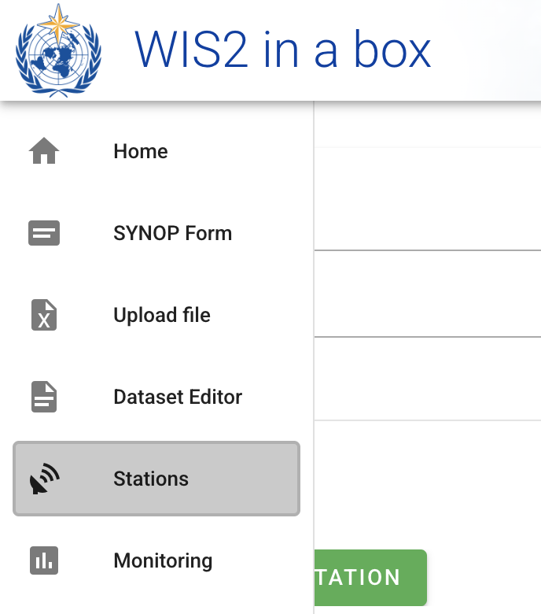

# Konfigurieren von Stationsmetadaten

!!! abstract "Lernergebnisse"

    Am Ende dieser praktischen Sitzung werden Sie in der Lage sein:

    - einen Autorisierungstoken für den `collections/stations`-Endpunkt erstellen
    - Stationsmetadaten zu wis2box hinzufügen
    - Stationsmetadaten mit der **wis2box-webapp** aktualisieren/löschen

## Einführung

Für den internationalen Datenaustausch zwischen Mitgliedern der WMO ist es wichtig, ein gemeinsames Verständnis der Stationen zu haben, die die Daten produzieren. Das Integrierte Globale Beobachtungssystem der WMO (WIGOS) bietet einen Rahmen für die Integration von Beobachtungssystemen und Datenmanagementsystemen. Der **WIGOS-Station-Identifier (WSI)** wird als eindeutiger Referenzpunkt der Station verwendet, die einen bestimmten Datensatz erzeugt hat.

wis2box verfügt über eine Sammlung von Stationsmetadaten, die verwendet wird, um die Stationen zu beschreiben, die die Beobachtungsdaten produzieren und die von **OSCAR/Surface** abgerufen werden sollten. Die Stationsmetadaten in wis2box werden von den BUFR-Transformationstools verwendet, um zu überprüfen, ob die Eingabedaten einen gültigen WIGOS-Station-Identifier (WSI) enthalten und um eine Zuordnung zwischen dem WSI und den Stationsmetadaten bereitzustellen.

## Erstellen eines Autorisierungstokens für collections/stations

Um Stationen über die **wis2box-webapp** zu bearbeiten, müssen Sie zunächst einen Autorisierungstoken erstellen.

Melden Sie sich an Ihrem Studenten-VM an und stellen Sie sicher, dass Sie sich im `wis2box`-Verzeichnis befinden:

```bash
cd ~/wis2box
```

Melden Sie sich dann im **wis2box-management**-Container mit folgendem Befehl an:

```bash
python3 wis2box-ctl.py login
```

Innerhalb des **wis2box-management**-Containers können Sie einen Autorisierungstoken für einen spezifischen Endpunkt mit dem Befehl erstellen: `wis2box auth add-token --path <my-endpoint>`.

Zum Beispiel, um einen zufällig automatisch generierten Token für den `collections/stations`-Endpunkt zu verwenden:

```{.copy}
wis2box auth add-token --path collections/stations
```	

Die Ausgabe sieht dann so aus:

```{.copy}
Continue with token: 7ca20386a131f0de384e6ffa288eb1ae385364b3694e47e3b451598c82e899d1 [y/N]? y
Token successfully created
```

Oder, wenn Sie Ihren eigenen Token für den `collections/stations`-Endpunkt definieren möchten, können Sie das folgende Beispiel verwenden:

```{.copy}
wis2box auth add-token --path collections/stations DataIsMagic
```

Ausgabe:
    
```{.copy}
Continue with token: DataIsMagic [y/N]? y
Token successfully created
```

Bitte erstellen Sie einen Autorisierungstoken für den `collections/stations`-Endpunkt gemäß den obigen Anweisungen.

## Stationsmetadaten mit der **wis2box-webapp** hinzufügen

Die **wis2box-webapp** bietet eine grafische Benutzeroberfläche zum Bearbeiten von Stationsmetadaten.

Öffnen Sie die **wis2box-webapp** in Ihrem Browser, indem Sie zu `http://YOUR-HOST/wis2box-webapp` navigieren, und wählen Sie Stationen:



Wenn Sie auf 'neue Station hinzufügen' klicken, werden Sie aufgefordert, den WIGOS-Station-Identifier für die Station anzugeben, die Sie hinzufügen möchten:


!!! note "Stationsmetadaten für 3 oder mehr Stationen hinzufügen"
    Bitte fügen Sie drei oder mehr Stationen zur Stationsmetadatensammlung Ihrer wis2box hinzu.
      
    Bitte verwenden Sie nach Möglichkeit Stationen aus Ihrem Land, insbesondere wenn Sie eigene Daten mitgebracht haben.
      
    Wenn Ihr Land keine Stationen in OSCAR/Surface hat, können Sie die folgenden Stationen für diese Übung verwenden:

      - 0-20000-0-91334
      - 0-20000-0-96323 (Hinweis auf fehlende Stationshöhe in OSCAR)
      - 0-20000-0-96749 (Hinweis auf fehlende Stationshöhe in OSCAR)

Wenn Sie die Suche starten, werden die Stationsdaten von OSCAR/Surface abgerufen, bitte beachten Sie, dass dies einige Sekunden dauern kann.

Überprüfen Sie die von OSCAR/Surface zurückgegebenen Daten und fügen Sie fehlende Daten hinzu, wo erforderlich. Wählen Sie ein Thema für die Station und geben Sie Ihren Autorisierungstoken für den `collections/stations`-Endpunkt ein und klicken Sie auf 'speichern':


Gehen Sie zurück zur Stationsliste und Sie werden die hinzugefügte Station sehen:


Wiederholen Sie diesen Vorgang, bis Sie mindestens 3 Stationen konfiguriert haben.

!!! tip "Fehlende Höheninformationen ableiten"

    Wenn die Höhe Ihrer Station fehlt, gibt es Online-Dienste, die helfen, die Höhe mit offenen Höhendaten zu ermitteln. Ein solches Beispiel ist die [Open Topo Data API](https://www.opentopodata.org).

    Zum Beispiel, um die Höhe bei Breitengrad -6.15558 und Längengrad 106.84204 zu erhalten, können Sie die folgende URL in einem neuen Browser-Tab kopieren und einfügen:

    ```{.copy}
    https://api.opentopodata.org/v1/aster30m?locations=-6.15558,106.84204
    ```

    Ausgabe:

    ```{.copy}
    {
      "results": [
        {
          "dataset": "aster30m", 
          "elevation": 7.0, 
          "location": {
            "lat": -6.15558, 
            "lng": 106.84204
          }
        }
      ], 
      "status": "OK"
    }
    ```

## Überprüfen Ihrer Stationsmetadaten

Die Stationsmetadaten werden im Backend von wis2box gespeichert und über die **wis2box-api** zur Verfügung gestellt.

Wenn Sie einen Browser öffnen und zu `http://YOUR-HOST/oapi/collections/stations/items` navigieren, sehen Sie die Stationsmetadaten, die Sie hinzugefügt haben:


!!! note "Überprüfen Ihrer Stationsmetadaten"

    Überprüfen Sie, ob die von Ihnen hinzugefügten Stationen Ihrem Datensatz zugeordnet sind, indem Sie `http://YOUR-HOST/oapi/collections/stations/items` in Ihrem Browser besuchen.

Sie haben auch die Möglichkeit, die Station in der **wis2box-webapp** anzusehen/zu aktualisieren/zu löschen. Beachten Sie, dass Sie Ihren Autorisierungstoken für den `collections/stations`-Endpunkt angeben müssen, um die Station zu aktualisieren/löschen.

!!! note "Stationsmetadaten aktualisieren/löschen"

    Versuchen Sie, die Stationsmetadaten für eine der Stationen, die Sie hinzugefügt haben, mit der **wis2box-webapp** zu aktualisieren oder zu löschen.

## Massen-Upload von Stationsmetadaten

Beachten Sie, dass wis2box auch die Möglichkeit bietet, "massenhaft" Stationsmetadaten aus einer CSV-Datei über die Befehlszeile im **wis2box-management**-Container zu laden.

```bash
python3 wis2box-ctl.py login
wis2box metadata station publish-collection -p /data/wis2box/metadata/station/station_list.csv -th origin/a/wis2/centre-id/weather/surface-based-observations/synop
```

Dies ermöglicht es Ihnen, eine große Anzahl von Stationen auf einmal hochzuladen und sie einem bestimmten Thema zuzuordnen.

Sie können die CSV-Datei mit Excel oder einem Texteditor erstellen und dann in das wis2box-host-datadir hochladen, um sie im `/data/wis2box/`-Verzeichnis des **wis2box-management**-Containers verfügbar zu machen.

Nach einem Massen-Upload von Stationen wird empfohlen, die Stationen in der **wis2box-webapp** zu überprüfen, um sicherzustellen, dass die Daten korrekt hochgeladen wurden.

Weitere Informationen zur Nutzung dieser Funktion finden Sie in der offiziellen [wis2box-Dokumentation](https://docs.wis2box.wis.wmo.int).

## Schlussfolgerung

!!! success "Herzlichen Glückwunsch!"
    In dieser praktischen Sitzung haben Sie gelernt, wie man:

    - einen Autorisierungstoken für den `collections/stations`-Endpunkt für die Verwendung mit der **wis2box-webapp** erstellt
    - Stationsmetadaten zu wis2box mit der **wis2box-webapp** hinzufügt
    - Stationsmetadaten mit der **wis2box-webapp** ansehen/aktualisieren/löschen