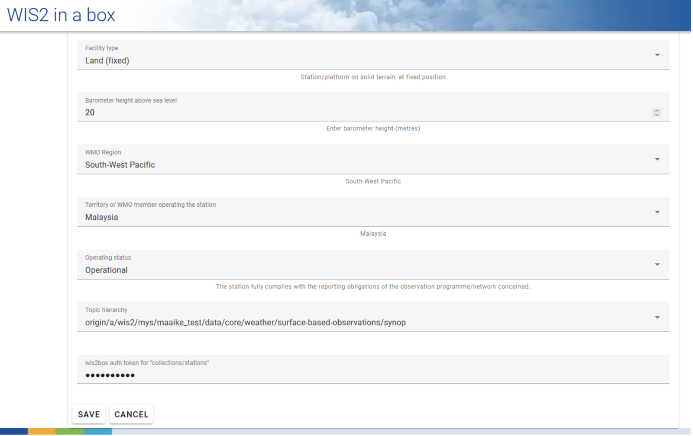

# Konfiguration von Stationsmetadaten

!!! abstract "Lernziele"

    Nach Abschluss dieser praktischen Übung werden Sie in der Lage sein:

    - einen Autorisierungstoken für den `collections/stations` Endpunkt zu erstellen
    - Stationsmetadaten zu wis2box hinzuzufügen
    - Stationsmetadaten über die **wis2box-webapp** zu aktualisieren/löschen

## Einführung

Für den internationalen Datenaustausch zwischen WMO-Mitgliedern ist ein gemeinsames Verständnis der datenerfassenden Stationen wichtig. Das WMO Integrierte Globale Beobachtungssystem (WIGOS) bietet einen Rahmen für die Integration von Beobachtungssystemen und Datenverwaltungssystemen. Die **WIGOS-Stationskennung (WSI)** wird als eindeutige Referenz für die Station verwendet, die einen bestimmten Satz von Beobachtungsdaten erzeugt hat.

wis2box verfügt über eine Sammlung von Stationsmetadaten, die die datenerfassenden Stationen beschreiben und aus **OSCAR/Surface** abgerufen werden sollten. Die Stationsmetadaten in wis2box werden von den BUFR-Transformationstools verwendet, um zu überprüfen, ob die Eingabedaten eine gültige WIGOS-Stationskennung (WSI) enthalten und eine Zuordnung zwischen WSI und Stationsmetadaten bereitzustellen.

## Erstellen eines Autorisierungstokens für collections/stations

Um Stationen über die **wis2box-webapp** zu bearbeiten, müssen Sie zunächst einen Autorisierungstoken erstellen.

Melden Sie sich an Ihrer Student-VM an und stellen Sie sicher, dass Sie sich im Verzeichnis `wis2box` befinden:

```bash
cd ~/wis2box
```

Melden Sie sich dann mit folgendem Befehl am **wis2box-management** Container an:

```bash
python3 wis2box-ctl.py login
```

Im **wis2box-management** Container können Sie einen Autorisierungstoken für einen bestimmten Endpunkt mit dem Befehl erstellen: `wis2box auth add-token --path <my-endpoint>`.

Um beispielsweise einen zufällig generierten Token für den `collections/stations` Endpunkt zu verwenden:

```{.copy}
wis2box auth add-token --path collections/stations
```	

Die Ausgabe wird wie folgt aussehen:

```{.copy}
Continue with token: 7ca20386a131f0de384e6ffa288eb1ae385364b3694e47e3b451598c82e899d1 [y/N]? y
Token successfully created
```

Oder wenn Sie Ihren eigenen Token für den `collections/stations` Endpunkt definieren möchten, können Sie folgendes Beispiel verwenden:

```{.copy}
wis2box auth add-token --path collections/stations DataIsMagic
```

Ausgabe:
    
```{.copy}
Continue with token: DataIsMagic [y/N]? y
Token successfully created
```

Bitte erstellen Sie einen Autorisierungstoken für den `collections/stations` Endpunkt anhand der obigen Anweisungen.

## Stationsmetadaten über die **wis2box-webapp** hinzufügen

Die **wis2box-webapp** bietet eine grafische Benutzeroberfläche zum Bearbeiten von Stationsmetadaten.

Öffnen Sie die **wis2box-webapp** in Ihrem Browser, indem Sie zu `http://YOUR-HOST/wis2box-webapp` navigieren und wählen Sie Stationen aus:


Wenn Sie auf "neue Station hinzufügen" klicken, werden Sie aufgefordert, die WIGOS-Stationskennung für die Station anzugeben, die Sie hinzufügen möchten:


!!! note "Fügen Sie Stationsmetadaten für 3 oder mehr Stationen hinzu"
    Bitte fügen Sie drei oder mehr Stationen zur wis2box Stationsmetadaten-Sammlung Ihrer wis2box hinzu.
      
    Verwenden Sie wenn möglich Stationen aus Ihrem Land, besonders wenn Sie eigene Daten mitgebracht haben.
      
    Falls Ihr Land keine Stationen in OSCAR/Surface hat, können Sie für diese Übung die folgenden Stationen verwenden:

      - 0-20000-0-91334
      - 0-20000-0-96323 (beachten Sie die fehlende Stationshöhe in OSCAR)
      - 0-20000-0-96749 (beachten Sie die fehlende Stationshöhe in OSCAR)

Wenn Sie auf Suchen klicken, werden die Stationsdaten von OSCAR/Surface abgerufen. Bitte beachten Sie, dass dies einige Sekunden dauern kann.

Überprüfen Sie die von OSCAR/Surface zurückgegebenen Daten und ergänzen Sie fehlende Daten wo erforderlich. Wählen Sie ein Thema für die Station aus, geben Sie Ihren Autorisierungstoken für den `collections/stations` Endpunkt ein und klicken Sie auf 'Speichern':




Gehen Sie zurück zur Stationsliste und Sie werden die hinzugefügte Station sehen:


Wiederholen Sie diesen Vorgang, bis Sie mindestens 3 Stationen konfiguriert haben.

!!! tip "Ableitung fehlender Höheninformationen"

    Wenn Ihre Stationshöhe fehlt, gibt es Online-Dienste, die bei der Suche nach der Höhe mithilfe offener Höhendaten helfen. Ein Beispiel dafür ist die [Open Topo Data API](https://www.opentopodata.org).

    Um beispielsweise die Höhe bei Breitengrad -6.15558 und Längengrad 106.84204 zu erhalten, können Sie die folgende URL in einem neuen Browser-Tab kopieren und einfügen:

    ```{.copy}
    https://api.opentopodata.org/v1/aster30m?locations=-6.15558,106.84204
    ```

    Ausgabe:

    ```{.copy}
    {
      "results": [
        {
          "dataset": "aster30m", 
          "elevation": 7.0, 
          "location": {
            "lat": -6.15558, 
            "lng": 106.84204
          }
        }
      ], 
      "status": "OK"
    }
    ```

## Überprüfen Ihrer Stationsmetadaten

Die Stationsmetadaten werden im Backend von wis2box gespeichert und über die **wis2box-api** verfügbar gemacht.

Wenn Sie einen Browser öffnen und zu `http://YOUR-HOST/oapi/collections/stations/items` navigieren, sehen Sie die von Ihnen hinzugefügten Stationsmetadaten:


!!! note "Überprüfen Sie Ihre Stationsmetadaten"

    Überprüfen Sie, ob die von Ihnen hinzugefügten Stationen Ihrem Datensatz zugeordnet sind, indem Sie `http://YOUR-HOST/oapi/collections/stations/items` in Ihrem Browser besuchen.

Sie haben auch die Möglichkeit, die Station in der **wis2box-webapp** anzuzeigen/zu aktualisieren/zu löschen. Beachten Sie, dass Sie Ihren Autorisierungstoken für den `collections/stations` Endpunkt angeben müssen, um die Station zu aktualisieren/zu löschen.

!!! note "Stationsmetadaten aktualisieren/löschen"

    Versuchen Sie, die Stationsmetadaten für eine der von Ihnen hinzugefügten Stationen über die **wis2box-webapp** zu aktualisieren/zu löschen.

## Massenimport von Stationsmetadaten

Beachten Sie, dass wis2box auch die Möglichkeit bietet, Stationsmetadaten über die Kommandozeile im **wis2box-management** Container als "Massenimport" aus einer CSV-Datei zu laden.

```bash
python3 wis2box-ctl.py login
wis2box metadata station publish-collection -p /data/wis2box/metadata/station/station_list.csv -th origin/a/wis2/centre-id/weather/surface-based-observations/synop
```

Damit können Sie eine große Anzahl von Stationen auf einmal hochladen und sie einem bestimmten Thema zuordnen.

Sie können die CSV-Datei mit Excel oder einem Texteditor erstellen und dann in wis2box-host-datadir hochladen, um sie dem **wis2box-management** Container im Verzeichnis `/data/wis2box/` zur Verfügung zu stellen.

Nach einem Massenimport von Stationen wird empfohlen, die Stationen in der **wis2box-webapp** zu überprüfen, um sicherzustellen, dass die Daten korrekt hochgeladen wurden.

Weitere Informationen zur Verwendung dieser Funktion finden Sie in der offiziellen [wis2box-Dokumentation](https://docs.wis2box.wis.wmo.int).

## Fazit

!!! success "Herzlichen Glückwunsch!"
    In dieser praktischen Übung haben Sie gelernt:

    - einen Autorisierungstoken für den `collections/stations` Endpunkt zu erstellen, der mit der **wis2box-webapp** verwendet werden kann
    - Stationsmetadaten mithilfe der **wis2box-webapp** zu wis2box hinzuzufügen
    - Stationsmetadaten mithilfe der **wis2box-webapp** anzuzeigen/zu aktualisieren/zu löschen