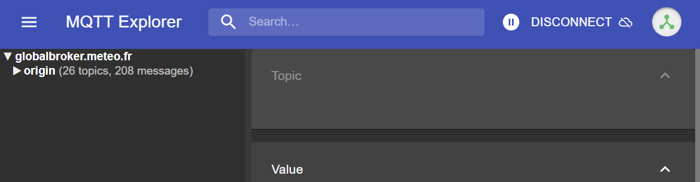

# Verbindung zu WIS2 über MQTT

!!! abstract "Lernergebnisse"

    Am Ende dieser praktischen Sitzung werden Sie in der Lage sein:

    - eine Verbindung zum WIS2 Global Broker mit MQTT Explorer herzustellen
    - die WIS2 Themenstruktur zu überprüfen
    - die Struktur der WIS2-Benachrichtigungsnachrichten zu überprüfen

## Einführung

WIS2 verwendet das MQTT-Protokoll, um die Verfügbarkeit von Wetter-/Klima-/Wasserdaten zu bewerben. Der WIS2 Global Broker abonniert alle WIS2-Knoten im Netzwerk und veröffentlicht die empfangenen Nachrichten erneut. Der Global Cache abonniert den Global Broker, lädt die Daten in der Nachricht herunter und veröffentlicht die Nachricht dann erneut im `cache` Thema mit einer neuen URL. Der Global Discovery Katalog veröffentlicht Entdeckungsmetadaten vom Broker und bietet eine Such-API.

Hier ist ein Beispiel für die Struktur einer WIS2-Benachrichtigungsnachricht für eine Nachricht, die im Thema `origin/a/wis2/br-inmet/data/core/weather/surface-based-observations/synop` empfangen wurde:

```json
{
  "id": "59f9b013-c4b3-410a-a52d-fff18f3f1b47",
  "type": "Feature",
  "version": "v04",
  "geometry": {
    "coordinates": [
      -38.69389,
      -17.96472,
      60
    ],
    "type": "Point"
  },
  "properties": {
    "data_id": "br-inmet/data/core/weather/surface-based-observations/synop/WIGOS_0-76-2-2900801000W83499_20240815T060000",
    "datetime": "2024-08-15T06:00:00Z",
    "pubtime": "2024-08-15T09:52:02Z",
    "integrity": {
      "method": "sha512",
      "value": "TBuWycx/G0lIiTo47eFPBViGutxcIyk7eikppAKPc4aHgOmTIS5Wb9+0v3awMOyCgwpFhTruRRCVReMQMp5kYw=="
    },
    "content": {
      "encoding": "base64",
      "value": "QlVGUgAA+gQAABYAACsAAAAAAAIAHAAH6AgPBgAAAAALAAABgMGWx1AAAM0ABOIAAAODM0OTkAAAAAAAAAAAAAAKb5oKEpJ6YkJ6mAAAAAAAAAAAAAAAAv0QeYA29WQa87ZhH4CQP//z+P//BD////+ASznXuUb///8MgAS3/////8X///e+AP////AB/+R/yf////////////////////6/1/79H/3///gEt////////4BLP6QAf/+/pAB//4H0YJ/YeAh/f2///7TH/////9+j//f///////////////////v0f//////////////////////wNzc3Nw==",
      "size": 250
    },
    "wigos_station_identifier": "0-76-2-2900801000W83499"
  },
  "links": [
    {
      "rel": "canonical",
      "type": "application/bufr",
      "href": "http://wis2bra.inmet.gov.br/data/2024-08-15/wis/br-inmet/data/core/weather/surface-based-observations/synop/WIGOS_0-76-2-2900801000W83499_20240815T060000.bufr4",
      "length": 250
    }
  ]
}
```

In dieser praktischen Sitzung lernen Sie, wie Sie das Tool MQTT Explorer verwenden, um eine MQTT-Clientverbindung zu einem WIS2 Global Broker einzurichten und WIS2-Benachrichtigungsnachrichten anzuzeigen.

MQTT Explorer ist ein nützliches Tool, um die Themenstruktur eines gegebenen MQTT-Brokers zu durchsuchen und die veröffentlichten Daten zu überprüfen.

Beachten Sie, dass MQTT hauptsächlich für die "Maschine-zu-Maschine"-Kommunikation verwendet wird; das bedeutet, dass normalerweise ein Client die Nachrichten automatisch verarbeitet, sobald sie empfangen werden. Um programmatisch mit MQTT zu arbeiten (zum Beispiel in Python), können Sie MQTT-Client-Bibliotheken wie [paho-mqtt](https://pypi.org/project/paho-mqtt) verwenden, um eine Verbindung zu einem MQTT-Broker herzustellen und eingehende Nachrichten zu verarbeiten. Es gibt zahlreiche MQTT-Client- und Server-Software, abhängig von Ihren Anforderungen und Ihrer technischen Umgebung.

## Verwendung von MQTT Explorer zur Verbindung mit dem Global Broker

Um Nachrichten, die von einem WIS2 Global Broker veröffentlicht wurden, anzusehen, können Sie "MQTT Explorer" verwenden, das von der [MQTT Explorer-Website](https://mqtt-explorer.com) heruntergeladen werden kann.

Öffnen Sie MQTT Explorer und fügen Sie eine neue Verbindung zum Global Broker hinzu, der von MeteoFrance gehostet wird, mit den folgenden Details:

- host: globalbroker.meteo.fr
- port: 8883
- username: everyone
- password: everyone


Klicken Sie auf die Schaltfläche 'ADVANCED', entfernen Sie die vorkonfigurierten Themen und fügen Sie die folgenden Themen zum Abonnieren hinzu:

- `origin/a/wis2/#`


!!! note
    Beim Einrichten von MQTT-Abonnements können Sie die folgenden Platzhalter verwenden:

    - **Einzelniveau (+)**: Ein Einzelniveau-Platzhalter ersetzt eine Themenstufe
    - **Mehrfachniveau (#)**: Ein Mehrfachniveau-Platzhalter ersetzt mehrere Themenstufen

    In diesem Fall wird `origin/a/wis2/#` alle Themen unter dem Thema `origin/a/wis2` abonnieren.

Klicken Sie auf 'BACK', dann auf 'SAVE', um Ihre Verbindungs- und Abonnementdetails zu speichern. Dann klicken Sie auf 'CONNECT':

Nachrichten sollten in Ihrer MQTT Explorer-Sitzung wie folgt erscheinen:



Sie sind jetzt bereit, die WIS2-Themen und Nachrichtenstrukturen zu erkunden.

## Übung 1: Überprüfung der WIS2-Themenstruktur

Verwenden Sie MQTT, um die Themenstruktur unter den `origin` Themen zu durchsuchen.

!!! question
    
    Wie können wir das WIS-Zentrum unterscheiden, das die Daten veröffentlicht hat?

??? success "Klicken, um die Antwort zu enthüllen"

    Sie können im linken Fenster in MQTT Explorer auf die Themenstruktur klicken, um sie zu erweitern.
    
    Wir können das WIS-Zentrum, das die Daten veröffentlicht hat, anhand der vierten Ebene der Themenstruktur erkennen. Zum Beispiel zeigt uns das folgende Thema:

    `origin/a/wis2/br-inmet/data/core/weather/surface-based-observations/synop`

    dass die Daten von einem WIS-Zentrum mit der Zentrum-ID `br-inmet` veröffentlicht wurden, das die Zentrum-ID für das Instituto Nacional de Meteorologia - INMET, Brasilien, ist.

!!! question

    Wie können wir zwischen Nachrichten unterscheiden, die von WIS-Zentren veröffentlicht wurden, die ein GTS-zu-WIS2-Gateway hosten, und Nachrichten, die von WIS-Zentren veröffentlicht wurden, die einen WIS2-Knoten hosten?

??? success "Klicken, um die Antwort zu enthüllen"

    Wir können Nachrichten, die von einem GTS-zu-WIS2-Gateway kommen, anhand der Zentrum-ID in der Themenstruktur unterscheiden. Zum Beispiel zeigt uns das folgende Thema:

    `origin/a/wis2/de-dwd-gts-to-wis2/data/core/I/S/A/I/01/sbbr`

    dass die Daten von dem GTS-zu-WIS2-Gateway veröffentlicht wurden, das vom Deutschen Wetterdienst (DWD) in Deutschland gehostet wird. Das GTS-zu-WIS2-Gateway ist eine spezielle Art von Datenveröffentlicher, der Daten vom Globalen Telekommunikationssystem (GTS) zu WIS2 veröffentlicht. Die Themenstruktur besteht aus den TTAAii CCCC-Headern für die GTS-Nachrichten.

## Übung 2: Überprüfung der WIS2-Nachrichtenstruktur

Trennen Sie die Verbindung von MQTT Explorer und aktualisieren Sie die 'Advanced'-Abschnitte, um das Abonnement auf die folgenden zu ändern:

* `origin/a/wis2/+/data/core/weather/surface-based-observations/synop`
* `cache/a/wis2/+/data/core/weather/surface-based-observations/synop`


!!! note
    Der `+` Platzhalter wird verwendet, um alle WIS-Zentren zu abonnieren.

Stellen Sie die Verbindung zum Global Broker wieder her und warten Sie, bis Nachrichten erscheinen.

Sie können den Inhalt der WIS2-Nachricht im Abschnitt "Value" auf der rechten Seite anzeigen. Versuchen Sie, die Themenstruktur zu erweitern, um die verschiedenen Ebenen der Nachricht zu sehen, bis Sie die letzte Ebene erreichen und den Nachrichteninhalt einer der Nachrichten überprüfen.

!!! question

    Wie können wir den Zeitstempel identifizieren, zu dem die Daten veröffentlicht wurden? Und wie können wir den Zeitstempel identifizieren, zu dem die Daten erfasst wurden?

??? success "Klicken, um die Antwort zu enthüllen"

    Der Zeitstempel, zu dem die Daten veröffentlicht wurden, befindet sich im Abschnitt `properties` der Nachricht mit einem Schlüssel von `pubtime`.

    Der Zeitstempel, zu dem die Daten erfasst wurden, befindet sich im Abschnitt `properties` der Nachricht mit einem Schlüssel von `datetime`.

    

!!! question

    Wie können wir die Daten von der in der Nachricht angegebenen URL herunterladen?

??? success "Klicken, um die Antwort zu enthüllen"

    Die URL befindet sich im Abschnitt `links` mit `rel="canonical"` und ist durch den Schlüssel `href` definiert.

    Sie können die URL kopieren und in einen Webbrowser einfügen, um die Daten herunterzuladen.

## Übung 3: Überprüfung des Unterschieds zwischen 'origin' und 'cache' Themen

Stellen Sie sicher, dass Sie weiterhin mit dem Global Broker verbunden sind und die Themenabonnements `origin/a/wis2/+/data/core/weather/surface-based-observations/synop` und `cache/a/wis2/+/data/core/weather/surface-based-observations/synop` verwenden, wie in Übung 2 beschrieben.

Versuchen Sie, eine Nachricht für dieselbe Zentrum-ID zu identifizieren, die sowohl auf den `origin`- als auch auf den `cache`-Themen veröffentlicht wurde.

!!! question

    Was ist der Unterschied zwischen den Nachrichten, die auf den `origin`- und den `cache`-Themen veröffentlicht wurden?

??? success "Klicken, um die Antwort zu enthüllen"

    Die Nachrichten, die auf den `origin`-Themen veröffentlicht wurden, sind die Originalnachrichten, die der Global Broker von den WIS2-Knoten im Netzwerk erneut veröffentlicht.

    Die Nachrichten, die auf den `cache`-Themen veröffentlicht wurden, sind die Nachrichten, für die Daten vom Global Cache heruntergeladen wurden. Wenn Sie den Inhalt der Nachricht aus dem Thema, das mit `cache` beginnt, überprüfen, werden Sie sehen, dass der 'canonical'-Link auf eine neue URL aktualisiert wurde.
    
    Es gibt mehrere Global Caches im WIS2-Netzwerk, daher erhalten Sie eine Nachricht von jedem Global Cache, der die Nachricht heruntergeladen hat.

    Der Global Cache lädt nur Nachrichten herunter und veröffentlicht sie erneut, die auf dem `../data/core/...` Themenhierarchie veröffentlicht wurden.

## Schlussfolgerung

!!! success "Herzlichen Glückwunsch!"
    In dieser praktischen Sitzung haben Sie gelernt:

    - wie man WIS2 Global Broker-Dienste mit MQTT Explorer abonniert
    - die WIS2-Themenstruktur
    - die WIS2-Benachrichtigungsnachrichtenstruktur
    - den Unterschied zwischen Kern- und empfohlenen Daten
    - die Themenstruktur, die vom GTS-zu-WIS2-Gateway verwendet wird
    - den Unterschied zwischen Nachrichten des Global Brokers, die auf den `origin`- und `cache`-Themen veröffentlicht wurden