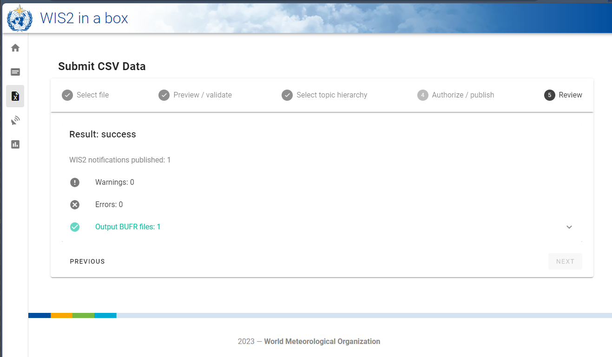

# Konvertierung von CSV-Daten in BUFR

!!! abstract "Lernergebnisse"
    Am Ende dieser praktischen Sitzung werden Sie in der Lage sein:

    - die **MinIO UI** zu nutzen, um Eingabe-CSV-Dateien hochzuladen und das Ergebnis zu überwachen
    - das Format für CSV-Daten zu kennen, das mit der Standardvorlage für automatische Wetterstationen BUFR verwendet wird
    - den Datensatz-Editor in der **wis2box Webapp** zu verwenden, um einen Datensatz für die Veröffentlichung von DAYCLI-Nachrichten zu erstellen
    - das Format für CSV-Daten zu kennen, das mit der DAYCLI BUFR-Vorlage verwendet wird
    - die **wis2box Webapp** zu verwenden, um Beispiel-Daten für AWS-Stationen zu validieren und in BUFR zu konvertieren (optional)

## Einführung

Daten in kommagetrennten Werten (CSV) werden häufig verwendet, um Beobachtungs- und andere Daten in tabellarischer Form aufzuzeichnen.
Die meisten Datenlogger, die zur Aufzeichnung von Sensordaten verwendet werden, können die Beobachtungen in begrenzten Dateien exportieren, einschließlich in CSV.
Ebenso ist es einfach, die erforderlichen Daten in CSV-formatierten Dateien zu exportieren, wenn Daten in eine Datenbank eingespeist werden.
Um den Austausch von Daten, die ursprünglich in tabellarischen Datenformaten gespeichert wurden, zu erleichtern, wurde ein CSV-zu-BUFR-Konverter in der
wis2box implementiert, der die gleiche Software wie für SYNOP zu BUFR verwendet.

In dieser Sitzung lernen Sie die Verwendung des csv2bufr-Konverters in der wis2box für die folgenden integrierten Vorlagen:

- **AWS** (aws-template.json) : Mapping-Vorlage für die Konvertierung von CSV-Daten aus einer vereinfachten Datei einer automatischen Wetterstation in die BUFR-Sequenz 301150, 307096"
- **DayCLI** (daycli-template.json) : Mapping-Vorlage für die Konvertierung von täglichen Klima-CSV-Daten in die BUFR-Sequenz 307075

## Vorbereitung

Stellen Sie sicher, dass der wis2box-Stack mit `python3 wis2box.py start` gestartet wurde.

Stellen Sie sicher, dass Sie einen Webbrowser geöffnet haben mit der MinIO UI für Ihre Instanz, indem Sie zu `http://<Ihr-Host>:9000` gehen.
Wenn Sie sich an Ihre MinIO-Zugangsdaten nicht erinnern können, finden Sie diese in der Datei `wis2box.env` im Verzeichnis `wis2box-1.0.0rc1` auf Ihrer Studenten-VM.

Stellen Sie sicher, dass Sie MQTT Explorer geöffnet und mit Ihrem Broker verbunden haben, indem Sie die Zugangsdaten `everyone/everyone` verwenden.

## Übung 1: Verwendung von csv2bufr mit der 'AWS'-Vorlage

Die 'AWS'-Vorlage bietet eine vordefinierte Mapping-Vorlage zur Konvertierung von CSV-Daten von AWS-Stationen zur Unterstützung der GBON-Berichtsanforderungen.

Die Beschreibung der AWS-Vorlage finden Sie [hier](/csv2bufr-templates/aws-template).

### Überprüfen der aws-example Eingabedaten

Laden Sie das Beispiel für diese Übung von untenstehendem Link herunter:

[aws-example.csv](/sample-data/aws-example.csv)

Öffnen Sie die heruntergeladene Datei in einem Editor und überprüfen Sie den Inhalt:

!!! question
    Wenn Sie das Datum, die Zeit und die Identifikationsfelder (WIGOS und traditionelle Kennungen) untersuchen, was fällt Ihnen auf? Wie würde das heutige Datum dargestellt?

??? success "Klicken, um die Antwort zu enthüllen"
    Jede Spalte enthält eine einzelne Information. Zum Beispiel ist das Datum aufgeteilt in
    Jahr, Monat und Tag, was widerspiegelt, wie die Daten in BUFR gespeichert sind. Das heutige Datum wäre 
    auf die Spalten "Jahr", "Monat" und "Tag" verteilt. Ähnlich muss die Zeit in "Stunde" und "Minute" aufgeteilt werden und die WIGOS-Stationkennung in ihre jeweiligen Komponenten.

!!! question
    Wenn Sie sich die Datendatei ansehen, wie sind fehlende Daten kodiert?
    
??? success "Klicken, um die Antwort zu enthüllen"
    Fehlende Daten in der Datei werden durch leere Zellen dargestellt. In einer CSV-Datei würde dies durch ``,,`` kodiert. Beachten Sie, dass dies eine leere Zelle ist und nicht als Zeichenkette der Länge null kodiert wird, z. B. ``,"",``.

!!! hint "Fehlende Daten"
    Es wird anerkannt, dass Daten aus verschiedenen Gründen fehlen können, sei es aufgrund eines Sensorausfalls oder weil der Parameter nicht beobachtet wurde. In diesen Fällen können fehlende Daten gemäß der obigen Antwort kodiert werden, die anderen Daten im Bericht bleiben gültig.

!!! question
    Was sind die WIGOS-Stationkennungen für die Stationen, die Daten in der Beispieldatei melden? Wie sind sie in der Eingabedatei definiert?

??? success "Klicken, um die Antwort zu enthüllen"

    Die WIGOS-Stationkennung wird durch 4 separate Spalten in der Datei definiert:

    - **wsi_series**: WIGOS-Kennungsserie
    - **wsi_issuer**: WIGOS-Aussteller der Kennung
    - **wsi_issue_number**: WIGOS-Ausgabenummer
    - **wsi_local**: WIGOS-lokale Kennung

    Die WIGOS-Stationkennungen, die in der Beispieldatei verwendet werden, sind `0-20000-0-60351`, `0-20000-0-60355` und `0-20000-0-60360`.	

### Aktualisieren der Beispieldatei

Aktualisieren Sie die heruntergeladene Beispieldatei, um das heutige Datum und die Uhrzeit zu verwenden, und ändern Sie die WIGOS-Stationkennungen, um Stationen zu verwenden, die Sie in der wis2box-Webapp registriert haben.

### Hochladen der Daten zu MinIO und Überprüfen des Ergebnisses

Navigieren Sie zur MinIO UI und melden Sie sich mit den Anmeldeinformationen aus der Datei `wis2box.env` an.

Navigieren Sie zu **wis2box-incoming** und klicken Sie auf die Schaltfläche "Neuen Pfad erstellen":

Erstellen Sie einen neuen Ordner im MinIO-Bucket, der der dataset-id für den Datensatz entspricht, den Sie mit der Vorlage='weather/surface-weather-observations/synop' erstellt haben:

Laden Sie die heruntergeladene Beispieldatei in den Ordner hoch, den Sie im MinIO-Bucket erstellt haben:

Überprüfen Sie das Grafana-Dashboard unter `http://<Ihr-Host>:3000`, um zu sehen, ob WARNUNGEN oder FEHLER vorliegen. Wenn Sie welche sehen, versuchen Sie, sie zu beheben und wiederholen Sie die Übung.

Überprüfen Sie den MQTT Explorer, um zu sehen, ob Sie WIS2-Datenbenachrichtigungen erhalten.

Wenn Sie die Daten erfolgreich eingespeist haben, sollten Sie 3 Benachrichtigungen im MQTT Explorer zum Thema `origin/a/wis2/<centre-id>/data/weather/surface-weather-observations/synop` für die 3 Stationen sehen, für die Sie Daten gemeldet haben:

## Übung 2 - Verwendung der 'DayCLI'-Vorlage

In der vorherigen Übung haben wir den Datensatz verwendet, den Sie mit Data-type='weather/surface-weather-observations/synop' erstellt haben, der die CSV-zu-BUFR-Konvertierungsvorlage auf die AWS-Vorlage voreingestellt hat.

In der nächsten Übung werden wir die 'DayCLI'-Vorlage verwenden, um tägliche Klimadaten in BUFR zu konvertieren.

Die Beschreibung der DAYCLI-Vorlage finden Sie [hier](/csv2bufr-templates/daycli-template).

!!! Note "Über die DAYCLI-Vorlage"
    Bitte beachten Sie, dass die DAYCLI BUFR-Sequenz während 2025 aktualisiert wird, um zusätzliche Informationen und überarbeitete QC-Flags einzubeziehen. Die DAYCLI-Vorlage in der wis2box wird aktualisiert, um diese Änderungen widerzuspiegeln. Die WMO wird mitteilen, wann die wis2box-Software aktualisiert wird, um die neue DAYCLI-Vorlage einzubeziehen, damit die Benutzer ihre Systeme entsprechend aktualisieren können.

### Erstellen eines wis2box-Datensatzes zur Veröffentlichung von DAYCLI-Nachrichten

Gehen Sie zum Datensatz-Editor in der wis2box-Webapp und erstellen Sie einen neuen Datensatz. Verwenden Sie dieselbe centre-id wie in den vorherigen praktischen Sitzungen und wählen Sie **Data Type='climate/surface-based-observations/daily'**:

Klicken Sie auf "CONTINUE TO FORM" und fügen Sie eine Beschreibung für Ihren Datensatz hinzu, legen Sie das Begrenzungsrechteck fest und geben Sie die Kontaktdaten für den Datensatz an. Sobald Sie alle Abschnitte ausgefüllt haben, klicken Sie auf 'VALIDATE FORM' und überprüfen Sie das Formular.

Überprüfen Sie die Daten-Plugins für die Datensätze. Klicken Sie auf "UPDATE" neben dem Plugin mit dem Namen "CSV data converted to BUFR" und Sie werden sehen, dass die Vorlage auf **DayCLI** eingestellt ist:

Schließen Sie die Plugin-Konfiguration und senden Sie das Formular mit dem Authentifizierungstoken ab, das Sie in der vorherigen praktischen Sitzung erstellt haben.

Sie sollten nun einen zweiten Datensatz in der wis2box-Webapp haben, der so konfiguriert ist, dass er die DAYCLI-Vorlage zur Konvertierung von CSV-Daten in BUFR verwendet.

### Überprüfen der daycli-example Eingabedaten

Laden Sie das Beispiel für diese Übung von untenstehendem Link herunter:

[daycli-example.csv](/sample-data/daycli-example.csv)

Öffnen Sie die heruntergeladene Datei in einem Editor und überprüfen Sie den Inhalt:

!!! question
    Welche zusätzlichen Variablen sind in der daycli-Vorlage enthalten?

??? success "Klicken, um die Antwort zu enthüllen"
    Die daycli-Vorlage enthält wichtige Metadaten über die Instrumentenplatzierung und die Messqualitätsklassifikationen für Temperatur und Feuchtigkeit, Qualitätskontrollflags und Informationen darüber, wie die tägliche Durchschnittstemperatur berechnet wurde.

### Aktualisieren der Beispieldatei

Die Beispieldatei enthält eine Zeile Daten für jeden Tag in einem Monat und meldet Daten für eine Station. Aktualisieren Sie die heruntergeladene Beispieldatei, um das heutige Datum und die Uhrzeit zu verwenden, und ändern Sie die WIGOS-Stationkennungen, um eine Station zu verwenden, die Sie in der wis2box-Webapp registriert haben.

### Hochladen der Daten zu MinIO und Überprüfen des Ergebnisses

Wie zuvor müssen Sie die Daten in den 'wis2box-incoming'-Bucket in MinIO hochladen, damit sie vom csv2bufr-Konverter verarbeitet werden. Diesmal müssen Sie einen neuen Ordner im MinIO-Bucket erstellen, der der dataset-id für den Datensatz entspricht, den Sie mit der Vorlage='climate/surface-based-observations/daily' erstellt haben, der sich von der dataset-id unterscheidet, die Sie in der vorherigen Übung verwendet haben:

Nachdem Sie die Daten hochgeladen haben, überprüfen Sie, ob keine WARNUNGEN oder FEHLER im Grafana-Dashboard vorliegen, und überprüfen Sie den MQTT Explorer, um zu sehen, ob Sie WIS2-Datenbenachrichtigungen erhalten.

Wenn Sie die Daten erfolgreich eingespeist haben, sollten Sie 30 Benachrichtigungen im MQTT Explorer zum Thema `origin/a/wis2/<centre-id>/data/climate/surface-based-observations/daily` für die 30 Tage im Monat sehen, für die Sie Daten gemeldet haben:

## Übung 3 - Verwendung des CSV-Formulars in der wis2box-Webapp (optional)

Die wis2box-Webanwendung bietet eine Schnittstelle zum Hochladen von CSV-Daten und deren Konvertierung in BUFR, bevor sie im WIS2 veröffentlicht werden, unter Verwendung der AWS-Vorlage.

Die Verwendung dieses Formulars ist für Debugging- und Validierungszwecke vorgesehen, die empfohlene Übermittlungsmethode für die Veröffentlichung von Daten von automatischen Wetterstationen besteht darin, einen Prozess einzurichten, der die Daten automatisch in den MinIO-Bucket hochlädt.

### Verwendung des CSV-Formulars in der wis2box-Webanwendung

Navigieren Sie zum CSV-Formular in der wis2box-Webanwendung
(``http://<Ihr-Hostname>/wis2box-webapp/csv2bufr_form``).
Verwenden Sie die Datei [aws-example.csv](/sample-data/aws-example.csv) für diese Übung.
Sie sollten jetzt in der Lage sein, neben der Datei auf Weiter zu klicken, um eine Vorschau zu sehen und die Datei zu validieren.

Wenn Sie auf die Schaltfläche Weiter klicken, wird die Datei in den Browser geladen und der Inhalt gegen ein vordefiniertes Schema validiert.
Noch wurden keine Daten konvertiert oder veröffentlicht. Auf der Registerkarte Vorschau/Validierung sollten Ihnen eine Liste von Warnungen
über fehlende Daten angezeigt werden, die in dieser Übung jedoch ignoriert werden können.

Klicken Sie auf *Weiter*, um fortzufahren, und Sie werden aufgefordert, eine dataset-id für die zu veröffentlichenden Daten anzugeben. Wählen Sie die dataset-id, die Sie zuvor erstellt haben, und klicken Sie auf *Weiter*.

Sie sollten jetzt auf einer Autorisierungsseite sein, auf der Sie aufgefordert werden, den ``processes/wis2box``
Token einzugeben, den Sie zuvor erstellt haben. Geben Sie diesen Token ein und klicken Sie auf den Schalter "Publish on WIS2", um sicherzustellen,
dass "Publish to WIS2" ausgewählt ist (siehe Screenshot unten).

Klicken Sie auf Weiter, um in BUFR zu konvertieren und zu veröffentlichen. Anschließend sollten Sie den folgenden Bildschirm sehen:

Wenn Sie auf den nach unten zeigenden Pfeil rechts von ``Output BUFR files`` klicken, sollten die Schaltflächen ``Download`` und ``Inspect`` angezeigt werden.
Klicken Sie auf Inspect, um die Daten anzusehen und zu bestätigen, dass die Werte wie erwartet sind.

### Debugging ungültiger Eingabedaten

In dieser Übung werden wir untersuchen, was mit ungültigen Eingabedaten passiert. Laden Sie die nächste Beispieldatei herunter, indem Sie auf den
untenstehenden Link klicken. Diese enthält dieselben Daten wie die erste Datei, jedoch wurden die leeren Spalten entfernt.
Überprüfen Sie die Datei und best