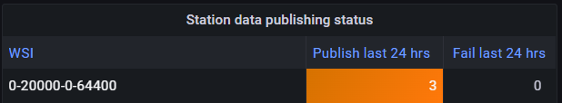

# Daten für die Veröffentlichung aufnehmen

!!! abstract "Lernergebnisse"

    Am Ende dieser praktischen Sitzung werden Sie in der Lage sein:
    
    - Den wis2box-Workflow durch Hochladen von Daten auf MinIO über die Befehlszeile, die MinIO-Web-Oberfläche, SFTP oder ein Python-Skript auszulösen.
    - Das Grafana-Dashboard aufrufen, um den Status der Datenaufnahme zu überwachen und Protokolle Ihrer wis2box-Instanz einzusehen.
    - WIS2-Datenbenachrichtigungen anzeigen, die von Ihrer wis2box über MQTT Explorer veröffentlicht wurden.

## Einführung

In WIS2 werden Daten in Echtzeit über WIS2-Datenbenachrichtigungen geteilt, die einen "kanonischen" Link enthalten, von dem die Daten heruntergeladen werden können.

Um den Daten-Workflow in einem WIS2-Knoten mit der wis2box-Software auszulösen, müssen Daten in den **wis2box-incoming**-Bucket in **MinIO** hochgeladen werden, was den wis2box-Workflow initiiert. Dieser Prozess führt dazu, dass die Daten über eine WIS2-Datenbenachrichtigung veröffentlicht werden. Abhängig von den in Ihrer wis2box-Instanz konfigurierten Datenzuordnungen können die Daten vor der Veröffentlichung in das BUFR-Format umgewandelt werden.

In dieser Übung werden wir Beispieldatendateien verwenden, um den wis2box-Workflow auszulösen und **WIS2-Datenbenachrichtigungen** für den Datensatz zu veröffentlichen, den Sie in der vorherigen praktischen Sitzung konfiguriert haben.

Während der Übung werden wir den Status der Datenaufnahme über das **Grafana-Dashboard** und **MQTT Explorer** überwachen. Das Grafana-Dashboard verwendet Daten von Prometheus und Loki, um den Status Ihrer wis2box anzuzeigen, während MQTT Explorer es Ihnen ermöglicht, die von Ihrer wis2box-Instanz veröffentlichten WIS2-Datenbenachrichtigungen zu sehen.

Beachten Sie, dass wis2box die Beispieldaten vor der Veröffentlichung in das BUFR-Format umwandeln wird, entsprechend den in Ihrem Datensatz vorkonfigurierten Datenzuordnungen. Für diese Übung konzentrieren wir uns auf die verschiedenen Methoden zum Hochladen von Daten in Ihre wis2box-Instanz und überprüfen die erfolgreiche Aufnahme und Veröffentlichung. Die Datenumwandlung wird später in der praktischen Sitzung [Data Conversion Tools](../data-conversion-tools) behandelt.

## Vorbereitung

Dieser Abschnitt verwendet den Datensatz für "surface-based-observations/synop", der zuvor in der praktischen Sitzung [Configuring Datasets in wis2box](../configuring-wis2box-datasets) erstellt wurde. Es wird auch Wissen über die Konfiguration von Stationen in der **wis2box-webapp** benötigt, wie in der praktischen Sitzung [Configuring Station Metadata](../configuring-station-metadata) beschrieben.

Stellen Sie sicher, dass Sie sich mit Ihrem SSH-Client (z. B. PuTTY) in Ihre Studenten-VM einloggen können.

Stellen Sie sicher, dass wis2box läuft:

```bash
cd ~/wis2box/
python3 wis2box-ctl.py start
python3 wis2box-ctl.py status
```

Stellen Sie sicher, dass MQTT Explorer läuft und mit Ihrer Instanz über die öffentlichen Anmeldeinformationen `everyone/everyone` mit einem Abonnement des Themas `origin/a/wis2/#` verbunden ist.

Stellen Sie sicher, dass Sie einen Webbrowser mit dem Grafana-Dashboard für Ihre Instanz geöffnet haben, indem Sie zu `http://YOUR-HOST:3000` navigieren.

### Beispieldaten vorbereiten

Kopieren Sie das Verzeichnis `exercise-materials/data-ingest-exercises` in das Verzeichnis, das Sie als `WIS2BOX_HOST_DATADIR` in Ihrer `wis2box.env`-Datei definiert haben:

```bash
cp -r ~/exercise-materials/data-ingest-exercises ~/wis2box-data/
```

!!! note
    Das `WIS2BOX_HOST_DATADIR` wird als `/data/wis2box/` innerhalb des wis2box-management-Containers durch die `docker-compose.yml`-Datei im `wis2box`-Verzeichnis eingebunden.
    
    Dies ermöglicht Ihnen, Daten zwischen dem Host und dem Container zu teilen.

### Die Teststation hinzufügen

Fügen Sie die Station mit dem WIGOS-Identifier `0-20000-0-64400` Ihrer wis2box-Instanz über den Stationseditor in der wis2box-webapp hinzu.

Rufen Sie die Station von OSCAR ab:


Fügen Sie die Station zu den Datensätzen hinzu, die Sie für die Veröffentlichung auf "../surface-based-observations/synop" erstellt haben, und speichern Sie die Änderungen mit Ihrem Authentifizierungstoken:


Beachten Sie, dass Sie diese Station nach der praktischen Sitzung aus Ihrem Datensatz entfernen können.

## Testen der Datenaufnahme über die Befehlszeile

In dieser Übung verwenden wir den Befehl `wis2box data ingest`, um Daten auf MinIO hochzuladen.

Stellen Sie sicher, dass Sie sich im Verzeichnis `wis2box` befinden und sich im **wis2box-management**-Container anmelden:

```bash
cd ~/wis2box
python3 wis2box-ctl.py login
```

Überprüfen Sie, ob die folgenden Beispieldaten im Verzeichnis `/data/wis2box/` innerhalb des **wis2box-management**-Containers verfügbar sind:

```bash
ls -lh /data/wis2box/data-ingest-exercises/synop_202412030900.txt
```

!!! question "Datenaufnahme mit `wis2box data ingest`"

    Führen Sie den folgenden Befehl aus, um die Beispieldatendatei in Ihre wis2box-Instanz einzuspeisen:

    ```bash
    wis2box data ingest -p /data/wis2box/data-ingest-exercises/synop_202412030900.txt --metadata-id urn:wmo:md:not-my-centre:synop-test
    ```

    Wurden die Daten erfolgreich aufgenommen? Wenn nicht, was war die Fehlermeldung und wie können Sie sie beheben?

??? success "Klicken Sie, um die Antwort zu enthüllen"

    Die Daten wurden **nicht** erfolgreich aufgenommen. Sie sollten Folgendes sehen:

    ```bash
    Error: metadata_id=urn:wmo:md:not-my-centre:synop-test not found in data mappings
    ```

    Die Fehlermeldung zeigt an, dass der von Ihnen bereitgestellte Metadaten-Identifier nicht mit einem der Datensätze übereinstimmt, die Sie in Ihrer wis2box-Instanz konfiguriert haben.

    Geben Sie die korrekte Metadaten-ID an, die mit dem Datensatz übereinstimmt, den Sie in der vorherigen praktischen Sitzung erstellt haben, und wiederholen Sie den Befehl zur Datenaufnahme, bis Sie folgende Ausgabe sehen:

    ```bash 
    Processing /data/wis2box/data-ingest-exercises/synop_202412030900.txt
    Done
    ```

Gehen Sie zur MinIO-Konsole in Ihrem Browser und überprüfen Sie, ob die Datei `synop_202412030900.txt` im `wis2box-incoming`-Bucket hochgeladen wurde. Sie sollten ein neues Verzeichnis mit dem Namen des Datensatzes sehen, den Sie in der Option `--metadata-id` angegeben haben, und in diesem Verzeichnis finden Sie die Datei `synop_202412030900.txt`:


!!! note
    Der Befehl `wis2box data ingest` hat die Datei im `wis2box-incoming`-Bucket in MinIO in einem Verzeichnis hochgeladen, das nach dem von Ihnen bereitgestellten Metadaten-Identifier benannt ist.

Gehen Sie zum Grafana-Dashboard in Ihrem Browser und überprüfen Sie den Status der Datenaufnahme.

!!! question "Überprüfen Sie den Status der Datenaufnahme auf Grafana"
    
    Gehen Sie zum Grafana-Dashboard unter **http://your-host:3000** und überprüfen Sie den Status der Datenaufnahme in Ihrem Browser.
    
    Wie können Sie feststellen, ob die Daten erfolgreich aufgenommen und veröffentlicht wurden?

??? success "Klicken Sie, um die Antwort zu enthüllen"
    
    Wenn Sie die Daten erfolgreich aufgenommen haben, sollten Sie Folgendes sehen:
    
      
    
    Wenn Sie dies nicht sehen, überprüfen Sie bitte auf WARN- oder ERROR-Meldungen, die am unteren Rand des Dashboards angezeigt werden, und versuchen Sie, diese zu beheben.

!!! question "Überprüfen Sie den MQTT-Broker auf WIS2-Benachrichtigungen"
    
    Gehen Sie zum MQTT Explorer und überprüfen Sie, ob Sie die WIS2-Benachrichtigungsnachricht für die Daten sehen können, die Sie gerade aufgenommen haben.
    
    Wie viele WIS2-Datenbenachrichtigungen wurden von Ihrer wis2box veröffentlicht?
    
    Wie greifen Sie auf den Inhalt der veröffentlichten Daten zu?

??? success "Klicken Sie, um die Antwort zu enthüllen"

    Sie sollten 1 WIS2-Datenbenachrichtigung sehen, die von Ihrer wis2box veröffentlicht wurde.

    Um auf den Inhalt der veröffentlichten Daten zuzugreifen, können Sie die Themenstruktur erweitern, um die verschiedenen Ebenen der Nachricht zu sehen, bis Sie die letzte Ebene erreichen und den Nachrichteninhalt überprüfen.

    Der Nachrichteninhalt hat einen "links"-Abschnitt mit einem "rel"-Schlüssel von "canonical" und einem "href"-Schlüssel mit der URL zum Herunterladen der Daten. Die URL wird im Format `http://YOUR-HOST/data/...` sein.
    
    Beachten Sie, dass das Datenformat BUFR ist und Sie einen BUFR-Parser benötigen, um den Inhalt der Daten anzuzeigen. Das BUFR-Format ist ein Binärformat, das von meteorologischen Diensten zum Datenaustausch verwendet wird. Die Daten-Plugins in wis2box haben die Daten in BUFR umgewandelt, bevor sie veröffentlicht wurden.

Nach Abschluss dieser Übung verlassen Sie den **wis2box-management**-Container:

```bash
exit
```

## Daten über die MinIO-Web-Oberfläche hochladen

In den vorherigen Übungen haben Sie Daten, die auf dem wis2box-Host verfügbar waren, mit dem Befehl `wis2box data ingest` auf MinIO hochgeladen. 

Als Nächstes verwenden wir die MinIO-Web-Oberfläche, die es Ihnen ermöglicht, Daten über einen Webbrowser auf MinIO herunterzuladen und hochzuladen.

!!! question "Daten erneut über die MinIO-Web-Oberfläche hochladen"

    Gehen Sie zur MinIO-Web-Oberfläche in Ihrem Browser und navigieren Sie zum `wis2box-incoming`-Bucket. Sie werden die Datei `synop_202412030900.txt` sehen, die Sie in den vorherigen Übungen hochgeladen haben.

    Klicken Sie auf die Datei, und Sie haben die Möglichkeit, sie herunterzuladen:

    

    Sie können diese Datei herunterladen und erneut auf denselben Pfad in MinIO hochladen, um den wis2box-Workflow erneut auszulösen.

    Überprüfen Sie das Grafana-Dashboard und den MQTT Explorer, um zu sehen, ob die Daten erfolgreich aufgenommen und veröffentlicht wurden.

??? success "Klicken Sie, um die Antwort zu enthüllen"

    Sie werden eine Meldung sehen, die darauf hinweist, dass die wis2box diese Daten bereits veröffentlicht hat:

    ```bash
    ERROR - Data already published for WIGOS_0-20000-0-64400_20241203T090000-bufr4; not publishing
    ``` 
    
    Dies zeigt, dass der Daten-Workflow ausgelöst wurde, die Daten jedoch nicht erneut veröffentlicht wurden. Die wis2box wird dieselben Daten nicht zweimal veröffentlichen. 
    
!!! question "Neue Daten über die MinIO-Web-Oberfläche hochladen"
    
    Laden Sie diese Beispieldatei herunter [synop_202502040900.txt](./../../sample-data/synop_202502040900.txt) (Rechtsklick und "Speichern unter" wählen, um die Datei herunterzuladen).
    
    Laden Sie die heruntergeladene Datei über die Web-Oberfläche auf denselben Pfad in MinIO hoch wie die vorherige Datei.

    Wurden die Daten erfolgreich aufgenommen und veröffentlicht?

??? success "Klicken Sie, um die Antwort zu enthüllen"

    Gehen Sie zum Grafana-Dashboard und überprüfen Sie, ob die Daten erfolgreich aufgenommen und veröffentlicht wurden.

    Wenn Sie den falschen Pfad verwenden, sehen Sie eine Fehlermeldung in den Protokollen.

    Wenn Sie den richtigen Pfad verwenden, sehen Sie eine weitere WIS2-Datenbenachrichtigung, die für die Teststation `0-20000-0-64400` veröffentlicht wurde, was darauf hinweist, dass die Daten erfolgreich aufgenommen und veröffentlicht wurden.

     

## Daten über SFTP hochladen

Der MinIO-Dienst in wis2box kann auch über SFTP zugegriffen werden. Der SFTP-Server für MinIO ist an Port 8022 auf dem Host gebunden (Port 22 wird für SSH verwendet).

In dieser Übung werden wir demonstrieren, wie Sie WinSCP verwenden, um Daten über SFTP auf MinIO hochzuladen.

Sie können eine neue WinSCP-Verbindung einrichten, wie in diesem Screenshot gezeigt:


Die Anmeldeinformationen für die SFTP-Verbindung sind durch `WIS2BOX_STORAGE_USERNAME` und `WIS2BOX_STORAGE_PASSWORD` in Ihrer `wis2box.env`-Datei definiert und sind dieselben wie die Anmeldeinformationen, die Sie verwendet haben, um sich bei der MinIO-UI anzumelden.

Wenn Sie sich anmelden, sehen Sie die von wis2box in MinIO verwendeten Buckets:


Sie können zum `wis2box-incoming`-Bucket navigieren und dann zum Ordner für Ihren Datensatz. Sie werden die Dateien sehen, die Sie in den vorherigen Übungen hochgeladen haben:


!!! question "Daten über SFTP hochladen"

    Laden Sie diese Beispieldatei auf Ihren lokalen Computer herunter:

    [synop_202503030900.txt](./../../sample-data/synop_202503030900.txt) (Rechtsklick und "Speichern unter" wählen, um die Datei herunterzuladen).

    Laden Sie sie dann über Ihre SFTP-Sitzung in WinSCP auf den eingehenden Datensatzpfad in MinIO hoch.

    Überprüfen Sie das Grafana-Dashboard und den MQTT Explorer, um zu sehen, ob die Daten erfolgreich aufgenommen und veröffentlicht wurden.

??? success "Klicken Sie, um die Antwort zu enthüllen"

    Sie sollten eine neue WIS2-Datenbenachrichtigung sehen, die für die Teststation `0-20000-0-64400` veröffentlicht wurde, was darauf hinweist, dass die Daten erfolgreich aufgenommen und veröffentlicht wurden.

    

Wenn Sie den falschen Pfad verwenden, sehen Sie eine Fehlermeldung in den Protokollen.

## Daten hochladen mit einem Python-Skript

In dieser Übung verwenden wir den MinIO Python-Client, um Daten in MinIO zu kopieren.

MinIO bietet einen Python-Client, der wie folgt installiert werden kann:

```bash
pip3 install minio
```

Auf Ihrer Studenten-VM ist das 'minio'-Paket für Python bereits installiert.

Im Verzeichnis `exercise-materials/data-ingest-exercises` finden Sie ein Beispiel-Skript `copy_file_to_incoming.py`, das verwendet werden kann, um Dateien in MinIO zu kopieren.

Versuchen Sie, das Skript auszuführen, um die Beispieldatei `synop_202501030900.txt` in den `wis2box-incoming`-Bucket in MinIO wie folgt zu kopieren:

```bash
cd ~/wis2box-data/data-ingest-exercises
python3 copy_file_to_incoming.py synop_202501030900.txt
```

!!! note

    Sie erhalten einen Fehler, da das Skript noch nicht konfiguriert ist, um auf den MinIO-Endpunkt auf Ihrer wis2box zuzugreifen.

Das Skript muss den richtigen Endpunkt kennen, um auf MinIO auf Ihrer wis2box zuzugreifen. Wenn wis2box auf Ihrem Host läuft, ist der MinIO-Endpunkt verfügbar unter `http://YOUR-HOST:9000`. Das Skript muss auch mit Ihrem Speicherpasswort und dem Pfad im MinIO-Bucket aktualisiert werden, um die Daten zu speichern.

!!! question "Aktualisieren Sie das Skript und nehmen Sie die CSV-Daten auf"

    Bearbeiten Sie das Skript `copy_file_to_incoming.py`, um die Fehler zu beheben, indem Sie eine der folgenden Methoden verwenden:
    - Von der Kommandozeile: Verwenden Sie den Texteditor `nano` oder `vim`, um das Skript zu bearbeiten.
    - Mit WinSCP: Starten Sie eine neue Verbindung mit dem Dateiprotokoll `SCP` und denselben Anmeldeinformationen wie Ihr SSH-Client. Navigieren Sie in das Verzeichnis `wis2box-data/data-ingest-exercises` und bearbeiten Sie `copy_file_to_incoming.py` mit dem integrierten Texteditor.
    
    Stellen Sie sicher, dass Sie:

    - Den richtigen MinIO-Endpunkt für Ihren Host definieren.
    - Das korrekte Speicherpasswort für Ihre MinIO-Instanz angeben.
    - Den korrekten Pfad im MinIO-Bucket angeben, um die Daten zu speichern.

    Führen Sie das Skript erneut aus, um die Beispieldatei `synop_202501030900.txt` in MinIO aufzunehmen:

    ```bash
    python3 ~/wis2box-data/ ~/wis2box-data/synop_202501030900.txt
    ```

    Stellen Sie sicher, dass die Fehler behoben sind.

Sobald Sie das Skript erfolgreich ausführen, sehen Sie eine Nachricht, die anzeigt, dass die Datei nach MinIO kopiert wurde, und Sie sollten Datenbenachrichtigungen sehen, die von Ihrer wis2box-Instanz in MQTT Explorer veröffentlicht wurden.

Sie können auch das Grafana-Dashboard überprüfen, um zu sehen, ob die Daten erfolgreich aufgenommen und veröffentlicht wurden.

Jetzt, da das Skript funktioniert, können Sie versuchen, andere Dateien mit demselben Skript in MinIO zu kopieren.

!!! question "Binärdaten im BUFR-Format aufnehmen"

    Führen Sie den folgenden Befehl aus, um die Binärdatei `bufr-example.bin` in den `wis2box-incoming`-Bucket in MinIO zu kopieren:

    ```bash
    python3 copy_file_to_incoming.py bufr-example.bin
    ```

Überprüfen Sie das Grafana-Dashboard und MQTT Explorer, um zu sehen, ob die Testdaten erfolgreich aufgenommen und veröffentlicht wurden. Wenn Sie Fehler sehen, versuchen Sie, diese zu beheben.

!!! question "Überprüfen Sie die Datenaufnahme"

    Wie viele Nachrichten wurden für diese Datenprobe an den MQTT-Broker gesendet?

??? success "Klicken Sie, um die Antwort zu enthüllen"

    Sie werden Fehler in Grafana sehen, da die Stationen in der BUFR-Datei nicht in der Stationsliste Ihrer wis2box-Instanz definiert sind.
    
    Wenn alle Stationen, die in der BUFR-Datei verwendet werden, in Ihrer wis2box-Instanz definiert sind, sollten Sie 10 Nachrichten sehen, die an den MQTT-Broker gesendet wurden. Jede Benachrichtigung entspricht Daten für eine Station zu einem Beobachtungszeitpunkt.

    Das Plugin `wis2box.data.bufr4.ObservationDataBUFR` teilt die BUFR-Datei in einzelne BUFR-Nachrichten auf und veröffentlicht eine Nachricht für jede Station und jeden Beobachtungszeitpunkt.

## Schlussfolgerung

!!! success "Herzlichen Glückwunsch!"
    In dieser praktischen Sitzung haben Sie gelernt, wie Sie:

    - Den wis2box-Workflow durch Hochladen von Daten auf MinIO auslösen.
    - Häufige Fehler im Datenübernahmeprozess mit dem Grafana-Dashboard und den Protokollen Ihrer wis2box-Instanz debuggen.
    - WIS2-Datenbenachrichtigungen, die von Ihrer wis2box im Grafana-Dashboard und MQTT Explorer veröffentlicht wurden, überwachen.