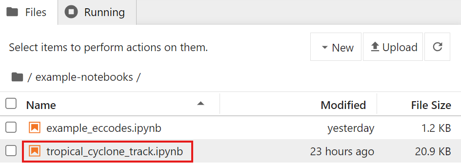
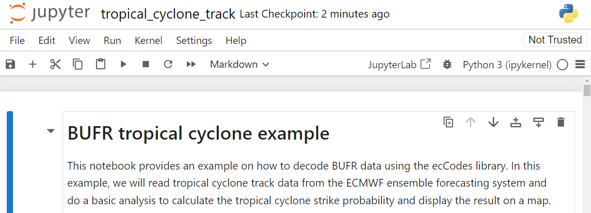

# Decodificación de datos desde formatos binarios de la OMM

!!! abstract "¡Resultados de aprendizaje!"

    Al final de esta sesión práctica, serás capaz de:

    - ejecutar un contenedor Docker para la imagen "demo-decode-eccodes-jupyter"
    - ejecutar los notebooks de ejemplo de Jupyter para decodificar datos en formatos GRIB2, NetCDF y BUFR
    - aprender sobre otras herramientas para decodificar y visualizar formatos de códigos dirigidos por tablas de la OMM (TDCF)

## Introducción

Los formatos binarios de la OMM, como BUFR y GRIB, son ampliamente utilizados en la comunidad meteorológica para el intercambio de datos observacionales y de modelos, y generalmente requieren herramientas especializadas para decodificar y visualizar los datos.

Después de descargar datos desde WIS2, a menudo necesitarás decodificar los datos para poder utilizarlos posteriormente.

Existen varias bibliotecas de código disponibles para escribir scripts o programas que decodifiquen formatos binarios de la OMM. También hay herramientas disponibles que proporcionan una interfaz de usuario para decodificar y visualizar los datos sin necesidad de escribir un programa de software.

En esta sesión práctica, demostramos cómo decodificar tres tipos diferentes de datos utilizando un notebook de Jupyter:

- GRIB2 que contiene datos para una Predicción Global por Conjunto realizada por el Sistema de Predicción Global Regional de Asimilación (GRAPES) del CMA
- BUFR que contiene datos de trayectorias de ciclones tropicales del sistema de predicción por conjuntos del ECMWF
- NetCDF que contiene datos de anomalías de temperatura mensuales

## Decodificación de datos descargados en un notebook de Jupyter

Para demostrar cómo puedes decodificar los datos descargados, iniciaremos un nuevo contenedor utilizando la imagen 'decode-bufr-jupyter'.

Este contenedor iniciará un servidor de notebook de Jupyter en tu instancia, que incluye la biblioteca [ecCodes](https://sites.ecmwf.int/docs/eccodes) que puedes usar para decodificar datos BUFR.

Usaremos los notebooks de ejemplo incluidos en `~/exercise-materials/notebook-examples` para decodificar los datos descargados de las trayectorias de ciclones.

Para iniciar el contenedor, utiliza el siguiente comando:

```bash
docker run -d --name demo-decode-eccodes-jupyter \
    -v ~/wis2-downloads:/root/downloads \
    -p 8888:8888 \
    -e JUPYTER_TOKEN=dataismagic! \
    ghcr.io/wmo-im/wmo-im/demo-decode-eccodes-jupyter:latest
```

Aquí tienes un desglose del comando anterior:

- `docker run -d --name demo-decode-eccodes-jupyter` inicia un nuevo contenedor en modo separado (`-d`) y lo nombra `demo-decode-eccodes-jupyter`
- `-v ~/wis2-downloads:/root/downloads` monta el directorio `~/wis2-downloads` en tu VM en `/root/downloads` dentro del contenedor. Aquí es donde se almacenarán los datos descargados desde WIS2 después de seguir las instrucciones de la sesión práctica anterior sobre el Descargador de WIS2.
- `-p 8888:8888` asigna el puerto 8888 en tu VM al puerto 8888 en el contenedor. Esto hace que el servidor de notebook de Jupyter sea accesible desde tu navegador web en `http://YOUR-HOST:8888`
- `-e JUPYTER_TOKEN=dataismagic!` establece el token requerido para acceder al servidor de notebook de Jupyter. Necesitarás proporcionar este token cuando accedas al servidor desde tu navegador web.
- `ghrc.io/wmo-im/demo-decode-eccodes-jupyter:latest` especifica la imagen utilizada por el contenedor, que incluye previamente los notebooks de ejemplo utilizados en los próximos ejercicios.

!!! note "Sobre la imagen demo-decode-eccodes-jupyter"

    La imagen `demo-decode-eccodes-jupyter` fue desarrollada para esta capacitación y utiliza una imagen base que incluye la biblioteca ecCodes, además de agregar un servidor de notebook de Jupyter y paquetes de Python para análisis y visualización de datos.

    El código fuente de esta imagen, incluidos los notebooks de ejemplo, se puede encontrar en [wmo-im/demo-decode-eccodes-jupyter](https://github.com/wmo-im/demo-decode-eccodes-jupyter).

Una vez que el contenedor esté iniciado, puedes acceder al servidor de notebook de Jupyter en tu VM de estudiante navegando a `http://YOUR-HOST:8888` en tu navegador web.

Verás una pantalla solicitándote que ingreses una "Contraseña o token".

Proporciona el token `dataismagic!` para iniciar sesión en el servidor de notebook de Jupyter (a menos que hayas utilizado un token diferente en el comando anterior).

Después de iniciar sesión, deberías ver la siguiente pantalla que lista los directorios en el contenedor:


Haz doble clic en el directorio `example-notebooks` para abrirlo. Deberías ver la siguiente pantalla que lista los notebooks de ejemplo:



Ahora puedes abrir los notebooks de ejemplo para decodificar los datos descargados.

### Ejemplo de decodificación GRIB2: Datos GEPS del CMA GRAPES

Abre el archivo `GRIB2_CMA_global_ensemble_prediction.ipynb` en el directorio `example-notebooks`:


Lee las instrucciones en el notebook y ejecuta las celdas para decodificar los datos descargados de la predicción global por conjunto. Ejecuta cada celda haciendo clic en ella y luego haciendo clic en el botón de ejecución en la barra de herramientas o presionando `Shift+Enter`.

Después de ejecutar todas las celdas, deberías ver una visualización de la "Probabilidad de anomalía de temperatura a 850hPa por debajo de -1.5 desviaciones estándar":


!!! question 

    ¿Cómo actualizarías la visualización en este notebook para visualizar uno de los otros mensajes en el archivo GRIB2?

??? success "Haz clic para revelar la respuesta"

    En la última celda del notebook, verás el siguiente código:

    ```python
    # mostrar visualización para el mensaje número 8 (Probabilidad de anomalía de temperatura a 850hPa por debajo de -1.5 desviaciones estándar)
    show_map_visualization(grib_file, 8)
    ```

    Puedes cambiar esta línea o agregar otra línea para visualizar uno de los otros mensajes en el archivo GRIB2 cambiando el número del mensaje:

    ```python
    # mostrar visualización para el mensaje número 9
    show_map_visualization(grib_file, 9)
    ```

    Luego, vuelve a ejecutar las celdas en el notebook para ver el gráfico actualizado.

### Ejemplo de decodificación BUFR: Trayectorias de ciclones tropicales

Abre el archivo `BUFR_tropical_cyclone_track.ipynb` en el directorio `example-notebooks`:



Lee las instrucciones en el notebook y ejecuta las celdas para decodificar los datos descargados de las trayectorias de ciclones tropicales. Ejecuta cada celda haciendo clic en ella y luego haciendo clic en el botón de ejecución en la barra de herramientas o presionando `Shift+Enter`.

Al final, deberías ver un gráfico de la probabilidad de impacto para las trayectorias de ciclones tropicales:


!!! question 

    El resultado muestra la probabilidad prevista de la trayectoria de tormentas tropicales dentro de 200 km. ¿Cómo actualizarías el notebook para mostrar la probabilidad prevista de la trayectoria de tormentas tropicales dentro de 300 km?

??? success "Haz clic para revelar la respuesta"

    Para actualizar el notebook y mostrar la probabilidad prevista de la trayectoria de tormentas tropicales dentro de una distancia diferente, puedes actualizar la variable `distance_threshold` en el bloque de código que calcula la probabilidad de impacto.

    Para mostrar la probabilidad prevista de la trayectoria de tormentas tropicales dentro de 300 km:

    ```python
    # establecer umbral de distancia (metros)
    distance_threshold = 300000  # 300 km en metros
    ```

    Luego, vuelve a ejecutar las celdas en el notebook para ver el gráfico actualizado.

!!! note "Decodificación de datos BUFR"

    El ejercicio que acabas de realizar proporcionó un ejemplo específico de cómo puedes decodificar datos BUFR utilizando la biblioteca ecCodes. Diferentes tipos de datos pueden requerir pasos de decodificación diferentes y es posible que necesites consultar la documentación para el tipo de datos con el que estás trabajando.

    Para más información, consulta la [documentación de ecCodes](https://confluence.ecmwf.int/display/ECC).

### Ejemplo de decodificación NetCDF: Anomalías de temperatura mensuales

Abre el archivo `NetCDF4_monthly_temperature_anomaly.ipynb` en el directorio `example-notebooks`:


Lee las instrucciones en el notebook y ejecuta las celdas para decodificar los datos descargados de las anomalías de temperatura mensuales. Ejecuta cada celda haciendo clic en ella y luego haciendo clic en el botón de ejecución en la barra de herramientas o presionando `Shift+Enter`.

Al final, deberías ver un mapa de las anomalías de temperatura:


!!! note "Decodificación de datos NetCDF"

    NetCDF es un formato flexible que en este ejemplo reportó los valores para la variable 'anomaly' reportados a lo largo de las dimensiones 'lat', 'lon'. Diferentes conjuntos de datos NetCDF pueden usar diferentes nombres de variables y dimensiones.

## Uso de otras herramientas para visualizar y decodificar formatos binarios de la OMM

Los notebooks de ejemplo demostraron cómo puedes decodificar formatos binarios comúnmente utilizados de la OMM utilizando Python.

También puedes usar otras herramientas para decodificar y visualizar formatos de códigos dirigidos por tablas de la OMM sin necesidad de escribir software, como:

- [Panoply](https://www.giss.nasa.gov/tools/panoply/) - una aplicación multiplataforma que grafica matrices georreferenciadas y otras desde NetCDF, HDF, GRIB y otros conjuntos de datos
- [ECMWF Metview](https://confluence.ecmwf.int/display/METV/Metview) - una aplicación meteorológica para análisis y visualización de datos, que admite formatos GRIB y BUFR
- [Integrated Data Viewer (IDV)](https://www.unidata.ucar.edu/software/idv/) - un marco de software gratuito basado en Java para analizar y visualizar datos de geociencias, que incluye soporte para formatos GRIB y NetCDF

## Conclusión

!!! success "¡Felicidades!"

    En esta sesión práctica, aprendiste a:

    - ejecutar un contenedor Docker para la imagen "demo-decode-eccodes-jupyter"
    - ejecutar los notebooks de ejemplo de Jupyter para decodificar datos en formatos GRIB2, NetCDF y BUFR