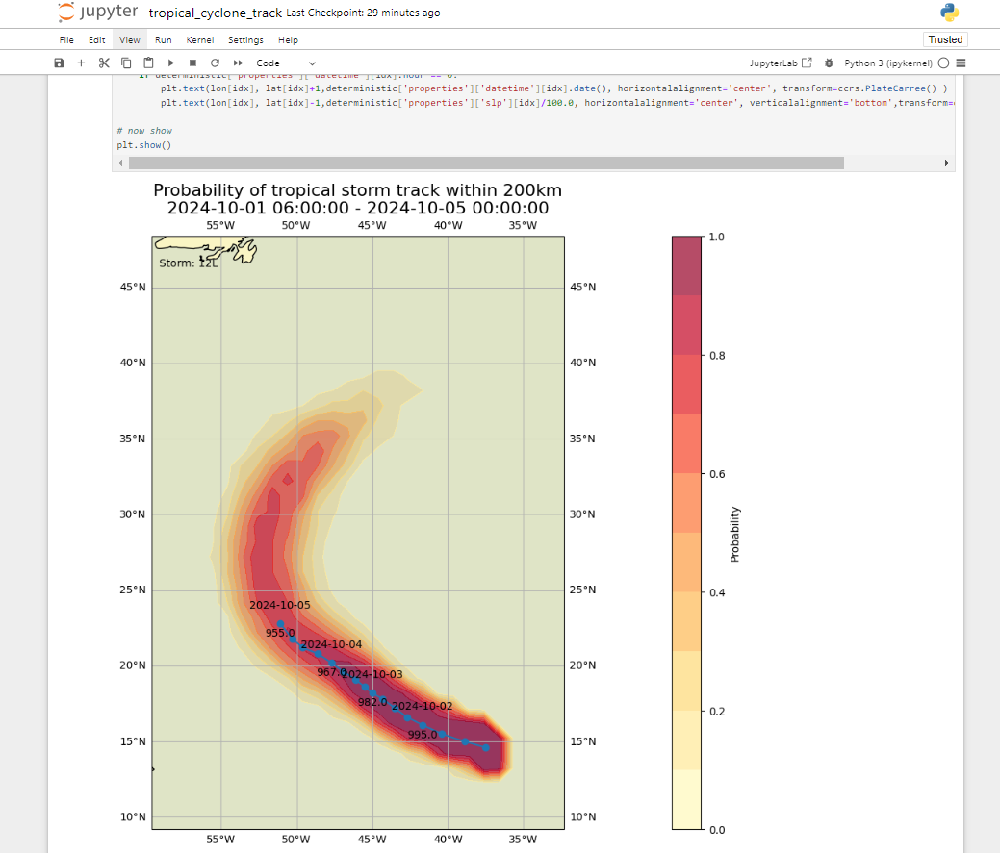

# Descarga y decodificación de datos desde WIS2

!!! abstract "Resultados de aprendizaje!"

    Al final de esta sesión práctica, podrás:

    - usar "wis2downloader" para suscribirte a notificaciones de datos de WIS2 y descargar datos a tu sistema local
    - ver el estado de las descargas en el tablero de Grafana
    - decodificar algunos datos descargados usando el contenedor "decode-bufr-jupyter"

## Introducción

En esta sesión aprenderás cómo configurar una suscripción a un Broker de WIS2 y descargar automáticamente datos a tu sistema local usando el servicio "wis2downloader" incluido en wis2box.

!!! note "Acerca de wis2downloader"
     
     El wis2downloader también está disponible como un servicio independiente que puede ejecutarse en un sistema diferente al que está publicando las notificaciones de WIS2. Consulta [wis2downloader](https://pypi.org/project/wis2downloader/) para más información sobre cómo usar el wis2downloader como un servicio independiente.

     Si deseas desarrollar tu propio servicio para suscribirte a notificaciones de WIS2 y descargar datos, puedes usar el [código fuente de wis2downloader](https://github.com/World-Meteorological-Organization/wis2downloader) como referencia.

!!! Other tools for accessing WIS2 data

    Las siguientes herramientas también pueden usarse para descubrir y acceder a datos de WIS2:

    - [pywiscat](https://github.com/wmo-im/pywiscat) proporciona capacidad de búsqueda sobre el Catálogo Global de Descubrimiento de WIS2 en apoyo del reporte y análisis del Catálogo de WIS2 y sus metadatos de descubrimiento asociados
    - [pywis-pubsub](https://github.com/World-Meteorological-Organization/pywis-pubsub) proporciona capacidad de suscripción y descarga de datos de la OMM desde servicios de infraestructura de WIS2

## Preparación

Antes de comenzar, por favor inicia sesión en tu VM de estudiante y asegúrate de que tu instancia de wis2box esté funcionando.

## Visualizando el tablero de wis2downloader en Grafana

Abre un navegador web y navega al tablero de Grafana para tu instancia de wis2box yendo a `http://YOUR-HOST:3000`.

Haz clic en tableros en el menú de la izquierda, y luego selecciona el **tablero de wis2downloader**.

Deberías ver el siguiente tablero:


Este tablero se basa en métricas publicadas por el servicio de wis2downloader y te mostrará el estado de las descargas que están en curso.

En la esquina superior izquierda puedes ver las suscripciones que están actualmente activas.

Mantén este tablero abierto ya que lo usarás para monitorear el progreso de la descarga en el próximo ejercicio.

## Revisando la configuración de wis2downloader

El servicio de wis2downloader iniciado por el stack de wis2box puede configurarse usando las variables de entorno definidas en tu archivo wis2box.env.

Las siguientes variables de entorno son utilizadas por wis2downloader:

    - DOWNLOAD_BROKER_HOST: El nombre de host del broker MQTT al que conectarse. Por defecto es globalbroker.meteo.fr
    - DOWNLOAD_BROKER_PORT: El puerto del broker MQTT al que conectarse. Por defecto es 443 (HTTPS para websockets)
    - DOWNLOAD_BROKER_USERNAME: El nombre de usuario para conectarse al broker MQTT. Por defecto es everyone
    - DOWNLOAD_BROKER_PASSWORD: La contraseña para conectarse al broker MQTT. Por defecto es everyone
    - DOWNLOAD_BROKER_TRANSPORT: websockets o tcp, el mecanismo de transporte para conectarse al broker MQTT. Por defecto es websockets,
    - DOWNLOAD_RETENTION_PERIOD_HOURS: El período de retención en horas para los datos descargados. Por defecto es 24
    - DOWNLOAD_WORKERS: El número de trabajadores de descarga para usar. Por defecto es 8. Determina el número de descargas paralelas.
    - DOWNLOAD_MIN_FREE_SPACE_GB: El espacio libre mínimo en GB para mantener en el volumen que aloja las descargas. Por defecto es 1.

Para revisar la configuración actual de wis2downloader, puedes usar el siguiente comando:

```bash
cat ~/wis2box/wis2box.env | grep DOWNLOAD
```

!!! question "Revisa la configuración de wis2downloader"
    
    ¿Cuál es el broker MQTT predeterminado al que se conecta wis2downloader?

    ¿Cuál es el período de retención predeterminado para los datos descargados?

??? success "Haz clic para revelar la respuesta"

    El broker MQTT predeterminado al que se conecta wis2downloader es `globalbroker.meteo.fr`.

    El período de retención predeterminado para los datos descargados es de 24 horas.

!!! note "Actualizando la configuración de wis2downloader"

    Para actualizar la configuración de wis2downloader, puedes editar el archivo wis2box.env. Para aplicar los cambios puedes volver a ejecutar el comando de inicio para el stack de wis2box:

    ```bash
    python3 wis2box-ctl.py start
    ```

    Y verás que el servicio de wis2downloader se reinicia con la nueva configuración.

Puedes mantener la configuración predeterminada para el propósito de este ejercicio.

## Agregando suscripciones al wis2downloader

Dentro del contenedor **wis2downloader**, puedes usar la línea de comandos para listar, agregar y eliminar suscripciones.

Para iniciar sesión en el contenedor **wis2downloader**, usa el siguiente comando:

```bash
python3 wis2box-ctl.py login wis2downloader
```

Luego usa el siguiente comando para listar las suscripciones que están actualmente activas:

```bash
wis2downloader list-subscriptions
```

Este comando devuelve una lista vacía ya que no hay suscripciones actualmente activas.

Para el propósito de este ejercicio, nos suscribiremos al siguiente tema `cache/a/wis2/de-dwd-gts-to-wis2/#`, para suscribirnos a datos publicados por la puerta de enlace GTS-to-WIS2 alojada por DWD y descargar notificaciones desde el Global Cache.

Para agregar esta suscripción, usa el siguiente comando:

```bash
wis2downloader add-subscription --topic cache/a/wis2/de-dwd-gts-to-wis2/#
```

Luego sal del contenedor **wis2downloader** escribiendo `exit`:

```bash
exit
```

Revisa el tablero de wis2downloader en Grafana para ver la nueva suscripción agregada. Espera unos minutos y deberías ver que las primeras descargas comienzan. Ve al siguiente ejercicio una vez que hayas confirmado que las descargas están comenzando.

## Visualizando los datos descargados

El servicio de wis2downloader en el stack de wis2box descarga los datos en el directorio 'downloads' en el directorio que definiste como WIS2BOX_HOST_DATADIR en tu archivo wis2box.env. Para ver el contenido del directorio de descargas, puedes usar el siguiente comando:

```bash
ls -R ~/wis2box-data/downloads
```

Nota que los datos descargados están almacenados en directorios nombrados después del tema en el que se publicó la Notificación de WIS2.

## Eliminando suscripciones del wis2downloader

A continuación, inicia sesión de nuevo en el contenedor de wis2downloader:

```bash
python3 wis2box-ctl.py login wis2downloader
```

y elimina la suscripción que hiciste del wis2downloader, usando el siguiente comando:

```bash
wis2downloader remove-subscription --topic cache/a/wis2/de-dwd-gts-to-wis2/#
```

Y sal del contenedor de wis2downloader escribiendo `exit`:
    
```bash
exit
```

Revisa el tablero de wis2downloader en Grafana para ver la suscripción eliminada. Deberías ver que las descargas se detienen.

## Descarga y decodificación de datos para una trayectoria de ciclón tropical

En este ejercicio, te suscribirás al Broker de Entrenamiento de WIS2 que está publicando datos de ejemplo para fines de entrenamiento. Configurarás una suscripción para descargar datos de una trayectoria de ciclón tropical. Luego decodificarás los datos descargados usando el contenedor "decode-bufr-jupyter".

### Suscríbete al wis2training-broker y configura una nueva suscripción

Esto demuestra cómo suscribirse a un broker que no es el broker predeterminado y te permitirá descargar algunos datos publicados desde el Broker de Entrenamiento de WIS2.

Edita el archivo wis2box.env y cambia DOWNLOAD_BROKER_HOST a `wis2training-broker.wis2dev.io`, cambia DOWNLOAD_BROKER_PORT a `1883` y cambia DOWNLOAD_BROKER_TRANSPORT a `tcp`:

```copy
# configuración del descargador
DOWNLOAD_BROKER_HOST=wis2training-broker.wis2dev.io
DOWNLOAD_BROKER_PORT=1883
DOWNLOAD_BROKER_USERNAME=everyone
DOWNLOAD_BROKER_PASSWORD=everyone
# mecanismo de transporte de descarga (tcp o websockets)
DOWNLOAD_BROKER_TRANSPORT=tcp
```

Luego ejecuta el comando 'start' nuevamente para aplicar los cambios:

```bash
python3 wis2box-ctl.py start
```

Revisa los registros de wis2downloader para ver si la conexión con el nuevo broker fue exitosa:

```bash
docker logs wis2downloader
```

Deberías ver el siguiente mensaje de registro:

```copy
...
INFO - Conectando...
INFO - Host: wis2training-broker.wis2dev.io, puerto: 1883
INFO - Conectado exitosamente
```

Ahora configuraremos una nueva suscripción al tema para descargar datos de trayectoria de ciclones desde el Broker de Entrenamiento de WIS2.

Inicia sesión en el contenedor **wis2downloader**:

```bash
python3 wis2box-ctl.py login wis2downloader
```

Y ejecuta el siguiente comando (copia y pega esto para evitar errores tipográficos):

```bash
wis2downloader add-subscription --topic origin/a/wis2/int-wis2-training/data/core/weather/prediction/forecast/medium-range/probabilistic/trajectory
```

Sal del contenedor **wis2downloader** escribiendo `exit`.

Espera hasta que veas que las descargas comienzan en el tablero de wis2downloader en Grafana.

!!! note "Descargando datos del Broker de Entrenamiento de WIS2"

    El Broker de Entrenamiento de WIS2 es un broker de prueba que se usa para fines de entrenamiento y puede no publicar datos todo el tiempo.

    Durante las sesiones de entrenamiento presenciales, el instructor local asegurará que el Broker de Entrenamiento de WIS2 publique datos para que los descargues.

    Si estás haciendo este ejercicio fuera de una sesión de entrenamiento, es posible que no veas ningún dato siendo descargado.

Verifica que los datos fueron descargados revisando los registros de wis2downloader nuevamente con:

```bash
docker logs wis2downloader
```

Deberías ver un mensaje de registro similar al siguiente:

```copy
[...] INFO - Mensaje recibido bajo el tema origin/a/wis2/int-wis2-training/data/core/weather/prediction/forecast/medium-range/probabilistic/trajectory
[...] INFO - Descargado A_JSXX05ECEP020000_C_ECMP_...
```

### Decodificando los datos descargados

Para demostrar cómo puedes decodificar los datos descargados, iniciaremos un nuevo contenedor usando la imagen 'decode-bufr-jupyter'.

Este contenedor iniciará un servidor de cuadernos Jupyter en tu instancia que incluye la biblioteca "ecCodes" que puedes usar para decodificar datos BUFR.

Usaremos los cuadernos de ejemplo incluidos en `~/exercise-materials/notebook-examples` para decodificar los datos descargados de las trayectorias de ciclones.

Para iniciar el contenedor, usa el siguiente comando:

```bash
docker run -d --name decode-bufr-jupyter \
    -v ~/wis2box-data/downloads:/root/downloads \
    -p 8888:8888 \
    -e JUPYTER_TOKEN=dataismagic! \
    mlimper/decode-bufr-jupyter
```

!!! note "Acerca del contenedor decode-bufr-jupyter"

    El contenedor `decode-bufr-jupyter` es un contenedor personalizado que incluye la biblioteca ecCodes y ejecuta un servidor de cuadernos Jupyter. El contenedor se basa en una imagen que incluye la biblioteca `ecCodes` para decodificar datos BUFR, junto con bibliotecas para trazado y análisis de datos.

    El comando anterior inicia el contenedor en modo separado, con el nombre `decode-bufr-jupyter`, el puerto 8888 está mapeado al sistema host y la variable de entorno `JUPYTER_TOKEN` está configurada como `dataismagic!`.
    
    El comando anterior también monta el directorio `~/wis2box-data/downloads` a `/root/downloads` en el contenedor. Esto asegura que los datos descargados estén disponibles para el servidor de cuadernos Jupyter.
    
Una vez que el contenedor esté iniciado, puedes acceder al servidor de cuadernos Jupyter navegando a `http://YOUR-HOST:8888` en tu navegador web.

Verás una pantalla solicitándote que ingreses una "Contraseña o token".

Proporciona el token `dataismagic!` para iniciar sesión en el servidor de cuadernos Jupyter.

Después de iniciar sesión, deberías ver la siguiente pantalla que lista los directorios en el contenedor:


Haz doble clic en el directorio `example-notebooks` para abrirlo.

Deberías ver la siguiente pantalla que lista los cuadernos de ejemplo, haz doble clic en el cuaderno `tropical_cyclone_track.ipynb` para abrirlo:


Ahora deberías estar en el cuaderno Jupyter para decodificar los datos de la trayectoria del ciclón tropical:


Lee las instrucciones en el cuaderno y ejecuta las celdas para decodificar los datos descargados de las trayectorias de los ciclones tropicales. Ejecuta cada celda haciendo clic en la celda y luego en el botón de ejecución en la barra de herramientas o presionando `Shift+Enter`.

Al final deberías ver un gráfico de la probabilidad de impacto para las trayectorias de los ciclones tropicales:



!!! question 

    El resultado muestra la probabilidad predicha de la trayectoria de la tormenta tropical dentro de 200 km. ¿Cómo actualizarías el cuaderno para mostrar la probabilidad predicha de la trayectoria de la tormenta tropical dentro de 300 km?

??? success "Haz clic para revelar la respuesta"

    Para actualizar el cuaderno y mostrar la probabilidad predicha de la trayectoria de la tormenta tropical a una distancia diferente, puedes actualizar la variable `distance_threshold` en el bloque de código que calcula la probabilidad de impacto.

    Para mostrar la probabilidad predicha de la trayectoria de la tormenta tropical dentro de 300 km,

    ```python
    # establecer umbral de distancia (metros)
    distance_threshold = 300000  # 300 km en metros
    ```

    Luego, vuelve a ejecutar las celdas en el cuaderno para ver el gráfico actualizado.

!!! note "Decodificación de datos BUFR"

    El ejercicio que acabas de realizar proporcionó un ejemplo específico de cómo puedes decodificar datos BUFR utilizando la biblioteca ecCodes. Diferentes tipos de datos pueden requerir diferentes pasos de decodificación y es posible que necesites consultar la documentación para el tipo de datos con el que estás trabajando.
    
    Para más información, consulta la [documentación de ecCodes](https://confluence.ecmwf.int/display/ECC).


## Conclusión

!!! success "¡Felicidades!"

    En esta sesión práctica, aprendiste cómo:

    - usar 'wis2downloader' para suscribirte a un WIS2 Broker y descargar datos a tu sistema local
    - ver el estado de las descargas en el tablero de Grafana
    - decodificar algunos datos descargados usando el contenedor 'decode-bufr-jupyter'