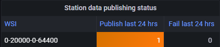
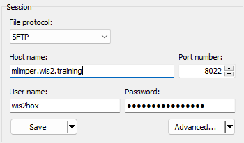

# Ingesta de datos para publicación

!!! abstract "Objetivos de Aprendizaje"

    Al finalizar esta sesión práctica, podrás:
    
    - Activar el flujo de trabajo de wis2box mediante la carga de datos a MinIO usando la línea de comandos, la interfaz web de MinIO, SFTP o un script de Python.
    - Acceder al panel de Grafana para monitorear el estado de la ingesta de datos y ver los registros de tu instancia de wis2box.
    - Ver las notificaciones de datos WIS2 publicadas por tu wis2box usando MQTT Explorer.

## Introducción

En WIS2, los datos se comparten en tiempo real utilizando notificaciones de datos WIS2 que contienen un enlace "canónico" desde el cual se pueden descargar los datos.

Para activar el flujo de trabajo de datos en un WIS2 Node utilizando el software wis2box, los datos deben cargarse al depósito **wis2box-incoming** en **MinIO**, lo que inicia el flujo de trabajo de wis2box. Este proceso resulta en la publicación de los datos mediante una notificación de datos WIS2. Dependiendo de las asignaciones de datos configuradas en tu instancia de wis2box, los datos pueden transformarse al formato BUFR antes de ser publicados.

En este ejercicio, utilizaremos archivos de datos de ejemplo para activar el flujo de trabajo de wis2box y **publicar notificaciones de datos WIS2** para el conjunto de datos que configuraste en la sesión práctica anterior.

Durante el ejercicio, monitorearemos el estado de la ingesta de datos utilizando el **panel de Grafana** y **MQTT Explorer**. El panel de Grafana utiliza datos de Prometheus y Loki para mostrar el estado de tu wis2box, mientras que MQTT Explorer te permite ver las notificaciones de datos WIS2 publicadas por tu instancia de wis2box.

Ten en cuenta que wis2box transformará los datos de ejemplo al formato BUFR antes de publicarlos en el broker MQTT, según las asignaciones de datos preconfiguradas en tu conjunto de datos. Para este ejercicio, nos centraremos en los diferentes métodos para cargar datos a tu instancia de wis2box y verificar la ingesta y publicación exitosa. La transformación de datos se cubrirá más adelante en la sesión práctica de [Herramientas de Conversión de Datos](../data-conversion-tools).

## Preparación

Esta sección utiliza el conjunto de datos para "surface-based-observations/synop" creado previamente en la sesión práctica [Configuración de Conjuntos de Datos en wis2box](/practical-sessions/configuring-wis2box-datasets). También requiere conocimiento sobre la configuración de estaciones en **wis2box-webapp**, como se describe en la sesión práctica [Configuración de Metadatos de Estaciones](/practical-sessions/configuring-station-metadata).

Asegúrate de poder iniciar sesión en tu VM de estudiante usando tu cliente SSH (por ejemplo, PuTTY).

Asegúrate de que wis2box esté en funcionamiento:

```bash
cd ~/wis2box/
python3 wis2box-ctl.py start
python3 wis2box-ctl.py status
```

Asegúrate de que MQTT Explorer esté ejecutándose y conectado a tu instancia usando las credenciales públicas `everyone/everyone` con una suscripción al tema `origin/a/wis2/#`.

Asegúrate de tener un navegador web abierto con el panel de Grafana para tu instancia navegando a `http://YOUR-HOST:3000`.

### Preparar Datos de Ejemplo

Copia el directorio `exercise-materials/data-ingest-exercises` al directorio que definiste como `WIS2BOX_HOST_DATADIR` en tu archivo `wis2box.env`:

```bash
cp -r ~/exercise-materials/data-ingest-exercises ~/wis2box-data/
```

!!! note
    El `WIS2BOX_HOST_DATADIR` está montado como `/data/wis2box/` dentro del contenedor wis2box-management por el archivo `docker-compose.yml` incluido en el directorio `wis2box`.
    
    Esto te permite compartir datos entre el host y el contenedor.

### Agregar la Estación de Prueba

Agrega la estación con identificador WIGOS `0-20000-0-64400` a tu instancia de wis2box usando el editor de estaciones en wis2box-webapp.

Recupera la estación desde OSCAR:


Agrega la estación a los conjuntos de datos que creaste para publicar en "../surface-based-observations/synop" y guarda los cambios usando tu token de autenticación:


Ten en cuenta que puedes eliminar esta estación de tu conjunto de datos después de la sesión práctica.

## Prueba de Ingesta de Datos desde la Línea de Comandos

En este ejercicio, utilizaremos el comando `wis2box data ingest` para cargar datos a MinIO.

Asegúrate de estar en el directorio `wis2box` e inicia sesión en el contenedor **wis2box-management**:

```bash
cd ~/wis2box
python3 wis2box-ctl.py login
```

Verifica que los siguientes datos de ejemplo estén disponibles en el directorio `/data/wis2box/` dentro del contenedor **wis2box-management**:

```bash
ls -lh /data/wis2box/data-ingest-exercises/synop_202412030900.txt
```

!!! question "Ingesta de Datos Usando `wis2box data ingest`"

    Ejecuta el siguiente comando para ingestar el archivo de datos de ejemplo en tu instancia de wis2box:

    ```bash
    wis2box data ingest -p /data/wis2box/data-ingest-exercises/synop_202412030900.txt --metadata-id urn:wmo:md:not-my-centre:synop-test
    ```

    ¿Se ingirieron los datos exitosamente? Si no, ¿cuál fue el mensaje de error y cómo puedes solucionarlo?

??? success "Haz Clic para Ver la Respuesta"

    Los datos **no** se ingirieron exitosamente. Deberías ver lo siguiente:

    ```bash
    Error: metadata_id=urn:wmo:md:not-my-centre:synop-test not found in data mappings
    ```

    El mensaje de error indica que el identificador de metadatos que proporcionaste no coincide con ninguno de los conjuntos de datos que has configurado en tu instancia de wis2box.

    Proporciona el ID de metadatos correcto que coincida con el conjunto de datos que creaste en la sesión práctica anterior y repite el comando de ingesta de datos hasta que veas la siguiente salida:

    ```bash 
    Processing /data/wis2box/data-ingest-exercises/synop_202412030900.txt
    Done
    ```

Ve a la consola de MinIO en tu navegador y verifica si el archivo `synop_202412030900.txt` se cargó al depósito `wis2box-incoming`. Deberías ver un nuevo directorio con el nombre del conjunto de datos que proporcionaste en la opción `--metadata-id`, y dentro de este directorio, encontrarás el archivo `synop_202412030900.txt`:


!!! note
    El comando `wis2box data ingest` cargó el archivo al depósito `wis2box-incoming` en MinIO en un directorio nombrado según el identificador de metadatos que proporcionaste.

Ve al panel de Grafana en tu navegador y verifica el estado de la ingesta de datos.

!!! question "Verificar el Estado de la Ingesta de Datos en Grafana"
    
    Ve al panel de Grafana en **http://your-host:3000** y verifica el estado de la ingesta de datos en tu navegador.
    
    ¿Cómo puedes ver si los datos se ingirieron y publicaron exitosamente?

??? success "Haz Clic para Ver la Respuesta"
    
    Si ingiriste los datos exitosamente, deberías ver lo siguiente:
    
      
    
    Si no ves esto, por favor verifica los mensajes de ADVERTENCIA o ERROR mostrados en la parte inferior del panel e intenta resolverlos.

!!! question "Verificar el Broker MQTT para Notificaciones WIS2"
    
    Ve a MQTT Explorer y verifica si puedes ver el mensaje de notificación WIS2 para los datos que acabas de ingerir.
    
    ¿Cuántas notificaciones de datos WIS2 fueron publicadas por tu wis2box?
    
    ¿Cómo accedes al contenido de los datos que se están publicando?

??? success "Haz Clic para Ver la Respuesta"

    Deberías ver 1 notificación de datos WIS2 publicada por tu wis2box.

    Para acceder al contenido de los datos que se están publicando, puedes expandir la estructura de temas para ver los diferentes niveles del mensaje hasta llegar al último nivel y revisar el contenido del mensaje.

    El contenido del mensaje tiene una sección "links" con una clave "rel" de "canonical" y una clave "href" con la URL para descargar los datos. La URL estará en el formato `http://YOUR-HOST/data/...`. 
    
    Ten en cuenta que el formato de datos es BUFR, y necesitarás un analizador BUFR para ver el contenido de los datos. El formato BUFR es un formato binario utilizado por los servicios meteorológicos para intercambiar datos. Los complementos de datos dentro de wis2box transformaron los datos a BUFR antes de publicarlos.

Después de completar este ejercicio, sal del contenedor **wis2box-management**:

```bash
exit
```

## Carga de Datos Usando la Interfaz Web de MinIO

En los ejercicios anteriores, cargaste datos disponibles en el host de wis2box a MinIO usando el comando `wis2box data ingest`. 

A continuación, utilizaremos la interfaz web de MinIO, que te permite descargar y cargar datos a MinIO usando un navegador web.

!!! question "Volver a Cargar Datos Usando la Interfaz Web de MinIO"

    Ve a la interfaz web de MinIO en tu navegador y navega hasta el depósito `wis2box-incoming`. Verás el archivo `synop_202412030900.txt` que cargaste en los ejercicios anteriores.

    Haz clic en el archivo y tendrás la opción de descargarlo:

    

    Puedes descargar este archivo y volver a cargarlo en la misma ruta en MinIO para volver a activar el flujo de trabajo de wis2box.

    Verifica el panel de Grafana y MQTT Explorer para ver si los datos se ingirieron y publicaron exitosamente.

??? success "Haz Clic para Ver la Respuesta"

    Verás un mensaje indicando que wis2box ya publicó estos datos:

    ```bash
    ERROR - Data already published for WIGOS_0-20000-0-64400_20241203T090000-bufr4; not publishing
    ``` 
    
    Esto demuestra que el flujo de trabajo de datos se activó, pero los datos no se volvieron a publicar. El wis2box no publicará los mismos datos dos veces. 
    
!!! question "Cargar Nuevos Datos Usando la Interfaz Web de MinIO"
    
    Descarga este archivo de ejemplo [synop_202502040900.txt](/sample-data/synop_202502040900.txt) (haz clic derecho y selecciona "guardar como" para descargar el archivo).
    
    Carga el archivo que descargaste usando la interfaz web a la misma ruta en MinIO que el archivo anterior.

    ¿La ingesta y publicación de datos fue exitosa?

??? success "Haz Clic para Ver la Respuesta"

    Ve al panel de Grafana y verifica si los datos se ingirieron y publicaron exitosamente.

    Si usas la ruta incorrecta, verás un mensaje de error en los registros.

    Si usas la ruta correcta, verás una notificación de datos WIS2 más publicada para la estación de prueba `0-20000-0-64400`, indicando que los datos se ingirieron y publicaron exitosamente.

     

## Carga de Datos Usando SFTP

El servicio MinIO en wis2box también puede ser accedido a través de SFTP. El servidor SFTP para MinIO está vinculado al puerto 8022 en el host (el puerto 22 se usa para SSH).

En este ejercicio, demostraremos cómo usar WinSCP para cargar datos a MinIO usando SFTP.

Puedes configurar una nueva conexión WinSCP como se muestra en esta captura de pantalla:



Las credenciales para la conexión SFTP están definidas por `WIS2BOX_STORAGE_USERNAME` y `WIS2BOX_STORAGE_PASSWORD` en tu archivo `wis2box.env` y son las mismas que las credenciales que usaste para conectarte a la interfaz de usuario de MinIO.

Cuando inicies sesión, verás los depósitos utilizados por wis2box en MinIO:


Puedes navegar al depósito `wis2box-incoming` y luego a la carpeta de tu conjunto de datos. Verás los archivos que cargaste en los ejercicios anteriores:


!!! question "Cargar Datos Usando SFTP"

    Descarga este archivo de ejemplo a tu computadora local:

    [synop_202503030900.txt](/sample-data/synop_202503030900.txt) (haz clic derecho y selecciona "guardar como" para descargar el archivo).

    Luego cárgalo a la ruta de entrada del conjunto de datos en MinIO usando tu sesión SFTP en WinSCP.

    Verifica el panel de Grafana y MQTT Explorer para ver si los datos se ingirieron y publicaron exitosamente.

??? success "Haz Clic para Ver la Respuesta"

    Deber