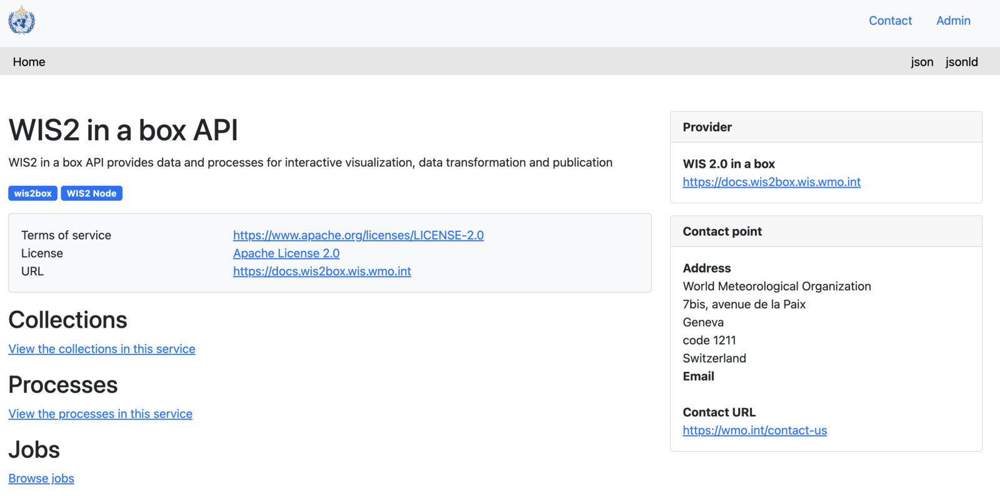

# Inicializando wis2box

!!! abstract "Objetivos de aprendizaje"

    Al finalizar esta sesión práctica, podrás:

    - ejecutar el script `wis2box-create-config.py` para crear la configuración inicial
    - iniciar wis2box y verificar el estado de sus componentes
    - ver el contenido de **wis2box-api**
    - acceder a **wis2box-webapp**
    - conectarte al **wis2box-broker** local usando MQTT Explorer

!!! note

    Los materiales actuales de capacitación están basados en wis2box-release 1.0.0.
    
    Consulta [accessing-your-student-vm](accessing-your-student-vm.md) para obtener instrucciones sobre cómo descargar e instalar el conjunto de software wis2box si estás realizando esta capacitación fuera de una sesión local.

## Preparación

Inicia sesión en tu VM designada con tu nombre de usuario y contraseña, y asegúrate de estar en el directorio `wis2box`:

```bash
cd ~/wis2box
```

## Creando la configuración inicial

La configuración inicial para wis2box requiere:

- un archivo de entorno `wis2box.env` que contiene los parámetros de configuración
- un directorio en la máquina anfitriona para compartir entre la máquina anfitriona y los contenedores wis2box definido por la variable de entorno `WIS2BOX_HOST_DATADIR`

El script `wis2box-create-config.py` puede usarse para crear la configuración inicial de tu wis2box.

Te hará una serie de preguntas para ayudarte a configurar tu instalación.

Podrás revisar y actualizar los archivos de configuración después de que el script haya terminado.

Ejecuta el script de la siguiente manera:

```bash
python3 wis2box-create-config.py
```

### Directorio wis2box-host-data

El script te pedirá que ingreses el directorio que se utilizará para la variable de entorno `WIS2BOX_HOST_DATADIR`.

Ten en cuenta que necesitas definir la ruta completa a este directorio.

Por ejemplo, si tu nombre de usuario es `username`, la ruta completa al directorio es `/home/username/wis2box-data`:

```{.copy}
username@student-vm-username:~/wis2box$ python3 wis2box-create-config.py
Please enter the directory to be used for WIS2BOX_HOST_DATADIR:
/home/username/wis2box-data
The directory to be used for WIS2BOX_HOST_DATADIR will be set to:
    /home/username/wis2box-data
Is this correct? (y/n/exit)
y
The directory /home/username/wis2box-data has been created.
```

### URL de wis2box

A continuación, se te pedirá que ingreses la URL para tu wis2box. Esta es la URL que se utilizará para acceder a la aplicación web, API y UI de wis2box.

Por favor, usa `http://<your-hostname-or-ip>` como URL.

```{.copy}
Please enter the URL of the wis2box:
 For local testing the URL is http://localhost
 To enable remote access, the URL should point to the public IP address or domain name of the server hosting the wis2box.
http://username.wis2.training
The URL of the wis2box will be set to:
  http://username.wis2.training
Is this correct? (y/n/exit)
```

### Contraseñas de WEBAPP, STORAGE y BROKER

Puedes usar la opción de generación de contraseñas aleatorias cuando se te solicite para `WIS2BOX_WEBAPP_PASSWORD`, `WIS2BOX_STORAGE_PASSWORD`, `WIS2BOX_BROKER_PASSWORD` o definir las tuyas propias.

No te preocupes por recordar estas contraseñas, se almacenarán en el archivo `wis2box.env` en tu directorio wis2box.

### Revisar `wis2box.env`

Una vez que el script haya terminado, verifica el contenido del archivo `wis2box.env` en tu directorio actual:

```bash
cat ~/wis2box/wis2box.env
```

O verifica el contenido del archivo a través de WinSCP.

!!! question

    ¿Cuál es el valor de WISBOX_BASEMAP_URL en el archivo wis2box.env?

??? success "Haz clic para ver la respuesta"

    El valor predeterminado para WIS2BOX_BASEMAP_URL es `https://{s}.tile.openstreetmap.org/{z}/{x}/{y}.png`.

    Esta URL se refiere al servidor de mosaicos de OpenStreetMap. Si deseas usar un proveedor de mapas diferente, puedes cambiar esta URL para apuntar a un servidor de mosaicos diferente.

!!! question 

    ¿Cuál es el valor de la variable de entorno WIS2BOX_STORAGE_DATA_RETENTION_DAYS en el archivo wis2box.env?

??? success "Haz clic para ver la respuesta"

    El valor predeterminado para WIS2BOX_STORAGE_DATA_RETENTION_DAYS es 30 días. Puedes cambiar este valor a un número diferente de días si lo deseas.
    
    El contenedor wis2box-management ejecuta una tarea programada diariamente para eliminar datos más antiguos que el número de días definido por WIS2BOX_STORAGE_DATA_RETENTION_DAYS del bucket `wis2box-public` y el backend de la API:
    
    ```{.copy}
    0 0 * * * su wis2box -c "wis2box data clean --days=$WIS2BOX_STORAGE_DATA_RETENTION_DAYS"
    ```

!!! note

    El archivo `wis2box.env` contiene variables de entorno que definen la configuración de tu wis2box. Para más información consulta la [documentación de wis2box](https://docs.wis2box.wis.wmo.int/en/latest/reference/configuration.html).

    No edites el archivo `wis2box.env` a menos que estés seguro de los cambios que estás haciendo. Los cambios incorrectos pueden hacer que tu wis2box deje de funcionar.

    No compartas el contenido de tu archivo `wis2box.env` con nadie, ya que contiene información sensible como contraseñas.

## Iniciar wis2box

Asegúrate de estar en el directorio que contiene los archivos de definición del stack de software wis2box:

```{.copy}
cd ~/wis2box
```

Inicia wis2box con el siguiente comando:

```{.copy}
python3 wis2box-ctl.py start
```

Cuando ejecutes este comando por primera vez, verás la siguiente salida:

```
No docker-compose.images-*.yml files found, creating one
Current version=Undefined, latest version=1.0.0
Would you like to update ? (y/n/exit)
```

Selecciona `y` y el script creará el archivo `docker-compose.images-1.0.0.yml`, descargará las imágenes Docker necesarias e iniciará los servicios.

La descarga de las imágenes puede llevar algún tiempo dependiendo de la velocidad de tu conexión a internet. Este paso solo se requiere la primera vez que inicias wis2box.

Inspecciona el estado con el siguiente comando:

```{.copy}
python3 wis2box-ctl.py status
```

Repite este comando hasta que todos los servicios estén en funcionamiento.

!!! note "wis2box y Docker"
    wis2box se ejecuta como un conjunto de contenedores Docker gestionados por docker-compose.
    
    Los servicios están definidos en los diversos archivos `docker-compose*.yml` que se pueden encontrar en el directorio `~/wis2box/`.
    
    El script Python `wis2box-ctl.py` se utiliza para ejecutar los comandos Docker Compose subyacentes que controlan los servicios de wis2box.

    No necesitas conocer los detalles de los contenedores Docker para ejecutar el stack de software wis2box, pero puedes inspeccionar los archivos `docker-compose*.yml` para ver cómo están definidos los servicios. Si estás interesado en aprender más sobre Docker, puedes encontrar más información en la [documentación de Docker](https://docs.docker.com/).

Para iniciar sesión en el contenedor wis2box-management, usa el siguiente comando:

```{.copy}
python3 wis2box-ctl.py login
```

Dentro del contenedor wis2box-management puedes ejecutar varios comandos para gestionar tu wis2box, como:

- `wis2box auth add-token --path processes/wis2box` : para crear un token de autorización para el endpoint `processes/wis2box`
- `wis2box data clean --days=<number-of-days>` : para limpiar datos más antiguos que cierto número de días del bucket `wis2box-public`

Para salir del contenedor y volver a la máquina anfitriona, usa el siguiente comando:

```{.copy}
exit
```

Ejecuta el siguiente comando para ver los contenedores docker ejecutándose en tu máquina anfitriona:

```{.copy}
docker ps
```

Deberías ver los siguientes contenedores en ejecución:

- wis2box-management
- wis2box-api
- wis2box-minio
- wis2box-webapp
- wis2box-auth
- wis2box-ui
- wis2downloader
- elasticsearch
- elasticsearch-exporter
- nginx
- mosquitto
- prometheus
- grafana
- loki

Estos contenedores son parte del stack de software wis2box y proporcionan los diversos servicios necesarios para ejecutar wis2box.

Ejecuta el siguiente comando para ver los volúmenes docker ejecutándose en tu máquina anfitriona:

```{.copy}
docker volume ls
```

Deberías ver los siguientes volúmenes:

- wis2box_project_auth-data
- wis2box_project_es-data
- wis2box_project_htpasswd
- wis2box_project_minio-data
- wis2box_project_prometheus-data
- wis2box_project_loki-data
- wis2box_project_mosquitto-config

Así como algunos volúmenes anónimos utilizados por los diversos contenedores.

Los volúmenes que comienzan con `wis2box_project_` se utilizan para almacenar datos persistentes para los diversos servicios en el stack de software wis2box.

## API de wis2box

El wis2box contiene una API (Interfaz de Programación de Aplicaciones) que proporciona acceso a datos y procesos para visualización interactiva, transformación de datos y publicación.

Abre una nueva pestaña y navega a la página `http://YOUR-HOST/oapi`.



Esta es la página de inicio de la API de wis2box (ejecutándose a través del contenedor **wis2box-api**).

!!! question
     
     ¿Qué colecciones están disponibles actualmente?

??? success "Haz clic para ver la respuesta"
    
    Para ver las colecciones actualmente disponibles a través de la API, haz clic en `View the collections in this service`:

    

    Las siguientes colecciones están actualmente disponibles:

    - Stations
    - Data notifications
    - Discovery metadata

!!! question

    ¿Cuántas notificaciones de datos se han publicado?

??? success "Haz clic para ver la respuesta"

    Haz clic en "Data notifications", luego haz clic en `Browse through the items of "Data Notifications"`. 
    
    Notarás que la página dice "No items" ya que no se han publicado notificaciones de datos todavía.

## Aplicación web wis2box

Abre un navegador web y visita la página `http://YOUR-HOST/wis2box-webapp`.

Verás una ventana emergente solicitando tu nombre de usuario y contraseña. Usa el nombre de usuario predeterminado `wis2box-user` y la `WIS2BOX_WEBAPP_PASSWORD` definida en el archivo `wis2box.env` y haz clic en "Sign in":

!!! note 

    Verifica tu wis2box.env para el valor de tu WIS2BOX_WEBAPP_PASSWORD. Puedes usar el siguiente comando para verificar el valor de esta variable de entorno:

    ```{.copy}
    cat ~/wis2box/wis2box.env | grep WIS2BOX_WEBAPP_PASSWORD
    ```

Una vez que hayas iniciado sesión, mueve tu mouse al menú de la izquierda para ver las opciones disponibles en la aplicación web wis2box:


Esta es la aplicación web wis2box que te permite interactuar con tu wis2box:

- crear y gestionar conjuntos de datos
- actualizar/revisar los metadatos de tus estaciones
- cargar observaciones manuales usando el formulario FM-12 synop
- monitorear las notificaciones publicadas en tu wis2box-broker

Usaremos esta aplicación web en una sesión posterior.

## wis2box-broker

Abre MQTT Explorer en tu computadora y prepara una nueva conexión para conectarte a tu broker (ejecutándose a través del contenedor **wis2box-broker**).

Haz clic en `+` para agregar una nueva conexión:


Puedes hacer clic en el botón 'ADVANCED' y verificar que tienes suscripciones a los siguientes temas:

- `#`
- `$SYS/#`


!!! note

    El tema `#` es una suscripción comodín que se suscribirá a todos los temas publicados en el broker.

    Los mensajes publicados bajo el tema `$SYS` son mensajes del sistema publicados por el servicio mosquitto mismo.

Usa los siguientes detalles de conexión, asegurándote de reemplazar el valor de `<your-host>` con tu nombre de host y `<WIS2BOX_BROKER_PASSWORD>` con el valor de tu archivo `wis2box.env`:

- **Protocol: mqtt://**
- **Host: `<your-host>`**
- **Port: 1883**
- **Username: wis2box**
- **Password: `<WIS2BOX_BROKER_PASSWORD>`**

!!! note 

    Puedes verificar tu wis2box.env para el valor de tu WIS2BOX_BROKER_PASSWORD. Puedes usar el siguiente comando para verificar el valor de esta variable de entorno: