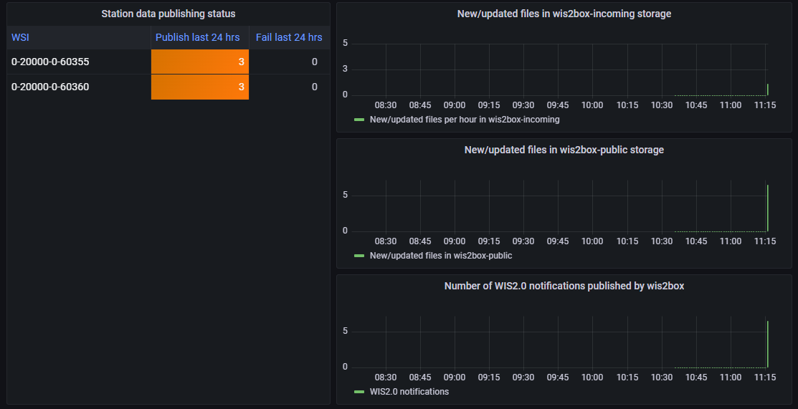

# Monitoreo de Notificaciones WIS2

!!! abstract "Resultados de aprendizaje"

    Al final de esta sesión práctica, podrás:
    
    - activar el flujo de trabajo de wis2box subiendo datos en MinIO usando el comando `wis2box data ingest`
    - ver advertencias y errores mostrados en el tablero de Grafana
    - verificar el contenido de los datos que se están publicando

## Introducción

El **tablero de Grafana** utiliza datos de Prometheus y Loki para mostrar el estado de tu wis2box. Prometheus almacena datos de series temporales de las métricas recogidas, mientras que Loki almacena los registros de los contenedores que se ejecutan en tu instancia de wis2box. Estos datos te permiten verificar cuántos datos se reciben en MinIO y cuántas notificaciones WIS2 se publican, y si se detectan errores en los registros.

Para ver el contenido de las notificaciones WIS2 que se están publicando en diferentes temas de tu wis2box puedes usar la pestaña 'Monitor' en el **wis2box-webapp**.

## Preparación

Esta sección utilizará el conjunto de datos "surface-based-observations/synop" creado previamente en la sesión práctica [Configurando conjuntos de datos en wis2box](/practical-sessions/configuring-wis2box-datasets).

Inicia sesión en tu VM de estudiante usando tu cliente SSH (PuTTY u otro).

Asegúrate de que wis2box esté funcionando:

```bash
cd ~/wis2box-1.0.0rc1/
python3 wis2box-ctl.py start
python3 wis2box-ctl.py status
```

Asegúrate de tener MQTT Explorer en funcionamiento y conectado a tu instancia usando las credenciales públicas `everyone/everyone` con una suscripción al tema `origin/a/wis2/#`.

Asegúrate de tener acceso a la interfaz web de MinIO yendo a `http://<tu-host>:9000` y que estás registrado (usando `WIS2BOX_STORAGE_USERNAME` y `WIS2BOX_STORAGE_PASSWORD` de tu archivo `wis2box.env`).

Asegúrate de tener un navegador web abierto con el tablero de Grafana para tu instancia yendo a `http://<tu-host>:3000`.

## Ingestando algunos datos

Por favor, ejecuta los siguientes comandos desde tu sesión de cliente SSH:

Copia el archivo de datos de ejemplo `aws-example.csv` al directorio que definiste como `WI2BOX_HOST_DATADIR` en tu archivo `wis2box.env`.

```bash
cp ~/exercise-materials/monitoring-exercises/aws-example.csv ~/wis2box-data/
```

Asegúrate de estar en el directorio `wis2box-1.0.0rc1` e inicia sesión en el contenedor **wis2box-management**:

```bash
cd ~/wis2box-1.0.0rc1
python3 wis2box-ctl.py login
```

Verifica que los datos de muestra estén disponibles en el directorio `/data/wis2box/` dentro del contenedor **wis2box-management**:

```bash
ls -lh /data/wis2box/aws-example.csv
```

!!! note
    El `WIS2BOX_HOST_DATADIR` está montado como `/data/wis2box/` dentro del contenedor de gestión de wis2box por el archivo `docker-compose.yml` incluido en el directorio `wis2box-1.0.0rc1`.
    
    Esto te permite compartir datos entre el host y el contenedor.

!!! question "Ejercicio 1: ingestando datos usando `wis2box data ingest`"

    Ejecuta el siguiente comando para ingestar el archivo de datos de muestra `aws-example.csv` en tu instancia de wis2box:

    ```bash
    wis2box data ingest -p /data/wis2box/aws-example.csv --metadata-id urn:wmo:md:not-my-centre:core.surface-based-observations.synop
    ```

    ¿Se ingestaron correctamente los datos? Si no, ¿cuál fue el mensaje de error y cómo puedes solucionarlo?

??? success "Haz clic para revelar la respuesta"

    Verás el siguiente resultado:

    ```bash
    Error: metadata_id=urn:wmo:md:not-my-centre:core.surface-based-observations.synop not found in data mappings
    ```

    El mensaje de error indica que el identificador de metadatos que proporcionaste no coincide con ninguno de los conjuntos de datos que has configurado en tu instancia de wis2box.

    Proporciona el metadata-id correcto que coincida con el conjunto de datos que creaste en la sesión práctica anterior y repite el comando de ingestión de datos hasta que veas el siguiente resultado:

    ```bash 
    Processing /data/wis2box/aws-example.csv
    Done
    ```

Ve a la consola de MinIO en tu navegador y verifica si el archivo `aws-example.csv` fue subido al bucket `wis2box-incoming`. Deberías ver que hay un nuevo directorio con el nombre del conjunto de datos que proporcionaste en la opción `--metadata-id`:


!!! note
    El comando `wis2box data ingest` subió el archivo al bucket `wis2box-incoming` en MinIO en un directorio nombrado después del identificador de metadatos que proporcionaste.

Ve al tablero de Grafana en tu navegador y verifica el estado de la ingestión de datos.

!!! question "Ejercicio 2: verifica el estado de la ingestión de datos"
    
    Ve al tablero de Grafana en tu navegador y verifica el estado de la ingestión de datos.
    
    ¿Se ingestaron correctamente los datos?

??? success "Haz clic para revelar la respuesta"
    El panel en la parte inferior del tablero de inicio de Grafana informa las siguientes advertencias:    
    
    `WARNING - input=aws-example.csv warning=Station 0-20000-0-60355 not in station list; skipping`
    `WARNING - input=aws-example.csv warning=Station 0-20000-0-60360 not in station list; skipping`

    Esta advertencia indica que las estaciones no están definidas en la lista de estaciones de tu wis2box. No se publicarán notificaciones WIS2 para esta estación hasta que la agregues a la lista de estaciones y la asocies con el tema para tu conjunto de datos.

!!! question "Ejercicio 3: agrega las estaciones de prueba y repite la ingestión de datos"

    Agrega las estaciones a tu wis2box usando el editor de estaciones en **wis2box-webapp**, y asocia las estaciones con el tema para tu conjunto de datos.

    Ahora vuelve a subir el archivo de datos de muestra `aws-example.csv` al mismo camino en MinIO que usaste en el ejercicio anterior.

    Verifica el tablero de Grafana, ¿hay nuevos errores o advertencias? ¿Cómo puedes ver que los datos de prueba se ingestaron y publicaron correctamente?

??? success "Haz clic para revelar la respuesta"

    Puedes verificar los gráficos en el tablero de inicio de Grafana para ver si los datos de prueba se ingestaron y publicaron correctamente.
    
    Si fue exitoso, deberías ver lo siguiente:

    

!!! question "Ejercicio 4: verifica el broker MQTT para las notificaciones WIS2"
    
    Ve al MQTT Explorer y verifica si puedes ver el Mensaje de Notificación WIS2 para los datos que acabas de ingestar.
    
    ¿Cuántas notificaciones de datos WIS2 fueron publicadas por tu wis2box?
    
    ¿Cómo accedes al contenido de los datos que se están publicando?

??? success "Haz clic para revelar la respuesta"

    Deberías ver 6 notificaciones de datos WIS2 publicadas por tu wis2box.

    Para acceder al contenido de los datos que se están publicando, puedes expandir la estructura del tema para ver los diferentes niveles del mensaje hasta llegar al último nivel y revisar el contenido del mensaje de uno de los mensajes.

    El contenido del mensaje tiene una sección de "enlaces" con una clave "rel" de "canonical" y una clave "href" con la URL para descargar los datos. La URL estará en el formato `http://<tu-host>/data/...`. 
    
    Ten en cuenta que el formato de datos es BUFR y necesitarás un analizador de BUFR para ver el contenido de los datos. El formato BUFR es un formato binario utilizado por los servicios meteorológicos para intercambiar datos. Los plugins de datos dentro de wis2box transformaron los datos de CSV a BUFR antes de publicarlos.

## Viendo el contenido de los datos que has publicado

Puedes usar el **wis2box-webapp** para ver el contenido de las notificaciones de datos WIS2 que han sido publicadas por tu wis2box.

Abre el **wis2box-webapp** en tu navegador navegando a `http://<tu-host>/wis2box-webapp` y selecciona la pestaña **Monitoring**:


En la pestaña de monitoreo selecciona tu dataset-id y haz clic en "UPDATE"

??? question "Ejercicio 5: ver las notificaciones WIS2 en el wis2box-webapp"
    
    ¿Cuántas notificaciones de datos WIS2 fueron publicadas por tu wis2box? 

    ¿Cuál es la temperatura del aire reportada en la última notificación en la estación con el identificador WIGOS=0-20000-0-60355?

??? success "Haz clic para revelar la respuesta"

    Si has ingestado correctamente los datos de prueba, deberías ver 6 notificaciones de datos WIS2 publicadas por tu wis2box.

    Para ver la temperatura del aire medida para la estación con el identificador WIGOS=0-20000-0-60355, haz clic en el botón "INSPECT" junto al archivo para esa estación para abrir una ventana emergente que muestra el contenido analizado del archivo de datos. La temperatura del aire medida en esta estación fue de 25.0 grados Celsius.

!!! Note
    El contenedor wis2box-api incluye herramientas para analizar archivos BUFR y mostrar el contenido en un formato legible por humanos. Esto no es un requisito central para la implementación de WIS2.0, pero se incluyó en wis2box para ayudar a los publicadores de datos a verificar el contenido de los datos que están publicando.

## Conclusión

!!! success "¡Felicidades!"
    En esta sesión práctica, aprendiste cómo:

    - activar el flujo de trabajo de wis2box subiendo datos en MinIO usando el comando `wis2box data ingest`
    - ver las notificaciones WIS2 publicadas por tu wis2box en el tablero de Grafana y el Explorador MQTT
    - verificar el contenido de los datos que se están publicando usando el **wis2box-webapp**