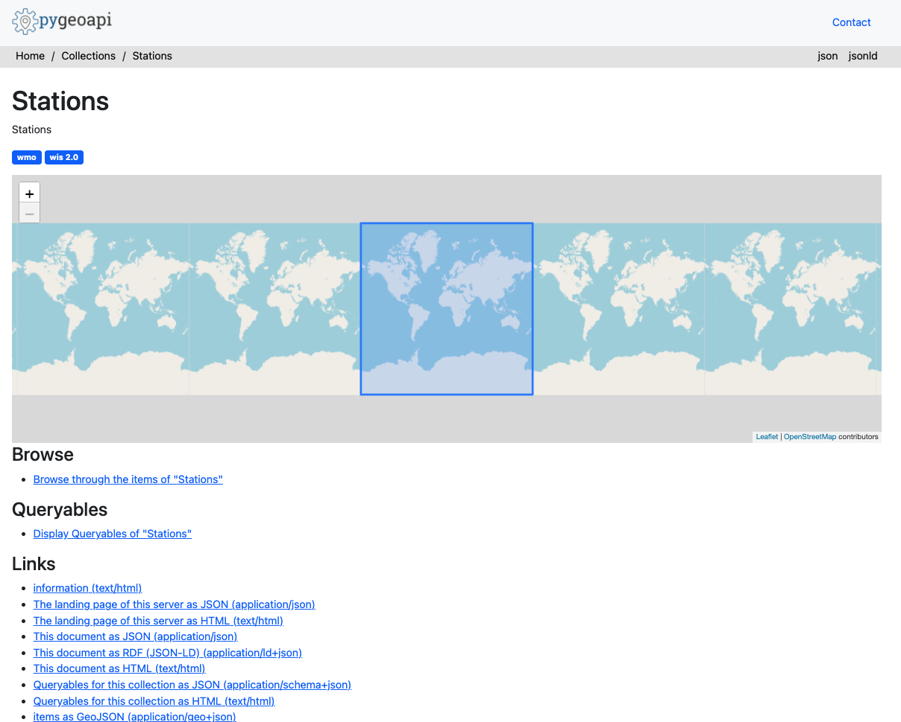

# Consultando datos usando la API de wis2box

!!! abstract "Objetivos de aprendizaje"
    Al final de esta sesión práctica, podrás:

    - usar la API de wis2box para consultar y filtrar tus estaciones
    - usar la API de wis2box para consultar y filtrar tus datos

## Introducción

La API de wis2box proporciona acceso de descubrimiento y consulta de forma legible por máquina a los datos que se han ingerido en wis2box. La API está basada en el estándar OGC API - Features y está implementada usando [pygeoapi](https://pygeoapi.io).

La API de wis2box proporciona acceso a las siguientes colecciones:

- Estaciones
- Metadatos de descubrimiento 
- Notificaciones de datos
- más una colección por conjunto de datos configurado, que almacena la salida de bufr2geojson (el plugin `bufr2geojson` debe estar habilitado en la configuración de mapeo de datos para completar los elementos en la colección del conjunto de datos).

En esta sesión práctica aprenderás cómo usar la API de datos para navegar y consultar datos que se han ingerido en wis2box.

## Preparación

!!! note
    Navega a la página principal de la API de wis2box en tu navegador web:

    `http://YOUR-HOST/oapi`

## Inspeccionando colecciones

Desde la página principal, haz clic en el enlace 'Collections'.

!!! question
    ¿Cuántas colecciones de datos ves en la página resultante? ¿Qué crees que representa cada colección?

??? success "Haz clic para ver la respuesta"
    Deberían mostrarse 4 colecciones, incluyendo "Stations", "Discovery metadata" y "Data notifications"

## Inspeccionando estaciones

Desde la página principal, haz clic en el enlace 'Collections', luego haz clic en el enlace 'Stations'.

Haz clic en el enlace 'Browse', luego haz clic en el enlace 'json'.

!!! question
    ¿Cuántas estaciones se devuelven? Compara este número con la lista de estaciones en `http://YOUR-HOST/wis2box-webapp/station`

??? success "Haz clic para ver la respuesta"
    El número de estaciones de la API debería ser igual al número de estaciones que ves en la webapp de wis2box.

!!! question
    ¿Cómo podemos consultar una sola estación (por ejemplo, `Balaka`)?

??? success "Haz clic para ver la respuesta"
    Consulta la API con `http://YOUR-HOST/oapi/collections/stations/items?q=Balaka`.

!!! note
    El ejemplo anterior está basado en los datos de prueba de Malawi. Intenta probar con las estaciones que has ingerido como parte de los ejercicios anteriores.

## Inspeccionando observaciones

!!! note
    El ejemplo anterior está basado en los datos de prueba de Malawi. Intenta probar con las observaciones que has ingerido como parte de los ejercicios.

Desde la página principal, haz clic en el enlace 'Collections', luego haz clic en el enlace 'Surface weather observations from Malawi'.

Haz clic en el enlace 'Queryables'.

!!! question
    ¿Qué queryable se usaría para filtrar por identificador de estación?

??? success "Haz clic para ver la respuesta"
    El `wigos_station_identifer` es el queryable correcto.

Navega a la página anterior (es decir, `http://YOUR-HOST/oapi/collections/urn:wmo:md:mwi:mwi_met_centre:surface-weather-observations`)

Haz clic en el enlace 'Browse'.

!!! question
    ¿Cómo podemos visualizar la respuesta JSON?

??? success "Haz clic para ver la respuesta"
    Haciendo clic en el enlace 'JSON' en la parte superior derecha de la página, o agregando `f=json` a la solicitud de la API en el navegador web.

Inspecciona la respuesta JSON de las observaciones.

!!! question
    ¿Cuántos registros se devuelven?

!!! question
    ¿Cómo podemos limitar la respuesta a 3 observaciones?

??? success "Haz clic para ver la respuesta"
    Agrega `limit=3` a la solicitud de la API.

!!! question
    ¿Cómo podemos ordenar la respuesta por las últimas observaciones?

??? success "Haz clic para ver la respuesta"
    Agrega `sortby=-resultTime` a la solicitud de la API (nota el signo `-` para denotar orden descendente). Para ordenar por las observaciones más antiguas, actualiza la solicitud para incluir `sortby=resultTime`.

!!! question
    ¿Cómo podemos filtrar las observaciones por una sola estación?

??? success "Haz clic para ver la respuesta"
    Agrega `wigos_station_identifier=<WSI>` a la solicitud de la API.

!!! question
    ¿Cómo podemos recibir las observaciones como CSV?

??? success "Haz clic para ver la respuesta"
    Agrega `f=csv` a la solicitud de la API.

!!! question
    ¿Cómo podemos mostrar una sola observación (id)?

??? success "Haz clic para ver la respuesta"
    Usando el identificador de característica de una solicitud de API contra las observaciones, consulta la API para `http://YOUR-HOST/oapi/collections/{collectionId}/items/{featureId}`, donde `{collectionId}` es el nombre de tu colección de observaciones y `{itemId}` es el identificador de la observación individual de interés.

## Conclusión

!!! success "¡Felicitaciones!"
    En esta sesión práctica, aprendiste cómo:

    - usar la API de wis2box para consultar y filtrar tus estaciones
    - usar la API de wis2box para consultar y filtrar tus datos