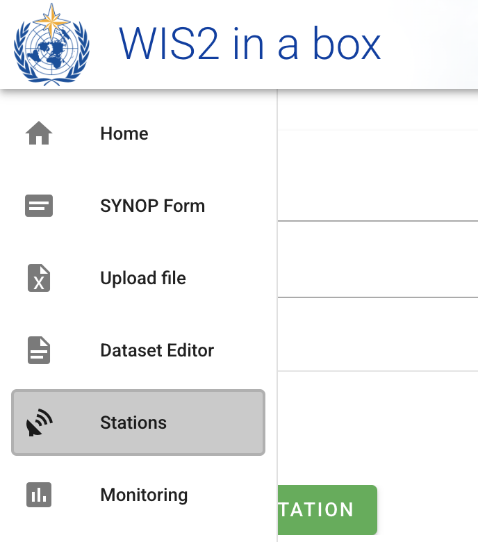
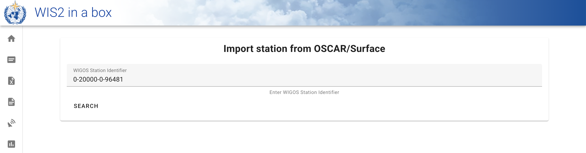
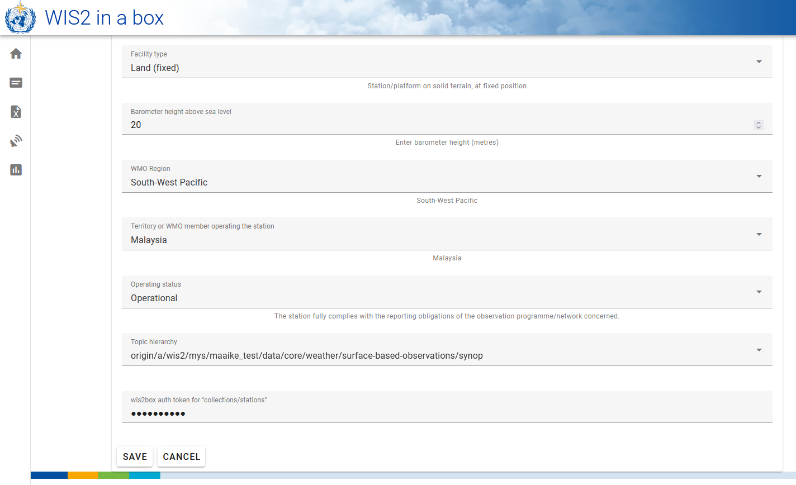
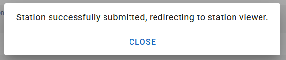
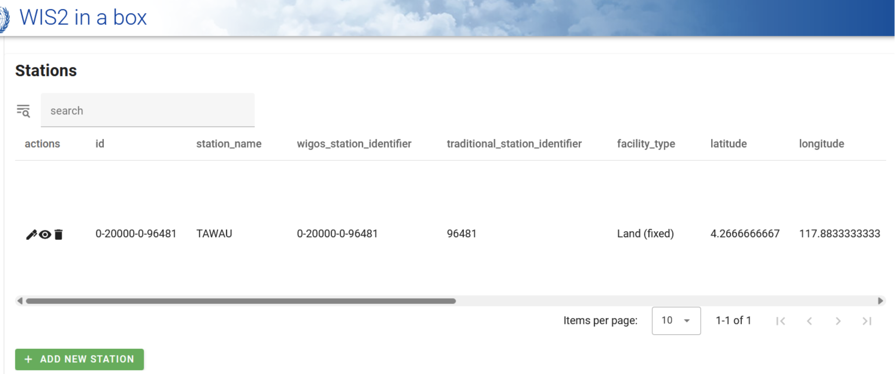
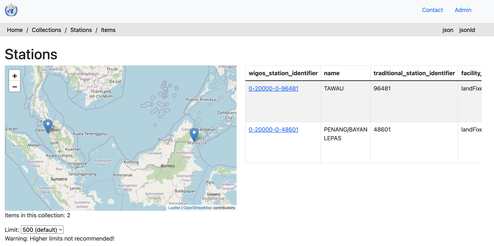

# Configuration des métadonnées des stations

!!! abstract "Objectifs d'apprentissage"

    À la fin de cette session pratique, vous serez capable de :

    - créer un jeton d'autorisation pour le point d'accès `collections/stations`
    - ajouter des métadonnées de station à wis2box
    - mettre à jour/supprimer les métadonnées des stations en utilisant le **wis2box-webapp**

## Introduction

Pour le partage international des données entre les Membres de l'OMM, il est important d'avoir une compréhension commune des stations qui produisent les données. Le Système mondial intégré des systèmes d'observation de l'OMM (WIGOS) fournit un cadre pour l'intégration des systèmes d'observation et des systèmes de gestion des données. L'**Identifiant de Station WIGOS (WSI)** est utilisé comme référence unique de la station qui a produit un ensemble spécifique de données d'observation.

wis2box dispose d'une collection de métadonnées de stations qui est utilisée pour décrire les stations produisant les données d'observation et qui doit être récupérée depuis **OSCAR/Surface**. Les métadonnées des stations dans wis2box sont utilisées par les outils de transformation BUFR pour vérifier que les données d'entrée contiennent un Identifiant de Station WIGOS (WSI) valide et pour fournir une correspondance entre le WSI et les métadonnées de la station.

## Créer un jeton d'autorisation pour collections/stations

Pour modifier les stations via le **wis2box-webapp**, vous devrez d'abord créer un jeton d'autorisation.

Connectez-vous à votre VM étudiant et assurez-vous d'être dans le répertoire `wis2box` :

```bash
cd ~/wis2box
```

Puis connectez-vous au conteneur **wis2box-management** avec la commande suivante :

```bash
python3 wis2box-ctl.py login
```

Dans le conteneur **wis2box-management**, vous pouvez créer un jeton d'autorisation pour un point d'accès spécifique en utilisant la commande : `wis2box auth add-token --path <my-endpoint>`.

Par exemple, pour utiliser un jeton généré automatiquement aléatoire pour le point d'accès `collections/stations` :

```{.copy}
wis2box auth add-token --path collections/stations
```	

La sortie ressemblera à ceci :

```{.copy}
Continue with token: 7ca20386a131f0de384e6ffa288eb1ae385364b3694e47e3b451598c82e899d1 [y/N]? y
Token successfully created
```

Ou, si vous souhaitez définir votre propre jeton pour le point d'accès `collections/stations`, vous pouvez utiliser l'exemple suivant :

```{.copy}
wis2box auth add-token --path collections/stations DataIsMagic
```

Sortie :
    
```{.copy}
Continue with token: DataIsMagic [y/N]? y
Token successfully created
```

Veuillez créer un jeton d'autorisation pour le point d'accès `collections/stations` en suivant les instructions ci-dessus.

## Ajouter des métadonnées de station en utilisant le **wis2box-webapp**

Le **wis2box-webapp** fournit une interface graphique pour éditer les métadonnées des stations.

Ouvrez le **wis2box-webapp** dans votre navigateur en accédant à `http://YOUR-HOST/wis2box-webapp`, et sélectionnez stations :



Lorsque vous cliquez sur "add new station", on vous demande de fournir l'identifiant de station WIGOS pour la station que vous souhaitez ajouter :



!!! note "Ajouter les métadonnées pour 3 stations ou plus"
    Veuillez ajouter trois stations ou plus à la collection de métadonnées de stations de votre wis2box.
      
    Utilisez si possible des stations de votre pays, en particulier si vous avez apporté vos propres données.
      
    Si votre pays n'a pas de stations dans OSCAR/Surface, vous pouvez utiliser les stations suivantes pour cet exercice :

      - 0-20000-0-91334
      - 0-20000-0-96323 (notez l'altitude manquante dans OSCAR)
      - 0-20000-0-96749 (notez l'altitude manquante dans OSCAR)

Lorsque vous cliquez sur rechercher, les données de la station sont récupérées depuis OSCAR/Surface, notez que cela peut prendre quelques secondes.

Examinez les données renvoyées par OSCAR/Surface et ajoutez les données manquantes si nécessaire. Sélectionnez un sujet pour la station et fournissez votre jeton d'autorisation pour le point d'accès `collections/stations` puis cliquez sur 'save' :





Retournez à la liste des stations et vous verrez la station que vous avez ajoutée :



Répétez ce processus jusqu'à ce que vous ayez configuré au moins 3 stations.

!!! tip "Dériver les informations d'altitude manquantes"

    Si l'altitude de votre station est manquante, il existe des services en ligne pour rechercher l'altitude à partir de données d'élévation ouvertes. Un exemple est l'[API Open Topo Data](https://www.opentopodata.org).

    Par exemple, pour obtenir l'altitude à la latitude -6.15558 et longitude 106.84204, vous pouvez copier-coller l'URL suivante dans un nouvel onglet du navigateur :

    ```{.copy}
    https://api.opentopodata.org/v1/aster30m?locations=-6.15558,106.84204
    ```

    Sortie :

    ```{.copy}
    {
      "results": [
        {
          "dataset": "aster30m", 
          "elevation": 7.0, 
          "location": {
            "lat": -6.15558, 
            "lng": 106.84204
          }
        }
      ], 
      "status": "OK"
    }
    ```

## Vérifier vos métadonnées de station

Les métadonnées des stations sont stockées dans le backend de wis2box et rendues disponibles via le **wis2box-api**.

Si vous ouvrez un navigateur et accédez à `http://YOUR-HOST/oapi/collections/stations/items`, vous verrez les métadonnées des stations que vous avez ajoutées :



!!! note "Vérifier vos métadonnées de station"

    Vérifiez que les stations que vous avez ajoutées sont associées à votre jeu de données en visitant `http://YOUR-HOST/oapi/collections/stations/items` dans votre navigateur.

Vous avez également la possibilité de visualiser/mettre à jour/supprimer la station dans le **wis2box-webapp**. Notez que vous devez fournir votre jeton d'autorisation pour le point d'accès `collections/stations` pour mettre à jour/supprimer la station.

!!! note "Mettre à jour/supprimer les métadonnées de station"

    Essayez de mettre à jour/supprimer les métadonnées d'une des stations que vous avez ajoutées en utilisant le **wis2box-webapp**.

## Chargement en masse des métadonnées de station

Notez que wis2box a également la capacité d'effectuer un chargement "en masse" des métadonnées de station à partir d'un fichier CSV en utilisant la ligne de commande dans le conteneur **wis2box-management**.

```bash
python3 wis2box-ctl.py login
wis2box metadata station publish-collection -p /data/wis2box/metadata/station/station_list.csv -th origin/a/wis2/centre-id/weather/surface-based-observations/synop
```

Cela vous permet de télécharger un grand nombre de stations en une seule fois et de les associer à un sujet spécifique.

Vous pouvez créer le fichier CSV en utilisant Excel ou un éditeur de texte, puis le télécharger vers wis2box-host-datadir pour le rendre disponible au conteneur **wis2box-management** dans le répertoire `/data/wis2box/`.

Après avoir effectué un chargement en masse des stations, il est recommandé de vérifier les stations dans le **wis2box-webapp** pour s'assurer que les données ont été correctement téléchargées.

Consultez la [documentation officielle de wis2box](https://docs.wis2box.wis.wmo.int) pour plus d'informations sur l'utilisation de cette fonctionnalité.

## Conclusion

!!! success "Félicitations !"
    Dans cette session pratique, vous avez appris à :

    - créer un jeton d'autorisation pour le point d'accès `collections/stations` à utiliser avec le **wis2box-webapp**
    - ajouter des métadonnées de station à wis2box en utilisant le **wis2box-webapp**
    - visualiser/mettre à jour/supprimer les métadonnées des stations en utilisant le **wis2box-webapp**