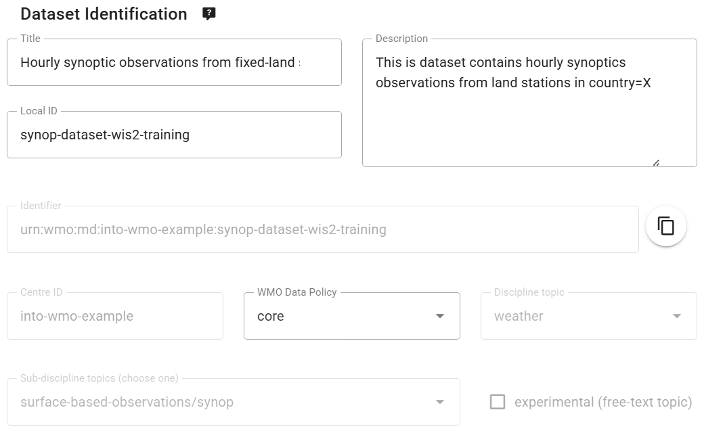

# Configuration des jeux de données dans wis2box

!!! abstract "Objectifs d'apprentissage"
    À la fin de cette session pratique, vous serez capable de :

    - créer un nouveau jeu de données
    - créer des métadonnées de découverte pour un jeu de données
    - configurer les mappages de données pour un jeu de données
    - publier une notification WIS2 avec un enregistrement WCMP2
    - mettre à jour et republier votre jeu de données

## Introduction

wis2box utilise des jeux de données qui sont associés à des métadonnées de découverte et des mappages de données.

Les métadonnées de découverte sont utilisées pour créer un enregistrement WCMP2 (WMO Core Metadata Profile 2) qui est partagé via une notification WIS2 publiée sur votre wis2box-broker.

Les mappages de données sont utilisés pour associer un plugin de données à vos données d'entrée, permettant la transformation de vos données avant leur publication via la notification WIS2.

Cette session vous guidera à travers la création d'un nouveau jeu de données, la création de métadonnées de découverte et la configuration des mappages de données. Vous inspecterez votre jeu de données dans wis2box-api et examinerez la notification WIS2 pour vos métadonnées de découverte.

## Préparation

Connectez-vous à votre broker en utilisant MQTT Explorer.

Au lieu d'utiliser vos identifiants de broker interne, utilisez les identifiants publics `everyone/everyone` :


!!! Note

    Vous n'avez jamais besoin de partager les identifiants de votre broker interne avec des utilisateurs externes. L'utilisateur 'everyone' est un utilisateur public permettant le partage des notifications WIS2.

    Les identifiants `everyone/everyone` ont un accès en lecture seule sur le sujet 'origin/a/wis2/#'. C'est le sujet où les notifications WIS2 sont publiées. Le Global Broker peut s'abonner avec ces identifiants publics pour recevoir les notifications.
    
    L'utilisateur 'everyone' ne verra pas les sujets internes et ne pourra pas publier de messages.

Ouvrez un navigateur et accédez à la page `http://YOUR-HOST/wis2box-webapp`. Assurez-vous d'être connecté et de pouvoir accéder à la page 'dataset editor'.

Consultez la section sur [l'initialisation de wis2box](/practical-sessions/initializing-wis2box) si vous avez besoin de vous rappeler comment vous connecter au broker ou accéder à wis2box-webapp.

## Créer un jeton d'autorisation pour processes/wis2box

Vous aurez besoin d'un jeton d'autorisation pour le point d'accès 'processes/wis2box' pour publier votre jeu de données.

Pour créer un jeton d'autorisation, accédez à votre VM de formation via SSH et utilisez les commandes suivantes pour vous connecter au conteneur wis2box-management :

```bash
cd ~/wis2box
python3 wis2box-ctl.py login
```

Puis exécutez la commande suivante pour créer un jeton d'autorisation généré aléatoirement pour le point d'accès 'processes/wis2box' :

```bash
wis2box auth add-token --path processes/wis2box
```

Vous pouvez également créer un jeton avec une valeur spécifique en fournissant le jeton comme argument à la commande :

```bash
wis2box auth add-token --path processes/wis2box MyS3cretToken
```

Assurez-vous de copier la valeur du jeton et de la stocker sur votre machine locale, car vous en aurez besoin plus tard.

Une fois que vous avez votre jeton, vous pouvez quitter le conteneur wis2box-management :

```bash
exit
```

## Créer un nouveau jeu de données dans wis2box-webapp

Naviguez vers la page 'dataset editor' dans wis2box-webapp de votre instance wis2box en allant sur `http://YOUR-HOST/wis2box-webapp` et en sélectionnant 'dataset editor' dans le menu à gauche.

Sur la page 'dataset editor', sous l'onglet 'Datasets', cliquez sur "Create New ..." :


Une fenêtre pop-up apparaîtra, vous demandant de fournir :

- **Centre ID** : c'est l'acronyme de l'agence (en minuscules et sans espaces), tel que spécifié par le Membre de l'OMM, qui identifie le centre de données responsable de la publication des données.
- **Data Type** : Le type de données pour lequel vous créez des métadonnées. Vous pouvez choisir entre utiliser un modèle prédéfini ou sélectionner 'other'. Si 'other' est sélectionné, plus de champs devront être remplis manuellement.

!!! Note "Centre ID"

    Votre centre-id doit commencer par le TLD de votre pays, suivi d'un tiret (`-`) et d'un nom abrégé de votre organisation (par exemple `fr-meteofrance`). Le centre-id doit être en minuscules et utiliser uniquement des caractères alphanumériques. La liste déroulante montre tous les centre-ids actuellement enregistrés sur WIS2 ainsi que tous les centre-ids que vous avez déjà créés dans wis2box.

!!! Note "Modèles de types de données"

    Le champ *Data Type* vous permet de sélectionner parmi une liste de modèles disponibles dans l'éditeur de jeux de données wis2box-webapp. Un modèle pré-remplira le formulaire avec des valeurs par défaut suggérées appropriées pour le type de données. Cela inclut des suggestions de titre et de mots-clés pour les métadonnées et des plugins de données préconfigurés. Le sujet sera fixé au sujet par défaut pour le type de données.

    Pour les besoins de la formation, nous utiliserons le type de données *weather/surface-based-observations/synop* qui inclut des plugins de données assurant la transformation des données au format BUFR avant leur publication.

    Si vous souhaitez publier des alertes CAP en utilisant wis2box, utilisez le modèle *weather/advisories-warnings*. Ce modèle inclut un plugin de données qui vérifie que les données d'entrée sont une alerte CAP valide avant la publication. Pour créer des alertes CAP et les publier via wis2box, vous pouvez utiliser [CAP Composer](https://github.com/wmo-raf/cap-composer).

Veuillez choisir un centre-id approprié pour votre organisation.

Pour **Data Type**, sélectionnez **weather/surface-based-observations/synop** :


Cliquez sur *continue to form* pour continuer, vous verrez alors le **Formulaire d'édition de jeu de données**.

Puisque vous avez sélectionné le type de données **weather/surface-based-observations/synop**, le formulaire sera pré-rempli avec certaines valeurs initiales liées à ce type de données.

## Création des métadonnées de découverte

Le Formulaire d'édition de jeu de données vous permet de fournir les Métadonnées de découverte pour votre jeu de données que le conteneur wis2box-management utilisera pour publier un enregistrement WCMP2.

Puisque vous avez sélectionné le type de données 'weather/surface-based-observations/synop', le formulaire sera pré-rempli avec certaines valeurs par défaut.

Assurez-vous de remplacer le 'Local ID' auto-généré par un nom descriptif pour votre jeu de données, par exemple 'synop-dataset-wis2training' :



Examinez le titre et les mots-clés, mettez-les à jour si nécessaire, et fournissez une description pour votre jeu de données.

Notez qu'il y a des options pour changer la 'WMO Data Policy' de 'core' à 'recommended' ou pour modifier votre Identifiant de métadonnées par défaut, veuillez garder data-policy comme 'core' et utiliser l'Identifiant de métadonnées par défaut.

Ensuite, examinez la section définissant vos 'Propriétés temporelles' et 'Propriétés spatiales'. Vous pouvez ajuster la zone délimitée en mettant à jour les champs 'Latitude Nord', 'Latitude Sud', 'Longitude Est' et 'Longitude Ouest' :


Ensuite, remplissez la section définissant les 'Informations de contact du fournisseur de données' :


Enfin, remplissez la section définissant les 'Informations sur la qualité des données' :

Une fois que vous avez rempli toutes les sections, cliquez sur 'VALIDATE FORM' et vérifiez le formulaire pour d'éventuelles erreurs :


S'il y a des erreurs, corrigez-les et cliquez à nouveau sur 'VALIDATE FORM'.

Assurez-vous de n'avoir aucune erreur et d'obtenir une indication pop-up que votre formulaire a été validé :


Ensuite, avant de soumettre votre jeu de données, examinez les mappages de données pour votre jeu de données.

## Configuration des mappages de données

Puisque vous avez utilisé un modèle pour créer votre jeu de données, les mappages de données ont été pré-remplis avec les plugins par défaut pour le type de données 'weather/surface-based-observations/synop'. Les plugins de données sont utilisés dans wis2box pour transformer les données avant leur publication via la notification WIS2.


Notez que vous pouvez cliquer sur le bouton "update" pour modifier les paramètres du plugin tels que l'extension de fichier et le modèle de fichier, vous pouvez laisser les paramètres par défaut pour l'instant. Dans une session ultérieure, vous en apprendrez davantage sur BUFR et la transformation des données au format BUFR.

## Soumission de votre jeu de données

Enfin, vous pouvez cliquer sur 'submit' pour publier votre jeu de données.

Vous devrez fournir le jeton d'autorisation pour 'processes/wis2box' que vous avez créé précédemment. Si vous ne l'avez pas fait, vous pouvez créer un nouveau jeton en suivant les instructions dans la section de préparation.

Vérifiez que vous obtenez le message suivant après avoir soumis votre jeu de données, indiquant que le jeu de données a été soumis avec succès :


Après avoir cliqué sur 'OK', vous êtes redirigé vers la page d'accueil de l'éditeur de jeux de données. Maintenant, si vous cliquez sur l'onglet 'Dataset', vous devriez voir votre nouveau jeu de données listé :


## Examen de la notification WIS2 pour vos métadonnées de découverte

Allez sur MQTT Explorer, si vous étiez connecté au broker, vous devriez voir une nouvelle notification WIS2 publiée sur le sujet `origin/a/wis2/<votre-centre-id>/metadata` :


Inspectez le contenu de la notification WIS2 que vous avez publiée. Vous devriez voir un JSON avec une structure correspondant au format WIS Notification Message (WNM).

!!! question

    Sur quel sujet la notification WIS2 est-elle publiée ?

??? success "Cliquez pour révéler la réponse"

    La notification WIS2 est publiée sur le sujet `origin/a/wis2/<votre-centre-id>/metadata`.

!!! question
    
    Essayez de trouver le titre, la description et les mots-clés que vous avez fournis dans les métadonnées de découverte dans la notification WIS2. Pouvez-vous les trouver ?

??? success "Cliquez pour révéler la réponse"

    **Le titre, la description et les mots-clés que vous avez fournis dans les métadonnées de découverte ne sont pas présents dans la charge utile de la notification WIS2 !**
    
    À la place, essayez de chercher le lien canonique dans la section "links" de la notification WIS2 :

    

    **La notification WIS2 contient un lien canonique vers l'enregistrement WCMP2 qui a été publié.**
    
    Copiez-collez ce lien canonique dans votre navigateur pour accéder à l'enregistrement WCMP2, selon vos paramètres de navigateur, vous pourriez être invité à télécharger le fichier ou il pourrait être affiché directement dans votre navigateur.

    Vous trouverez le titre, la description et les mots-clés que vous avez fournis à l'intérieur de l'enregistrement WCMP2.

## Conclusion

!!! success "Félicitations !"
    Dans cette session pratique, vous avez appris à :

    - créer un nouveau jeu de données
    - définir vos métadonnées de découverte
    - examiner vos mappages de données
    - publier des métadonnées de découverte
    - examiner la notification WIS2 pour vos métadonnées de découverte