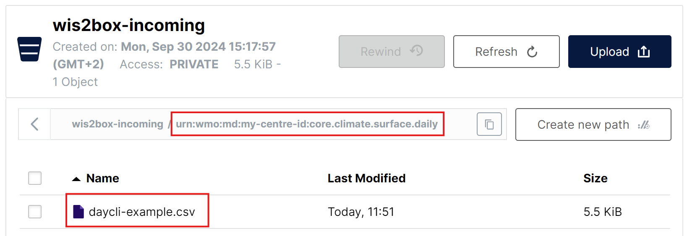

# Conversion des données CSV en BUFR

!!! abstract "Résultats d'apprentissage"
    À la fin de cette session pratique, vous serez capable de :

    - utiliser l'**interface utilisateur MinIO** pour télécharger des fichiers de données CSV et surveiller le résultat
    - connaître le format des données CSV à utiliser avec le modèle BUFR de station météorologique automatique par défaut
    - utiliser l'éditeur de jeux de données dans l'**application web wis2box** pour créer un jeu de données pour la publication de messages DAYCLI
    - connaître le format des données CSV à utiliser avec le modèle BUFR DAYCLI
    - utiliser l'**application web wis2box** pour valider et convertir des données d'exemple pour les stations AWS en BUFR (optionnel)

## Introduction

Les fichiers de données à valeurs séparées par des virgules (CSV) sont souvent utilisés pour enregistrer des observations et d'autres données dans un format tabulaire.
La plupart des enregistreurs de données utilisés pour enregistrer la sortie des capteurs sont capables d'exporter les observations dans des fichiers délimités, y compris en CSV.
De même, lorsque les données sont ingérées dans une base de données, il est facile d'exporter les données requises dans des fichiers formatés CSV.
Pour faciliter l'échange de données initialement stockées dans des formats de données tabulaires, un convertisseur de CSV en BUFR a été implémenté dans
le wis2box en utilisant le même logiciel que pour SYNOP en BUFR.

Dans cette session, vous apprendrez à utiliser le convertisseur csv2bufr dans le wis2box pour les modèles intégrés suivants :

- **AWS** (aws-template.json) : Modèle de mappage pour convertir les données CSV d'un fichier de station météorologique automatique simplifié en séquence BUFR 301150, 307096"
- **DayCLI** (daycli-template.json) : Modèle de mappage pour convertir les données CSV climatiques quotidiennes en séquence BUFR 307075

## Préparation

Assurez-vous que la pile wis2box a été démarrée avec `python3 wis2box.py start`

Assurez-vous que vous avez un navigateur web ouvert avec l'interface utilisateur MinIO pour votre instance en allant sur `http://<votre-hôte>:9000`
Si vous ne vous souvenez pas de vos identifiants MinIO, vous pouvez les trouver dans le fichier `wis2box.env` dans le répertoire `wis2box-1.0.0rc1` sur votre VM étudiant.

Assurez-vous que vous avez MQTT Explorer ouvert et connecté à votre courtier en utilisant les identifiants `everyone/everyone`.

## Exercice 1 : Utilisation de csv2bufr avec le modèle 'AWS'

Le modèle 'AWS' fournit un modèle de mappage prédéfini pour convertir les données CSV des stations AWS en support des exigences de rapport GBON.

La description du modèle AWS peut être trouvée [ici](/csv2bufr-templates/aws-template).

### Examiner les données d'entrée aws-example

Téléchargez l'exemple pour cet exercice depuis le lien ci-dessous :

[aws-example.csv](/sample-data/aws-example.csv)

Ouvrez le fichier que vous avez téléchargé dans un éditeur et inspectez le contenu :

!!! question
    En examinant les champs de date, d'heure et d'identité (identifiants WIGOS et traditionnels), que remarquez-vous ? Comment la date d'aujourd'hui serait-elle représentée ?

??? success "Cliquez pour révéler la réponse"
    Chaque colonne contient une seule information. Par exemple, la date est divisée en
    année, mois et jour, reflétant la manière dont les données sont stockées en BUFR. La date d'aujourd'hui serait 
    divisée à travers les colonnes "année", "mois" et "jour". De même, l'heure doit être
    divisée en "heure" et "minute" et l'identifiant de la station WIGOS en ses composants respectifs.

!!! question
    En regardant le fichier de données, comment les données manquantes sont-elles codées ?
    
??? success "Cliquez pour révéler la réponse"
    Les données manquantes dans le fichier sont représentées par des cellules vides. Dans un fichier CSV, cela serait codé par ``,,``. Notez qu'il s'agit d'une cellule vide et non codée comme une chaîne de longueur zéro, 
    par exemple ``,"",``.

!!! hint "Données manquantes"
    Il est reconnu que les données peuvent manquer pour diverses raisons, que ce soit en raison d'une défaillance du capteur ou du paramètre non observé. Dans ces cas, les données manquantes peuvent être codées
    comme indiqué ci-dessus, les autres données dans le rapport restent valides.

!!! question
    Quels sont les identifiants des stations WIGOS pour les stations qui rapportent des données dans le fichier exemple ? Comment est-il défini dans le fichier d'entrée ?

??? success "Cliquez pour révéler la réponse"

    L'identifiant de la station WIGOS est défini par 4 colonnes séparées dans le fichier :

    - **wsi_series** : série d'identifiants WIGOS
    - **wsi_issuer** : émetteur de l'identifiant WIGOS
    - **wsi_issue_number** : numéro d'émission WIGOS
    - **wsi_local** : identifiant local WIGOS

    Les identifiants des stations WIGOS utilisés dans le fichier exemple sont `0-20000-0-60351`, `0-20000-0-60355` et `0-20000-0-60360`.	

### Mettre à jour le fichier exemple

Mettez à jour le fichier exemple que vous avez téléchargé pour utiliser la date et l'heure d'aujourd'hui et changez les identifiants des stations WIGOS pour utiliser les stations que vous avez enregistrées dans l'application web wis2box.

### Téléchargez les données sur MinIO et vérifiez le résultat

Naviguez vers l'interface utilisateur MinIO et connectez-vous en utilisant les identifiants du fichier `wis2box.env`.

Naviguez vers **wis2box-incoming** et cliquez sur le bouton "Créer un nouveau chemin" :

Créez un nouveau dossier dans le seau MinIO qui correspond à l'identifiant du jeu de données pour le jeu de données que vous avez créé avec le modèle='weather/surface-weather-observations/synop' :

Téléchargez le fichier exemple que vous avez téléchargé dans le dossier que vous avez créé dans le seau MinIO :

Vérifiez le tableau de bord Grafana à `http://<votre-hôte>:3000` pour voir s'il y a des AVERTISSEMENTS ou des ERREURS. Si vous en voyez, essayez de les corriger et répétez l'exercice.

Vérifiez l'explorateur MQTT pour voir si vous recevez des notifications de données WIS2.

Si vous avez réussi à ingérer les données, vous devriez voir 3 notifications dans l'explorateur MQTT sur le sujet `origin/a/wis2/<centre-id>/data/weather/surface-weather-observations/synop` pour les 3 stations pour lesquelles vous avez rapporté des données :

## Exercice 2 - Utilisation du modèle 'DayCLI'

Dans l'exercice précédent, nous avons utilisé le jeu de données que vous avez créé avec Data-type='weather/surface-weather-observations/synop', qui a préconfiguré la conversion de CSV en BUFR au modèle AWS.

Dans le prochain exercice, nous utiliserons le modèle 'DayCLI' pour convertir les données climatiques quotidiennes en BUFR.

La description du modèle DAYCLI peut être trouvée [ici](/csv2bufr-templates/daycli-template).

!!! Note "À propos du modèle DAYCLI"
    Veuillez noter que la séquence BUFR DAYCLI sera mise à jour en 2025 pour inclure des informations supplémentaires et des drapeaux QC révisés. Le modèle DAYCLI inclus dans le wis2box sera mis à jour pour refléter ces changements. L'OMM communiquera lorsque le logiciel wis2box sera mis à jour pour inclure le nouveau modèle DAYCLI, afin de permettre aux utilisateurs de mettre à jour leurs systèmes en conséquence.

### Création d'un jeu de données wis2box pour la publication de messages DAYCLI

Allez à l'éditeur de jeux de données dans l'application web wis2box et créez un nouveau jeu de données. Utilisez le même identifiant de centre que dans les sessions pratiques précédentes et sélectionnez **Type de données='climate/surface-based-observations/daily'** :

Cliquez sur "CONTINUER VERS LE FORMULAIRE" et ajoutez une description pour votre jeu de données, définissez la boîte englobante et fournissez les informations de contact pour le jeu de données. Une fois que vous avez rempli toutes les sections, cliquez sur 'VALIDER LE FORMULAIRE' et vérifiez le formulaire.

Examinez les plugins de données pour les jeux de données. Cliquez sur "MISE À JOUR" à côté du plugin avec le nom "Données CSV converties en BUFR" et vous verrez que le modèle est défini sur **DayCLI** :

Fermez la configuration du plugin et soumettez le formulaire en utilisant le jeton d'authentification que vous avez créé lors de la session pratique précédente.

Vous devriez maintenant avoir un deuxième jeu de données dans l'application web wis2box configuré pour utiliser le modèle DAYCLI pour convertir les données CSV en BUFR.

### Examiner les données d'entrée daycli-example

Téléchargez l'exemple pour cet exercice depuis le lien ci-dessous :

[daycli-example.csv](/sample-data/daycli-example.csv)

Ouvrez le fichier que vous avez téléchargé dans un éditeur et inspectez le contenu :

!!! question
    Quelles variables supplémentaires sont incluses dans le modèle daycli ?

??? success "Cliquez pour révéler la réponse"
    Le modèle daycli comprend des métadonnées importantes sur l'emplacement des instruments et les classifications de qualité des mesures de température et d'humidité, des drapeaux de contrôle de qualité et des informations sur la manière dont la température moyenne quotidienne a été calculée.

### Mettre à jour le fichier exemple

Le fichier exemple contient une ligne de données pour chaque jour d'un mois et rapporte des données pour une station. Mettez à jour le fichier exemple que vous avez téléchargé pour utiliser la date et l'heure d'aujourd'hui et changez les identifiants des stations WIGOS pour utiliser une station que vous avez enregistrée dans l'application web wis2box.

### Téléchargez les données sur MinIO et vérifiez le résultat

Comme précédemment, vous devrez télécharger les données dans le seau 'wis2box-incoming' de MinIO pour être traitées par le convertisseur csv2bufr. Cette fois, vous devrez créer un nouveau dossier dans le seau MinIO qui correspond à l'identifiant du jeu de données pour le jeu de données que vous avez créé avec le modèle='climate/surface-based-observations/daily' qui sera différent de l'identifiant du jeu de données que vous avez utilisé dans l'exercice précédent :

Après avoir téléchargé les données, vérifiez qu'il n'y a pas d'AVERTISSEMENTS ou d'ERREURS dans le tableau de bord Grafana et vérifiez l'explorateur MQTT pour voir si vous recevez des notifications de données WIS2.

Si vous avez réussi à ingérer les données, vous devriez voir 30 notifications dans l'explorateur MQTT sur le sujet `origin/a/wis2/<centre-id>/data/climate/surface-based-observations/daily` pour les 30 jours du mois pour lesquels vous avez rapporté des données :

## Exercice 3 - Utilisation du formulaire CSV dans l'application web wis2box (optionnel)

L'application web wis2box fournit une interface pour télécharger des données CSV et les convertir en BUFR avant de les publier sur le WIS2, en utilisant le modèle AWS.

L'utilisation de ce formulaire est destinée à des fins de débogage et de validation, la méthode de soumission recommandée pour publier des données provenant de stations météorologiques automatisées est de configurer un processus qui télécharge automatiquement les données dans le seau MinIO.

### Utilisation du formulaire CSV dans l'application web wis2box

Naviguez vers le formulaire CSV sur l'application web wis2box
(``http://<votre-nom-d'hôte>/wis2box-webapp/csv2bufr_form``).
Utilisez le fichier [aws-example.csv](/sample-data/aws-example.csv) pour cet exercice.
Vous devriez maintenant pouvoir cliquer à côté pour prévisualiser et valider le fichier.

En cliquant sur le bouton suivant, le fichier est chargé dans le navigateur et validé contre un schéma prédéfini.
Aucune donnée n'a encore été convertie ou publiée. Sur l'onglet aperçu / validation, vous devriez être présenté avec une liste d'avertissements
sur les données manquantes mais dans cet exercice, ces avertissements peuvent être ignorés.

Cliquez sur *suivant* pour continuer et vous serez invité à fournir un identifiant de jeu de données pour les données à publier. Sélectionnez l'identifiant du jeu de données que vous avez créé précédemment et cliquez sur *suivant*.

Vous devriez maintenant être sur une page d'autorisation où il vous sera demandé d'entrer le jeton ``processes/wis2box``
que vous avez précédemment créé. Entrez ce jeton et cliquez sur l'interrupteur "Publier sur WIS2" pour vous assurer
que "Publier sur WIS2" est sélectionné (voir capture d'écran ci-dessous).

Cliquez sur suivant pour transformer en BUFR et publier, vous devriez alors voir l'écran suivant :

En cliquant sur la flèche vers le bas à droite de ``Fichiers BUFR de sortie``, les boutons ``Télécharger`` et ``Inspecter`` devraient apparaître.
Cliquez sur inspecter pour voir les données et confirmer que les valeurs sont comme prévu.

### Débogage des données d'entrée invalides

Dans cet exercice, nous examinerons ce qui se passe avec des données d'entrée invalides. Téléchargez le fichier exemple suivant en cliquant sur le
lien ci-dessous. Ce fichier contient les mêmes données que le premier fichier mais avec les colonnes vides supprimées.
Examinez le fichier et confirmez quelles colonnes ont été supprimées, puis suivez le même processus pour convertir les données en BUFR.

[csv2bufr-ex3a.csv](/sample-data/csv2bufr-ex3a.csv)

!!! question
    Avec les colonnes manquantes du fichier, avez-vous pu convertir les données en BUFR ?
    Avez-vous remarqué un changement dans les avertissements sur la page de validation ?

??? success "Cliquez pour révéler la réponse"
    Vous auriez dû toujours être capable de convertir les données en BUFR mais les messages d'avertissement auront été mis à jour
    pour indiquer que les colonnes étaient complètement manquantes plutôt que contenant