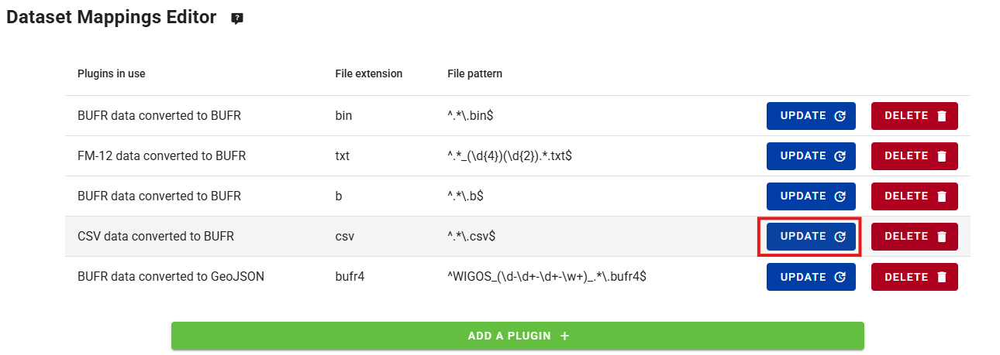
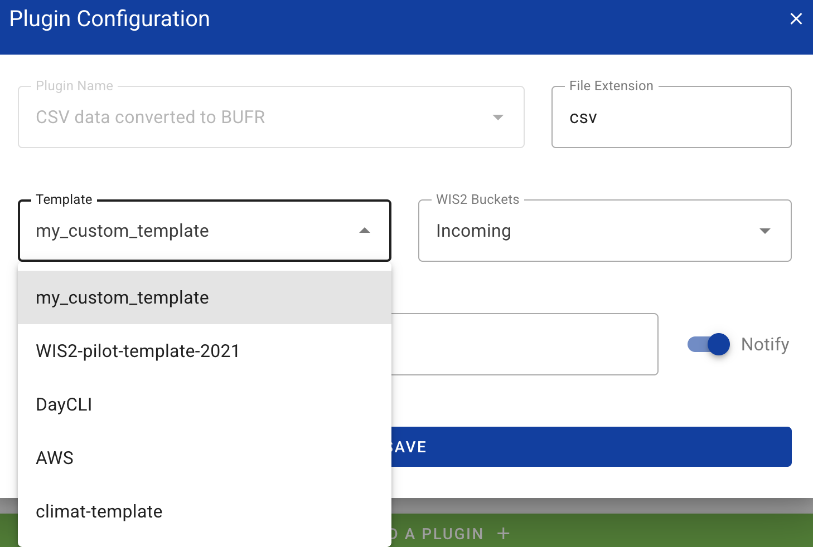

# Modèles de conversion CSV-vers-BUFR

!!! abstract "Objectifs d'apprentissage"
    À la fin de cette session pratique, vous serez capable de :

    - créer un nouveau modèle de conversion BUFR pour vos données CSV
    - éditer et déboguer votre modèle de conversion BUFR personnalisé depuis la ligne de commande
    - configurer le plugin de données CSV-vers-BUFR pour utiliser un modèle de conversion BUFR personnalisé
    - utiliser les modèles intégrés AWS et DAYCLI pour convertir des données CSV en BUFR

## Introduction

Les fichiers de données en valeurs séparées par des virgules (CSV) sont souvent utilisés pour enregistrer des observations et autres données dans un format tabulaire.
La plupart des enregistreurs de données utilisés pour enregistrer les sorties de capteurs peuvent exporter les observations dans des fichiers délimités, y compris en CSV.
De même, lorsque les données sont ingérées dans une base de données, il est facile d'exporter les données requises dans des fichiers au format CSV.

Le module wis2box csv2bufr fournit un outil en ligne de commande pour convertir les données CSV au format BUFR. Lors de l'utilisation de csv2bufr, vous devez fournir un modèle de conversion BUFR qui fait correspondre les colonnes CSV aux éléments BUFR correspondants. Si vous ne souhaitez pas créer votre propre modèle de conversion, vous pouvez utiliser les modèles intégrés AWS et DAYCLI pour convertir les données CSV en BUFR, mais vous devrez vous assurer que les données CSV que vous utilisez sont dans le format correct pour ces modèles. Si vous souhaitez décoder des paramètres qui ne sont pas inclus dans les modèles AWS et DAYCLI, vous devrez créer votre propre modèle de conversion.

Dans cette session, vous apprendrez à créer votre propre modèle de conversion pour convertir des données CSV en BUFR. Vous apprendrez également à utiliser les modèles intégrés AWS et DAYCLI pour convertir des données CSV en BUFR.

## Préparation

Assurez-vous que wis2box-stack a été démarré avec `python3 wis2box.py start`

Assurez-vous d'avoir un navigateur web ouvert avec l'interface MinIO pour votre instance en allant sur `http://YOUR-HOST:9000`
Si vous ne vous souvenez pas de vos identifiants MinIO, vous pouvez les trouver dans le fichier `wis2box.env` dans le répertoire `wis2box` sur votre VM étudiant.

Assurez-vous d'avoir MQTT Explorer ouvert et connecté à votre broker en utilisant les identifiants `everyone/everyone`.

## Création d'un modèle de conversion

Le module csv2bufr est livré avec un outil en ligne de commande pour créer votre propre modèle de conversion en utilisant un ensemble de séquences BUFR et/ou d'éléments BUFR comme entrée.

Pour trouver des séquences et éléments BUFR spécifiques, vous pouvez consulter les tables BUFR sur [https://confluence.ecmwf.int/display/ECC/BUFR+tables](https://confluence.ecmwf.int/display/ECC/BUFR+tables).

### Outil en ligne de commande csv2bufr mappings

Pour accéder à l'outil en ligne de commande csv2bufr, vous devez vous connecter au conteneur wis2box-api :

```bash
cd ~/wis2box
python3 wis2box-ctl.py login wis2box-api
```

Pour afficher la page d'aide de la commande `csv2bufr mapping` :

```bash
csv2bufr mappings --help
```

La page d'aide montre 2 sous-commandes :

- `csv2bufr mappings create` : Créer un nouveau modèle de conversion
- `csv2bufr mappings list` : Lister les modèles de conversion disponibles dans le système

!!! Note "csv2bufr mapping list"

    La commande `csv2bufr mapping list` vous montrera les modèles de conversion disponibles dans le système.
    Les modèles par défaut sont stockés dans le répertoire `/opt/wis2box/csv2bufr/templates` dans le conteneur.

    Pour partager des modèles de conversion personnalisés avec le système, vous pouvez les stocker dans le répertoire défini par `$CSV2BUFR_TEMPLATES`, qui est défini par défaut sur `/data/wis2box/mappings` dans le conteneur. Comme le répertoire `/data/wis2box/mappings` dans le conteneur est monté sur le répertoire `$WIS2BOX_HOST_DATADIR/mappings` sur l'hôte, vous trouverez vos modèles de conversion personnalisés dans le répertoire `$WIS2BOX_HOST_DATADIR/mappings` sur l'hôte.

Essayons de créer un nouveau modèle de conversion personnalisé en utilisant la commande `csv2bufr mapping create` avec comme entrée la séquence BUFR 301150 plus l'élément BUFR 012101.

```bash
csv2bufr mappings create 301150 012101 --output /data/wis2box/mappings/my_custom_template.json
```

Vous pouvez vérifier le contenu du modèle de conversion que vous venez de créer en utilisant la commande `cat` :

```bash
cat /data/wis2box/mappings/my_custom_template.json
```

!!! question "Inspection du modèle de conversion"

    Combien de colonnes CSV sont mappées aux éléments BUFR ? Quel est l'en-tête CSV pour chaque élément BUFR mappé ?

??? success "Cliquez pour révéler la réponse"
    
    Le modèle de conversion que vous avez créé mappe **5** colonnes CSV aux éléments BUFR, à savoir les 4 éléments BUFR de la séquence 301150 plus l'élément BUFR 012101.

    Les colonnes CSV suivantes sont mappées aux éléments BUFR :

    - **wigosIdentifierSeries** correspond à `"eccodes_key": "#1#wigosIdentifierSeries"` (élément BUFR 001125)
    - **wigosIssuerOfIdentifier** correspond à `"eccodes_key": "#1#wigosIssuerOfIdentifier` (élément BUFR 001126)
    - **wigosIssueNumber** correspond à `"eccodes_key": "#1#wigosIssueNumber"` (élément BUFR 001127)
    - **wigosLocalIdentifierCharacter** correspond à `"eccodes_key": "#1#wigosLocalIdentifierCharacter"` (élément BUFR 001128)
    - **airTemperature** correspond à `"eccodes_key": "#1#airTemperature"` (élément BUFR 012101)

Le modèle de conversion que vous avez créé manque des métadonnées importantes sur l'observation qui a été faite, la date et l'heure de l'observation, et la latitude et la longitude de la station.

Nous allons maintenant mettre à jour le modèle de conversion et ajouter les séquences suivantes :
    
- **301011** pour la Date (Année, mois, jour)
- **301012** pour l'Heure (Heure, minute)
- **301023** pour la Localisation (Latitude/longitude (précision grossière))

Et les éléments suivants :

- **010004** pour la Pression
- **007031** pour la Hauteur du baromètre au-dessus du niveau moyen de la mer

Exécutez la commande suivante pour mettre à jour le modèle de conversion :

```bash
csv2bufr mappings create 301150 301011 301012 301023 007031 012101 010004  --output /data/wis2box/mappings/my_custom_template.json
```

Et inspectez à nouveau le contenu du modèle de conversion :

```bash
cat /data/wis2box/mappings/my_custom_template.json
```

!!! question "Inspection du modèle de conversion mis à jour"

    Combien de colonnes CSV sont maintenant mappées aux éléments BUFR ? Quel est l'en-tête CSV pour chaque élément BUFR mappé ?

??? success "Cliquez pour révéler la réponse"
    
    Le modèle de conversion que vous avez créé mappe maintenant **18** colonnes CSV aux éléments BUFR :
    - 4 éléments BUFR de la séquence BUFR 301150
    - 3 éléments BUFR de la séquence BUFR 301011
    - 2 éléments BUFR de la séquence BUFR 301012
    - 2 éléments BUFR de la séquence BUFR 301023
    - élément BUFR 007031
    - élément BUFR 012101

    Les colonnes CSV suivantes sont mappées aux éléments BUFR :

    - **wigosIdentifierSeries** correspond à `"eccodes_key": "#1#wigosIdentifierSeries"` (élément BUFR 001125)
    - **wigosIssuerOfIdentifier** correspond à `"eccodes_key": "#1#wigosIssuerOfIdentifier` (élément BUFR 001126)
    - **wigosIssueNumber** correspond à `"eccodes_key": "#1#wigosIssueNumber"` (élément BUFR 001127)
    - **wigosLocalIdentifierCharacter** correspond à `"eccodes_key": "#1#wigosLocalIdentifierCharacter"` (élément BUFR 001128)
    - **year** correspond à `"eccodes_key": "#1#year"` (élément BUFR 004001)
    - **month** correspond à `"eccodes_key": "#1#month"` (élément BUFR 004002)
    - **day** correspond à `"eccodes_key": "#1#day"` (élément BUFR 004003)
    - **hour** correspond à `"eccodes_key": "#1#hour"` (élément BUFR 004004)
    - **minute** correspond à `"eccodes_key": "#1#minute"` (élément BUFR 004005)
    - **latitude** correspond à `"eccodes_key": "#1#latitude"` (élément BUFR 005002)
    - **longitude** correspond à `"eccodes_key": "#1#longitude"` (élément BUFR 006002)
    - **heightOfBarometerAboveMeanSeaLevel"** correspond à `"eccodes_key": "#1#heightOfBarometerAboveMeanSeaLevel"` (élément BUFR 007031)
    - **airTemperature** correspond à `"eccodes_key": "#1#airTemperature"` (élément BUFR 012101)
    - **nonCoordinatePressure** correspond à `"eccodes_key": "#1#nonCoordinatePressure"` (élément BUFR 010004)

Vérifiez le contenu du fichier `custom_template_data.csv` dans le répertoire `/root/data-conversion-exercises` :

```bash
cat /root/data-conversion-exercises/custom_template_data.csv
```

Notez que les en-têtes de ce fichier CSV sont les mêmes que les en-têtes CSV dans le modèle de conversion que vous avez créé.

Pour tester la conversion des données, nous pouvons utiliser l'outil en ligne de commande `csv2bufr` pour convertir le fichier CSV en BUFR en utilisant le modèle de conversion que nous avons créé :

```bash
csv2bufr data transform --bufr-template my_custom_template /root/data-conversion-exercises/custom_template_data.csv
```

Vous devriez voir la sortie suivante :

```bash
CLI:    ... Transforming /root/data-conversion-exercises/custom_template_data.csv to BUFR ...
CLI:    ... Processing subsets:
CLI:    ..... 94 bytes written to ./WIGOS_0-20000-0-15015_20250412T210000.bufr4
CLI:    End of processing, exiting.
```

!!! question "Vérifier le contenu du fichier BUFR"
    
    Comment pouvez-vous vérifier le contenu du fichier BUFR que vous venez de créer et vérifier qu'il a correctement encodé les données ?

??? success "Cliquez pour révéler la réponse"

    Vous pouvez utiliser la commande `bufr_dump -p` pour vérifier le contenu du fichier BUFR que vous venez de créer.
    La commande vous montrera le contenu du fichier BUFR dans un format lisible par l'homme.

    ```bash
    bufr_dump -p ./WIGOS_0-20000-0-15015_20250412T210000.bufr4
    ```

    Dans la sortie, vous verrez les valeurs des éléments BUFR que vous avez mappés dans le modèle, par exemple la "airTemperature" montrera :
    
    ```bash
    airTemperature=298.15
    ```

Vous pouvez maintenant quitter le conteneur :

```bash
exit
```

### Utilisation du modèle de conversion dans wis2box

Pour s'assurer que le nouveau modèle de conversion est reconnu par le conteneur wis2box-api, vous devez redémarrer le conteneur :

```bash
docker restart wis2box-api
```

Vous pouvez maintenant configurer votre jeu de données dans wis2box-webapp pour utiliser le modèle de conversion personnalisé pour le plugin de conversion CSV vers BUFR.

Le wis2box-webapp détectera automatiquement le modèle de conversion que vous avez créé et le rendra disponible dans la liste des modèles pour le plugin de conversion CSV vers BUFR.

Cliquez sur le jeu de données que vous avez créé lors de la session pratique précédente et cliquez sur "UPDATE" à côté du plugin nommé "CSV data converted to BUFR" :



Vous devriez voir le nouveau modèle que vous avez créé dans la liste des modèles disponibles :



!!! hint

    Notez que si vous ne voyez pas le nouveau modèle que vous avez créé, essayez de rafraîchir la page ou de l'ouvrir dans une nouvelle fenêtre de navigation privée.

Pour l'instant, gardez la sélection par défaut du modèle AWS (cliquez en haut à droite pour fermer la configuration du plugin).

## Utilisation du modèle 'AWS'

Le modèle 'AWS' fournit un modèle de conversion pour convertir les données CSV en séquence BUFR 301150, 307096, en support des exigences minimales GBON.

La description du modèle AWS peut être trouvée ici [aws-template](/