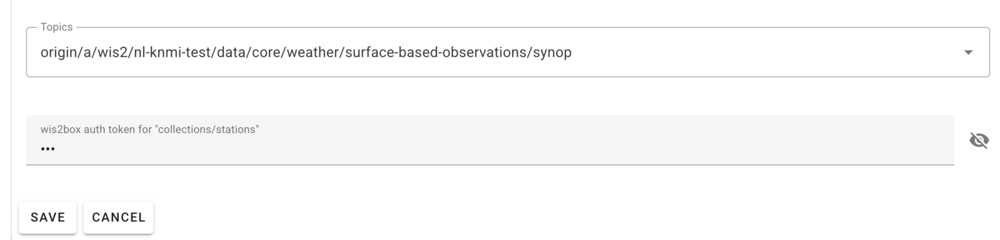

# Ingestion des données pour publication

!!! abstract "Objectifs d'Apprentissage"

    À la fin de cette session pratique, vous serez capable de :
    
    - Déclencher le workflow wis2box en téléchargeant des données vers MinIO via la ligne de commande, l'interface web MinIO, SFTP, ou un script Python.
    - Accéder au tableau de bord Grafana pour surveiller l'état de l'ingestion des données et consulter les journaux de votre instance wis2box.
    - Visualiser les notifications de données WIS2 publiées par votre wis2box à l'aide de MQTT Explorer.

## Introduction

Dans WIS2, les données sont partagées en temps réel via des notifications de données WIS2 qui contiennent un lien "canonique" permettant de télécharger les données.

Pour déclencher le workflow de données dans un WIS2 Node utilisant le logiciel wis2box, les données doivent être téléchargées dans le compartiment **wis2box-incoming** dans **MinIO**, ce qui initie le workflow wis2box. Ce processus aboutit à la publication des données via une notification de données WIS2. Selon les mappages de données configurés dans votre instance wis2box, les données peuvent être transformées au format BUFR avant d'être publiées.

Dans cet exercice, nous utiliserons des fichiers de données d'exemple pour déclencher le workflow wis2box et **publier des notifications de données WIS2** pour le jeu de données que vous avez configuré lors de la session pratique précédente.

Pendant l'exercice, nous surveillerons l'état de l'ingestion des données à l'aide du **tableau de bord Grafana** et de **MQTT Explorer**. Le tableau de bord Grafana utilise les données de Prometheus et Loki pour afficher l'état de votre wis2box, tandis que MQTT Explorer vous permet de voir les notifications de données WIS2 publiées par votre instance wis2box.

Notez que wis2box transformera les données d'exemple au format BUFR avant de les publier sur le broker MQTT, conformément aux mappages de données préconfigurés dans votre jeu de données. Pour cet exercice, nous nous concentrerons sur les différentes méthodes pour télécharger des données vers votre instance wis2box et vérifier la réussite de l'ingestion et de la publication. La transformation des données sera abordée plus tard dans la session pratique [Data Conversion Tools](../data-conversion-tools).

## Préparation

Cette section utilise le jeu de données "surface-based-observations/synop" précédemment créé dans la session pratique [Configuring Datasets in wis2box](/practical-sessions/configuring-wis2box-datasets). Elle nécessite également la connaissance de la configuration des stations dans **wis2box-webapp**, comme décrit dans la session pratique [Configuring Station Metadata](/practical-sessions/configuring-station-metadata).

Assurez-vous de pouvoir vous connecter à votre VM étudiant en utilisant votre client SSH (par exemple, PuTTY).

Assurez-vous que wis2box est en cours d'exécution :

```bash
cd ~/wis2box/
python3 wis2box-ctl.py start
python3 wis2box-ctl.py status
```

Assurez-vous que MQTT Explorer est en cours d'exécution et connecté à votre instance en utilisant les identifiants publics `everyone/everyone` avec un abonnement au sujet `origin/a/wis2/#`.

Assurez-vous d'avoir un navigateur web ouvert avec le tableau de bord Grafana de votre instance en naviguant vers `http://YOUR-HOST:3000`.

### Préparer les Données d'Exemple

Copiez le répertoire `exercise-materials/data-ingest-exercises` dans le répertoire que vous avez défini comme `WIS2BOX_HOST_DATADIR` dans votre fichier `wis2box.env` :

```bash
cp -r ~/exercise-materials/data-ingest-exercises ~/wis2box-data/
```

!!! note
    Le `WIS2BOX_HOST_DATADIR` est monté comme `/data/wis2box/` à l'intérieur du conteneur wis2box-management par le fichier `docker-compose.yml` inclus dans le répertoire `wis2box`.
    
    Cela vous permet de partager des données entre l'hôte et le conteneur.

### Ajouter la Station de Test

Ajoutez la station avec l'identifiant WIGOS `0-20000-0-64400` à votre instance wis2box en utilisant l'éditeur de station dans wis2box-webapp.

Récupérez la station depuis OSCAR :


Ajoutez la station aux jeux de données que vous avez créés pour la publication sur "../surface-based-observations/synop" et sauvegardez les modifications en utilisant votre jeton d'authentification :



Notez que vous pouvez supprimer cette station de votre jeu de données après la session pratique.

[La traduction continue avec le même style et les mêmes règles pour le reste du document...]