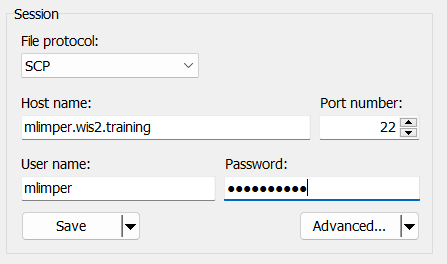

# Accesso alla VM dello studente

!!! abstract "Obiettivi formativi"

    Al termine di questa sessione pratica, sarai in grado di:

    - accedere alla tua VM studente tramite SSH e WinSCP
    - verificare che il software necessario per gli esercizi pratici sia installato
    - verificare di avere accesso ai materiali degli esercizi per questa formazione sulla tua VM studente locale

## Introduzione

Come parte delle sessioni di formazione wis2box eseguite localmente, puoi accedere alla tua VM studente personale sulla rete di formazione locale denominata "WIS2-training".

La tua VM studente ha il seguente software preinstallato:

- Ubuntu 22.0.4.3 LTS [ubuntu-22.04.3-live-server-amd64.iso](https://releases.ubuntu.com/jammy/ubuntu-22.04.3-live-server-amd64.iso)
- Python 3.10.12
- Docker 24.0.6
- Docker Compose 2.21.0
- Editor di testo: vim, nano

!!! note

    Se desideri eseguire questa formazione al di fuori di una sessione di formazione locale, puoi fornire la tua istanza utilizzando qualsiasi provider cloud, ad esempio:

    - GCP (Google Cloud Platform) VM instance `e2-medium`
    - AWS (Amazon Web Services) ec2-instance `t3a.medium`
    - Azure (Microsoft) Azure Virtual Machine `standard_b2s`

    Seleziona Ubuntu Server 22.0.4 LTS come sistema operativo.
    
    Dopo aver creato la tua VM assicurati di aver installato python, docker e docker compose, come descritto in [wis2box-software-dependencies](https://docs.wis2box.wis.wmo.int/en/latest/user/getting-started.html#software-dependencies).
    
    L'archivio delle release per wis2box utilizzato in questa formazione può essere scaricato come segue:

    ```bash
    wget https://github.com/World-Meteorological-Organization/wis2box-release/releases/download/1.0.0/wis2box-setup.zip
    unzip wis2box-setup.zip
    ```
    
    Puoi sempre trovare l'ultimo archivio 'wis2box-setup' su [https://github.com/World-Meteorological-Organization/wis2box/releases](https://github.com/World-Meteorological-Organization/wis2box-release/releases).

    Il materiale degli esercizi utilizzato in questa formazione può essere scaricato come segue:

    ```bash
    wget https://training.wis2box.wis.wmo.int/exercise-materials.zip
    unzip exercise-materials.zip
    ```

    I seguenti pacchetti Python aggiuntivi sono necessari per eseguire i materiali degli esercizi:

    ```bash
    pip3 install minio
    pip3 install pywiscat==0.2.2
    ```

    Se stai utilizzando la VM studente fornita durante le sessioni di formazione WIS2 locali, il software richiesto sarà già installato.

## Connessione alla VM studente sulla rete di formazione locale

Connetti il tuo PC alla rete Wi-Fi locale trasmessa nella sala durante la formazione WIS2 secondo le istruzioni fornite dal formatore.

Usa un client SSH per connetterti alla tua VM studente utilizzando quanto segue:

- **Host: (fornito durante la formazione in presenza)**
- **Porta: 22**
- **Nome utente: (fornito durante la formazione in presenza)**
- **Password: (fornita durante la formazione in presenza)**

!!! tip
    Contatta un formatore se non sei sicuro dell'hostname/nome utente o hai problemi di connessione.

Una volta connesso, modifica la tua password per assicurarti che altri non possano accedere alla tua VM:

```bash
limper@student-vm:~$ passwd
Changing password for testuser.
Current password:
New password:
Retype new password:
passwd: password updated successfully
```

## Verifica delle versioni del software

Per poter eseguire wis2box, la VM studente dovrebbe avere Python, Docker e Docker Compose preinstallati.

Verifica la versione di Python:
```bash
python3 --version
```
restituisce:
```console
Python 3.10.12
```

Verifica la versione di Docker:
```bash
docker --version
```
restituisce:
```console
Docker version 24.0.6, build ed223bc
```

Verifica la versione di Docker Compose:
```bash
docker compose version
```
restituisce:
```console
Docker Compose version v2.21.0
```

Per assicurarti che il tuo utente possa eseguire i comandi Docker, il tuo utente è stato aggiunto al gruppo `docker`.

Per verificare che il tuo utente possa eseguire docker hello-world, esegui il seguente comando:
```bash
docker run hello-world
```

Questo dovrebbe scaricare l'immagine hello-world ed eseguire un container che stampa un messaggio.

Verifica di vedere quanto segue nell'output:

```console
...
Hello from Docker!
This message shows that your installation appears to be working correctly.
...
```

## Ispeziona i materiali degli esercizi

Ispeziona il contenuto della tua directory home; questi sono i materiali utilizzati durante la formazione e le sessioni pratiche.

```bash
ls ~/
```
restituisce:
```console
exercise-materials  wis2box
```

Se hai WinSCP installato sul tuo PC locale, puoi utilizzarlo per connetterti alla tua VM studente e ispezionare il contenuto della tua directory home e scaricare o caricare file tra la tua VM e il tuo PC locale.

WinSCP non è necessario per la formazione, ma può essere utile se vuoi modificare i file sulla tua VM utilizzando un editor di testo sul tuo PC locale.

Ecco come puoi connetterti alla tua VM studente utilizzando WinSCP:

Apri WinSCP e fai clic su "New Site". Puoi creare una nuova connessione SCP alla tua VM come segue:



Fai clic su 'Save' e poi su 'Login' per connetterti alla tua VM.

E dovresti essere in grado di vedere il seguente contenuto:


## Conclusione

!!! success "Congratulazioni!"
    In questa sessione pratica, hai imparato a:

    - accedere alla tua VM studente tramite SSH e WinSCP
    - verificare che il software necessario per gli esercizi pratici sia installato
    - verificare di avere accesso ai materiali degli esercizi per questa formazione sulla tua VM studente locale