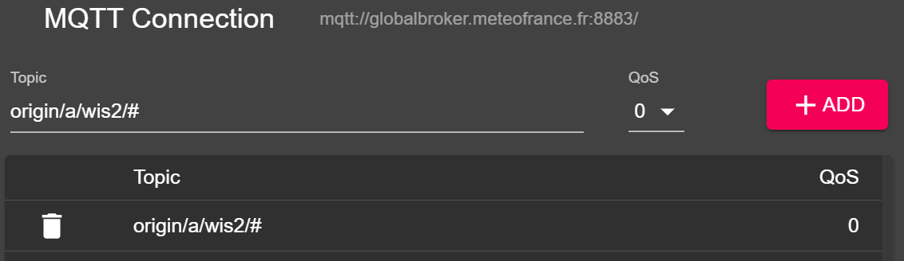
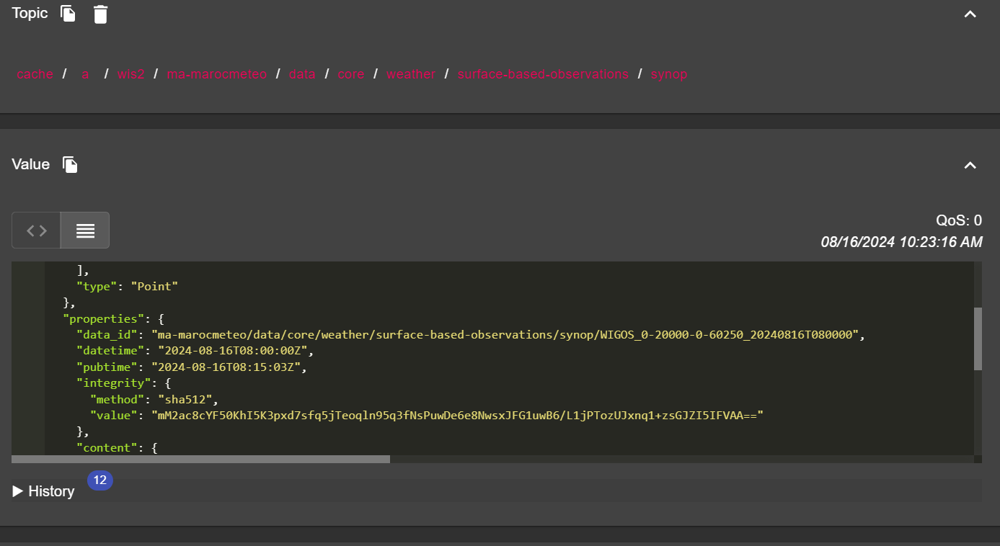

# Connessione a WIS2 tramite MQTT

!!! abstract "Risultati di apprendimento"

    Al termine di questa sessione pratica, sarai in grado di:

    - connetterti al Global Broker WIS2 utilizzando MQTT Explorer
    - esaminare la struttura degli argomenti WIS2
    - esaminare la struttura dei messaggi di notifica WIS2

## Introduzione

WIS2 utilizza il protocollo MQTT per pubblicizzare la disponibilità di dati meteorologici/climatici/idrici. Il Global Broker WIS2 si abbona a tutti i nodi WIS2 nella rete e ripubblica i messaggi che riceve. La Cache Globale si abbona al Global Broker, scarica i dati nel messaggio e poi ripubblica il messaggio sull'argomento `cache` con un nuovo URL. Il Catalogo Globale di Scoperta pubblica metadati di scoperta dal Broker e fornisce un'API di ricerca.

Questo è un esempio della struttura del messaggio di notifica WIS2 per un messaggio ricevuto sull'argomento `origin/a/wis2/br-inmet/data/core/weather/surface-based-observations/synop`:	

```json
{
  "id": "59f9b013-c4b3-410a-a52d-fff18f3f1b47",
  "type": "Feature",
  "version": "v04",
  "geometry": {
    "coordinates": [
      -38.69389,
      -17.96472,
      60
    ],
    "type": "Point"
  },
  "properties": {
    "data_id": "br-inmet/data/core/weather/surface-based-observations/synop/WIGOS_0-76-2-2900801000W83499_20240815T060000",
    "datetime": "2024-08-15T06:00:00Z",
    "pubtime": "2024-08-15T09:52:02Z",
    "integrity": {
      "method": "sha512",
      "value": "TBuWycx/G0lIiTo47eFPBViGutxcIyk7eikppAKPc4aHgOmTIS5Wb9+0v3awMOyCgwpFhTruRRCVReMQMp5kYw=="
    },
    "content": {
      "encoding": "base64",
      "value": "QlVGUgAA+gQAABYAACsAAAAAAAIAHAAH6AgPBgAAAAALAAABgMGWx1AAAM0ABOIAAAODM0OTkAAAAAAAAAAAAAAKb5oKEpJ6YkJ6mAAAAAAAAAAAAAAAAv0QeYA29WQa87ZhH4CQP//z+P//BD////+ASznXuUb///8MgAS3/////8X///e+AP////AB/+R/yf////////////////////6/1/79H/3///gEt////////4BLP6QAf/+/pAB//4H0YJ/YeAh/f2///7TH/////9+j//f///////////////////v0f//////////////////////wNzc3Nw==",
      "size": 250
    },
    "wigos_station_identifier": "0-76-2-2900801000W83499"
  },
  "links": [
    {
      "rel": "canonical",
      "type": "application/bufr",
      "href": "http://wis2bra.inmet.gov.br/data/2024-08-15/wis/br-inmet/data/core/weather/surface-based-observations/synop/WIGOS_0-76-2-2900801000W83499_20240815T060000.bufr4",
      "length": 250
    }
  ]
}
``` 

In questa sessione pratica imparerai come utilizzare lo strumento MQTT Explorer per configurare una connessione client MQTT a un Global Broker WIS2 e visualizzare i messaggi di notifica WIS2.

MQTT Explorer è uno strumento utile per navigare ed esaminare la struttura degli argomenti per un dato broker MQTT per rivedere i dati pubblicati.

Nota che MQTT è utilizzato principalmente per la comunicazione "macchina a macchina"; ciò significa che normalmente ci sarebbe un client che analizza automaticamente i messaggi man mano che vengono ricevuti. Per lavorare con MQTT a livello di programmazione (ad esempio, in Python), puoi utilizzare le librerie client MQTT come [paho-mqtt](https://pypi.org/project/paho-mqtt) per connetterti a un broker MQTT ed elaborare i messaggi in arrivo. Esistono numerosi software client e server MQTT, a seconda delle tue esigenze e dell'ambiente tecnico.

## Utilizzo di MQTT Explorer per connettersi al Global Broker

Per visualizzare i messaggi pubblicati da un Global Broker WIS2 puoi utilizzare "MQTT Explorer", che può essere scaricato dal [sito web di MQTT Explorer](https://mqtt-explorer.com).

Apri MQTT Explorer e aggiungi una nuova connessione al Global Broker ospitato da MeteoFrance utilizzando i seguenti dettagli:

- host: globalbroker.meteo.fr
- port: 8883
- username: everyone
- password: everyone


Fai clic sul pulsante 'AVANZATE', rimuovi gli argomenti preconfigurati e aggiungi i seguenti argomenti a cui iscriverti:

- `origin/a/wis2/#`



!!! note
    Quando configuri le iscrizioni MQTT puoi utilizzare i seguenti caratteri jolly:

    - **Singolo livello (+)**: un carattere jolly di singolo livello sostituisce un livello di argomento
    - **Multi-livello (#)**: un carattere jolly multi-livello sostituisce più livelli di argomento

    In questo caso `origin/a/wis2/#` ti iscriverà a tutti gli argomenti sotto l'argomento `origin/a/wis2`.

Fai clic su 'INDIETRO', poi 'SALVA' per salvare i dettagli della tua connessione e iscrizione.  Poi fai clic su 'CONNETTI':

I messaggi dovrebbero iniziare a comparire nella tua sessione di MQTT Explorer come segue:


Ora sei pronto per iniziare ad esplorare gli argomenti e la struttura dei messaggi WIS2.

## Esercizio 1: Esaminare la struttura degli argomenti WIS2

Utilizza MQTT per navigare la struttura degli argomenti sotto gli argomenti `origin`.

!!! question
    
    Come possiamo distinguere il centro WIS che ha pubblicato i dati?

??? success "Clicca per rivelare la risposta"

    Puoi fare clic sulla finestra sul lato sinistro in MQTT Explorer per espandere la struttura degli argomenti.
    
    Possiamo distinguere il centro WIS che ha pubblicato i dati guardando il quarto livello della struttura degli argomenti.  Ad esempio, l'argomento seguente:

    `origin/a/wis2/br-inmet/data/core/weather/surface-based-observations/synop`

    ci dice che i dati sono stati pubblicati da un centro WIS con l'ID del centro `br-inmet`, che è l'ID del centro per l'Instituto Nacional de Meteorologia - INMET, Brasile.

!!! question

    Come possiamo distinguere tra i messaggi pubblicati dai centri WIS che ospitano un gateway GTS-to-WIS2 e i messaggi pubblicati dai centri WIS che ospitano un nodo WIS2?

??? success "Clicca per rivelare la risposta"

    Possiamo distinguere i messaggi provenienti da un gateway GTS-to-WIS2 guardando l'ID del centro nella struttura dell'argomento. Ad esempio, l'argomento seguente:

    `origin/a/wis2/de-dwd-gts-to-wis2/data/core/I/S/A/I/01/sbbr`

    ci dice che i dati sono stati pubblicati dal gateway GTS-to-WIS2 ospitato dal Deutscher Wetterdienst (DWD), Germania. Il gateway GTS-to-WIS2 è un tipo speciale di editore di dati che pubblica dati dal Sistema di Telecomunicazione Globale (GTS) a WIS2. La struttura dell'argomento è composta dagli header TTAAii CCCC per i messaggi GTS.

## Esercizio 2: Esaminare la struttura dei messaggi WIS2

Disconnettiti da MQTT Explorer e aggiorna le sezioni 'Avanzate' per cambiare l'iscrizione ai seguenti argomenti:

* `origin/a/wis2/+/data/core/weather/surface-based-observations/synop`
* `cache/a/wis2/+/data/core/weather/surface-based-observations/synop`


!!! note
    Il carattere jolly `+` è utilizzato per iscriversi a tutti i centri WIS.

Riconnettiti al Global Broker e attendi che appaiano i messaggi.

Puoi visualizzare il contenuto del messaggio WIS2 nella sezione "Valore" sul lato destro. Prova ad espandere la struttura dell'argomento per vedere i diversi livelli del messaggio fino a raggiungere l'ultimo livello e rivedere il contenuto del messaggio di uno dei messaggi.

!!! question

    Come possiamo identificare il timestamp in cui i dati sono stati pubblicati? E come possiamo identificare il timestamp in cui i dati sono stati raccolti?

??? success "Clicca per rivelare la risposta"

    Il timestamp in cui i dati sono stati pubblicati è contenuto nella sezione `properties` del messaggio con una chiave di `pubtime`.

    Il timestamp in cui i dati sono stati raccolti è contenuto nella sezione `properties` del messaggio con una chiave di `datetime`.

    

!!! question

    Come possiamo scaricare i dati dall'URL fornito nel messaggio?

??? success "Clicca per rivelare la risposta"

    L'URL è contenuto nella sezione `links` con `rel="canonical"` e definito dalla chiave `href`.

    Puoi copiare l'URL e incollarlo in un browser web per scaricare i dati.

## Esercizio 3: Esaminare la differenza tra gli argomenti 'origin' e 'cache'

Assicurati di essere ancora connesso al Global Broker utilizzando le iscrizioni agli argomenti `origin/a/wis2/+/data/core/weather/surface-based-observations/synop` e `cache/a/wis2/+/data/core/weather/surface-based-observations/synop` come descritto nell'Esercizio 2.

Prova a identificare un messaggio per lo stesso ID del centro pubblicato sia sugli argomenti `origin` che `cache`.


!!! question

    Qual è la differenza tra i messaggi pubblicati sugli argomenti `origin` e `cache`?

??? success "Clicca per rivelare la risposta"

    I messaggi pubblicati sugli argomenti `origin` sono i messaggi originali che il Global Broker ripubblica dai nodi WIS2 nella rete. 

    I messaggi pubblicati sugli argomenti `cache` sono i messaggi per cui i dati sono stati scaricati dalla Cache Globale. Se controlli il contenuto del messaggio dall'argomento che inizia con `cache`, vedrai che il link 'canonico' è stato aggiornato con un nuovo URL.
    
    Ci sono molteplici Cache Globali nella rete WIS2, quindi riceverai un messaggio da ogni Cache Globale che ha scaricato il messaggio.

    La Cache Globale scaricherà e ripubblicherà solo i messaggi che sono stati pubblicati sulla gerarchia degli argomenti `../data/core/...`.

## Conclusione

!!! success "Congratulazioni!"
    In questa sessione pratica, hai imparato:

    - come iscriverti ai servizi del Global Broker WIS2 utilizzando MQTT Explorer
    - la struttura degli argomenti WIS2
    - la struttura dei messaggi di notifica WIS2
    - la differenza tra dati core e dati raccomandati
    - la struttura degli argomenti utilizzata dal gateway GTS-to-WIS2
    - la differenza tra i messaggi del Global Broker pubblicati sugli argomenti `origin` e `cache`