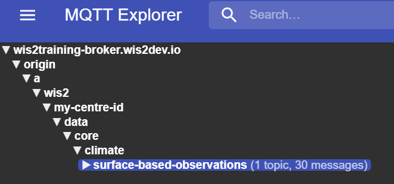

# Conversione dati CSV in BUFR

!!! abstract "Risultati di apprendimento"
    Al termine di questa sessione pratica, sarai in grado di:

    - utilizzare l'**interfaccia utente MinIO** per caricare file di dati CSV in input e monitorare il risultato
    - conoscere il formato dei dati CSV per l'uso con il template automatico di stazione meteorologica BUFR predefinito
    - utilizzare l'editor di dataset nell'**applicazione web wis2box** per creare un dataset per la pubblicazione dei messaggi DAYCLI
    - conoscere il formato dei dati CSV per l'uso con il template BUFR DAYCLI
    - utilizzare **l'applicazione web wis2box** per validare e convertire dati di esempio per stazioni AWS in BUFR (opzionale)

## Introduzione

I file di dati in valori separati da virgola (CSV) sono spesso utilizzati per registrare osservazioni e altri dati in formato tabellare.
La maggior parte dei data logger utilizzati per registrare l'output dei sensori è in grado di esportare le osservazioni in file delimitati, inclusi i CSV.
Analogamente, quando i dati vengono inseriti in un database, è facile esportare i dati richiesti in file formattati CSV.
Per facilitare lo scambio di dati originariamente memorizzati in formati di dati tabellari è stato implementato un convertitore da CSV a BUFR nel
wis2box utilizzando lo stesso software di SYNOP a BUFR.

In questa sessione imparerai a utilizzare il convertitore csv2bufr nel wis2box per i seguenti template integrati:

- **AWS** (aws-template.json) : Template di mappatura per convertire dati CSV da file di stazione meteorologica automatica semplificata a sequenza BUFR 301150, 307096"
- **DayCLI** (daycli-template.json) : Template di mappatura per convertire dati CSV climatici giornalieri in sequenza BUFR 307075

## Preparazione

Assicurati che lo stack wis2box sia stato avviato con `python3 wis2box.py start`

Assicurati di avere un browser web aperto con l'interfaccia utente MinIO per la tua istanza accedendo a `http://<tuo-host>:9000`
Se non ricordi le tue credenziali MinIO, puoi trovarle nel file `wis2box.env` nella directory `wis2box-1.0.0rc1` sul tuo VM studente.

Assicurati di avere MQTT Explorer aperto e connesso al tuo broker utilizzando le credenziali `everyone/everyone`.

## Esercizio 1: Utilizzo di csv2bufr con il template 'AWS'

Il template 'AWS' fornisce un template di mappatura predefinito per convertire dati CSV da stazioni AWS a supporto dei requisiti di reporting GBON.

La descrizione del template AWS può essere trovata [qui](/csv2bufr-templates/aws-template).

### Revisione dei dati di input dell'esempio aws

Scarica l'esempio per questo esercizio dal link sottostante:

[aws-example.csv](/sample-data/aws-example.csv)

Apri il file che hai scaricato in un editor e ispeziona il contenuto:

!!! question
    Esaminando i campi data, ora e identificativo (identificatori WIGOS e tradizionali) cosa
    noti? Come sarebbe rappresentata la data di oggi?

??? success "Clicca per rivelare la risposta"
    Ogni colonna contiene un singolo pezzo di informazione. Ad esempio, la data è divisa in
    anno, mese e giorno, riflettendo come i dati sono memorizzati in BUFR. La data di oggi sarebbe 
    divisa tra le colonne "anno", "mese" e "giorno". Analogamente, l'ora deve essere
    divisa in "ora" e "minuto" e l'identificatore della stazione WIGOS nei suoi rispettivi componenti.

!!! question
    Guardando il file di dati, come sono codificati i dati mancanti?
    
??? success "Clicca per rivelare la risposta"
    I dati mancanti nel file sono rappresentati da celle vuote. In un file CSV questo sarebbe codificato da ``,,``. Nota che si tratta di una cella vuota e non di una stringa di lunghezza zero, 
    ad es. ``,"",``.

!!! hint "Dati mancanti"
    Si riconosce che i dati possono mancare per una varietà di motivi, sia a causa di un guasto del sensore sia perché il parametro non è stato osservato. In questi casi i dati mancanti possono essere codificati
    come per la risposta sopra, gli altri dati nel rapporto rimangono validi.

!!! question
    Quali sono gli identificatori delle stazioni WIGOS per le stazioni che riportano dati nel file di esempio? Come sono definiti nel file di input?

??? success "Clicca per rivelare la risposta"

    L'identificatore della stazione WIGOS è definito da 4 colonne separate nel file:

    - **wsi_series**: serie di identificatori WIGOS
    - **wsi_issuer**: emittente dell'identificatore WIGOS
    - **wsi_issue_number**: numero di emissione WIGOS
    - **wsi_local**: identificatore locale WIGOS

    Gli identificatori delle stazioni WIGOS utilizzati nel file di esempio sono `0-20000-0-60351`, `0-20000-0-60355` e `0-20000-0-60360`.	

### Aggiorna il file di esempio

Aggiorna il file di esempio che hai scaricato per utilizzare la data e l'ora odierne e cambia gli identificatori delle stazioni WIGOS per utilizzare le stazioni che hai registrato nell'applicazione web wis2box.

### Carica i dati su MinIO e controlla il risultato

Naviga all'interfaccia utente MinIO e accedi utilizzando le credenziali dal file `wis2box.env`.

Naviga alla **wis2box-incoming** e clicca sul pulsante "Crea nuovo percorso":

Crea una nuova cartella nel bucket MinIO che corrisponde all'id del dataset per il dataset che hai creato con il template='weather/surface-weather-observations/synop':

Carica il file di esempio che hai scaricato nella cartella che hai creato nel bucket MinIO:

Controlla la dashboard di Grafana a `http://<tuo-host>:3000` per vedere se ci sono AVVISI o ERRORI. Se ne vedi, prova a risolverli e ripeti l'esercizio.

Controlla MQTT Explorer per vedere se ricevi notifiche di dati WIS2.

Se hai inserito correttamente i dati, dovresti vedere 3 notifiche in MQTT Explorer sull'argomento `origin/a/wis2/<id-centro>/data/weather/surface-weather-observations/synop` per le 3 stazioni per cui hai riportato dati:

## Esercizio 2 - Utilizzo del template 'DayCLI'

Nell'esercizio precedente abbiamo utilizzato il dataset che hai creato con Data-type='weather/surface-weather-observations/synop', che ha preconfigurato il template di conversione CSV a BUFR al template AWS.

Nel prossimo esercizio utilizzeremo il template 'DayCLI' per convertire i dati climatici giornalieri in BUFR.

La descrizione del template DAYCLI può essere trovata [qui](/csv2bufr-templates/daycli-template).

!!! Note "Riguardo al template DAYCLI"
    Si prega di notare che la sequenza BUFR DAYCLI sarà aggiornata durante il 2025 per includere informazioni aggiuntive e bandiere di controllo di qualità riviste. Il template DAYCLI incluso nel wis2box sarà aggiornato per riflettere questi cambiamenti. L'OMM comunicherà quando il software wis2box sarà aggiornato per includere il nuovo template DAYCLI, per permettere agli utenti di aggiornare i loro sistemi di conseguenza.

### Creazione di un dataset wis2box per la pubblicazione dei messaggi DAYCLI

Vai all'editor di dataset nell'applicazione web wis2box e crea un nuovo dataset. Utilizza lo stesso id-centro come nelle sessioni pratiche precedenti e seleziona **Tipo di Dato='climate/surface-based-observations/daily'**:

Clicca "CONTINUA AL MODULO" e aggiungi una descrizione per il tuo dataset, imposta il riquadro di delimitazione e fornisci le informazioni di contatto per il dataset. Una volta completate tutte le sezioni, clicca 'VALIDA MODULO' e controlla il modulo.

Rivedi i plugin di dati per i dataset. Clicca su "AGGIORNA" accanto al plugin con nome "Dati CSV convertiti in BUFR" e vedrai che il template è impostato su **DayCLI**:

Chiudi la configurazione del plugin e invia il modulo utilizzando il token di autenticazione che hai creato nella sessione pratica precedente.

Ora dovresti avere un secondo dataset nell'applicazione web wis2box configurato per utilizzare il template DAYCLI per convertire i dati CSV in BUFR.

### Revisione dei dati di input dell'esempio daycli

Scarica l'esempio per questo esercizio dal link sottostante:

[daycli-example.csv](/sample-data/daycli-example.csv)

Apri il file che hai scaricato in un editor e ispeziona il contenuto:

!!! question
    Quali variabili aggiuntive sono incluse nel template daycli?

??? success "Clicca per rivelare la risposta"
    Il template daycli include importanti metadati sulla posizione degli strumenti e sulle classificazioni della qualità delle misurazioni per temperatura e umidità, bandiere di controllo di qualità e informazioni su come è stata calcolata la temperatura media giornaliera.

### Aggiorna il file di esempio

Il file di esempio contiene una riga di dati per ogni giorno di un mese e riporta dati per una stazione. Aggiorna il file di esempio che hai scaricato per utilizzare la data e l'ora odierne e cambia gli identificatori delle stazioni WIGOS per utilizzare una stazione che hai registrato nell'applicazione web wis2box.

### Carica i dati su MinIO e controlla il risultato

Come prima, dovrai caricare i dati nel bucket 'wis2box-incoming' in MinIO per essere elaborati dal convertitore csv2bufr. Questa volta dovrai creare una nuova cartella nel bucket MinIO che corrisponde all'id del dataset per il dataset che hai creato con il template='climate/surface-based-observations/daily' che sarà diverso dall'id del dataset che hai utilizzato nell'esercizio precedente:

Dopo aver caricato i dati controlla che non ci siano AVVISI o ERRORI nella dashboard di Grafana e controlla MQTT Explorer per vedere se ricevi notifiche di dati WIS2.

Se hai inserito correttamente i dati, dovresti vedere 30 notifiche in MQTT Explorer sull'argomento `origin/a/wis2/<id-centro>/data/climate/surface-based-observations/daily` per i 30 giorni del mese per cui hai riportato dati:

## Esercizio 3 - utilizzo del modulo CSV nell'applicazione web wis2box (opzionale)

L'applicazione web wis2box fornisce un'interfaccia per caricare dati CSV e convertirli in BUFR prima di pubblicarli su WIS2, utilizzando il template AWS.

L'uso di questo modulo è inteso per scopi di debug e validazione, il metodo di invio raccomandato per la pubblicazione di dati da stazioni meteorologiche automatizzate è impostare un processo che carichi automaticamente i dati nel bucket MinIO.

### Utilizzo del modulo CSV nell'applicazione web wis2box

Naviga al modulo CSV sull'applicazione web wis2box
(``http://<nome-host>/wis2box-webapp/csv2bufr_form``).
Utilizza il file [aws-example.csv](/sample-data/aws-example.csv) per questo esercizio.
Ora dovresti essere in grado di cliccare su avanti per visualizzare in anteprima e validare il file.

Cliccando sul pulsante avanti, il file viene caricato nel browser e validato contro uno schema predefinito.
Ancora nessun dato è stato convertito o pubblicato. Nella scheda anteprima/valida dovresti essere presentato con un elenco di avvisi
sui dati mancanti ma in questo esercizio possono essere ignorati.

Clicca *avanti* per procedere e ti verrà chiesto di fornire un id del dataset per i dati da pubblicare. Seleziona l'id del dataset che hai creato in precedenza e clicca *avanti*.

Ora dovresti essere su una pagina di autorizzazione dove ti verrà chiesto di inserire il token ``processes/wis2box``
che hai precedentemente creato. Inserisci questo token e clicca sull'interruttore "Pubblica su WIS2" per assicurarti
che "Pubblica su WIS2" sia selezionato (vedi screenshot sotto).

Clicca avanti per trasformare in BUFR e pubblicare, dovresti quindi vedere la seguente schermata:

Cliccando sulla freccia in basso a destra di ``File BUFR di output`` dovrebbero apparire i pulsanti ``Scarica`` e ``Ispeziona``.
Clicca ispeziona per visualizzare i dati e confermare che i valori siano come previsto.

### Debugging di dati di input non validi

In questo esercizio esamineremo cosa succede con dati di input non validi. Scarica il file di esempio successivo cliccando sul
link sottostante. Questo contiene gli stessi dati del primo file ma con le colonne vuote rimosse.
Esamina il file e conferma quali colonne sono state rimosse e poi segui lo stesso processo per convertire i dati in BUFR.

[csv2bufr-ex3a.csv](/sample-data/csv2bufr-ex3a.csv)

!!! question
    Con le colonne mancanti dal file sei stato in grado di convertire i dati in BUFR?
    Hai notato qualche cambiamento agli avvisi nella pagina di validazione?

??? success "Clicca per rivelare la risposta"
    Avresti ancora dovuto essere in grado di convertire i dati in BUFR ma i messaggi di avviso saranno stati aggiornati
    per indicare che le colonne mancavano completamente piuttosto che contenere un valore mancante.

Nel prossimo esempio è stata aggiunta una colonna aggiuntiva al file CSV.

[csv2bufr-ex3b.csv](/sample-data/csv2bufr-ex3b.csv)

!!! question
    Senza caricare o inviare il file puoi prevedere cosa succederà quando lo farai?

Ora carica e conferma se la tua previsione era corretta.

??? success "Clicca per rivelare la risposta"
    Quando il file viene validato ora riceverai un avviso che la colonna ``index``
    non è trovata nello schema