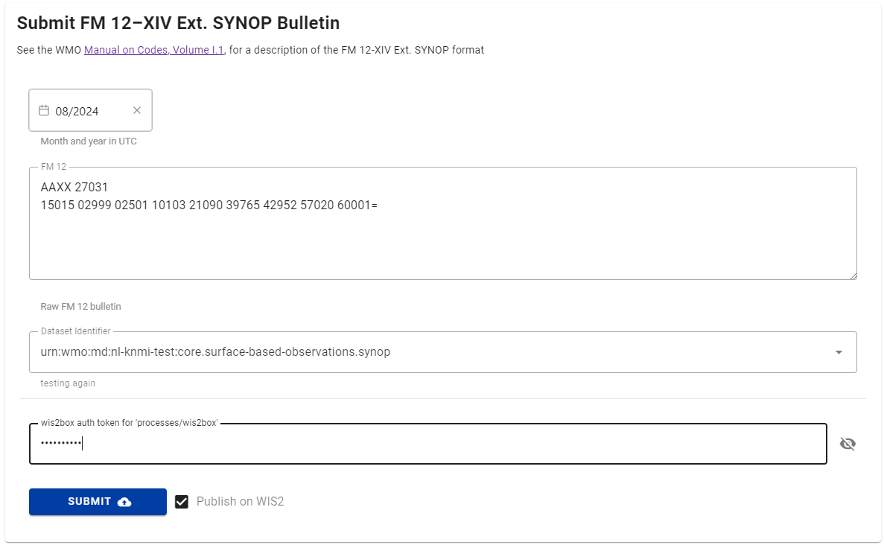
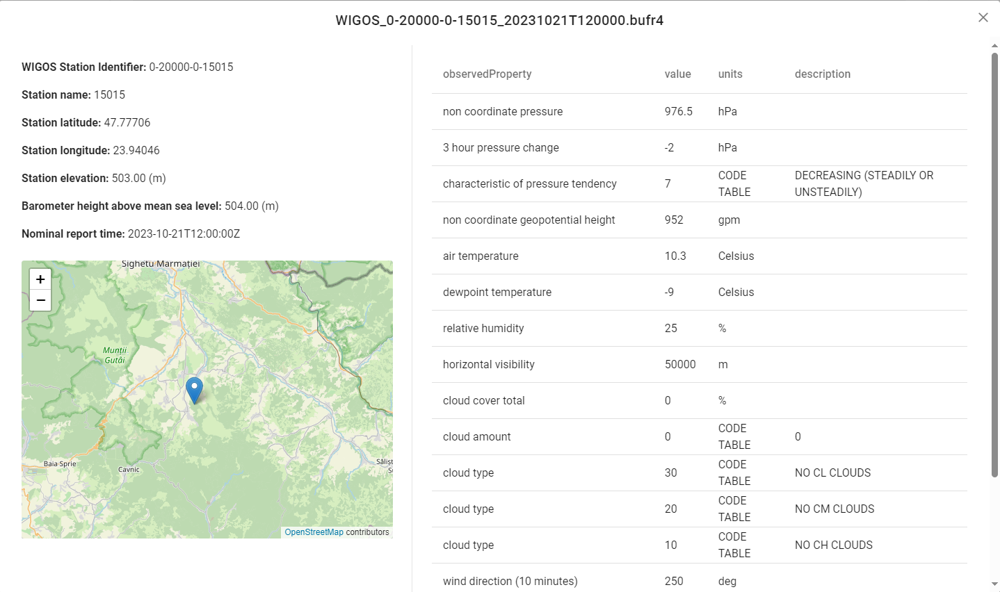

# Conversione dei dati SYNOP in BUFR tramite wis2box-webapp

!!! abstract "Risultati dell'apprendimento"
    Al termine di questa sessione pratica, sarai in grado di:

    - inviare bollettini SYNOP FM-12 validi tramite l'applicazione web wis2box per la conversione in BUFR e lo scambio tramite WIS2.0
    - validare, diagnosticare e correggere errori di codifica semplici in un bollettino SYNOP FM-12 prima della conversione del formato e dello scambio
    - assicurare che i metadati della stazione richiesti siano disponibili in wis2box
    - confermare e ispezionare i bollettini convertiti con successo

## Introduzione

Per permettere agli osservatori manuali di inviare dati direttamente a WIS2.0, la wis2box-webapp include un modulo per convertire i bollettini SYNOP FM-12 in BUFR. Il modulo permette anche agli utenti di diagnosticare e correggere errori di codifica semplici nel bollettino SYNOP FM-12 prima della conversione del formato e dello scambio e di ispezionare i dati BUFR risultanti.

## Preparazione

!!! warning "Prerequisiti"

    - Assicurati che il tuo wis2box sia stato configurato e avviato.
    - Apri un terminale e connettiti alla tua VM studente tramite SSH.
    - Connettiti al broker MQTT della tua istanza wis2box usando MQTT Explorer.
    - Apri l'applicazione web wis2box (``http://<il-tuo-nome-host>/wis2box-webapp``) e assicurati di essere loggato.

## Utilizzo della wis2box-webapp per convertire SYNOP FM-12 in BUFR

### Esercizio 1 - utilizzo della wis2box-webapp per convertire SYNOP FM-12 in BUFR

Assicurati di avere il token di autenticazione per "processes/wis2box" che hai generato nell'esercizio precedente e che sei connesso al broker wis2box in MQTT Explorer.

Copia il seguente messaggio:
    
``` {.copy}
AAXX 27031
15015 02999 02501 10103 21090 39765 42952 57020 60001=
``` 

Apri l'applicazione web wis2box e naviga alla pagina synop2bufr usando il menu di navigazione a sinistra e procedi come segue:

- Incolla il contenuto che hai copiato nella casella di testo.
- Seleziona il mese e l'anno usando il selettore di date, assumendo il mese corrente per questo esercizio.
- Seleziona un argomento dal menu a tendina (le opzioni sono basate sui set di dati configurati in wis2box).
- Inserisci il token di autenticazione "processes/wis2box" che hai generato in precedenza
- Assicurati che l'opzione "Pubblica su WIS2" sia attivata
- Clicca "INVIA"

<center></center>

Clicca invia. Riceverai un messaggio di avviso poiché la stazione non è registrata in wis2box. Vai all'editor delle stazioni e importa la seguente stazione:

``` {.copy}
0-20000-0-15015
```

Assicurati che la stazione sia associata all'argomento che hai selezionato nel passaggio precedente e poi torna alla pagina synop2bufr e ripeti il processo con gli stessi dati di prima.

!!! question
    Come puoi vedere il risultato della conversione da SYNOP FM-12 a BUFR?

??? success "Clicca per scoprire la risposta"
    La sezione dei risultati della pagina mostra Avvisi, Errori e file BUFR di output.

    Clicca su "File BUFR di output" per vedere un elenco dei file che sono stati generati. Dovresti vedere un file nell'elenco.

    Il pulsante di download permette di scaricare i dati BUFR direttamente sul tuo computer.

    Il pulsante di ispezione avvia un processo per convertire ed estrarre i dati da BUFR.

    <center></center>

!!! question
    I dati di input SYNOP FM-12 non includevano la posizione della stazione, l'altitudine o l'altezza del barometro.
    Conferma che questi siano nei dati BUFR di output, da dove provengono?

??? success "Clicca per scoprire la risposta"
    Cliccando il pulsante di ispezione dovrebbe apparire un dialogo come quello mostrato sotto.

    <center></center>

    Questo include la posizione della stazione mostrata su una mappa e i metadati di base, così come le osservazioni nel messaggio.
    
    Come parte della trasformazione da SYNOP FM-12 a BUFR, metadati aggiuntivi sono stati aggiunti al file BUFR.
    
    Il file BUFR può anche essere ispezionato scaricando il file e validandolo usando uno strumento come il validatore BUFR di ECMWF ecCodes.

Vai a MQTT Explorer e controlla il topic delle notifiche WIS2 per vedere le notifiche WIS2 che sono state pubblicate.

### Esercizio 2 - comprensione della lista delle stazioni

Per questo prossimo esercizio convertirai un file contenente più rapporti, vedi i dati qui sotto:

``` {.copy}
AAXX 27031
15015 02999 02501 10103 21090 39765 42952 57020 60001=
15020 02997 23104 10130 21075 30177 40377 58020 60001 81041=
15090 02997 53102 10139 21075 30271 40364 58031 60001 82046=
```

!!! question
    Basandoti sull'esercizio precedente, guarda il messaggio SYNOP FM-12 e prevedi quanti messaggi BUFR
    verranno generati.
    
    Ora copia e incolla questo messaggio nel modulo SYNOP e invia i dati.

    Il numero di messaggi generati corrisponde alle tue aspettative e se no, perché?

??? warning "Clicca per scoprire la risposta"
    
    Potresti aver previsto che venissero generati tre messaggi BUFR, uno per ogni rapporto meteorologico. Tuttavia, invece hai ottenuto 2 avvisi e solo un file BUFR.
    
    Affinché un rapporto meteorologico sia convertito in BUFR, i metadati di base contenuti nella 
    lista delle stazioni sono necessari. Mentre l'esempio sopra include tre rapporti meteorologici, due delle
    tre stazioni che riportano non erano registrate nel tuo wis2box. 
    
    Di conseguenza, solo uno dei tre rapporti meteorologici ha risultato in un file BUFR generato e una notifica WIS2 pubblicata. Gli altri due rapporti meteorologici sono stati ignorati e sono stati generati avvisi.

!!! hint
    Prendi nota della relazione tra l'Identificatore WIGOS e l'identificatore della stazione tradizionale incluso nell'output BUFR. In molti casi, per le stazioni elencate nel WMO-No. 9
    Volume A al momento della migrazione agli identificatori delle stazioni WIGOS, l'identificatore della stazione WIGOS è dato dall'identificatore della stazione tradizionale con ``0-20000-0`` prepended,
    ad esempio ``15015`` è diventato ``0-20000-0-15015``.

Utilizzando la pagina della lista delle stazioni, importa le seguenti stazioni:

``` {.copy}
0-20000-0-15020
0-20000-0-15090
```

Assicurati che le stazioni siano associate all'argomento che hai selezionato nell'esercizio precedente e poi torna alla pagina synop2bufr e ripeti il processo.

Ora dovrebbero essere generati tre file BUFR e non dovrebbero esserci avvisi o errori elencati nell'applicazione web.

Oltre alle informazioni di base sulla stazione, sono necessari metadati aggiuntivi come l'elevazione della stazione sul livello del mare e l'altezza del barometro sul livello del mare per la codifica in BUFR. I campi sono inclusi nelle pagine della lista delle stazioni e dell'editor delle stazioni.
    
### Esercizio 3 - debugging

In questo esercizio finale identificherai e correggerai due dei problemi più comuni incontrati quando
usi questo strumento per convertire SYNOP FM-12 in BUFR. 

I dati di esempio sono mostrati nel riquadro qui sotto, esamina i dati e cerca di risolvere eventuali problemi che ci 
potrebbero essere prima di inviare i dati tramite l'applicazione web. 

!!! hint
    Puoi modificare i dati nella casella di inserimento sulla pagina dell'applicazione web. Se ti perdi qualche problema 
    questi dovrebbero essere rilevati e evidenziati come un avviso o un errore una volta premuto il pulsante di invio.

``` {.copy}
AAXX 27031
15015 02999 02501 10103 21090 39765 42952 57020 60001
15020 02997 23104 10130 21075 30177 40377 58020 60001 81041=
15090 02997 53102 10139 21075 30271 40364 58031 60001 82046=
```

!!! question
    Quali problemi ti aspettavi di incontrare nella conversione dei dati in BUFR e come li hai
    superati? Ci sono stati problemi che non ti aspettavi?

??? success "Clicca per scoprire la risposta"
    Nel primo esempio manca il simbolo di "fine del testo" (=), o delimitatore di record, tra il
    primo e il secondo rapporto meteorologico. Di conseguenza, le linee 2 e 3 sono trattate come un unico rapporto, 
    portando a errori nell'analisi del messaggio.

Il secondo esempio qui sotto contiene diversi problemi comuni trovati nei rapporti SYNOP FM-12. Esamina i
dati e cerca di identificare i problemi e poi invia i dati corretti tramite l'applicazione web.

```{.copy}
AAXX 27031
15020 02997 23104 10/30 21075 30177 40377 580200 60001 81041=
```

!!! question
    Quali problemi hai trovato e come li hai risolti?

??? success "Clicca per scoprire la risposta"
    Ci sono due problemi nel rapporto meteorologico. 
    
    Il primo, nel gruppo della temperatura dell'aria firmata, ha il carattere delle decine impostato su mancante (/), 
    portando a un gruppo non valido. In questo esempio sappiamo che la temperatura è di 13,0 gradi 
    Celsius (dagli esempi sopra) e quindi questo problema può essere corretto. Operativamente, il 
    valore corretto dovrebbe essere confermato con l'osservatore.

    Il secondo problema si verifica nel gruppo 5 dove c'è un carattere aggiuntivo, con l'ultimo 
    carattere duplicato. Questo problema può essere risolto rimuovendo il carattere extra.

## Pulizia

Durante gli esercizi in questa sessione avrai importato diversi file nella tua lista delle stazioni. Naviga alla 
pagina della lista delle stazioni e clicca sulle icone del cestino per eliminare le stazioni. Potrebbe essere necessario aggiornare la pagina per rimuovere le stazioni dalla lista dopo averle eliminate.

<center></center>

## Conclusione

!!! success "Congratulazioni!"

    In questa sessione pratica, hai imparato:

    - come lo strumento synop2bufr può essere utilizzato per convertire i rapporti SYNOP FM-12 in BUFR;
    - come inviare un rapporto SYNOP FM-12 tramite l'app web;
    - come diagnosticare e correggere errori semplici in un rapporto SYNOP FM-12;
    - l'importanza di registrare le stazioni in wis2box (e OSCAR/Surface);
    - e l'uso del pulsante di ispezione per visualizzare il contenuto dei dati BUFR.
