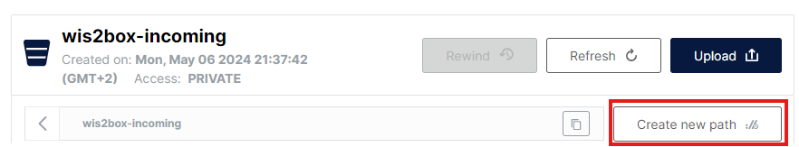

# Modelli di mappatura da CSV a BUFR

!!! abstract "Risultati dell'apprendimento"
    Al termine di questa sessione pratica, sarai in grado di:

    - creare un nuovo modello di mappatura BUFR per i tuoi dati CSV
    - modificare e correggere il tuo modello di mappatura BUFR personalizzato dalla riga di comando
    - configurare il plugin di dati CSV-to-BUFR per utilizzare un modello di mappatura BUFR personalizzato
    - utilizzare i modelli integrati AWS e DAYCLI per convertire i dati CSV in BUFR

## Introduzione

I file di dati con valori separati da virgola (CSV) sono spesso utilizzati per registrare dati osservativi e altri dati in un formato tabellare.
La maggior parte dei registratori di dati utilizzati per registrare l'output dei sensori è in grado di esportare le osservazioni in file delimitati, inclusi in CSV.
Allo stesso modo, quando i dati vengono inseriti in un database è facile esportare i dati richiesti in file formattati CSV.

Il modulo csv2bufr di wis2box fornisce uno strumento da riga di comando per convertire i dati CSV in formato BUFR. Quando utilizzi csv2bufr devi fornire un modello di mappatura BUFR che mappa le colonne CSV agli elementi BUFR corrispondenti. Se non vuoi creare il tuo modello di mappatura, puoi utilizzare i modelli integrati AWS e DAYCLI per convertire i dati CSV in BUFR, ma dovrai assicurarti che i dati CSV che stai utilizzando siano nel formato corretto per questi modelli. Se desideri decodificare parametri che non sono inclusi nei modelli AWS e DAYCLI, dovrai creare il tuo modello di mappatura.

In questa sessione imparerai come creare il tuo modello di mappatura per convertire i dati CSV in BUFR. Imparerai anche come utilizzare i modelli integrati AWS e DAYCLI per convertire i dati CSV in BUFR.

## Preparazione

Assicurati che lo stack wis2box sia stato avviato con `python3 wis2box.py start`

Assicurati di avere un browser web aperto con l'interfaccia utente MinIO per la tua istanza accedendo a `http://YOUR-HOST:9000`
Se non ricordi le tue credenziali MinIO, puoi trovarle nel file `wis2box.env` nella directory `wis2box` sulla tua VM studente.

Assicurati di avere MQTT Explorer aperto e connesso al tuo broker utilizzando le credenziali `everyone/everyone`.

## Creazione di un modello di mappatura

Il modulo csv2bufr viene fornito con uno strumento da riga di comando per creare il tuo modello di mappatura utilizzando un insieme di sequenze BUFR e/o elementi BUFR come input.

Per trovare specifiche sequenze ed elementi BUFR puoi fare riferimento alle tabelle BUFR su [https://confluence.ecmwf.int/display/ECC/BUFR+tables](https://confluence.ecmwf.int/display/ECC/BUFR+tables).

### Strumento da riga di comando csv2bufr mappings

Per accedere allo strumento da riga di comando csv2bufr, devi effettuare il login nel contenitore wis2box-api:

```bash
cd ~/wis2box
python3 wis2box-ctl.py login wis2box-api
```

Per stampare la pagina di aiuto per il comando `csv2bufr mapping`:

```bash
csv2bufr mappings --help
```

La pagina di aiuto mostra 2 sottocomandi:

- `csv2bufr mappings create` : Crea un nuovo modello di mappatura
- `csv2bufr mappings list` : Elenca i modelli di mappatura disponibili nel sistema

!!! Note "csv2bufr mapping list"

    Il comando `csv2bufr mapping list` ti mostrerà i modelli di mappatura disponibili nel sistema.
    I modelli predefiniti sono memorizzati nella directory `/opt/wis2box/csv2bufr/templates` nel contenitore.

    Per condividere modelli di mappatura personalizzati con il sistema puoi memorizzarli nella directory definita da `$CSV2BUFR_TEMPLATES`, che è impostata su `/data/wis2box/mappings` per impostazione predefinita nel contenitore. Poiché la directory `/data/wis2box/mappings` nel contenitore è montata sulla directory `$WIS2BOX_HOST_DATADIR/mappings` sull'host, troverai i tuoi modelli di mappatura personalizzati nella directory `$WIS2BOX_HOST_DATADIR/mappings` sull'host.

Proviamo a creare un nuovo modello di mappatura personalizzato utilizzando il comando `csv2bufr mapping create` usando come input la sequenza BUFR 301150 più l'elemento BUFR 012101.

```bash
csv2bufr mappings create 301150 012101 --output /data/wis2box/mappings/my_custom_template.json
```

Puoi controllare il contenuto del modello di mappatura che hai appena creato utilizzando il comando `cat`:

```bash
cat /data/wis2box/mappings/my_custom_template.json
```

!!! question "Ispezione del modello di mappatura"

    Quante colonne CSV vengono mappate agli elementi BUFR? Qual è l'intestazione CSV per ogni elemento BUFR mappato?

??? success "Clicca per rivelare la risposta"
    
    Il modello di mappatura che hai creato mappa **5** colonne CSV agli elementi BUFR, ovvero i 4 elementi BUFR nella sequenza 301150 più l'elemento BUFR 012101. 

    Le seguenti colonne CSV vengono mappate agli elementi BUFR:

    - **wigosIdentifierSeries** mappa a `"eccodes_key": "#1#wigosIdentifierSeries"` (elemento BUFR 001125)
    - **wigosIssuerOfIdentifier** mappa a `"eccodes_key": "#1#wigosIssuerOfIdentifier` (elemento BUFR 001126)
    - **wigosIssueNumber** mappa a `"eccodes_key": "#1#wigosIssueNumber"` (elemento BUFR 001127)
    - **wigosLocalIdentifierCharacter** mappa a `"eccodes_key": "#1#wigosLocalIdentifierCharacter"` (elemento BUFR 001128)
    - **airTemperature** mappa a `"eccodes_key": "#1#airTemperature"` (elemento BUFR 012101)

Il modello di mappatura che hai creato non include importanti metadati riguardanti l'osservazione effettuata, la data e l'ora dell'osservazione e la latitudine e longitudine della stazione.

Successivamente aggiorneremo il modello di mappatura e aggiungeremo le seguenti sequenze :
    
- **301011** per la Data (Anno, mese, giorno)
- **301012** per l'Ora (Ora, minuto)
- **301023** per la Località (Latitudine/longitudine (accuratezza grossolana))

E i seguenti elementi :

- **010004** per la Pressione
- **007031** per l'Altezza del barometro sul livello medio del mare

Esegui il seguente comando per aggiornare il modello di mappatura:

```bash
csv2bufr mappings create 301150 301011 301012 301023 007031 012101 010004  --output /data/wis2box/mappings/my_custom_template.json
```

E ispeziona nuovamente il contenuto del modello di mappatura:

```bash
cat /data/wis2box/mappings/my_custom_template.json
```

!!! question "Ispezione del modello di mappatura aggiornato"

    Quante colonne CSV vengono ora mappate agli elementi BUFR? Qual è l'intestazione CSV per ogni elemento BUFR mappato?

??? success "Clicca per rivelare la risposta"
    
    Il modello di mappatura che hai creato ora mappa **18** colonne CSV agli elementi BUFR:
    - 4 elementi BUFR dalla sequenza BUFR 301150
    - 3 elementi BUFR dalla sequenza BUFR 301011
    - 2 elementi BUFR dalla sequenza BUFR 301012
    - 2 elementi BUFR dalla sequenza BUFR 301023
    - elemento BUFR 007031
    - elemento BUFR 012101

    Le seguenti colonne CSV vengono mappate agli elementi BUFR:

    - **wigosIdentifierSeries** mappa a `"eccodes_key": "#1#wigosIdentifierSeries"` (elemento BUFR 001125)
    - **wigosIssuerOfIdentifier** mappa a `"eccodes_key": "#1#wigosIssuerOfIdentifier` (elemento BUFR 001126)
    - **wigosIssueNumber** mappa a `"eccodes_key": "#1#wigosIssueNumber"` (elemento BUFR 001127)
    - **wigosLocalIdentifierCharacter** mappa a `"eccodes_key": "#1#wigosLocalIdentifierCharacter"` (elemento BUFR 001128)
    - **year** mappa a `"eccodes_key": "#1#year"` (elemento BUFR 004001)
    - **month** mappa a `"eccodes_key": "#1#month"` (elemento BUFR 004002)
    - **day** mappa a `"eccodes_key": "#1#day"` (elemento BUFR 004003)
    - **hour** mappa a `"eccodes_key": "#1#hour"` (elemento BUFR 004004)
    - **minute** mappa a `"eccodes_key": "#1#minute"` (elemento BUFR 004005)
    - **latitude** mappa a `"eccodes_key": "#1#latitude"` (elemento BUFR 005002)
    - **longitude** mappa a `"eccodes_key": "#1#longitude"` (elemento BUFR 006002)
    - **heightOfBarometerAboveMeanSeaLevel"** mappa a `"eccodes_key": "#1#heightOfBarometerAboveMeanSeaLevel"` (elemento BUFR 007031)
    - **airTemperature** mappa a `"eccodes_key": "#1#airTemperature"` (elemento BUFR 012101)
    - **nonCoordinatePressure** mappa a `"eccodes_key": "#1#nonCoordinatePressure"` (elemento BUFR 010004)

Controlla il contenuto del file `custom_template_data.csv` nella directory `/root/data-conversion-exercises`:

```bash
cat /root/data-conversion-exercises/custom_template_data.csv
```

Nota che le intestazioni di questo file CSV sono le stesse delle intestazioni CSV nel modello di mappatura che hai creato.

Per testare la conversione dei dati possiamo utilizzare lo strumento da riga di comando `csv2bufr` per convertire il file CSV in BUFR utilizzando il modello di mappatura che abbiamo creato:

```bash
csv2bufr data transform --bufr-template my_custom_template /root/data-conversion-exercises/custom_template_data.csv
```

Dovresti vedere il seguente output:

```bash
CLI:    ... Transforming /root/data-conversion-exercises/custom_template_data.csv to BUFR ...
CLI:    ... Processing subsets:
CLI:    ..... 94 bytes written to ./WIGOS_0-20000-0-15015_20250412T210000.bufr4
CLI:    End of processing, exiting.
```

!!! question "Verifica il contenuto del file BUFR"
    
    Come puoi verificare il contenuto del file BUFR che hai appena creato e verificare che abbia codificato i dati correttamente?

??? success "Clicca per rivelare la risposta"

    Puoi utilizzare il comando `bufr_dump -p` per verificare il contenuto del file BUFR che hai appena creato.
    Il comando ti mostrerà il contenuto del file BUFR in un formato leggibile dall'uomo.

    ```bash
    bufr_dump -p ./WIGOS_0-20000-0-15015_20250412T210000.bufr4
    ```

    Nell'output vedrai i valori per gli elementi BUFR che hai mappato nel modello, per esempio la "airTemperature" mostrerà:
    
    ```bash
    airTemperature=298.15
    ```

Ora puoi uscire dal contenitore:

```bash
exit
```

### Utilizzo del modello di mappatura nel wis2box

Per assicurarti che il nuovo modello di mappatura sia riconosciuto dal contenitore wis2box-api, devi riavviare il contenitore:

```bash
docker restart wis2box-api
```

Ora puoi configurare il tuo dataset nel wis2box-webapp per utilizzare il modello di mappatura personalizzato per il plugin di conversione CSV to BUFR.

Il wis2box-webapp rileverà automaticamente il modello di mappatura che hai creato e lo renderà disponibile nell'elenco dei modelli per il plugin di conversione CSV to BUFR.

Clicca sul dataset che hai creato nella sessione pratica precedente e clicca su "AGGIORNA" accanto al plugin con nome "Dati CSV convertiti in BUFR":


Dovresti vedere il nuovo modello che hai creato nell'elenco dei modelli disponibili:


!!! hint

    Nota che se non vedi il nuovo modello che hai creato, prova a ricaricare la pagina o ad aprirla in una nuova finestra in incognito.

Per ora mantieni la selezione predefinita del modello AWS (clicca in alto a destra per chiudere la configurazione del plugin).

## Utilizzo del modello 'AWS'

Il modello 'AWS' fornisce un modello di mappatura per convertire i dati CSV in sequenza BUFR 301150, 307096, a supporto dei requisiti minimi GBON.

La descrizione del modello AWS può essere trovata qui [aws-template](./../csv2bufr-templates/aws-template.md).

### Revisione dei dati di input dell'esempio aws

Scarica l'esempio per questo esercizio dal link sottostante:

[aws-example.csv](./../../sample-data/aws-example.csv)

Apri il file che hai scaricato in un editor e ispeziona il contenuto:

!!! question
    Esaminando i campi data, ora e identità (identificatori WIGOS e tradizionali) cosa noti?
    Come sarebbe rappresentata la data di oggi?

??? success "Clicca per rivelare la risposta"
    Ogni colonna contiene un singolo pezzo di informazione. Ad esempio, la data è suddivisa in
    anno, mese e giorno, riflettendo come i dati sono memorizzati in BUFR. La data di oggi sarebbe 
    suddivisa tra le colonne "anno", "mese" e "giorno". Analogamente, l'ora deve essere
    suddivisa in "ora" e "minuto" e l'identificatore della stazione WIGOS nei suoi rispettivi componenti.

!!! question
    Guardando il file di dati come sono codificati i dati mancanti?
    
??? success "Clicca per rivelare la risposta"
    I dati mancanti nel file sono rappresentati da celle vuote. In un file CSV questo sarebbe
    codificato da ``,,``. Nota che si tratta di una cella vuota e non di una stringa di lunghezza zero, 
    ad esempio ``,"",``.

!!! hint "Dati mancanti"
    Si riconosce che i dati possono mancare per vari motivi, sia a causa di un guasto del sensore sia perché il parametro non è stato osservato. In questi casi i dati mancanti possono essere codificati
    come nella risposta sopra, gli altri dati nel rapporto rimangono validi.

### Aggiorna il file di esempio

Aggiorna il file di esempio che hai scaricato per utilizzare la data e l'ora odierne e cambia gli identificatori delle stazioni WIGOS per utilizzare le stazioni che hai registrato nella wis2box-webapp.

### Carica i dati su MinIO e controlla il risultato

Naviga nell'interfaccia utente di MinIO e accedi utilizzando le credenziali del file `wis2box.env`.

Naviga fino a **wis2box-incoming** e clicca sul pulsante "Crea nuovo percorso":



Crea una nuova cartella nel bucket MinIO che corrisponda all'id del dataset per il dataset che hai creato con il template='weather/surface-weather-observations/synop':


Carica il file di esempio che hai scaricato nella cartella che hai creato nel bucket MinIO:


Controlla la dashboard di Grafana all'indirizzo `http://YOUR-HOST:3000` per vedere se ci sono AVVISI o ERRORI. Se ne vedi, prova a risolverli e ripeti l'esercizio.

Controlla MQTT Explorer per vedere se ricevi notifiche di dati WIS2.

Se hai inserito correttamente i dati dovresti vedere 3 notifiche in MQTT Explorer sull'argomento `origin/a/wis2/<centre-id>/data/weather/surface-weather-observations/synop` per le 3 stazioni per cui hai segnalato i dati:


## Utilizzo del template 'DayCLI'

Il template **DayCLI** fornisce un template di mappatura per convertire i dati CSV climatici giornalieri in sequenza BUFR 307075, a supporto della segnalazione dei dati climatici giornalieri.

La descrizione del template DAYCLI può essere trovata qui [daycli-template](./../csv2bufr-templates/daycli-template.md).

Per condividere questi dati su WIS2 sarà necessario creare un nuovo dataset nella wis2box-webapp che abbia la corretta Gerarchia degli Argomenti WIS2 e che utilizzi il template DAYCLI per convertire i dati CSV in BUFR.

### Creazione di un dataset wis2box per la pubblicazione dei messaggi DAYCLI

Vai all'editor di dataset nella wis2box-webapp e crea un nuovo dataset. Usa lo stesso centre-id delle sessioni pratiche precedenti e seleziona **Data Type='climate/surface-based-observations/daily'**:


Clicca su "CONTINUA AL MODULO" e aggiungi una descrizione per il tuo dataset, imposta il bounding box e fornisci le informazioni di contatto per il dataset. Una volta completate tutte le sezioni, clicca su 'VALIDA MODULO' e controlla il modulo.

Rivedi i data-plugins per i dataset. Clicca su "AGGIORNA" accanto al plugin con nome "Dati CSV convertiti in BUFR" e vedrai che il template è impostato su **DayCLI**:


Chiudi la configurazione del plugin e invia il modulo utilizzando il token di autenticazione che hai creato nella sessione pratica precedente.

Ora dovresti avere un secondo dataset nella wis2box-webapp configurato per utilizzare il template DAYCLI per convertire i dati CSV in BUFR.

### Revisione dei dati di input dell'esempio daycli

Scarica l'esempio per questo esercizio dal link sottostante:

[daycli-example.csv](./../../sample-data/daycli-example.csv)

Apri il file che hai scaricato in un editor e ispeziona il contenuto:

!!! question
    Quali variabili aggiuntive sono incluse nel template daycli?

??? success "Clicca per rivelare la risposta"
    Il template daycli include importanti metadati sulla posizione degli strumenti e sulle classificazioni della qualità delle misurazioni per temperatura e umidità, flag di controllo della qualità e informazioni su come è stata calcolata la temperatura media giornaliera.

### Aggiorna il file di esempio

Il file di esempio contiene una riga di dati per ogni giorno di un mese e segnala i dati per una stazione. Aggiorna il file di esempio che hai scaricato per utilizzare la data e l'ora odierne e cambia gli identificatori delle stazioni WIGOS per utilizzare una stazione che hai registrato nella wis2box-webapp.

### Carica i dati su MinIO e controlla il risultato

Come prima, dovrai caricare i dati nel bucket 'wis2box-incoming' in MinIO per essere processati dal convertitore csv2bufr. Questa volta dovrai creare una nuova cartella nel bucket MinIO che corrisponda all'id del dataset per il dataset che hai creato con il template='climate/surface-based-observations/daily' che sarà diverso dall'id del dataset che hai usato nell'esercizio precedente:


Dopo aver caricato i dati controlla che non ci siano AVVISI o ERRORI nella dashboard di Grafana e controlla MQTT Explorer per vedere se ricevi notifiche di dati WIS2.

Se hai inserito correttamente i dati dovresti vedere 30 notifiche in MQTT Explorer sull'argomento `origin/a/wis2/<centre-id>/data/climate/surface-based-observations/daily` per i 30 giorni del mese per cui hai segnalato i dati:


## Conclusione

!!! success "Congratulazioni"
    In questa sessione pratica hai imparato:

    - come creare un template di mappatura personalizzato per convertire i dati CSV in BUFR
    - come utilizzare i template integrati AWS e DAYCLI per convertire i dati CSV in BUFR