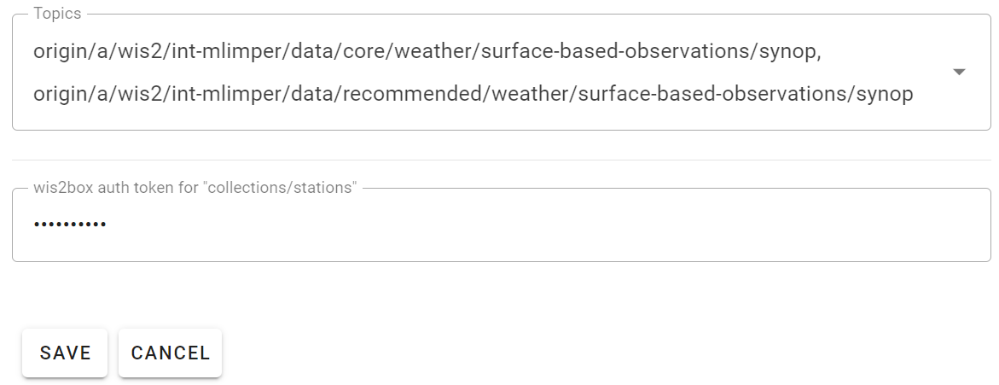

# Configurazione di un dataset consigliato con controllo degli accessi

!!! abstract "Risultati di apprendimento"
    Al termine di questa sessione pratica, sarai in grado di:

    - creare un nuovo dataset con politica dei dati 'consigliato'
    - aggiungere un token di accesso al dataset
    - validare che il dataset non possa essere accessibile senza il token di accesso
    - aggiungere il token di accesso agli header HTTP per accedere al dataset

## Introduzione

I dataset che non sono considerati 'core' nell'ambito WMO possono essere configurati opzionalmente con una politica di controllo degli accessi. wis2box fornisce un meccanismo per aggiungere un token di accesso a un dataset che impedirà agli utenti di scaricare dati a meno che non forniscano il token di accesso negli header HTTP.

## Preparazione

Assicurati di avere accesso SSH alla tua VM studente e che la tua istanza wis2box sia attiva e funzionante.

Assicurati di essere connesso al broker MQTT della tua istanza wis2box utilizzando MQTT Explorer. Puoi utilizzare le credenziali pubbliche `everyone/everyone` per connetterti al broker.

Assicurati di avere un browser web aperto con il wis2box-webapp per la tua istanza accedendo a `http://YOUR-HOST/wis2box-webapp`.

## Crea un nuovo dataset con politica dei dati 'consigliato'

Vai alla pagina 'editor di dataset' nel wis2box-webapp e crea un nuovo dataset. Seleziona il Data Type = 'weather/surface-weather-observations/synop'.


Per "Centre ID", utilizza lo stesso che hai usato nelle sessioni pratiche precedenti.

Clicca su 'CONTINUE To FORM' per procedere.

Nell'editor di dataset, imposta la politica dei dati su 'consigliato' (nota che cambiare la politica dei dati aggiornerà la 'Gerarchia degli Argomenti').
Sostituisci l'ID locale generato automaticamente con un nome descrittivo per il dataset, ad esempio 'recommended-data-with-access-control':


Continua a compilare i campi richiesti per le Proprietà Spaziali e le Informazioni di Contatto, e 'Valida il modulo' per controllare eventuali errori.

Infine, invia il dataset, utilizzando il token di autenticazione creato in precedenza, e verifica che il nuovo dataset sia creato nel wis2box-webapp.

Controlla MQTT-explorer per vedere che ricevi il Messaggio di Notifica WIS2 che annuncia il nuovo record di Metadati di Scoperta sul topic `origin/a/wis2/<your-centre-id>/metadata`.

## Aggiungi un token di accesso al dataset

Accedi al container wis2box-management,

```bash
cd ~/wis2box
python3 wis2box-ctl.py login
```

Dalla linea di comando all'interno del container puoi proteggere un dataset utilizzando il comando `wis2box auth add-token`, usando il flag `--metadata-id` per specificare l'identificatore dei metadati del dataset e il token di accesso come argomento.

Ad esempio, per aggiungere il token di accesso `S3cr3tT0k3n` al dataset con identificatore dei metadati `urn:wmo:md:not-my-centre:core.surface-based-observations.synop`:

```bash
wis2box auth add-token --metadata-id urn:wmo:md:not-my-centre:reco.surface-based-observations.synop S3cr3tT0k3n
```

Esci dal container wis2box-management:

```bash
exit
```

## Pubblica alcuni dati nel dataset

Copia il file `exercise-materials/access-control-exercises/aws-example.csv` nella directory definita da `WIS2BOX_HOST_DATADIR` nel tuo `wis2box.env`:

```bash
cp ~/exercise-materials/access-control-exercises/aws-example.csv ~/wis2box-data
```

Quindi usa WinSCP o un editor da linea di comando per modificare il file `aws-example.csv` e aggiornare gli identificatori delle stazioni WIGOS nei dati di input per corrispondere alle stazioni che hai nella tua istanza wis2box.

Successivamente, vai all'editor di stazioni nel wis2box-webapp. Per ogni stazione che hai usato in `aws-example.csv`, aggiorna il campo 'topic' per corrispondere al 'topic' del dataset che hai creato nell'esercizio precedente.

Questa stazione sarà ora associata a 2 topic, uno per il dataset 'core' e uno per il dataset 'consigliato':



Dovrai utilizzare il tuo token per `collections/stations` per salvare i dati della stazione aggiornati.

Successivamente, accedi al container wis2box-management:

```bash
cd ~/wis2box
python3 wis2box-ctl.py login
```

Dalla linea di comando wis2box possiamo ingerire il file di dati di esempio `aws-example.csv` in un dataset specifico come segue:

```bash
wis2box data ingest -p /data/wis2box/aws-example.csv --metadata-id urn:wmo:md:not-my-centre:reco.surface-based-observations.synop
```

Assicurati di fornire l'identificatore dei metadati corretto per il tuo dataset e **verifica di ricevere notifiche di dati WIS2 in MQTT Explorer**, sul topic `origin/a/wis2/<your-centre-id>/data/recommended/surface-based-observations/synop`.

Controlla il link canonico nel Messaggio di Notifica WIS2 e copia/incolla il link nel browser per provare a scaricare i dati.

Dovresti vedere un errore 403 Forbidden.

## Aggiungi il token di accesso agli header HTTP per accedere al dataset

Per dimostrare che il token di accesso è necessario per accedere al dataset riprodurremo l'errore che hai visto nel browser utilizzando la funzione da linea di comando `wget`.

Dalla linea di comando nella tua VM studente, usa il comando `wget` con il link canonico che hai copiato dal Messaggio di Notifica WIS2.

```bash
wget <canonical-link>
```

Dovresti vedere che la richiesta HTTP ritorna con *401 Unauthorized* e i dati non vengono scaricati.

Ora aggiungi il token di accesso agli header HTTP per accedere al dataset.

```bash
wget --header="Authorization: Bearer S3cr3tT0k3n" <canonical-link>
```

Ora i dati dovrebbero essere scaricati con successo.

## Conclusione

!!! success "Congratulazioni!"
    In questa sessione pratica, hai imparato come:

    - creare un nuovo dataset con politica dei dati 'consigliato'
    - aggiungere un token di accesso al dataset
    - validare che il dataset non possa essere accessibile senza il token di accesso
    - aggiungere il token di accesso agli header HTTP per accedere al dataset