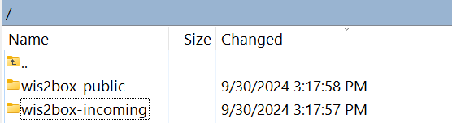

# Ingestione dei dati per la pubblicazione

!!! abstract "Risultati dell'apprendimento"

    Al termine di questa sessione pratica, sarai in grado di:
    
    - Attivare il flusso di lavoro wis2box caricando dati su MinIO tramite la riga di comando, l'interfaccia web di MinIO, SFTP o uno script Python.
    - Accedere al dashboard di Grafana per monitorare lo stato dell'ingestione dei dati e visualizzare i log della tua istanza wis2box.
    - Visualizzare le notifiche dei dati WIS2 pubblicate dalla tua wis2box utilizzando MQTT Explorer.

## Introduzione

In WIS2, i dati vengono condivisi in tempo reale utilizzando notifiche di dati WIS2 che contengono un link "canonico" da cui i dati possono essere scaricati.

Per attivare il flusso di lavoro dei dati in un WIS2 Node utilizzando il software wis2box, i dati devono essere caricati nel bucket **wis2box-incoming** in **MinIO**, che avvia il flusso di lavoro wis2box. Questo processo porta alla pubblicazione dei dati tramite una notifica di dati WIS2. A seconda delle mappature dei dati configurate nella tua istanza wis2box, i dati possono essere trasformati in formato BUFR prima di essere pubblicati.

In questo esercizio, utilizzeremo file di dati di esempio per attivare il flusso di lavoro wis2box e **pubblicare notifiche di dati WIS2** per il dataset che hai configurato nella sessione pratica precedente.

Durante l'esercizio, monitoreremo lo stato dell'ingestione dei dati utilizzando il **dashboard di Grafana** e **MQTT Explorer**. Il dashboard di Grafana utilizza dati da Prometheus e Loki per visualizzare lo stato del tuo wis2box, mentre MQTT Explorer ti permette di vedere le notifiche di dati WIS2 pubblicate dalla tua istanza wis2box.

Nota che wis2box trasformerà i dati di esempio in formato BUFR prima di pubblicarli sul broker MQTT, come preconfigurato nelle mappature dei dati del tuo dataset. Per questo esercizio, ci concentreremo sui diversi metodi per caricare dati sulla tua istanza wis2box e verificare l'ingestione e la pubblicazione con successo. La trasformazione dei dati sarà trattata più avanti nella sessione pratica [Strumenti di Conversione dei Dati](./data-conversion-tools).

## Preparazione

Questa sezione utilizza il dataset per "surface-based-observations/synop" precedentemente creato nella sessione pratica [Configurazione dei Dataset in wis2box](./configuring-wis2box-datasets). È inoltre necessaria la conoscenza della configurazione delle stazioni in **wis2box-webapp**, come descritto nella sessione pratica [Configurazione dei Metadati delle Stazioni](./configuring-station-metadata).

Assicurati di poter accedere alla tua VM studente utilizzando il tuo client SSH (ad es., PuTTY).

Assicurati che wis2box sia attivo e funzionante:

```bash
cd ~/wis2box/
python3 wis2box-ctl.py start
python3 wis2box-ctl.py status
```

Assicurati che MQTT Explorer sia in esecuzione e connesso alla tua istanza utilizzando le credenziali pubbliche `everyone/everyone` con una sottoscrizione al topic `origin/a/wis2/#`.

Assicurati di avere un browser web aperto con il dashboard di Grafana per la tua istanza navigando a `http://YOUR-HOST:3000`.

### Prepara i Dati di Esempio

Copia la directory `exercise-materials/data-ingest-exercises` nella directory che hai definito come `WIS2BOX_HOST_DATADIR` nel tuo file `wis2box.env`:

```bash
cp -r ~/exercise-materials/data-ingest-exercises ~/wis2box-data/
```

!!! note
    Il `WIS2BOX_HOST_DATADIR` è montato come `/data/wis2box/` all'interno del container wis2box-management dal file `docker-compose.yml` incluso nella directory `wis2box`.
    
    Questo ti permette di condividere dati tra l'host e il container.

### Aggiungi la Stazione di Test

Aggiungi la stazione con l'identificatore WIGOS `0-20000-0-64400` alla tua istanza wis2box utilizzando l'editor di stazioni in wis2box-webapp.

Recupera la stazione da OSCAR:


Aggiungi la stazione ai dataset che hai creato per la pubblicazione su "../surface-based-observations/synop" e salva le modifiche utilizzando il tuo token di autenticazione:


Nota che puoi rimuovere questa stazione dal tuo dataset dopo la sessione pratica.

## Test dell'Ingestione dei Dati dalla Riga di Comando

In questo esercizio, utilizzeremo il comando `wis2box data ingest` per caricare dati su MinIO.

Assicurati di trovarti nella directory `wis2box` e accedi al container **wis2box-management**:

```bash
cd ~/wis2box
python3 wis2box-ctl.py login
```

Verifica che i seguenti dati di esempio siano disponibili nella directory `/data/wis2box/` all'interno del container **wis2box-management**:

```bash
ls -lh /data/wis2box/data-ingest-exercises/synop_202412030900.txt
```

!!! question "Ingestione dei Dati Utilizzando `wis2box data ingest`"

    Esegui il seguente comando per ingestire il file di dati di esempio nella tua istanza wis2box:

    ```bash
    wis2box data ingest -p /data/wis2box/data-ingest-exercises/synop_202412030900.txt --metadata-id urn:wmo:md:not-my-centre:synop-test
    ```

    I dati sono stati ingestiti con successo? In caso contrario, qual è stato il messaggio di errore e come puoi risolverlo?

??? success "Clicca per Rivelare la Risposta"

    I dati **non** sono stati ingestiti con successo. Dovresti vedere quanto segue:

    ```bash
    Error: metadata_id=urn:wmo:md:not-my-centre:synop-test not found in data mappings
    ```

    Il messaggio di errore indica che l'identificatore dei metadati che hai fornito non corrisponde a nessuno dei dataset che hai configurato nella tua istanza wis2box.

    Fornisci l'ID dei metadati corretto che corrisponde al dataset che hai creato nella sessione pratica precedente e ripeti il comando di ingestione dei dati fino a vedere il seguente output:

    ```bash 
    Processing /data/wis2box/data-ingest-exercises/synop_202412030900.txt
    Done
    ```

Vai alla console MinIO nel tuo browser e controlla se il file `synop_202412030900.txt` è stato caricato nel bucket `wis2box-incoming`. Dovresti vedere una nuova directory con il nome del dataset che hai fornito nell'opzione `--metadata-id`, e all'interno di questa directory, troverai il file `synop_202412030900.txt`:


!!! note
    Il comando `wis2box data ingest` ha caricato il file nel bucket `wis2box-incoming` in MinIO in una directory denominata con l'identificatore dei metadati che hai fornito.

Vai al dashboard di Grafana nel tuo browser e controlla lo stato dell'ingestione dei dati.

!!! question "Verifica lo Stato dell'Ingestione dei Dati su Grafana"
    
    Vai al dashboard di Grafana all'indirizzo **http://your-host:3000** e controlla lo stato dell'ingestione dei dati nel tuo browser.
    
    Come puoi vedere se i dati sono stati ingestiti e pubblicati con successo?

??? success "Clicca per Rivelare la Risposta"
    
    Se hai ingestito i dati con successo, dovresti vedere quanto segue:
    
      
    
    Se non vedi questo, controlla i messaggi di AVVISO o ERRORE visualizzati nella parte inferiore del dashboard e tenta di risolverli.

!!! question "Verifica il Broker MQTT per le Notifiche WIS2"
    
    Vai a MQTT Explorer e controlla se puoi vedere il messaggio di notifica WIS2 per i dati che hai appena ingestito.
    
    Quante notifiche di dati WIS2 sono state pubblicate dalla tua wis2box?
    
    Come accedi al contenuto dei dati pubblicati?

??? success "Clicca per Rivelare la Risposta"

    Dovresti vedere 1 notifica di dati WIS2 pubblicata dalla tua wis2box.

    Per accedere al contenuto dei dati pubblicati, puoi espandere la struttura del topic per vedere i diversi livelli del messaggio fino a raggiungere l'ultimo livello e rivedere il contenuto del messaggio.

    Il contenuto del messaggio ha una sezione "links" con una chiave "rel" di "canonical" e una chiave "href" con l'URL per scaricare i dati. L'URL sarà nel formato `http://YOUR-HOST/data/...`. 
    
    Nota che il formato dei dati è BUFR e avrai bisogno di un parser BUFR per visualizzare il contenuto dei dati. Il formato BUFR è un formato binario utilizzato dai servizi meteorologici per lo scambio di dati. I plugin di dati all'interno di wis2box hanno trasformato i dati in BUFR prima di pubblicarli.

Dopo aver completato questo esercizio, esci dal container **wis2box-management**:

```bash
exit
```

## Caricamento dei Dati Utilizzando l'Interfaccia Web di MinIO

Negli esercizi precedenti, hai caricato dati disponibili sull'host wis2box su MinIO utilizzando il comando `wis2box data ingest`. 

Successivamente, utilizzeremo l'interfaccia web di MinIO, che ti permette di scaricare e caricare dati su MinIO utilizzando un browser web.

!!! question "Ricarica i Dati Utilizzando l'Interfaccia Web di MinIO"

    Vai all'interfaccia web di MinIO nel tuo browser e naviga al bucket `wis2box-incoming`. Vedrai il file `synop_202412030900.txt` che hai caricato negli esercizi precedenti.

    Clicca sul file e avrai l'opzione di scaricarlo:

    

    Puoi scaricare questo file e ricaricarlo nello stesso percorso in MinIO per riattivare il flusso di lavoro wis2box.

    Controlla il dashboard di Grafana e MQTT Explorer per vedere se i dati sono stati ingestiti e pubblicati con successo.

??? success "Clicca per Rivelare la Risposta"

    Vedrai un messaggio che indica che wis2box ha già pubblicato questi dati:

    ```bash
    ERROR - Data already published for WIGOS_0-20000-0-64400_20241203T090000-bufr4; not publishing
    ``` 
    
    Questo dimostra che il flusso di lavoro dei dati è stato attivato, ma i dati non sono stati ripubblicati. Il wis2box non pubblicherà gli stessi dati due volte. 
    
!!! question "Carica Nuovi Dati Utilizzando l'Interfaccia Web di MinIO"
    
    Scarica questo file di esempio [synop_202502040900.txt](./../../sample-data/synop_202502040900.txt) (clic destro e seleziona "salva con nome" per scaricare il file).
    
    Carica il file che hai scaricato utilizzando l'interfaccia web nel stesso percorso in MinIO come il file precedente.

    I dati sono stati ingestiti e pubblicati con successo?

??? success "Clicca per Rivelare la Risposta"

    Vai al dashboard di Grafana e controlla se i dati sono stati ingestiti e pubblicati con successo.

    Se utilizzi il percorso sbagliato, vedrai un messaggio di errore nei log.

    Se utilizzi il percorso corretto, vedrai una notifica di dati WIS2 in più pubblicata per la stazione di test `0-20000-0-64400`, indicando che i dati sono stati ingestiti e pubblicati con successo.

     

## Caricamento dei Dati Utilizzando SFTP

Il servizio MinIO in wis2box può anche essere accessibile tramite SFTP. Il server SFTP per MinIO è collegato alla porta 8022 sull'host (la porta 22 è utilizzata per SSH).

In questo esercizio, dimostreremo come utilizzare WinSCP per caricare dati su MinIO utilizzando SFTP.

Puoi configurare una nuova connessione WinSCP come mostrato in questo screenshot:


Le credenziali per la connessione SFTP sono definite da `WIS2BOX_STORAGE_USERNAME` e `WIS2BOX_STORAGE_PASSWORD` nel tuo file `wis2box.env` e sono le stesse credenziali che hai utilizzato per connetterti all'interfaccia UI di MinIO.

Quando accedi, vedrai i bucket utilizzati da wis2box in MinIO:



Puoi navigare al bucket `wis2box-incoming` e poi alla cartella per il tuo dataset. Vedrai i file che hai caricato negli esercizi precedenti:


!!! question "Carica Dati Utilizzando SFTP"

    Scarica questo file di esempio sul tuo computer locale:

    [synop_202503030900.txt](./../../sample-data/synop_202503030900.txt) (clic destro e seleziona "salva con nome" per scaricare il file).

    Poi caricalo nel percorso del dataset in arrivo in MinIO utilizzando la tua sessione SFTP in WinSCP.

    Controlla il dashboard di Grafana e MQTT Explorer per vedere se i dati sono stati ingestiti e pubblicati con successo.

??? success "Clicca per Rivelare la Risposta"

    Dovresti vedere una nuova notifica di dati WIS2 pubblicata per la stazione di test `0-20000-0-64400`, indicando che i dati sono stati ingestiti e pubblicati con successo.

    

Se utilizzi un percorso errato, vedrai un messaggio di errore nei log.

## Caricamento dei Dati Utilizzando uno Script Python

In questo esercizio, utilizzeremo il client Python di MinIO per copiare i dati in MinIO.

MinIO fornisce un client Python, che può essere installato come segue:

```bash
pip3 install minio
```

Sul tuo VM studente, il pacchetto 'minio' per Python sarà già installato.

Nella directory `exercise-materials/data-ingest-exercises`, troverai uno script di esempio `copy_file_to_incoming.py` che può essere utilizzato per copiare i file in MinIO.

Prova a eseguire lo script per copiare il file di dati di esempio `synop_202501030900.txt` nel bucket `wis2box-incoming` in MinIO come segue:

```bash
cd ~/wis2box-data/data-ingest-exercises
python3 copy_file_to_incoming.py synop_202501030900.txt
```

!!! note

    Riceverai un errore poiché lo script non è configurato per accedere al punto finale di MinIO sul tuo wis2box.

Lo script deve conoscere il punto finale corretto per accedere a MinIO sul tuo wis2box. Se wis2box è in esecuzione sul tuo host, il punto finale di MinIO è disponibile su `http://YOUR-HOST:9000`. Lo script deve anche essere aggiornato con la tua password di archiviazione e il percorso nel bucket di MinIO per memorizzare i dati.

!!! question "Aggiorna lo Script e Ingestisci i Dati CSV"
    
    Modifica lo script `copy_file_to_incoming.py` per risolvere gli errori, utilizzando uno dei seguenti metodi:
    - Da riga di comando: usa l'editor di testo `nano` o `vim` per modificare lo script.
    - Utilizzando WinSCP: avvia una nuova connessione utilizzando il Protocollo File `SCP` e le stesse credenziali del tuo client SSH. Naviga nella directory `wis2box-data/data-ingest-exercises` e modifica `copy_file_to_incoming.py` utilizzando l'editor di testo integrato.
    
    Assicurati di:

    - Definire il punto finale MinIO corretto per il tuo host.
    - Fornire la password di archiviazione corretta per la tua istanza MinIO.
    - Fornire il percorso corretto nel bucket MinIO per memorizzare i dati.

    Riesegui lo script per ingestire il file di dati di esempio `synop_202501030900.txt` in MinIO:

    ```bash
    python3 ~/wis2box-data/ ~/wis2box-data/synop_202501030900.txt
    ```

    Assicurati che gli errori siano risolti.

Una volta che riesci a eseguire lo script con successo, vedrai un messaggio che indica che il file è stato copiato in MinIO, e dovresti vedere le notifiche dei dati pubblicate dalla tua istanza wis2box in MQTT Explorer.

Puoi anche controllare la dashboard di Grafana per vedere se i dati sono stati ingestiti e pubblicati con successo.

Ora che lo script funziona, puoi provare a copiare altri file in MinIO utilizzando lo stesso script.

!!! question "Ingestione di Dati Binari in Formato BUFR"

    Esegui il seguente comando per copiare il file di dati binari `bufr-example.bin` nel bucket `wis2box-incoming` in MinIO:

    ```bash
    python3 copy_file_to_incoming.py bufr-example.bin
    ```

Controlla la dashboard di Grafana e MQTT Explorer per vedere se i dati di prova sono stati ingestiti e pubblicati con successo. Se vedi degli errori, prova a risolverli.

!!! question "Verifica dell'Ingestione dei Dati"

    Quanti messaggi sono stati pubblicati al broker MQTT per questo campione di dati?

??? success "Clicca per Rivelare la Risposta"

    Vedrai errori segnalati in Grafana poiché le stazioni nel file BUFR non sono definite nell'elenco delle stazioni della tua istanza wis2box. 
    
    Se tutte le stazioni utilizzate nel file BUFR sono definite nella tua istanza wis2box, dovresti vedere 10 messaggi pubblicati al broker MQTT. Ogni notifica corrisponde ai dati di una stazione per un timestamp di osservazione.

    Il plugin `wis2box.data.bufr4.ObservationDataBUFR` divide il file BUFR in singoli messaggi BUFR e pubblica un messaggio per ogni stazione e timestamp di osservazione.

## Conclusione

!!! success "Congratulazioni!"
    In questa sessione pratica, hai imparato come:

    - Attivare il flusso di lavoro wis2box caricando dati su MinIO utilizzando vari metodi.
    - Risolvere gli errori comuni nel processo di ingestione dei dati utilizzando la dashboard di Grafana e i log della tua istanza wis2box.
    - Monitorare le notifiche dei dati WIS2 pubblicate dal tuo wis2box nella dashboard di Grafana e in MQTT Explorer.