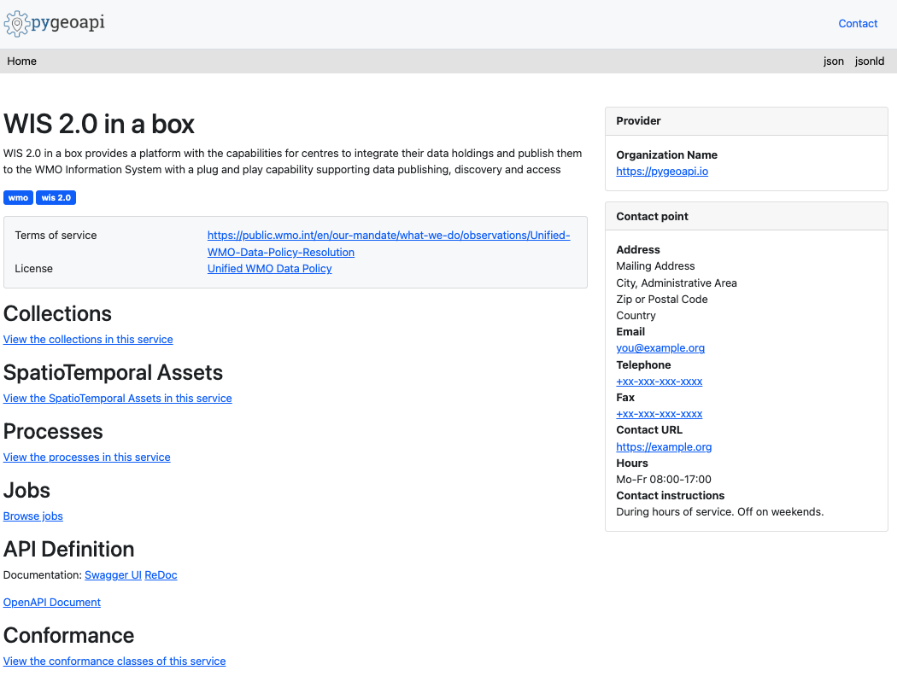

# Interrogazione dei dati tramite l'API wis2box

!!! abstract "Risultati dell'apprendimento"
    Al termine di questa sessione pratica, sarai in grado di:

    - utilizzare l'API wis2box per interrogare e filtrare le tue stazioni
    - utilizzare l'API wis2box per interrogare e filtrare i tuoi dati

## Introduzione

L'API wis2box fornisce accesso alla scoperta e all'interrogazione in modo leggibile da macchina ai dati che sono stati ingeriti in wis2box. L'API si basa sullo standard OGC API - Features ed è implementata utilizzando [pygeoapi](https://pygeoapi.io).

L'API wis2box offre accesso alle seguenti collezioni:

- Stazioni
- Metadati di scoperta
- Notifiche di dati
- più una collezione per dataset configurato, che memorizza l'output da bufr2geojson (il plugin `bufr2geojson` deve essere abilitato nella configurazione delle mappature dei dati per riempire gli elementi nella collezione del dataset).

In questa sessione pratica imparerai a utilizzare l'API dei dati per sfogliare e interrogare i dati che sono stati ingeriti in wis2box.

## Preparazione

!!! note
    Naviga alla pagina di atterraggio dell'API wis2box nel tuo browser web:

    `http://YOUR-HOST/oapi`

## Ispezione delle collezioni

Dalla pagina di atterraggio, clicca sul link 'Collections'.

!!! question
    Quante collezioni di dataset vedi nella pagina risultante? Cosa pensi che rappresenti ogni collezione?

??? success "Clicca per rivelare la risposta"
    Dovrebbero essere visualizzate 4 collezioni, incluse "Stazioni", "Metadati di scoperta" e "Notifiche di dati"

## Ispezione delle stazioni

Dalla pagina di atterraggio, clicca sul link 'Collections', poi clicca sul link 'Stazioni'.

Clicca sul link 'Browse', poi clicca sul link 'json'.

!!! question
    Quante stazioni vengono restituite? Confronta questo numero con l'elenco delle stazioni in `http://YOUR-HOST/wis2box-webapp/station`

??? success "Clicca per rivelare la risposta"
    Il numero di stazioni dall'API dovrebbe essere uguale al numero di stazioni che vedi nella wis2box webapp.

!!! question
    Come possiamo interrogare per una singola stazione (es. `Balaka`)?

??? success "Clicca per rivelare la risposta"
    Interroga l'API con `http://YOUR-HOST/oapi/collections/stations/items?q=Balaka`.

!!! note
    L'esempio sopra è basato sui dati di test del Malawi. Prova a testare contro le stazioni che hai ingerito come parte degli esercizi precedenti.

## Ispezione delle osservazioni

!!! note
    L'esempio sopra è basato sui dati di test del Malawi. Prova a testare contro le osservazioni che hai ingerito come parte degli esercizi.

Dalla pagina di atterraggio, clicca sul link 'Collections', poi clicca sul link 'Osservazioni meteorologiche di superficie dal Malawi'.

Clicca sul link 'Queryables'.

!!! question
    Quale queryable sarebbe utilizzato per filtrare per identificatore di stazione?

??? success "Clicca per rivelare la risposta"
    Il `wigos_station_identifer` è il queryable corretto.

Naviga alla pagina precedente (i.e. `http://YOUR-HOST/oapi/collections/urn:wmo:md:mwi:mwi_met_centre:surface-weather-observations`)

Clicca sul link 'Browse'.

!!! question
    Come possiamo visualizzare la risposta JSON?

??? success "Clicca per rivelare la risposta"
    Cliccando sul link 'JSON' in alto a destra della pagina, o aggiungendo `f=json` alla richiesta API sul browser web.

Ispeziona la risposta JSON delle osservazioni.

!!! question
    Quanti record vengono restituiti?

!!! question
    Come possiamo limitare la risposta a 3 osservazioni?

??? success "Clicca per rivelare la risposta"
    Aggiungi `limit=3` alla richiesta API.

!!! question
    Come possiamo ordinare la risposta per le osservazioni più recenti?

??? success "Clicca per rivelare la risposta"
    Aggiungi `sortby=-resultTime` alla richiesta API (nota il segno `-` per denotare l'ordine decrescente). Per ordinare per le osservazioni più vecchie, aggiorna la richiesta includendo `sortby=resultTime`.

!!! question
    Come possiamo filtrare le osservazioni per una singola stazione?

??? success "Clicca per rivelare la risposta"
    Aggiungi `wigos_station_identifier=<WSI>` alla richiesta API.

!!! question
    Come possiamo ricevere le osservazioni come un CSV?

??? success "Clicca per rivelare la risposta"
    Aggiungi `f=csv` alla richiesta API.

!!! question
    Come possiamo mostrare una singola osservazione (id)?

??? success "Clicca per rivelare la risposta"
    Utilizzando l'identificatore della caratteristica da una richiesta API contro le osservazioni, interroga l'API per `http://YOUR-HOST/oapi/collections/{collectionId}/items/{featureId}`, dove `{collectionId}` è il nome della tua collezione di osservazioni e `{itemId}` è l'identificatore della singola osservazione di interesse.

## Conclusione

!!! success "Congratulazioni!"
    In questa sessione pratica, hai imparato a:

    - utilizzare l'API wis2box per interrogare e filtrare le tue stazioni
    - utilizzare l'API wis2box per interrogare e filtrare i tuoi dati