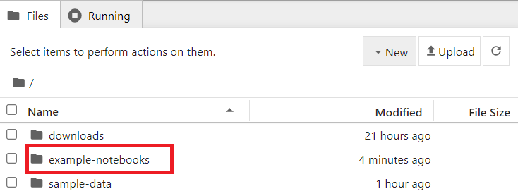

# Downloading and decoding data from WIS2

!!! abstract "Learning outcomes!"

    By the end of this practical session, you will be able to:

    - use the "wis2downloader" to subscribe to WIS2 data notifications and download data to your local system
    - view the status of the downloads in the Grafana dashboard
    - decode some downloaded data using the "decode-bufr-jupyter" container

## Introduction

In this session you will learn how to setup a subscription to a WIS2 Broker and automatically download data to your local system using the "wis2downloader"-service included in the wis2box. 

!!! note "About wis2downloader"
     
     The wis2downloader is also available as a standalone service that can be run on a different system from the one that is publishing the WIS2 notifications. See [wis2downloader](https://pypi.org/project/wis2downloader/) for more information for using the wis2downloader as a standalone service.

     If you like to develop your own service for subscribing to WIS2 notifications and downloading data, you can use the [wis2downloader source code](https://github.com/wmo-im/wis2downloader) as a reference.

!!! Other tools for accessing WIS2 data

    The following tools can also be used to discover and access data from WIS2:

    - [pywiscat](https://github.com/wmo-im/pywiscat) provides search capability atop the WIS2 Global Discovery Catalogue in support of reporting and analysis of the WIS2 Catalogue and its associated discovery metadata
    - [pywis-pubsub](https://github.com/wmo-im/pywis-pubsub) provides subscription and download capability of WMO data from WIS2 infrastructure services

## Preparation

Before starting please login to your student VM and ensure your wis2box instance is up and running.

## Exercise 1: viewing the wis2download dashboard in Grafana

Open a web browser and navigate to the Grafana dashboard for your wis2box instance by going to `http://<your-host>:3000`.

Click on dashboards in the left-hand menu, and then select the **wis2downloader dashboard**.

You should see the following dashboard:


This dashboard is based on metrics published by the wis2downloader service and will show you the status of the downloads that are currently in progress.

On the top left corner you can see the subscriptions that are currently active.

Keep this dashboard open as you will use it to monitor the download progress in the next exercise.

## Exercise 2: reviewing the wis2downloader configuration

The wis2downloader-service started by the wis2box-stack can be configured using the environment variables defined in your wis2box.env file.

The following environment variables are used by the wis2downloader:

    - DOWNLOAD_BROKER_HOST: The hostname of the MQTT broker to connect to. Defaults to globalbroker.meteo.fr
    - DOWNLOAD_BROKER_PORT: The port of the MQTT broker to connect to. Defaults to 443 (HTTPS for websockets)
    - DOWNLOAD_BROKER_USERNAME: The username to use to connect to the MQTT broker. Defaults to everyone
    - DOWNLOAD_BROKER_PASSWORD: The password to use to connect to the MQTT broker. Defaults to everyone
    - DOWNLOAD_BROKER_TRANSPORT: websockets or tcp, the transport-mechanism to use to connect to the MQTT broker. Defaults to websockets,
    - DOWNLOAD_RETENTION_PERIOD_HOURS: The retention period in hours for the downloaded data. Defaults to 24
    - DOWNLOAD_WORKERS: The number of download workers to use. Defaults to 8. Determines the number of parallel downloads.
    - DOWNLOAD_MIN_FREE_SPACE_GB: The minimum free space in GB to keep on the volume hosting the downloads. Defaults to 1.

To review the current configuration of the wis2downloader, you can use the following command:

```bash
cat ~/wis2box-1.0.0rc1/wis2box.env | grep DOWNLOAD
```

!!! question "Review the configuration of the wis2downloader"
    
    What is the default MQTT broker that the wis2downloader connects to?

    What is the default retention period for the downloaded data?

??? success "Click to reveal answer"

    The default MQTT broker that the wis2downloader connects to is `globalbroker.meteo.fr`.

    The default retention period for the downloaded data is 24 hours.

!!! note "Updating the configuration of the wis2downloader"

    To update the configuration of the wis2downloader, you can edit the wis2box.env file. To apply the changes you can re-run the start command for the wis2box-stack:

    ```bash
    python3 wis2box-ctl.py start
    ```

    And you will see the wis2downloader service restart with the new configuration.

You can keep the default configuration for the purpose of this exercise.

## Exercise 3: adding subscriptions to the wis2downloader

Inside the **wis2downloader** container, you can use the command line to list, add and delete subscriptions.

To login to the **wis2downloader** container, use the following command:

```bash
python3 wis2box-ctl.py login wis2downloader
```

Then use the following command to list the subscriptions that are currently active:

```bash
wis2downloader list-subscriptions
```

This command returns an empty list since no subscriptions are currently active.

For the purpose of this exercise, we will subscribe to the following topic `cache/a/wis2/de-dwd-gts-to-wis2/#`, to subscribe to data published by the DWD-hosted GTS-to-WIS2 gateway and downloading notifications from the Global Cache.

To add this subscription, use the following command:

```bash
wis2downloader add-subscription --topic cache/a/wis2/de-dwd-gts-to-wis2/#
```

Then exit the **wis2downloader** container by typing `exit`:

```bash
exit
```

Check the wis2downloader dashboard in Grafana to see the new subscription added. Wait a few minutes and you should see the first downloads starting. Go to he next exercise once you have confirmed that the downloads are starting.

## Exercise 4: viewing the downloaded data

The wis2downloader-service in the wis2box-stack downloads the data in the 'downloads' directory in the directory you defined as the WIS2BOX_HOST_DATADIR in your wis2box.env file. To view the contents of the downloads directory, you can use the following command:

```bash
ls -R ~/wis2box-data/downloads
```

Note that the downloaded data is stored in directories named after the topic the WIS2 Notification was published on.

## Exercise 5: removing subscriptions from the wis2downloader

Next, log back in to the wis2downloader container:

```bash
python3 wis2box-ctl.py login wis2downloader
```

and remove the subscription you made from the wis2downloader, using the following command:

```bash
wis2downloader remove-subscription --topic cache/a/wis2/de-dwd-gts-to-wis2/#
```

And exit the wis2downloader container by typing `exit`:
    
```bash
exit
```

Check the wis2downloader dashboard in Grafana to see the subscription removed. You should see the downloads stopping.

## Exercise 6: subscribe to the wis2training-broker and setup a new subscription

For the next exercise we will subscribe to the wis2training-broker.

This demonstrates how to subscribe to a broker that is not the default broker and will allow you to download some data published from the WIS2 Training Broker.

Edit the wis2box.env file and change the DOWNLOAD_BROKER_HOST to `wis2training-broker.wis2dev.io`, change DOWNLOAD_BROKER_PORT to `1883` and change DOWNLOAD_BROKER_TRANSPORT to `tcp`:

```copy
# downloader settings
DOWNLOAD_BROKER_HOST=wis2training-broker.wis2dev.io
DOWNLOAD_BROKER_PORT=1883
DOWNLOAD_BROKER_USERNAME=everyone
DOWNLOAD_BROKER_PASSWORD=everyone
# download transport mechanism (tcp or websockets)
DOWNLOAD_BROKER_TRANSPORT=tcp
```

Then restart the wis2box-stack to apply the changes:

```bash
python3 wis2box-ctl.py start
```

Check the logs of the wis2downloader to see if the connection to the new broker was successful:

```bash
docker logs wis2downloader
```

You should see the following log message:

```copy
...
INFO - Connecting...
INFO - Host: wis2training-broker.wis2dev.io, port: 1883
INFO - Connected successfully
```

Now we will setup a new subscription to the topic to downloaded cyclone-track data from the WIS2 Training Broker.

Login to the **wis2downloader** container:

```bash
python3 wis2box-ctl.py login wis2downloader
```

And execute the following command (copy-paste this to avoid typo's):

```bash
wis2downloader add-subscription --topic origin/a/wis2/int-wis2-training/data/core/weather/prediction/forecast/medium-range/probabilistic/trajectory
```

Exit the **wis2downloader** container by typing `exit`.

Wait until you see the downloads starting in the wis2downloader dashboard in Grafana.

!!! note "Downloading data from the WIS2 Training Broker"

    The WIS2 Training Broker is a test broker that is used for training purposes and may not publish data all the time.

    During the in-person training sessions, the local trainer will ensure the WIS2 Training Broker will publish data for you to download.

    If you are doing this exercise outside of a training session, you may not see any data being downloaded.

Check that the data was downloaded by checking the wis2downloader logs again with:

```bash
docker logs wis2downloader
```

You should see a log message similar to the following:

```copy
[...] INFO - Message received under topic origin/a/wis2/int-wis2-training/data/core/weather/prediction/forecast/medium-range/probabilistic/trajectory
[...] INFO - Downloaded A_JSXX05ECEP020000_C_ECMP_...
```

## Exercise 7: decoding the downloaded data

In order to demonstrate how you can decode the downloaded data, we will start a new container using 'decode-bufr-jupyter' image.

This container will be start Jupyter notebook server on your instance which includes the "ecCodes" library that you can use to decode BUFR data.

We will use the example notebooks included in `~/exercise-materials/notebook-examples` to decode the downloaded data for the cyclone tracks.

To start the container, use the following command:

```bash
docker run -d --name decode-bufr-jupyter \
    -v ~/wis2box-data/downloads:/root/downloads \
    -p 8888:8888 \
    -e JUPYTER_TOKEN=dataismagic! \
    mlimper/decode-bufr-jupyter
```

!!! note "About the decode-bufr-jupyter container"

    The `decode-bufr-jupyter` container is a custom container that includes the ecCodes library and runs a Jupyter notebook server. The container is based on a image that includes the `ecCodes` library for decoding BUFR data, along with libraries for plotting and data analysis.

    The command above starts the container in detached mode, with the name `decode-bufr-jupyter`, the port 8888 is mapped to the host system and the environment variable `JUPYTER_TOKEN` is set to `dataismagic!`.
    
    The command above also mounts the `~/wis2box-data/downloads` directory to `/root/downloads` in the container. This ensures that the downloaded data is available to the Jupyter notebook server.
    
Once the container is started, you can access the Jupyter notebook server by navigating to `http://<your-host>:8888` in your web browser.

You will see a screen requesting you to enter a "Password or token".

Provide the token `dataismagic!` to login to the Jupyter notebook server.

After you login, you should see the following screen listing the directories in the container:



Double click on the `example-notebooks` directory to open it.

You should see the following screen listing the example notebooks, double click on the `tropical_cyclone_track.ipynb` notebook to open it:


You should now be in the Jupyter notebook for decoding the tropical cyclone track data:


Read the instructions in the notebook and run the cells to decode the downloaded data for the tropical cyclone tracks. Run each cell by clicking on the cell and then clicking the run button in the toolbar or by pressing `Shift+Enter`.

At the end you should see a plot of the strike probability for the tropical cyclone tracks:


!!! question 

    The result displays the predicted probability of tropical storm track within 200 km. How would you update the notebook to display the predicted probability of tropical storm track within 300 km ?

??? success "Click to reveal answer"

    To update the notebook to display the predicted probability of tropical storm track within a different distance, you can update the `distance_threshold` variable in the code-block that calculates the strike probability.

    To display the predicted probability of tropical storm track within 300 km, 

    ```python
    # set distance threshold (meters)
    distance_threshold = 300000  # 300 km in meters
    ```

    Then re-run the cells in the notebook to see the updated plot.

!!! note "Decoding BUFR data"

    The exercise you just did provided one specific example of how you can decode BUFR data using the ecCodes library. Different data types may require different decoding steps and you may need to refer to the documentation for the data type you are working with.
    
    For more information please consult the [ecCodes documentation](https://confluence.ecmwf.int/display/ECC).


## Conclusion

!!! success "Congratulations!"

    In this practical session, you learned how to:

    - use the 'wis2downloader' to subscribe to a WIS2 Broker and download data to your local system
    - view the status of the downloads in the Grafana dashboard
    - decode some downloaded data using the 'decode-bufr-jupyter' container
