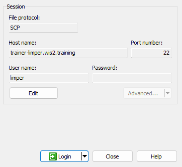
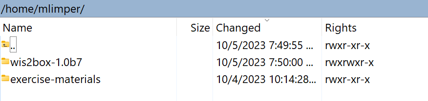

# Acessando sua VM de estudante

!!! abstract "Objetivos de aprendizagem"

    Ao final desta sessão prática, você será capaz de:

    - acessar sua VM de estudante via SSH e WinSCP
    - verificar se o software necessário para os exercícios práticos está instalado
    - verificar se você tem acesso aos materiais de exercício para este treinamento em sua VM local de estudante

## Introdução

Como parte das sessões de treinamento wis2box executadas localmente, você pode acessar sua VM pessoal de estudante na rede local de treinamento chamada "WIS2-training".

Sua VM de estudante tem os seguintes softwares pré-instalados:

- Ubuntu 22.0.4.3 LTS [ubuntu-22.04.3-live-server-amd64.iso](https://releases.ubuntu.com/jammy/ubuntu-22.04.3-live-server-amd64.iso)
- Python 3.10.12
- Docker 24.0.6
- Docker Compose 2.21.0
- Editores de texto: vim, nano

!!! note

    Se você quiser executar este treinamento fora de uma sessão local de treinamento, você pode fornecer sua própria instância usando qualquer provedor de nuvem, por exemplo:

    - GCP (Google Cloud Platform) VM instance `e2-medium`
    - AWS (Amazon Web Services) ec2-instance `t3a.medium`
    - Azure (Microsoft) Azure Virtual Machine `standard_b2s`

    Selecione Ubuntu Server 22.0.4 LTS como SO.
    
    Após criar sua VM, certifique-se de ter instalado python, docker e docker compose, conforme descrito em [wis2box-software-dependencies](https://docs.wis2box.wis.wmo.int/en/latest/user/getting-started.html#software-dependencies).
    
    O arquivo de lançamento do wis2box usado neste treinamento pode ser baixado da seguinte forma:

    ```bash
    wget https://github.com/World-Meteorological-Organization/wis2box-release/releases/download/1.0.0/wis2box-setup.zip
    unzip wis2box-setup.zip
    ```
    
    Você sempre pode encontrar o arquivo mais recente do 'wis2box-setup' em [https://github.com/World-Meteorological-Organization/wis2box/releases](https://github.com/World-Meteorological-Organization/wis2box-release/releases).

    O material de exercício usado neste treinamento pode ser baixado da seguinte forma:

    ```bash
    wget https://training.wis2box.wis.wmo.int/exercise-materials.zip
    unzip exercise-materials.zip
    ```

    Os seguintes pacotes Python adicionais são necessários para executar os materiais de exercício:

    ```bash
    pip3 install minio
    pip3 install pywiscat==0.2.2
    ```

    Se você estiver usando a VM de estudante fornecida durante as sessões locais de treinamento WIS2, o software necessário já estará instalado.

## Conecte-se à sua VM de estudante na rede local de treinamento

Conecte seu PC ao Wi-Fi local transmitido na sala durante o treinamento WIS2 conforme as instruções fornecidas pelo instrutor.

Use um cliente SSH para se conectar à sua VM de estudante usando o seguinte:

- **Host: (fornecido durante o treinamento presencial)**
- **Porta: 22**
- **Nome de usuário: (fornecido durante o treinamento presencial)**
- **Senha: (fornecida durante o treinamento presencial)**

!!! tip
    Entre em contato com um instrutor se você não tiver certeza sobre o hostname/nome de usuário ou tiver problemas para se conectar.

Uma vez conectado, altere sua senha para garantir que outros não possam acessar sua VM:

```bash
limper@student-vm:~$ passwd
Changing password for testuser.
Current password:
New password:
Retype new password:
passwd: password updated successfully
```

## Verificar versões do software

Para poder executar o wis2box, a VM do estudante deve ter Python, Docker e Docker Compose pré-instalados.

Verificar versão do Python:
```bash
python3 --version
```
retorna:
```console
Python 3.10.12
```

Verificar versão do docker:
```bash
docker --version
```
retorna:
```console
Docker version 24.0.6, build ed223bc
```

Verificar versão do Docker Compose:
```bash
docker compose version
```
retorna:
```console
Docker Compose version v2.21.0
```

Para garantir que seu usuário possa executar comandos Docker, seu usuário foi adicionado ao grupo `docker`.

Para testar se seu usuário pode executar o docker hello-world, execute o seguinte comando:
```bash
docker run hello-world
```

Isso deve baixar a imagem hello-world e executar um contêiner que imprime uma mensagem.

Verifique se você vê o seguinte na saída:

```console
...
Hello from Docker!
This message shows that your installation appears to be working correctly.
...
```

## Inspecionar os materiais de exercício

Inspecione o conteúdo do seu diretório inicial; estes são os materiais usados como parte do treinamento e sessões práticas.

```bash
ls ~/
```
retorna:
```console
exercise-materials  wis2box
```

Se você tiver o WinSCP instalado em seu PC local, pode usá-lo para se conectar à sua VM de estudante e inspecionar o conteúdo do seu diretório inicial e baixar ou enviar arquivos entre sua VM e seu PC local.

O WinSCP não é necessário para o treinamento, mas pode ser útil se você quiser editar arquivos em sua VM usando um editor de texto em seu PC local.

Aqui está como você pode se conectar à sua VM de estudante usando WinSCP:

Abra o WinSCP e clique em "New Site". Você pode criar uma nova conexão SCP para sua VM da seguinte forma:



Clique em 'Save' e depois em 'Login' para se conectar à sua VM.

E você deve poder ver o seguinte conteúdo:



## Conclusão

!!! success "Parabéns!"
    Nesta sessão prática, você aprendeu como:

    - acessar sua VM de estudante via SSH e WinSCP
    - verificar se o software necessário para os exercícios práticos está instalado
    - verificar se você tem acesso aos materiais de exercício para este treinamento em sua VM local de estudante