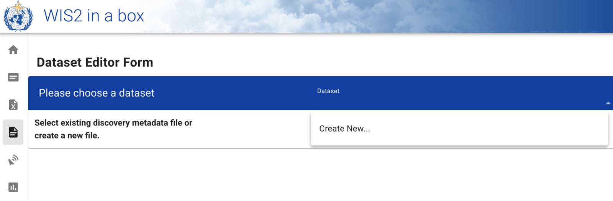
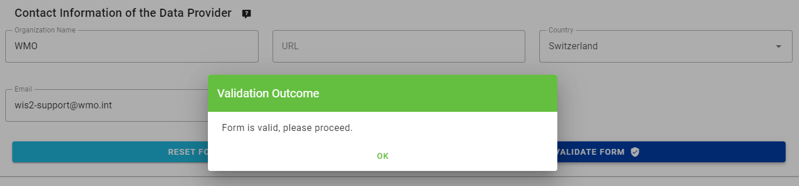

# Configurando conjuntos de dados no wis2box

!!! abstract "Objetivos de aprendizagem"
    Ao final desta sessão prática, você será capaz de:

    - criar um novo conjunto de dados
    - criar metadados de descoberta para um conjunto de dados
    - configurar mapeamentos de dados para um conjunto de dados
    - publicar uma notificação WIS2 com um registro WCMP2
    - atualizar e republicar seu conjunto de dados

## Introdução

O wis2box utiliza conjuntos de dados que estão associados a metadados de descoberta e mapeamentos de dados.

Os metadados de descoberta são usados para criar um registro WCMP2 (WMO Core Metadata Profile 2) que é compartilhado usando uma notificação WIS2 publicada no seu wis2box-broker.

Os mapeamentos de dados são usados para associar um plugin de dados aos seus dados de entrada, permitindo que seus dados sejam transformados antes de serem publicados usando a notificação WIS2.

Esta sessão irá guiá-lo através da criação de um novo conjunto de dados, criação de metadados de descoberta e configuração de mapeamentos de dados. Você irá inspecionar seu conjunto de dados no wis2box-api e revisar a notificação WIS2 para seus metadados de descoberta.

## Preparação

Conecte-se ao seu broker usando MQTT Explorer.

Em vez de usar suas credenciais internas do broker, use as credenciais públicas `everyone/everyone`:


!!! Note

    Você nunca precisa compartilhar as credenciais do seu broker interno com usuários externos. O usuário 'everyone' é um usuário público para permitir o compartilhamento de notificações WIS2.

    As credenciais `everyone/everyone` têm acesso somente leitura no tópico 'origin/a/wis2/#'. Este é o tópico onde as notificações WIS2 são publicadas. O Global Broker pode se inscrever com essas credenciais públicas para receber as notificações.
    
    O usuário 'everyone' não verá tópicos internos nem poderá publicar mensagens.

Abra um navegador e acesse a página `http://YOUR-HOST/wis2box-webapp`. Certifique-se de que está conectado e pode acessar a página 'dataset editor'.

Consulte a seção sobre [Inicializando wis2box](/practical-sessions/initializing-wis2box) se precisar lembrar como se conectar ao broker ou acessar o wis2box-webapp.

## Criar um token de autorização para processes/wis2box

Você precisará de um token de autorização para o endpoint 'processes/wis2box' para publicar seu conjunto de dados.

Para criar um token de autorização, acesse sua VM de treinamento via SSH e use os seguintes comandos para fazer login no container wis2box-management:

```bash
cd ~/wis2box
python3 wis2box-ctl.py login
```

Em seguida, execute o seguinte comando para criar um token de autorização gerado aleatoriamente para o endpoint 'processes/wis2box':

```bash
wis2box auth add-token --path processes/wis2box
```

Você também pode criar um token com um valor específico fornecendo o token como argumento para o comando:

```bash
wis2box auth add-token --path processes/wis2box MyS3cretToken
```

Certifique-se de copiar o valor do token e armazená-lo em sua máquina local, pois você precisará dele mais tarde.

Depois de obter seu token, você pode sair do container wis2box-management:

```bash
exit
```

## Criando um novo conjunto de dados no wis2box-webapp

Navegue até a página 'dataset editor' no wis2box-webapp da sua instância wis2box acessando `http://YOUR-HOST/wis2box-webapp` e selecionando 'dataset editor' no menu do lado esquerdo.

Na página 'dataset editor', na aba 'Datasets', clique em "Create New ...":



Uma janela pop-up aparecerá, solicitando que você forneça:

- **Centre ID**: esta é a sigla da agência (em minúsculas e sem espaços), conforme especificado pelo Membro da OMM, que identifica o centro de dados responsável pela publicação dos dados.
- **Data Type**: O tipo de dados para o qual você está criando metadados. Você pode escolher entre usar um modelo predefinido ou selecionar 'other'. Se 'other' for selecionado, mais campos terão que ser preenchidos manualmente.

!!! Note "Centre ID"

    Seu centre-id deve começar com o TLD do seu país, seguido por um traço (`-`) e um nome abreviado da sua organização (por exemplo `fr-meteofrance`). O centre-id deve estar em minúsculas e usar apenas caracteres alfanuméricos. A lista suspensa mostra todos os centre-ids atualmente registrados no WIS2, bem como qualquer centre-id que você já tenha criado no wis2box.

!!! Note "Data Type Templates"

    O campo *Data Type* permite que você selecione de uma lista de modelos disponíveis no editor de conjuntos de dados do wis2box-webapp. Um modelo pré-preencherá o formulário com valores padrão sugeridos apropriados para o tipo de dados. Isso inclui título e palavras-chave sugeridos para os metadados e plugins de dados pré-configurados. O tópico será fixado no tópico padrão para o tipo de dados.

    Para fins de treinamento, usaremos o tipo de dados *weather/surface-based-observations/synop* que inclui plugins de dados que garantem que os dados sejam transformados em formato BUFR antes de serem publicados.

    Se você quiser publicar alertas CAP usando wis2box, use o modelo *weather/advisories-warnings*. Este modelo inclui um plugin de dados que verifica se os dados de entrada são um alerta CAP válido antes da publicação. Para criar alertas CAP e publicá-los via wis2box, você pode usar o [CAP Composer](https://github.com/wmo-raf/cap-composer).

Por favor, escolha um centre-id apropriado para sua organização.

Para **Data Type**, selecione **weather/surface-based-observations/synop**:


Clique em *continue to form* para prosseguir, você verá o **Dataset Editor Form**.

Como você selecionou o tipo de dados **weather/surface-based-observations/synop**, o formulário será pré-preenchido com alguns valores iniciais relacionados a este tipo de dados.

## Criando metadados de descoberta

O Formulário do Editor de Conjunto de Dados permite que você forneça os Metadados de Descoberta para seu conjunto de dados que o container wis2box-management usará para publicar um registro WCMP2.

Como você selecionou o tipo de dados 'weather/surface-based-observations/synop', o formulário será pré-preenchido com alguns valores padrão.

Certifique-se de substituir o 'Local ID' gerado automaticamente por um nome descritivo para seu conjunto de dados, por exemplo 'synop-dataset-wis2training':


Revise o título e as palavras-chave, atualize-os conforme necessário e forneça uma descrição para seu conjunto de dados.

Observe que existem opções para alterar a 'WMO Data Policy' de 'core' para 'recommended' ou para modificar seu Identificador de Metadados padrão, mantenha a política de dados como 'core' e use o Identificador de Metadados padrão.

Em seguida, revise a seção que define suas 'Propriedades Temporais' e 'Propriedades Espaciais'. Você pode ajustar a caixa delimitadora atualizando os campos 'Latitude Norte', 'Latitude Sul', 'Longitude Leste' e 'Longitude Oeste':


Em seguida, preencha a seção que define as 'Informações de Contato do Fornecedor de Dados':


Por fim, preencha a seção que define as 'Informações de Qualidade dos Dados':

Depois de preencher todas as seções, clique em 'VALIDATE FORM' e verifique se há erros no formulário:


Se houver algum erro, corrija-os e clique em 'VALIDATE FORM' novamente.

Certifique-se de que não há erros e que você receba uma indicação pop-up de que seu formulário foi validado:



Em seguida, antes de enviar seu conjunto de dados, revise os mapeamentos de dados para seu conjunto de dados.

## Configurando mapeamentos de dados

Como você usou um modelo para criar seu conjunto de dados, os mapeamentos de conjunto de dados foram pré-preenchidos com os plugins padrão para o tipo de dados 'weather/surface-based-observations/synop'. Os plugins de dados são usados no wis2box para transformar dados antes de serem publicados usando a notificação WIS2.


Observe que você pode clicar no botão "update" para alterar as configurações do plugin, como extensão de arquivo e padrão de arquivo, você pode deixar as configurações padrão por enquanto. Em uma sessão posterior, você aprenderá mais sobre BUFR e a transformação de dados em formato BUFR.

## Enviando seu conjunto de dados

Finalmente, você pode clicar em 'submit' para publicar seu conjunto de dados.

Você precisará fornecer o token de autorização para 'processes/wis2box' que você criou anteriormente. Se você ainda não fez isso, pode criar um novo token seguindo as instruções na seção de preparação.

Verifique se você recebe a seguinte mensagem após enviar seu conjunto de dados, indicando que o conjunto de dados foi enviado com sucesso:


Depois de clicar em 'OK', você é redirecionado para a página inicial do Editor de Conjunto de Dados. Agora, se você clicar na aba 'Dataset', deverá ver seu novo conjunto de dados listado:


## Revisando a notificação WIS2 para seus metadados de descoberta

Vá para o MQTT Explorer, se você estiver conectado ao broker, deverá ver uma nova notificação WIS2 publicada no tópico `origin/a/wis2/<seu-centre-id>/metadata`:


Inspecione o conteúdo da notificação WIS2 que você publicou. Você deve ver um JSON com uma estrutura correspondente ao formato WIS Notification Message (WNM).

!!! question

    Em qual tópico a notificação WIS2 é publicada?

??? success "Clique para revelar a resposta"

    A notificação WIS2 é publicada no tópico `origin/a/wis2/<seu-centre-id>/metadata`.

!!! question
    
    Tente encontrar o título, descrição e palavras-chave que você forneceu nos metadados de descoberta na notificação WIS2. Você consegue encontrá-los?

??? success "Clique para revelar a resposta"

    **O título, descrição e palavras-chave que você forneceu nos metadados de descoberta não estão presentes no payload da notificação WIS2!**
    
    Em vez disso, tente procurar o link canônico na seção "links" na notificação WIS2:

    

    **A notificação WIS2 contém um link canônico para o registro WCMP2 que foi publicado.**
    
    Copie e cole este link canônico em seu navegador para acessar o registro WCMP2, dependendo das configurações do seu navegador, você pode ser solicitado a baixar o arquivo ou ele pode ser exibido diretamente no seu navegador.

    Você encontrará o título, descrição e palavras-chave que forneceu dentro do registro WCMP2.

## Conclusão

!!! success "Parabéns!"
    Nesta sessão prática, você aprendeu como:

    - criar um novo conjunto de dados
    - definir seus metadados de descoberta
    - revisar seus mapeamentos de dados
    - publicar metadados de descoberta
    - revisar a notificação WIS2 para seus metadados de descoberta