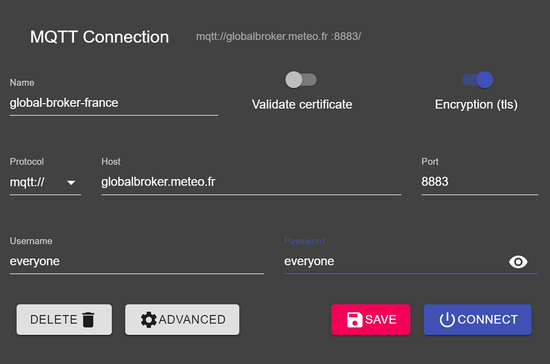
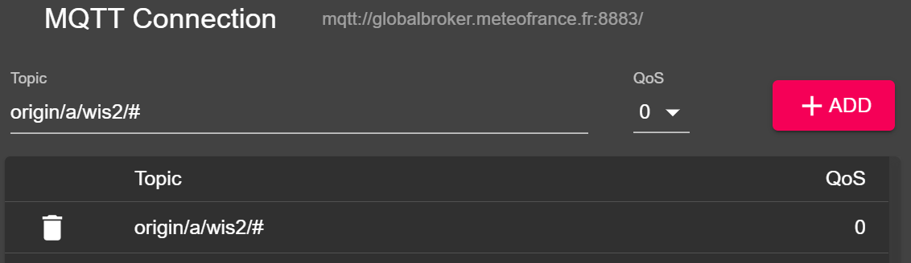

# Conectando ao WIS2 via MQTT

!!! abstract "Resultados de aprendizado"

    Ao final desta sessão prática, você será capaz de:

    - conectar ao Global Broker do WIS2 usando MQTT Explorer
    - revisar a estrutura de tópicos do WIS2
    - revisar a estrutura de mensagens de notificação do WIS2

## Introdução

O WIS2 utiliza o protocolo MQTT para anunciar a disponibilidade de dados de clima/meteorologia/água. O Global Broker do WIS2 se inscreve em todos os WIS2 Nodes na rede e republica as mensagens que recebe. O Global Cache se inscreve no Global Broker, baixa os dados na mensagem e então republica a mensagem no tópico `cache` com uma nova URL. O Global Discovery Catalogue publica metadados de descoberta do Broker e fornece uma API de busca.

Este é um exemplo da estrutura de mensagem de notificação do WIS2 para uma mensagem recebida no tópico `origin/a/wis2/br-inmet/data/core/weather/surface-based-observations/synop`:	

```json
{
  "id": "59f9b013-c4b3-410a-a52d-fff18f3f1b47",
  "type": "Feature",
  "version": "v04",
  "geometry": {
    "coordinates": [
      -38.69389,
      -17.96472,
      60
    ],
    "type": "Point"
  },
  "properties": {
    "data_id": "br-inmet/data/core/weather/surface-based-observations/synop/WIGOS_0-76-2-2900801000W83499_20240815T060000",
    "datetime": "2024-08-15T06:00:00Z",
    "pubtime": "2024-08-15T09:52:02Z",
    "integrity": {
      "method": "sha512",
      "value": "TBuWycx/G0lIiTo47eFPBViGutxcIyk7eikppAKPc4aHgOmTIS5Wb9+0v3awMOyCgwpFhTruRRCVReMQMp5kYw=="
    },
    "content": {
      "encoding": "base64",
      "value": "QlVGUgAA+gQAABYAACsAAAAAAAIAHAAH6AgPBgAAAAALAAABgMGWx1AAAM0ABOIAAAODM0OTkAAAAAAAAAAAAAAKb5oKEpJ6YkJ6mAAAAAAAAAAAAAAAAv0QeYA29WQa87ZhH4CQP//z+P//BD////+ASznXuUb///8MgAS3/////8X///e+AP////AB/+R/yf////////////////////6/1/79H/3///gEt////////4BLP6QAf/+/pAB//4H0YJ/YeAh/f2///7TH/////9+j//f///////////////////v0f//////////////////////wNzc3Nw==",
      "size": 250
    },
    "wigos_station_identifier": "0-76-2-2900801000W83499"
  },
  "links": [
    {
      "rel": "canonical",
      "type": "application/bufr",
      "href": "http://wis2bra.inmet.gov.br/data/2024-08-15/wis/br-inmet/data/core/weather/surface-based-observations/synop/WIGOS_0-76-2-2900801000W83499_20240815T060000.bufr4",
      "length": 250
    }
  ]
}
``` 

Nesta sessão prática você aprenderá como usar a ferramenta MQTT Explorer para configurar uma conexão de cliente MQTT ao Global Broker do WIS2 e ser capaz de exibir mensagens de notificação do WIS2.

MQTT Explorer é uma ferramenta útil para navegar e revisar a estrutura de tópicos para um dado broker MQTT para revisar dados sendo publicados.

Observe que o MQTT é usado principalmente para comunicação "máquina-a-máquina"; o que significa que normalmente haveria um cliente automaticamente analisando as mensagens conforme são recebidas. Para trabalhar com MQTT programaticamente (por exemplo, em Python), você pode usar bibliotecas de cliente MQTT como [paho-mqtt](https://pypi.org/project/paho-mqtt) para conectar a um broker MQTT e processar mensagens recebidas. Existem inúmeros softwares de cliente e servidor MQTT, dependendo de suas necessidades e ambiente técnico.

## Usando MQTT Explorer para conectar ao Global Broker

Para visualizar mensagens publicadas por um Global Broker do WIS2 você pode usar "MQTT Explorer" que pode ser baixado do [site do MQTT Explorer](https://mqtt-explorer.com).

Abra o MQTT Explorer e adicione uma nova conexão ao Global Broker hospedado pelo MeteoFrance usando os seguintes detalhes:

- host: globalbroker.meteo.fr
- port: 8883
- username: everyone
- password: everyone



Clique no botão 'ADVANCED', remova os tópicos pré-configurados e adicione os seguintes tópicos para se inscrever:

- `origin/a/wis2/#`



!!! note
    Ao configurar inscrições MQTT você pode usar os seguintes curingas:

    - **Curinga de um nível (+)**: um curinga de um nível substitui um nível de tópico
    - **Curinga de múltiplos níveis (#)**: um curinga de múltiplos níveis substitui vários níveis de tópicos

    Neste caso `origin/a/wis2/#` inscreverá em todos os tópicos sob o tópico `origin/a/wis2`.

Clique em 'BACK', depois em 'SAVE' para salvar seus detalhes de conexão e inscrição. Em seguida, clique em 'CONNECT':

As mensagens devem começar a aparecer em sua sessão do MQTT Explorer como segue:


Você está agora pronto para começar a explorar os tópicos e a estrutura de mensagens do WIS2.

## Exercício 1: Revisar a estrutura de tópicos do WIS2

Use MQTT para navegar pela estrutura de tópicos sob os tópicos `origin`.

!!! question
    
    Como podemos distinguir o centro WIS que publicou os dados?

??? success "Clique para revelar a resposta"

    Você pode clicar na janela do lado esquerdo no MQTT Explorer para expandir a estrutura de tópicos.
    
    Podemos distinguir o centro WIS que publicou os dados olhando para o quarto nível da estrutura de tópicos. Por exemplo, o seguinte tópico:

    `origin/a/wis2/br-inmet/data/core/weather/surface-based-observations/synop`

    nos diz que os dados foram publicados por um centro WIS com o Centre ID `br-inmet`, que é o Centre ID para o Instituto Nacional de Meteorologia - INMET, Brasil.

!!! question

    Como podemos distinguir entre mensagens publicadas por centros WIS hospedando um gateway GTS-to-WIS2 e mensagens publicadas por centros WIS hospedando um WIS2 Node?

??? success "Clique para revelar a resposta"

    Podemos distinguir mensagens vindas de um gateway GTS-to-WIS2 olhando para o Centre ID na estrutura de tópicos. Por exemplo, o seguinte tópico:

    `origin/a/wis2/de-dwd-gts-to-wis2/data/core/I/S/A/I/01/sbbr`

    nos diz que os dados foram publicados pelo gateway GTS-to-WIS2 hospedado pelo Deutscher Wetterdienst (DWD), Alemanha. O gateway GTS-to-WIS2 é um tipo especial de publicador de dados que publica dados do Sistema Global de Telecomunicações (GTS) para o WIS2. A estrutura de tópicos é composta pelos cabeçalhos TTAAii CCCC para as mensagens GTS.

## Exercício 2: Revisar a estrutura de mensagens do WIS2

Desconecte do MQTT Explorer e atualize as seções 'Advanced' para mudar a inscrição para os seguintes tópicos:

* `origin/a/wis2/+/data/core/weather/surface-based-observations/synop`
* `cache/a/wis2/+/data/core/weather/surface-based-observations/synop`


!!! note
    O curinga `+` é usado para se inscrever em todos os centros WIS.

Reconecte ao Global Broker e aguarde as mensagens aparecerem.

Você pode visualizar o conteúdo da mensagem WIS2 na seção "Value" no lado direito. Tente expandir a estrutura de tópicos para ver os diferentes níveis da mensagem até alcançar o último nível e revisar o conteúdo da mensagem de uma das mensagens.

!!! question

    Como podemos identificar o carimbo de data/hora em que os dados foram publicados? E como podemos identificar o carimbo de data/hora em que os dados foram coletados?

??? success "Clique para revelar a resposta"

    O carimbo de data/hora em que os dados foram publicados está contido na seção `properties` da mensagem com a chave `pubtime`.

    O carimbo de data/hora em que os dados foram coletados está contido na seção `properties` da mensagem com a chave `datetime`.

    

!!! question

    Como podemos baixar os dados a partir da URL fornecida na mensagem?

??? success "Clique para revelar a resposta"

    A URL está contida na seção `links` com `rel="canonical"` e definida pela chave `href`.

    Você pode copiar a URL e colar em um navegador web para baixar os dados.

## Exercício 3: Revisar a diferença entre os tópicos 'origin' e 'cache'

Certifique-se de que ainda está conectado ao Global Broker usando as inscrições de tópicos `origin/a/wis2/+/data/core/weather/surface-based-observations/synop` e `cache/a/wis2/+/data/core/weather/surface-based-observations/synop` conforme descrito no Exercício 2.

Tente identificar uma mensagem para o mesmo Centre ID publicada tanto nos tópicos `origin` quanto `cache`.


!!! question

    Qual é a diferença entre as mensagens publicadas nos tópicos `origin` e `cache`?

??? success "Clique para revelar a resposta"

    As mensagens publicadas nos tópicos `origin` são as mensagens originais que o Global Broker republica dos WIS2 Nodes na rede. 

    As mensagens publicadas nos tópicos `cache` são as mensagens para dados que foram baixados pelo Global Cache. Se você verificar o conteúdo da mensagem do tópico que começa com `cache`, você verá que o link 'canonical' foi atualizado para uma nova URL.
    
    Existem múltiplos Global Caches na rede WIS2, então você receberá uma mensagem de cada Global Cache que baixou a mensagem.

    O Global Cache só baixará e republicará mensagens que foram publicadas na hierarquia de tópicos `../data/core/...`.

## Conclusão

!!! success "Parabéns!"
    Nesta sessão prática, você aprendeu:

    - como se inscrever nos serviços do Global Broker do WIS2 usando MQTT Explorer
    - a estrutura de tópicos do WIS2
    - a estrutura de mensagens de notificação do WIS2
    - a diferença entre dados essenciais e recomendados
    - a estrutura de tópicos usada pelo gateway GTS-to-WIS2
    - a diferença entre mensagens do Global Broker publicadas nos tópicos `origin` e `cache`