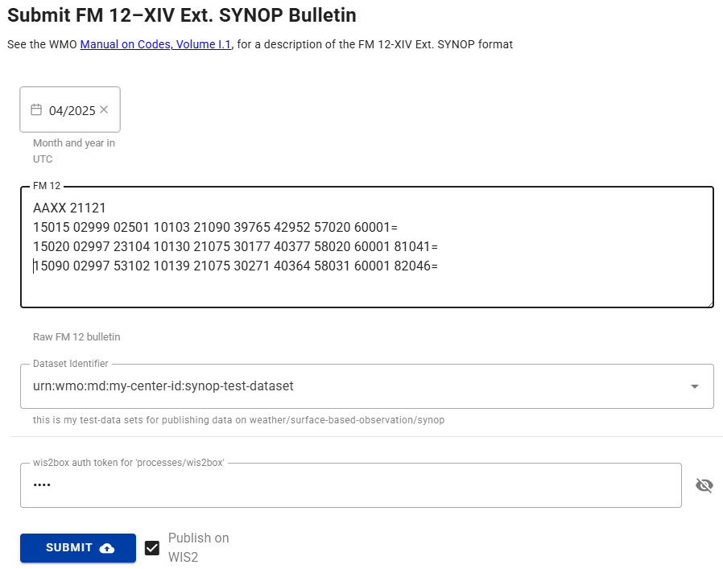

# Ferramentas de Conversão de Dados

!!! abstract "Resultados de Aprendizagem"
    Ao final desta sessão prática, você será capaz de:

    - Acessar as ferramentas de linha de comando ecCodes dentro do contêiner wis2box-api
    - Usar a ferramenta synop2bufr para converter relatórios SYNOP FM-12 para BUFR a partir da linha de comando
    - Acionar a conversão synop2bufr via wis2box-webapp
    - Usar a ferramenta csv2bufr para converter dados CSV para BUFR a partir da linha de comando

## Introdução

Os dados publicados no WIS2 devem atender aos requisitos e padrões definidos pelas diversas comunidades de especialistas em disciplinas/sistemas terrestres. Para reduzir a barreira à publicação de dados para observações de superfície terrestre, o wis2box fornece ferramentas para converter dados para o formato BUFR. Essas ferramentas estão disponíveis por meio do contêiner wis2box-api e podem ser usadas a partir da linha de comando para testar o processo de conversão de dados.

As principais conversões atualmente suportadas pelo wis2box são de relatórios SYNOP FM-12 para BUFR e dados CSV para BUFR. Os dados FM-12 são suportados, pois ainda são amplamente usados e trocados na comunidade da WMO, enquanto os dados CSV são suportados para permitir o mapeamento de dados produzidos por estações meteorológicas automáticas para o formato BUFR.

### Sobre FM-12 SYNOP

Relatórios meteorológicos de superfície de estações terrestres têm sido historicamente relatados por hora ou nas principais (00, 06, 12 e 18 UTC) e intermediárias (03, 09, 15, 21 UTC) horas sinóticas. Antes da migração para BUFR, esses relatórios eram codificados no formato de texto simples FM-12 SYNOP. Embora a migração para BUFR estivesse programada para ser concluída até 2012, um grande número de relatórios ainda é trocado no formato FM-12 SYNOP legado. Mais informações sobre o formato FM-12 SYNOP podem ser encontradas no Manual da WMO sobre Códigos, Volume I.1 (WMO-No. 306, Volume I.1).

### Sobre ecCodes

A biblioteca ecCodes é um conjunto de bibliotecas de software e utilitários projetados para decodificar e codificar dados meteorológicos nos formatos GRIB e BUFR. É desenvolvido pelo Centro Europeu de Previsões Meteorológicas de Médio Prazo (ECMWF), consulte a [documentação do ecCodes](https://confluence.ecmwf.int/display/ECC/ecCodes+documentation) para mais informações.

O software wis2box inclui a biblioteca ecCodes na imagem base do contêiner wis2box-api. Isso permite que os usuários acessem as ferramentas e bibliotecas de linha de comando dentro do contêiner. A biblioteca ecCodes é usada dentro do wis2box-stack para decodificar e codificar mensagens BUFR.

### Sobre csv2bufr e synop2bufr

Além do ecCodes, o wis2box usa os seguintes módulos Python que trabalham com ecCodes para converter dados para o formato BUFR:

- **synop2bufr**: para suportar o formato SYNOP FM-12 legado tradicionalmente usado por observadores manuais. O módulo synop2bufr depende de metadados adicionais da estação para codificar parâmetros adicionais no arquivo BUFR. Veja o [repositório synop2bufr no GitHub](https://github.com/World-Meteorological-Organization/synop2bufr)
- **csv2bufr**: para possibilitar a conversão de dados CSV produzidos por estações meteorológicas automáticas para o formato BUFR. O módulo csv2bufr é usado para converter dados CSV para BUFR usando um modelo de mapeamento que define como os dados CSV devem ser mapeados para o formato BUFR. Veja o [repositório csv2bufr no GitHub](https://github.com/World-Meteorological-Organization/csv2bufr)

Esses módulos podem ser usados de forma independente ou como parte do wis2box stack.

## Preparação

!!! warning "Pré-requisitos"

    - Certifique-se de que seu wis2box foi configurado e iniciado
    - Certifique-se de que você configurou um conjunto de dados e configurou pelo menos uma estação em seu wis2box
    - Conecte-se ao broker MQTT da sua instância wis2box usando MQTT Explorer
    - Abra a aplicação web wis2box (`http://YOUR-HOST/wis2box-webapp`) e certifique-se de que você está logado
    - Abra o painel Grafana para sua instância acessando `http://YOUR-HOST:3000`

Para usar as ferramentas de linha de comando BUFR, você precisará estar logado no contêiner wis2box-api. A menos que especificado de outra forma, todos os comandos devem ser executados neste contêiner. Você também precisará ter o MQTT Explorer aberto e conectado ao seu broker.

Primeiro, conecte-se ao seu VM de estudante via seu cliente SSH e copie os materiais do exercício para o contêiner wis2box-api:

```bash
docker cp ~/exercise-materials/data-conversion-exercises wis2box-api:/root
```

Em seguida, faça login no contêiner wis2box-api e mude para o diretório onde os materiais do exercício estão localizados:

```bash
cd ~/wis2box
python3 wis2box-ctl.py login wis2box-api
cd /root/data-conversion-exercises
```

Confirme que as ferramentas estão disponíveis, começando com ecCodes:

```bash
bufr_dump -V
```

Você deve obter a seguinte resposta:

```
ecCodes Version 2.36.0
```

Em seguida, verifique a versão do synop2bufr:

```bash
synop2bufr --version
```

Você deve obter a seguinte resposta:

```
synop2bufr, version 0.7.0
```

Em seguida, verifique o csv2bufr:

```bash
csv2bufr --version
```

Você deve obter a seguinte resposta:

```
csv2bufr, version 0.8.5
```

## Ferramentas de linha de comando ecCodes

A biblioteca ecCodes incluída no contêiner wis2box-api fornece várias ferramentas de linha de comando para trabalhar com arquivos BUFR.
Os próximos exercícios demonstram como usar `bufr_ls` e `bufr_dump` para verificar o conteúdo de um arquivo BUFR.

### bufr_ls

Neste primeiro exercício, você usará o comando `bufr_ls` para inspecionar os cabeçalhos de um arquivo BUFR e determinar o tipo do conteúdo do arquivo.

Use o seguinte comando para executar `bufr_ls` no arquivo `bufr-cli-ex1.bufr4`:

```bash
bufr_ls bufr-cli-ex1.bufr4
```

Você deve ver a seguinte saída:

```bash
bufr-cli-ex1.bufr4
centre                     masterTablesVersionNumber  localTablesVersionNumber   typicalDate                typicalTime                numberOfSubsets
cnmc                       29                         0                          20231002                   000000                     1
1 of 1 messages in bufr-cli-ex1.bufr4

1 of 1 total messages in 1 file
```

Várias opções podem ser passadas para `bufr_ls` para alterar tanto o formato quanto os campos de cabeçalho impressos.

!!! question
     
    Qual seria o comando para listar a saída anterior no formato JSON?

    Você pode executar o comando `bufr_ls` com a flag `-h` para ver as opções disponíveis.

??? success "Clique para revelar a resposta"
    Você pode alterar o formato de saída para JSON usando a flag `-j`, ou seja,
    ```bash
    bufr_ls -j bufr-cli-ex1.bufr4
    ```

    Ao executar, isso deve fornecer a seguinte saída:
    ```
    { "messages" : [
      {
        "centre": "cnmc",
        "masterTablesVersionNumber": 29,
        "localTablesVersionNumber": 0,
        "typicalDate": 20231002,
        "typicalTime": "000000",
        "numberOfSubsets": 1
      }
    ]}
    ```

A saída impressa representa os valores de algumas das chaves de cabeçalho no arquivo BUFR.

Por si só, essa informação não é muito informativa, fornecendo apenas informações limitadas sobre o conteúdo do arquivo.

Ao examinar um arquivo BUFR, muitas vezes queremos determinar o tipo de dados contidos no arquivo e a data/hora típica dos dados no arquivo. Essas informações podem ser listadas usando a flag `-p` para selecionar os cabeçalhos a serem impressos. Vários cabeçalhos podem ser incluídos usando uma lista separada por vírgulas.

Você pode usar o seguinte comando para listar a categoria de dados, subcategoria, data típica e hora:
    
```bash
bufr_ls -p dataCategory,internationalDataSubCategory,typicalDate,typicalTime -j bufr-cli-ex1.bufr4
```

!!! question

    Execute o comando anterior e interprete a saída usando a [Tabela de Códigos Comuns C-13](https://github.com/wmo-im/CCT/blob/master/C13.csv) para determinar a categoria de dados e subcategoria.

    Que tipo de dados (categoria de dados e subcategoria) estão contidos no arquivo? Qual é a data e hora típicas para os dados?

??? success "Clique para revelar a resposta"
    
    ```
    { "messages" : [
      {
        "dataCategory": 2,
        "internationalDataSubCategory": 4,
        "typicalDate": 20231002,
        "typicalTime": "000000"
      }
    ]}
    ```

    A partir disso, vemos que:

    - A categoria de dados é 2, indicando dados de **"Sondagens verticais (exceto por satélite)"**.
    - A subcategoria internacional é 4, indicando dados de **"Relatórios de temperatura/umidade/vento de nível superior de estações terrestres fixas (TEMP)"**.
    - A data e hora típicas são 2023-10-02 e 00:00:00z, respectivamente.

### bufr_dump

O comando `bufr_dump` pode ser usado para listar e examinar o conteúdo de um arquivo BUFR, incluindo os próprios dados.

Tente executar o comando `bufr_dump` no segundo arquivo de exemplo `bufr-cli-ex2.bufr4`:

```{.copy}
bufr_dump bufr-cli-ex2.bufr4
```

Isso resulta em um JSON que pode ser difícil de analisar, tente usar a flag `-p` para saída dos dados em texto simples (formato chave=valor):

```{.copy}
bufr_dump -p bufr-cli-ex2.bufr4
```

Você verá um grande número de chaves como saída, muitas das quais estão ausentes. Isso é típico com dados do mundo real, pois nem todas as chaves do eccodes são preenchidas com dados relatados.

Você pode usar o comando `grep` para filtrar a saída e mostrar apenas as chaves que não estão ausentes. Por exemplo, para mostrar todas as chaves que não estão ausentes, você pode usar o seguinte comando:

```{.copy}
bufr_dump -p bufr-cli-ex2.bufr4 | grep -v MISSING
```

!!! question

    Qual é a pressão reduzida ao nível médio do mar relatada no arquivo BUFR `bufr-cli-ex2.bufr4`?

??? success "Clique para revelar a resposta"

    Usando o seguinte comando:

    ```bash
    bufr_dump -p bufr-cli-ex2.bufr4 | grep -i 'pressureReducedToMeanSeaLevel'
    ```

    Você deve ver a seguinte saída:

    ```
    pressureReducedToMeanSeaLevel=105590
    ```
    Isso indica que a pressão reduzida ao nível médio do mar é 105590 Pa (1055.90 hPa).

!!! question

    Qual é o identificador da estação WIGOS da estação que relatou os dados no arquivo BUFR `bufr-cli-ex2.bufr4`?

??? success "Clique para revelar a resposta"

    Usando o seguinte comando:

    ```bash
    bufr_dump -p bufr-cli-ex2.bufr4 | grep -i 'wigos'
    ```

    Você deve ver a seguinte saída:

    ```
    wigosIdentifierSeries=0
    wigosIssuerOfIdentifier=20000
    wigosIssueNumber=0
    wigosLocalIdentifierCharacter="99100"
    ```

    Isso indica que o identificador da estação WIGOS é `0-20000-0-99100`.

## Conversão synop2bufr

A seguir, vamos analisar como converter dados SYNOP FM-12 para o formato BUFR usando o módulo `synop2bufr`. O módulo `synop2bufr` é usado para converter dados SYNOP FM-12 para o formato BUFR. O módulo está instalado no contêiner wis2box-api e pode ser usado a partir da linha de comando da seguinte forma:

```{.copy}
synop2bufr data transform \
    --metadata <station-metadata.csv> \
    --output-dir <output-directory-path> \
    --year <year-of-observation> \
    --month <month-of-observation> \
    <input-fm12.txt>
```

O argumento `--metadata` é usado para especificar o arquivo de metadados da estação, que fornece informações adicionais a serem codificadas no arquivo BUFR.
O argumento `--output-dir` é usado para especificar o diretório onde os arquivos BUFR convertidos serão escritos. Os argumentos `--year` e `--month` são usados para especificar o ano e o mês da observação.

O módulo `synop2bufr` também é usado no wis2box-webapp para converter dados SYNOP FM-12 para o formato BUFR usando um formulário de entrada baseado na web.

Os próximos exercícios demonstrarão como o módulo `synop2bufr` funciona e como usá-lo para converter dados SYNOP FM-12 para o formato BUFR.

### revisar a mensagem SYNOP de exemplo

Inspecione o arquivo de mensagem SYNOP de exemplo para este exercício `synop_message.txt`:

```bash
cd /root/data-conversion-exercises
more synop_message.txt
```

!!! question

    Quantos relatórios SYNOP estão neste arquivo?

??? success "Clique para revelar a resposta"
    
    A saída mostra o seguinte:

    ```{.copy}
    AAXX 21121
    15015 02999 02501 10103 21090 39765 42952 57020 60001=
    15020 02997 23104 10130 21075 30177 40377 58020 60001 81041=
    15090 02997 53102 10139 21075 30271 40364 58031 60001 82046=
    ```

    Há 3 relatórios SYNOP no arquivo, correspondendo a 3 diferentes estações (identificadas pelos identificadores tradicionais de estação de 5 dígitos: 15015, 15020 e 15090).
    Note que o final de cada relatório é marcado pelo caractere `=`. 

### revisar a lista de estações

O argumento `--metadata` requer um arquivo CSV usando um formato pré-definido, um exemplo funcional é fornecido no arquivo `station_list.csv`:

Use o seguinte comando para inspecionar o conteúdo do arquivo `station_list.csv`:

```bash
more station_list.csv
```

!!! question

    Quantas estações estão listadas na lista de estações? Quais são os identificadores de estação WIGOS das estações?

??? success "Clique para revelar a resposta"

    A saída mostra o seguinte:

    ```{.copy}
    station_name,wigos_station_identifier,traditional_station_identifier,facility_type,latitude,longitude,elevation,barometer_height,territory_name,wmo_region
    OCNA SUGATAG,0-20000-0-15015,15015,landFixed,47.7770616258,23.9404602638,503.0,504.0,ROU,europe
    BOTOSANI,0-20000-0-15020,15020,landFixed,47.7356532437,26.6455501701,161.0,162.1,ROU,europe
    ```

    Isso corresponde aos metadados da estação para 2 estações: para os identificadores de estação WIGOS `0-20000-0-15015` e `0-20000-0-15020`.

### converter SYNOP para BUFR

Em seguida, use o seguinte comando para converter a mensagem SYNOP FM-12 para o formato BUFR:

```bash
synop2bufr data transform --metadata station_list.csv --output-dir ./ --year 2024 --month 09 synop_message.txt
```

!!! question
    Quantos arquivos BUFR foram criados? O que significa a mensagem de AVISO na saída?

??? success "Clique para revelar a resposta"
    A saída mostra o seguinte:

    ```{.copy}
    [WARNING] Station 15090 not found in station file
    ```

    Se você verificar o conteúdo do seu diretório com o `ls -lh`, você deve ver que 2 novos arquivos BUFR foram criados: `WIGOS_0-20000-0-15015_20240921T120000.bufr4` e `WIGOS_0-20000-0-15020_20240921T120000.bufr4`.

    A mensagem de aviso indica que a estação com o identificador de estação tradicional `15090` não foi encontrada no arquivo de lista de estações `station_list.csv`. Isso significa que o relatório SYNOP para esta estação não foi convertido para o formato BUFR.

!!! question
    Verifique o conteúdo do arquivo BUFR `WIGOS_0-20000-0-15015_20240921T120000.bufr4` usando o comando `bufr_dump`. 

    Você pode verificar se as informações fornecidas no arquivo `station_list.csv` estão presentes no arquivo BUFR?

??? success "Clique para revelar a resposta"
    Você pode usar o seguinte comando para verificar o conteúdo do arquivo BUFR:

    ```bash
    bufr_dump -p WIGOS_0-20000-0-15015_20240921T120000.bufr4 | grep -v MISSING
    ```

    Você notará a seguinte saída:

    ```{.copy}
    wigosIdentifierSeries=0
    wigosIssuerOfIdentifier=20000
    wigosIssueNumber=0
    wigosLocalIdentifierCharacter="15015"
    blockNumber=15
    stationNumber=15
    stationOrSiteName="OCNA SUGATAG"
    stationType=1
    year=2024
    month=9
    day=21
    hour=12
    minute=0
    latitude=47.7771
    longitude=23.9405
    heightOfStationGroundAboveMeanSeaLevel=503
    heightOfBarometerAboveMeanSeaLevel=504
    ```

    Observe que isso inclui os dados fornecidos pelo arquivo `station_list.csv`.

### Formulário SYNOP no wis2box-webapp

O módulo `synop2bufr` também é usado no wis2box-webapp para converter dados SYNOP FM-12 para o formato BUFR usando um formulário de entrada baseado na web.
Para testar isso, vá para `http://YOUR-HOST/wis2box-webapp` e faça login.

Selecione o `Formulário SYNOP` no menu à esquerda e copie e cole o conteúdo do arquivo `synop_message.txt`:

```{.copy}
AAXX 21121
15015 02999 02501 10103 21090 39765 42952 57020 60001=
15020 02997 23104 10130 21075 30177 40377 58020 60001 81041=
15090 02997 53102 10139 21075 30271 40364 58031 60001 82046=
```

Na área de texto `Mensagem SYNOP`:



!!! question
    Você conseguiu enviar o formulário? Qual é o resultado?

??? success "Clique para revelar a resposta"

    Você precisa selecionar um conjunto de dados e fornecer o token para "processes/wis2box" que você criou no exercício anterior para enviar o formulário.

    Se você fornecer um token inválido, você verá:
    
    - Resultado: Não autorizado, forneça um token 'processes/wis2box' válido

    Se você fornecer um token válido, você verá "AVISOS: 3". Clique em "AVISOS" para abrir o dropdown que mostrará:

    - Estação 15015 não encontrada no arquivo de estação
    - Estação 15020 não encontrada no arquivo de estação
    - Estação 15090 não encontrada no arquivo de estação

    Para converter esses dados para o formato BUFR, você precisaria configurar as estações correspondentes no seu wis2box e garantir que as estações estejam associadas ao tópico para o seu conjunto de dados.

!!! note

    No exercício para [ingesting-data-for-publication](./ingesting-data-for-publication.md) você ingeriu o arquivo "synop_202412030900.txt" e ele foi convertido para o formato BUFR pelo módulo synop2bufr.

    No fluxo de trabalho automatizado no wis2box, o ano e o mês são extraídos automaticamente do nome do arquivo e usados para preencher os argumentos `--year` e `--month` necessários pelo synop2bufr, enquanto os metadados da estação são extraídos automaticamente da configuração da estação no wis2box.

## conversão csv2bufr

!!! note
    Certifique-se de que você ainda está logado no contêiner wis2box-api e no diretório `/root/data-conversion-exercises`, se você saiu do contêiner no exercício anterior, você pode fazer login novamente da seguinte forma:

    ```bash
    cd ~/wis2box
    python3 wis2box-ctl.py login wis2box-api
    cd /root/data-conversion-exercises
    ```

Agora, vamos ver como converter dados CSV para o formato BUFR usando o módulo `csv2bufr`. O módulo está instalado no contêiner wis2box-api e pode ser usado a partir da linha de comando da seguinte forma:

```{.copy}
csv2bufr data transform \
    --bufr-template <bufr-mapping-template> \
    <input-csv-file>
```

O argumento `--bufr-template` é usado para especificar o arquivo de modelo de mapeamento BUFR, que fornece o mapeamento entre os dados de entrada CSV e os dados de saída BUFR especificados em um arquivo JSON. Modelos de mapeamento padrão estão instalados no diretório `/opt/csv2bufr/templates` no contêiner wis2box-api.

### revisar o arquivo CSV de exemplo

Revise o conteúdo do arquivo CSV de exemplo `aws-example.csv`:

```bash
more aws-example.csv
```

!!! question
    Quantas linhas de dados estão no arquivo CSV? Qual é o identificador da estação WIGOS das estações que estão relatando no arquivo CSV?

??? question "Clique para revelar a resposta"

    A saída mostra o seguinte:

    ```{.copy}
    wsi_series,wsi_issuer,wsi_issue_number,wsi_local,wmo_block_number,wmo_station_number,station_type,year,month,day,hour,minute,latitude,longitude,station_height_above_msl,barometer_height_above_msl,station_pressure,msl_pressure,geopotential_height,thermometer_height,air_temperature,dewpoint_temperature,relative_humidity,method_of_ground_state_measurement,ground_state,method_of_snow_depth_measurement,snow_depth,precipitation_intensity,anemometer_height,time_period_of_wind,wind_direction,wind_speed,maximum_wind_gust_direction_10_minutes,maximum_wind_gust_speed_10_minutes,maximum_wind_gust_direction_1_hour,maximum_wind_gust_speed_1_hour,maximum_wind_gust_direction_3_hours,maximum_wind_gust_speed_3_hours,rain_sensor_height,total_precipitation_1_hour,total_precipitation_3_hours,total_precipitation_6_hours,total_precipitation_12_hours,total_precipitation_24_hours
    0,20000,0,60355,60,355,1,2024,3,31,1,0,47.77706163,23.94046026,503,504.43,100940,101040,1448,5,298.15,294.55,80,3,1,1,0,0.004,10,-10,30,3,30,5,40,9,20,11,2,4.7,5.3,7.9,9.5,11.4
    0,20000,0,60355,60,355,1,2024,3,31,2,0,47.77706163,23.94046026,503,504.43,100940,101040,1448,5,25.,294.55,80,3,1,1,0,0.004,10,-10,30,3,30,5,40,9,20,11,2,4.7,5.3,7.9,9.5,11.4
    0,20000,0,60355,60,355,1,2024,3,31,3,0,47.77706163,23.94046026,503,504.43,100940,101040,1448,5,298.15,294.55,80,3,1,1,0,0.004,10,-10,30,3,30,5,40,9,20,11,2,4.7,5.3,7.9,9.5,11.4
    ```

    A primeira linha do arquivo CSV contém os cabeçalhos das colunas, que são usados para identificar os dados em cada coluna.

    Após a linha de cabeçalho, há 3 linhas de dados, representando 3 observações meteorológicas da mesma estação com o identificador de estação WIGOS `0-20000-0-60355` em três carimbos de tempo diferentes `2024-03-31 01:00:00`, `2024-03-31 02:00:00`, e `2024-03-31 03:00:00`.

### revisar o aws-template

O wis2box-api inclui um conjunto de modelos de mapeamento BUFR pré-definidos que estão instalados no diretório `/opt/csv2bufr/templates`.

Verifique o conteúdo do diretório `/opt/csv2bufr/templates`:

```bash
ls /opt/csv2bufr/templates
```
Você deve ver a seguinte saída:

```{.copy}
CampbellAfrica-v1-template.json  aws-template.json  daycli-template.json
```

Vamos verificar o conteúdo do arquivo `aws-template.json`:

```bash
cat /opt/csv2bufr/templates/aws-template.json
```

Isso retorna um grande arquivo JSON, fornecendo o mapeamento para 43 colunas CSV.

!!! question
    Qual coluna CSV é mapeada para a chave eccodes `airTemperature`? Quais são os valores mínimos e máximos válidos para essa chave?

??? success "Clique para revelar a resposta"

    Usando o seguinte comando para filtrar a saída:

    ```bash
    cat /opt/csv2bufr/templates/aws-template.json | grep -i airTemperature
    ```
    Você deve ver a seguinte saída:

    ```{.copy}
    {"eccodes_key": "#1#airTemperature", "value": "data:air_temperature", "valid_min": "const:193.15", "valid_max": "const:333.15"},
    ```

    O valor que será codificado para a chave eccodes `airTemperature` será retirado dos dados na coluna CSV: **air_temperature**.

    Os valores mínimos e máximos para essa chave são `193.15` e `333.15`, respectivamente.

!!! question

    Qual coluna CSV é mapeada para a chave eccodes `internationalDataSubCategory`? Qual é o valor dessa chave?

??? success "Clique para revelar a resposta"
    Usando o seguinte comando para filtrar a saída:

    ```bash
    cat /opt/csv2bufr/templates/aws-template.json | grep -i internationalDataSubCategory
    ```
    Você deve ver a seguinte saída:

    ```{.copy}
    {"eccodes_key": "internationalDataSubCategory", "value": "const:2"},
    ```

    **Não há coluna CSV mapeada para a chave eccodes `internationalDataSubCategory`**, em vez disso, o valor constante 2 é usado e será codificado em todos os arquivos BUFR produzidos com este modelo de mapeamento.

### converter CSV para BUFR

Vamos tentar converter o arquivo para o formato BUFR usando o comando `csv2bufr`:

```{.copy}
csv2bufr data transform --bufr-template aws-template ./aws-example.csv
```

!!! question
    Quantos arquivos BUFR foram criados?

??? success "Clique para revelar a resposta"

    A saída mostra o seguinte:

    ```{.copy}
    CLI:    ... Transformando ./aws-example.csv para BUFR ...
    CLI:    ... Processando subconjuntos:
    CLI:    ..... 384 bytes escritos para ./WIGOS_0-20000-0-60355_20240331T010000.bufr4
    #1#airTemperature: Valor (25.0) fora do intervalo válido (193.15 - 333.15).; Elemento definido como ausente
    CLI:    ..... 384 bytes escritos para ./WIGOS_0-20000-0-60355_20240331T020000.bufr4
    CLI:    ..... 384 bytes escritos para ./WIGOS_0-20000-0-60355_20240331T030000.bufr4
    CLI:    Fim do processamento, saindo.
    ```

    A saída indica que 3 arquivos BUFR foram criados: `WIGOS_0-20000-0-60355_20240331T010000.bufr4`, `WIGOS_0-20000-0-60355_20240331T020000.bufr4`, e `WIGOS_0-20000-0-60355_20240331T030000.bufr4`.

Para verificar o conteúdo dos arquivos BUFR enquanto ignora os valores ausentes, você pode usar o seguinte comando:

```bash
bufr_dump -p WIGOS_0-20000-0-60355_20240331T010000.bufr4 | grep -v MISSING
```

!!! question
    Qual é o valor da chave eccodes `airTemperature` no arquivo BUFR `WIGOS_0-20000-0-60355_20240331T010000.bufr4`? E no arquivo BUFR `WIGOS_0-20000-0-60355_20240331T020000.bufr4`?

??? success "Clique para revelar a resposta"
    Para filtrar a saída, você pode usar o seguinte comando:

    ```bash
    bufr_dump -p WIGOS_0-20000-0-60355_20240331T010000.bufr4 | grep -v MISSING | grep airTemperature
    ```
    Você deve ver a seguinte saída:

    ```{.copy}
    #1#airTemperature=298.15
    ```

    Enquanto para o segundo arquivo:

    ```bash
    bufr_dump -p WIGOS_0-20000-0-60355_20240331T020000.bufr4 | grep -v MISSING | grep airTemperature
    ```

Você não obteve resultado, indicando que o valor para a chave `airTemperature` está ausente no arquivo BUFR `WIGOS_0-20000-0-60355_20240331T020000.bufr4`. O csv2bufr recusou-se a codificar o valor `25.0` dos dados CSV, pois está fora do intervalo válido de `193.15` e `333.15` conforme definido no modelo de mapeamento.

Observe que converter CSV para BUFR usando um dos modelos de mapeamento BUFR predefinidos tem limitações:

- o arquivo CSV deve estar no formato definido no modelo de mapeamento, ou seja, os nomes das colunas CSV devem corresponder aos nomes definidos no modelo de mapeamento
- você só pode codificar as chaves definidas no modelo de mapeamento
- as verificações de controle de qualidade são limitadas às verificações definidas no modelo de mapeamento

Para informações sobre como criar e usar modelos de mapeamento BUFR personalizados, veja o próximo exercício prático [csv2bufr-templates](./csv2bufr-templates.md).

## Conclusão

!!! success "Parabéns!"
    Nesta sessão prática, você aprendeu:

    - como acessar as ferramentas de linha de comando ecCodes dentro do contêiner wis2box-api
    - como usar `synop2bufr` para converter relatórios SYNOP FM-12 para BUFR a partir da linha de comando
    - como usar o Formulário SYNOP no wis2box-webapp para converter relatórios SYNOP FM-12 para BUFR
    - como usar `csv2bufr` para converter dados CSV para BUFR a partir da linha de comando