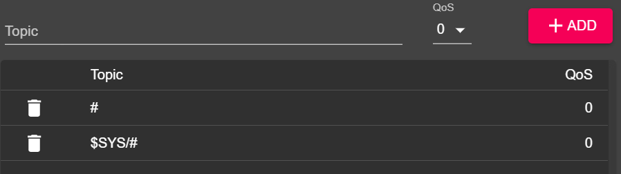

# Inicializando wis2box

!!! abstract "Objetivos de aprendizagem"

    Ao final desta sessão prática, você será capaz de:

    - executar o script `wis2box-create-config.py` para criar a configuração inicial
    - iniciar o wis2box e verificar o status de seus componentes
    - visualizar o conteúdo do **wis2box-api**
    - acessar o **wis2box-webapp**
    - conectar-se ao **wis2box-broker** local usando MQTT Explorer

!!! note

    Os materiais de treinamento atuais são baseados no wis2box-release 1.0.0.
    
    Consulte [accessing-your-student-vm](accessing-your-student-vm.md) para instruções sobre como baixar e instalar o conjunto de software wis2box se você estiver executando este treinamento fora de uma sessão de treinamento local.

## Preparação

Faça login na sua VM designada com seu nome de usuário e senha e certifique-se de estar no diretório `wis2box`:

```bash
cd ~/wis2box
```

## Criando a configuração inicial

A configuração inicial do wis2box requer:

- um arquivo de ambiente `wis2box.env` contendo os parâmetros de configuração
- um diretório na máquina host para compartilhar entre a máquina host e os contêineres wis2box definidos pela variável de ambiente `WIS2BOX_HOST_DATADIR`

O script `wis2box-create-config.py` pode ser usado para criar a configuração inicial do seu wis2box.

Ele fará um conjunto de perguntas para ajudar a configurar sua instalação.

Você poderá revisar e atualizar os arquivos de configuração após a conclusão do script.

Execute o script da seguinte forma:

```bash
python3 wis2box-create-config.py
```

### Diretório wis2box-host-data

O script solicitará que você insira o diretório a ser usado para a variável de ambiente `WIS2BOX_HOST_DATADIR`.

Observe que você precisa definir o caminho completo para este diretório.

Por exemplo, se seu nome de usuário for `username`, o caminho completo para o diretório é `/home/username/wis2box-data`:

```{.copy}
username@student-vm-username:~/wis2box$ python3 wis2box-create-config.py
Please enter the directory to be used for WIS2BOX_HOST_DATADIR:
/home/username/wis2box-data
The directory to be used for WIS2BOX_HOST_DATADIR will be set to:
    /home/username/wis2box-data
Is this correct? (y/n/exit)
y
The directory /home/username/wis2box-data has been created.
```

### URL do wis2box

Em seguida, você será solicitado a inserir a URL para seu wis2box. Esta é a URL que será usada para acessar o aplicativo web, API e UI do wis2box.

Por favor, use `http://<your-hostname-or-ip>` como URL.

```{.copy}
Please enter the URL of the wis2box:
 For local testing the URL is http://localhost
 To enable remote access, the URL should point to the public IP address or domain name of the server hosting the wis2box.
http://username.wis2.training
The URL of the wis2box will be set to:
  http://username.wis2.training
Is this correct? (y/n/exit)
```

### Senhas WEBAPP, STORAGE e BROKER

Você pode usar a opção de geração de senha aleatória quando solicitado para `WIS2BOX_WEBAPP_PASSWORD`, `WIS2BOX_STORAGE_PASSWORD`, `WIS2BOX_BROKER_PASSWORD` e definir suas próprias senhas.

Não se preocupe em lembrar essas senhas, elas serão armazenadas no arquivo `wis2box.env` no seu diretório wis2box.

### Revisar `wis2box.env`

Após a conclusão do script, verifique o conteúdo do arquivo `wis2box.env` em seu diretório atual:

```bash
cat ~/wis2box/wis2box.env
```

Ou verifique o conteúdo do arquivo via WinSCP.

!!! question

    Qual é o valor de WISBOX_BASEMAP_URL no arquivo wis2box.env?

??? success "Clique para revelar a resposta"

    O valor padrão para WIS2BOX_BASEMAP_URL é `https://{s}.tile.openstreetmap.org/{z}/{x}/{y}.png`.

    Esta URL refere-se ao servidor de tiles do OpenStreetMap. Se você quiser usar um provedor de mapas diferente, pode alterar esta URL para apontar para um servidor de tiles diferente.

!!! question 

    Qual é o valor da variável de ambiente WIS2BOX_STORAGE_DATA_RETENTION_DAYS no arquivo wis2box.env?

??? success "Clique para revelar a resposta"

    O valor padrão para WIS2BOX_STORAGE_DATA_RETENTION_DAYS é 30 dias. Você pode alterar este valor para um número diferente de dias, se desejar.
    
    O contêiner wis2box-management executa um cronjob diariamente para remover dados mais antigos que o número de dias definido por WIS2BOX_STORAGE_DATA_RETENTION_DAYS do bucket `wis2box-public` e do backend da API:
    
    ```{.copy}
    0 0 * * * su wis2box -c "wis2box data clean --days=$WIS2BOX_STORAGE_DATA_RETENTION_DAYS"
    ```

!!! note

    O arquivo `wis2box.env` contém variáveis de ambiente que definem a configuração do seu wis2box. Para mais informações, consulte a [documentação do wis2box](https://docs.wis2box.wis.wmo.int/en/latest/reference/configuration.html).

    Não edite o arquivo `wis2box.env` a menos que você tenha certeza das alterações que está fazendo. Alterações incorretas podem fazer com que seu wis2box pare de funcionar.

    Não compartilhe o conteúdo do seu arquivo `wis2box.env` com ninguém, pois ele contém informações sensíveis como senhas.

## Iniciar wis2box

Certifique-se de estar no diretório contendo os arquivos de definição do conjunto de software wis2box:

```{.copy}
cd ~/wis2box
```

Inicie o wis2box com o seguinte comando:

```{.copy}
python3 wis2box-ctl.py start
```

Ao executar este comando pela primeira vez, você verá a seguinte saída:

```
No docker-compose.images-*.yml files found, creating one
Current version=Undefined, latest version=1.0.0
Would you like to update ? (y/n/exit)
```

Selecione ``y`` e o script criará o arquivo ``docker-compose.images-1.0.0.yml``, baixará as imagens Docker necessárias e iniciará os serviços.

O download das imagens pode levar algum tempo, dependendo da velocidade da sua conexão com a internet. Esta etapa é necessária apenas na primeira vez que você iniciar o wis2box.

Inspecione o status com o seguinte comando:

```{.copy}
python3 wis2box-ctl.py status
```

Repita este comando até que todos os serviços estejam em execução.

!!! note "wis2box e Docker"
    O wis2box é executado como um conjunto de contêineres Docker gerenciados pelo docker-compose.
    
    Os serviços são definidos nos vários arquivos `docker-compose*.yml` que podem ser encontrados no diretório `~/wis2box/`.
    
    O script Python `wis2box-ctl.py` é usado para executar os comandos Docker Compose subjacentes que controlam os serviços wis2box.

    Você não precisa conhecer os detalhes dos contêineres Docker para executar o conjunto de software wis2box, mas pode inspecionar os arquivos `docker-compose*.yml` para ver como os serviços são definidos. Se você estiver interessado em aprender mais sobre Docker, pode encontrar mais informações na [documentação do Docker](https://docs.docker.com/).

Para fazer login no contêiner wis2box-management, use o seguinte comando:

```{.copy}
python3 wis2box-ctl.py login
```

Dentro do contêiner wis2box-management, você pode executar vários comandos para gerenciar seu wis2box, como:

- `wis2box auth add-token --path processes/wis2box` : para criar um token de autorização para o endpoint `processes/wis2box`
- `wis2box data clean --days=<number-of-days>` : para limpar dados mais antigos que um determinado número de dias do bucket `wis2box-public`

Para sair do contêiner e voltar à máquina host, use o seguinte comando:

```{.copy}
exit
```

Execute o seguinte comando para ver os contêineres docker em execução em sua máquina host:

```{.copy}
docker ps
```

Você deverá ver os seguintes contêineres em execução:

- wis2box-management
- wis2box-api
- wis2box-minio
- wis2box-webapp
- wis2box-auth
- wis2box-ui
- wis2downloader
- elasticsearch
- elasticsearch-exporter
- nginx
- mosquitto
- prometheus
- grafana
- loki

Estes contêineres fazem parte do conjunto de software wis2box e fornecem os vários serviços necessários para executar o wis2box.

Execute o seguinte comando para ver os volumes docker em execução em sua máquina host:

```{.copy}
docker volume ls
```

Você deverá ver os seguintes volumes:

- wis2box_project_auth-data
- wis2box_project_es-data
- wis2box_project_htpasswd
- wis2box_project_minio-data
- wis2box_project_prometheus-data
- wis2box_project_loki-data
- wis2box_project_mosquitto-config

Além de alguns volumes anônimos usados pelos vários contêineres.

Os volumes começando com `wis2box_project_` são usados para armazenar dados persistentes para os vários serviços no conjunto de software wis2box.

## API do wis2box

O wis2box contém uma API (Interface de Programação de Aplicações) que fornece acesso a dados e processos para visualização interativa, transformação de dados e publicação.

Abra uma nova aba e navegue até a página `http://YOUR-HOST/oapi`.


Esta é a página inicial da API do wis2box (executando via contêiner **wis2box-api**).

!!! question
     
     Quais coleções estão atualmente disponíveis?

??? success "Clique para revelar a resposta"
    
    Para visualizar as coleções atualmente disponíveis através da API, clique em `View the collections in this service`:

    

    As seguintes coleções estão atualmente disponíveis:

    - Stations
    - Data notifications
    - Discovery metadata

!!! question

    Quantas notificações de dados foram publicadas?

??? success "Clique para revelar a resposta"

    Clique em "Data notifications", depois clique em `Browse through the items of "Data Notifications"`. 
    
    Você notará que a página diz "No items" pois nenhuma notificação de dados foi publicada ainda.

## webapp do wis2box

Abra um navegador web e visite a página `http://YOUR-HOST/wis2box-webapp`.

Você verá um pop-up solicitando seu nome de usuário e senha. Use o nome de usuário padrão `wis2box-user` e a `WIS2BOX_WEBAPP_PASSWORD` definida no arquivo `wis2box.env` e clique em "Sign in":

!!! note 

    Verifique seu wis2box.env para o valor de WIS2BOX_WEBAPP_PASSWORD. Você pode usar o seguinte comando para verificar o valor desta variável de ambiente:

    ```{.copy}
    cat ~/wis2box/wis2box.env | grep WIS2BOX_WEBAPP_PASSWORD
    ```

Depois de fazer login, mova seu mouse para o menu à esquerda para ver as opções disponíveis no aplicativo web wis2box:


Este é o aplicativo web wis2box que permite que você interaja com seu wis2box:

- criar e gerenciar conjuntos de dados
- atualizar/revisar seus metadados de estação
- carregar observações manuais usando o formulário FM-12 synop
- monitorar notificações publicadas em seu wis2box-broker

Usaremos este aplicativo web em uma sessão posterior.

## wis2box-broker

Abra o MQTT Explorer em seu computador e prepare uma nova conexão para conectar ao seu broker (executando via contêiner **wis2box-broker**).

Clique em `+` para adicionar uma nova conexão:


Você pode clicar no botão 'ADVANCED' e verificar se você tem assinaturas para os seguintes tópicos:

- `#`
- `$SYS/#`



!!! note

    O tópico `#` é uma assinatura curinga que irá assinar todos os tópicos publicados no broker.

    As mensagens publicadas sob o tópico `$SYS` são mensagens do sistema publicadas pelo próprio serviço mosquitto.

Use os seguintes detalhes de conexão, certificando-se de substituir o valor de `<your-host>` pelo seu nome de host e `<WIS2BOX_BROKER_PASSWORD>` pelo valor do seu arquivo `wis2box.env`:

- **Protocol: mqtt://**
- **Host: `<your-host>`**
- **Port: 1883**
- **Username: wis2box**
- **Password: `<WIS2BOX_BROKER_PASSWORD>`**

!!! note 

    Você pode verificar seu wis2box.env para o valor de WIS2BOX_BROKER_PASSWORD. Você pode usar o seguinte comando para verificar o valor desta variável de ambiente:

    ```{.copy}
    cat ~/wis2box/wis2box.env | grep WIS2BOX_BROKER_PASSWORD
    ```

    Note que esta é sua senha de broker **interna**, o Global Broker usará