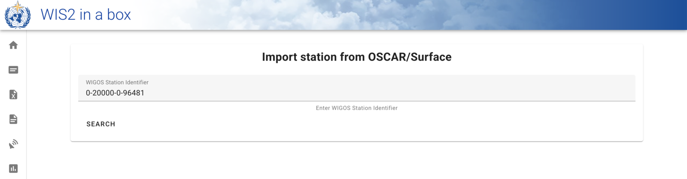
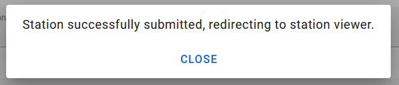

# Настройка метаданных станций

!!! abstract "Результаты обучения"

    К концу этого практического занятия вы сможете:

    - создать токен авторизации для конечной точки `collections/stations`
    - добавлять метаданные станций в wis2box
    - обновлять/удалять метаданные станций с помощью **wis2box-webapp**

## Введение

Для международного обмена данными между членами ВМО важно иметь общее понимание станций, производящих данные. Интегрированная глобальная система наблюдений ВМО (WIGOS) предоставляет основу для интеграции систем наблюдений и систем управления данными. **Идентификатор станции WIGOS (WSI)** используется как уникальная ссылка на станцию, которая произвела определенный набор данных наблюдений.

wis2box имеет коллекцию метаданных станций, которая используется для описания станций, производящих данные наблюдений, и должна быть получена из **OSCAR/Surface**. Метаданные станций в wis2box используются инструментами преобразования BUFR для проверки того, что входные данные содержат действительный идентификатор станции WIGOS (WSI), и для обеспечения соответствия между WSI и метаданными станции.

## Создание токена авторизации для collections/stations

Чтобы редактировать станции через **wis2box-webapp**, сначала нужно создать токен авторизации.

Войдите в свою студенческую VM и убедитесь, что вы находитесь в директории `wis2box`:

```bash
cd ~/wis2box
```

Затем войдите в контейнер **wis2box-management** следующей командой:

```bash
python3 wis2box-ctl.py login
```

Внутри контейнера **wis2box-management** вы можете создать токен авторизации для определенной конечной точки, используя команду: `wis2box auth add-token --path <my-endpoint>`.

Например, чтобы использовать случайно сгенерированный токен для конечной точки `collections/stations`:

```{.copy}
wis2box auth add-token --path collections/stations
```	

Вывод будет выглядеть так:

```{.copy}
Continue with token: 7ca20386a131f0de384e6ffa288eb1ae385364b3694e47e3b451598c82e899d1 [y/N]? y
Token successfully created
```

Или, если вы хотите определить свой собственный токен для конечной точки `collections/stations`, вы можете использовать следующий пример:

```{.copy}
wis2box auth add-token --path collections/stations DataIsMagic
```

Вывод:
    
```{.copy}
Continue with token: DataIsMagic [y/N]? y
Token successfully created
```

Пожалуйста, создайте токен авторизации для конечной точки `collections/stations`, используя приведенные выше инструкции.

## Добавление метаданных станций с помощью **wis2box-webapp**

**wis2box-webapp** предоставляет графический интерфейс пользователя для редактирования метаданных станций.

Откройте **wis2box-webapp** в вашем браузере, перейдя по адресу `http://YOUR-HOST/wis2box-webapp`, и выберите станции:


Когда вы нажимаете "добавить новую станцию", вас просят указать идентификатор станции WIGOS для станции, которую вы хотите добавить:



!!! note "Добавьте метаданные для 3 или более станций"
    Пожалуйста, добавьте три или более станций в коллекцию метаданных станций вашего wis2box.
      
    Пожалуйста, используйте станции из вашей страны, если это возможно, особенно если вы принесли свои собственные данные.
      
    Если в вашей стране нет станций в OSCAR/Surface, вы можете использовать следующие станции для этого упражнения:

      - 0-20000-0-91334
      - 0-20000-0-96323 (обратите внимание на отсутствующую высоту станции в OSCAR)
      - 0-20000-0-96749 (обратите внимание на отсутствующую высоту станции в OSCAR)

Когда вы нажимаете "поиск", данные станции извлекаются из OSCAR/Surface, обратите внимание, что это может занять несколько секунд.

Просмотрите данные, полученные из OSCAR/Surface, и добавьте недостающие данные, где это необходимо. Выберите тему для станции и укажите ваш токен авторизации для конечной точки `collections/stations` и нажмите "сохранить":




Вернитесь к списку станций, и вы увидите добавленную станцию:


Повторяйте этот процесс, пока у вас не будет настроено как минимум 3 станции.

!!! tip "Получение отсутствующей информации о высоте"

    Если высота вашей станции отсутствует, существуют онлайн-сервисы, помогающие найти высоту с помощью открытых данных о рельефе. Одним из таких примеров является [Open Topo Data API](https://www.opentopodata.org).

    Например, чтобы получить высоту на широте -6.15558 и долготе 106.84204, вы можете скопировать и вставить следующий URL в новую вкладку браузера:

    ```{.copy}
    https://api.opentopodata.org/v1/aster30m?locations=-6.15558,106.84204
    ```

    Вывод:

    ```{.copy}
    {
      "results": [
        {
          "dataset": "aster30m", 
          "elevation": 7.0, 
          "location": {
            "lat": -6.15558, 
            "lng": 106.84204
          }
        }
      ], 
      "status": "OK"
    }
    ```

## Просмотр метаданных ваших станций

Метаданные станций хранятся в бэкенде wis2box и доступны через **wis2box-api**. 

Если вы откроете браузер и перейдете по адресу `http://YOUR-HOST/oapi/collections/stations/items`, вы увидите добавленные метаданные станций:


!!! note "Просмотр метаданных ваших станций"

    Проверьте, что добавленные вами станции связаны с вашим набором данных, посетив `http://YOUR-HOST/oapi/collections/stations/items` в вашем браузере.

У вас также есть возможность просматривать/обновлять/удалять станции в **wis2box-webapp**. Обратите внимание, что для обновления/удаления станции требуется предоставить токен авторизации для конечной точки `collections/stations`.

!!! note "Обновление/удаление метаданных станций"

    Попробуйте обновить/удалить метаданные станции для одной из добавленных вами станций с помощью **wis2box-webapp**.

## Массовая загрузка метаданных станций

Обратите внимание, что wis2box также имеет возможность выполнять "массовую" загрузку метаданных станций из CSV-файла с помощью командной строки в контейнере **wis2box-management**.

```bash
python3 wis2box-ctl.py login
wis2box metadata station publish-collection -p /data/wis2box/metadata/station/station_list.csv -th origin/a/wis2/centre-id/weather/surface-based-observations/synop
```

Это позволяет загружать большое количество станций одновременно и связывать их с определенной темой.

Вы можете создать CSV-файл с помощью Excel или текстового редактора, а затем загрузить его в wis2box-host-datadir, чтобы сделать его доступным для контейнера **wis2box-management** в директории `/data/wis2box/`.

После массовой загрузки станций рекомендуется просмотреть станции в **wis2box-webapp**, чтобы убедиться, что данные были загружены правильно.

Дополнительную информацию об использовании этой функции см. в официальной [документации wis2box](https://docs.wis2box.wis.wmo.int).

## Заключение

!!! success "Поздравляем!"
    В этом практическом занятии вы научились:

    - создавать токен авторизации для конечной точки `collections/stations` для использования с **wis2box-webapp**
    - добавлять метаданные станций в wis2box с помощью **wis2box-webapp**
    - просматривать/обновлять/удалять метаданные станций с помощью **wis2box-webapp**