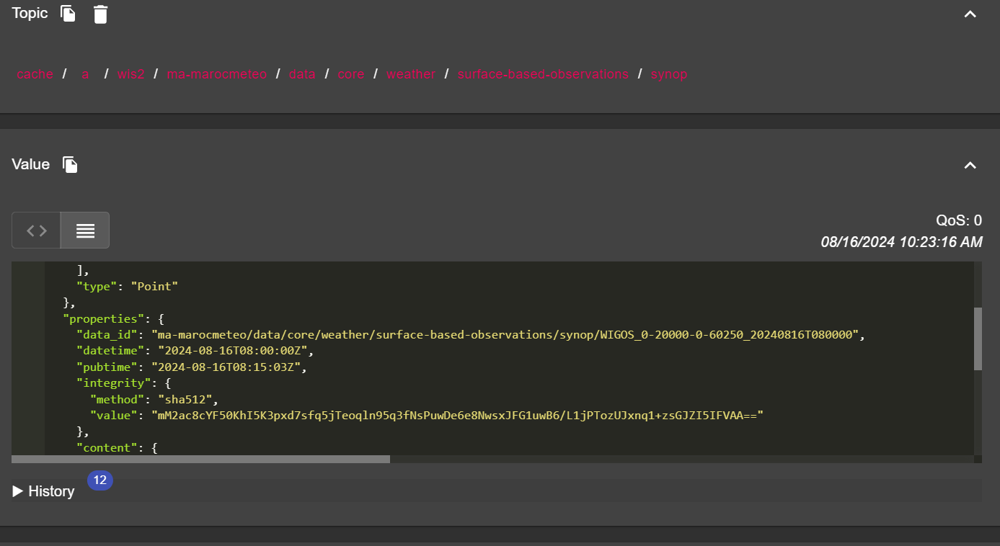

# Подключение к WIS2 через MQTT

!!! abstract "Учебные результаты"

    По окончании этого практического занятия вы сможете:

    - подключиться к Глобальному Брокеру WIS2 с помощью MQTT Explorer
    - изучить структуру топиков WIS2
    - изучить структуру уведомлений WIS2

## Введение

WIS2 использует протокол MQTT для объявления о доступности данных о погоде/климате/воде. Глобальный Брокер WIS2 подписывается на все узлы WIS2 в сети и переиздает полученные сообщения. Глобальный Кэш подписывается на Глобального Брокера, загружает данные из сообщения, а затем переиздает сообщение в топике `cache` с новым URL. Глобальный Каталог Открытий публикует метаданные открытия от Брокера и предоставляет API поиска.

Вот пример структуры уведомлений WIS2 для сообщения, полученного по топику `origin/a/wis2/br-inmet/data/core/weather/surface-based-observations/synop`:	

```json
{
  "id": "59f9b013-c4b3-410a-a52d-fff18f3f1b47",
  "type": "Feature",
  "version": "v04",
  "geometry": {
    "coordinates": [
      -38.69389,
      -17.96472,
      60
    ],
    "type": "Point"
  },
  "properties": {
    "data_id": "br-inmet/data/core/weather/surface-based-observations/synop/WIGOS_0-76-2-2900801000W83499_20240815T060000",
    "datetime": "2024-08-15T06:00:00Z",
    "pubtime": "2024-08-15T09:52:02Z",
    "integrity": {
      "method": "sha512",
      "value": "TBuWycx/G0lIiTo47eFPBViGutxcIyk7eikppAKPc4aHgOmTIS5Wb9+0v3awMOyCgwpFhTruRRCVReMQMp5kYw=="
    },
    "content": {
      "encoding": "base64",
      "value": "QlVGUgAA+gQAABYAACsAAAAAAAIAHAAH6AgPBgAAAAALAAABgMGWx1AAAM0ABOIAAAODM0OTkAAAAAAAAAAAAAAKb5oKEpJ6YkJ6mAAAAAAAAAAAAAAAAv0QeYA29WQa87ZhH4CQP//z+P//BD////+ASznXuUb///8MgAS3/////8X///e+AP////AB/+R/yf////////////////////6/1/79H/3///gEt////////4BLP6QAf/+/pAB//4H0YJ/YeAh/f2///7TH/////9+j//f///////////////////v0f//////////////////////wNzc3Nw==",
      "size": 250
    },
    "wigos_station_identifier": "0-76-2-2900801000W83499"
  },
  "links": [
    {
      "rel": "canonical",
      "type": "application/bufr",
      "href": "http://wis2bra.inmet.gov.br/data/2024-08-15/wis/br-inmet/data/core/weather/surface-based-observations/synop/WIGOS_0-76-2-2900801000W83499_20240815T060000.bufr4",
      "length": 250
    }
  ]
}
``` 

На этом практическом занятии вы научитесь использовать инструмент MQTT Explorer для настройки подключения клиента MQTT к Глобальному Брокеру WIS2 и отображения уведомлений WIS2.

MQTT Explorer - полезный инструмент для просмотра и изучения структуры топиков для данного брокера MQTT для просмотра публикуемых данных.

Обратите внимание, что MQTT в основном используется для коммуникации "машина-машина"; это означает, что обычно клиент автоматически анализирует сообщения по мере их получения. Для программной работы с MQTT (например, на Python) вы можете использовать библиотеки клиента MQTT, такие как [paho-mqtt](https://pypi.org/project/paho-mqtt), чтобы подключиться к брокеру MQTT и обрабатывать входящие сообщения. Существует множество программного обеспечения для клиентов и серверов MQTT, в зависимости от ваших требований и технической среды.

## Использование MQTT Explorer для подключения к Глобальному Брокеру

Чтобы просмотреть сообщения, опубликованные Глобальным Брокером WIS2, можно использовать "MQTT Explorer", который можно загрузить с [сайта MQTT Explorer](https://mqtt-explorer.com).

Откройте MQTT Explorer и добавьте новое подключение к Глобальному Брокеру, размещенному MeteoFrance, используя следующие данные:

- хост: globalbroker.meteo.fr
- порт: 8883
- имя пользователя: everyone
- пароль: everyone


Нажмите кнопку 'ADVANCED', удалите предварительно настроенные топики и добавьте следующие топики для подписки:

- `origin/a/wis2/#`


!!! note
    При настройке подписок MQTT можно использовать следующие подстановочные знаки:

    - **Одноуровневый (+)**: одноуровневый подстановочный знак заменяет один уровень топика
    - **Многоуровневый (#)**: многоуровневый подстановочный знак заменяет несколько уровней топика

    В данном случае `origin/a/wis2/#` подпишет вас на все топики под `origin/a/wis2`.

Нажмите 'BACK', затем 'SAVE', чтобы сохранить данные вашего подключения и подписки. Затем нажмите 'CONNECT':

Сообщения должны начать появляться в вашей сессии MQTT Explorer следующим образом:


Теперь вы готовы начать изучение топиков и структуры сообщений WIS2.

## Упражнение 1: Изучение структуры топиков WIS2

Используйте MQTT для просмотра структуры топиков в разделе `origin`.

!!! question
    
    Как мы можем определить центр WIS, который опубликовал данные?

??? success "Нажмите, чтобы увидеть ответ"

    Вы можете щелкнуть по окну слева в MQTT Explorer, чтобы развернуть структуру топиков.
    
    Мы можем определить центр WIS, который опубликовал данные, посмотрев на четвертый уровень структуры топика. Например, следующий топик:

    `origin/a/wis2/br-inmet/data/core/weather/surface-based-observations/synop`

    говорит нам, что данные были опубликованы центром WIS с идентификатором центра `br-inmet`, который является идентификатором центра для Instituto Nacional de Meteorologia - INMET, Бразилия.

!!! question

    Как мы можем различать сообщения, опубликованные центрами WIS, которые размещают шлюз GTS-to-WIS2, и сообщения, опубликованные центрами WIS, которые размещают узел WIS2?

??? success "Нажмите, чтобы увидеть ответ"

    Мы можем различать сообщения, исходящие от шлюза GTS-to-WIS2, посмотрев на идентификатор центра в структуре топика. Например, следующий топик:

    `origin/a/wis2/de-dwd-gts-to-wis2/data/core/I/S/A/I/01/sbbr`

    говорит нам, что данные были опубликованы шлюзом GTS-to-WIS2, размещенным Deutscher Wetterdienst (DWD), Германия. Шлюз GTS-to-WIS2 - это специальный тип издателя данных, который публикует данные из Глобальной телекоммуникационной системы (GTS) в WIS2. Структура топика составлена из заголовков TTAAii CCCC для сообщений GTS.

## Упражнение 2: Изучение структуры сообщений WIS2

Отключитесь от MQTT Explorer и обновите раздел 'Advanced', чтобы изменить подписку на следующие:

* `origin/a/wis2/+/data/core/weather/surface-based-observations/synop`
* `cache/a/wis2/+/data/core/weather/surface-based-observations/synop`


!!! note
    Подстановочный знак `+` используется для подписки на все центры WIS.

Подключитесь снова к Глобальному Брокеру и дождитесь появления сообщений.

Вы можете просмотреть содержимое сообщения WIS2 в разделе "Value" справа. Попробуйте развернуть структуру топика, чтобы увидеть разные уровни сообщения, пока не дойдете до последнего уровня и не изучите содержимое одного из сообщений.

!!! question

    Как мы можем определить временную метку, когда данные были опубликованы? И как мы можем определить временную метку, когда данные были собраны?

??? success "Нажмите, чтобы увидеть ответ"

    Временная метка, когда данные были опубликованы, содержится в разделе `properties` сообщения с ключом `pubtime`.

    Временная метка, когда данные были собраны, содержится в разделе `properties` сообщения с ключом `datetime`.

    

!!! question

    Как мы можем загрузить данные по предоставленному URL в сообщении?

??? success "Нажмите, чтобы увидеть ответ"

    URL содержится в разделе `links` с `rel="canonical"` и определяется ключом `href`.

    Вы можете скопировать URL и вставить его в веб-браузер, чтобы загрузить данные.

## Упражнение 3: Изучение различий между топиками 'origin' и 'cache'

Убедитесь, что вы все еще подключены к Глобальному Брокеру с подписками на топики `origin/a/wis2/+/data/core/weather/surface-based-observations/synop` и `cache/a/wis2/+/data/core/weather/surface-based-observations/synop`, как описано в Упражнении 2.

Попробуйте идентифицировать сообщение для одного и того же идентификатора центра, опубликованное как в топиках `origin`, так и в топиках `cache`.

!!! question

    В чем разница между сообщениями, опубликованными в топиках `origin` и `cache`?

??? success "Нажмите, чтобы увидеть ответ"

    Сообщения, опубликованные в топиках `origin`, являются оригинальными сообщениями, которые Глобальный Брокер переиздает от узлов WIS2 в сети.

    Сообщения, опубликованные в топиках `cache`, являются сообщениями для данных, которые были загружены Глобальным Кэшем. Если вы проверите содержимое сообщения из топика, начинающегося с `cache`, вы увидите, что ссылка 'canonical' была обновлена на новый URL.
    
    В сети WIS2 есть несколько Глобальных Кэшей, поэтому вы получите одно сообщение от каждого Глобального Кэша, который загрузил сообщение.

    Глобальный Кэш загружает и переиздает сообщения только те, которые были опубликованы в иерархии топиков `../data/core/...`.

## Заключение

!!! success "Поздравляем!"
    На этом практическом занятии вы научились:

    - подписываться на услуги Глобального Брокера WIS2 с помощью MQTT Explorer
    - структуре топиков WIS2
    - структуре уведомлений WIS2
    - различиям между основными и рекомендуемыми данными
    - структуре топиков, используемой шлюзом GTS-to-WIS2
    - различиям между сообщениями Глобального Брокера, опубликованными в топиках `origin` и `cache`