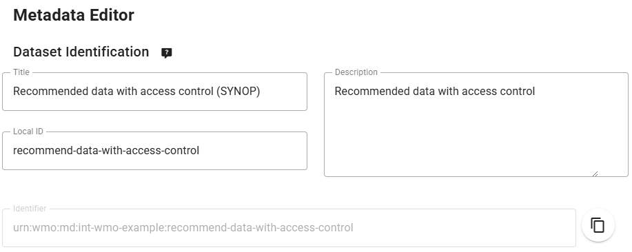

# Настройка рекомендуемого набора данных с контролем доступа

!!! abstract "Результаты обучения"
    По завершении этого практического занятия вы сможете:

    - создать новый набор данных с политикой данных 'recommended'
    - добавить токен доступа к набору данных
    - проверить, что доступ к набору данных невозможен без токена доступа
    - добавить токен доступа в HTTP-заголовки для доступа к набору данных

## Введение

Наборы данных, которые не считаются 'core' наборами данных в WMO, могут быть дополнительно настроены с политикой контроля доступа. wis2box предоставляет механизм добавления токена доступа к набору данных, который предотвратит загрузку данных пользователями, если они не предоставят токен доступа в HTTP-заголовках.

## Подготовка

Убедитесь, что у вас есть SSH-доступ к вашей учебной виртуальной машине и что ваш экземпляр wis2box запущен и работает.

Убедитесь, что вы подключены к MQTT-брокеру вашего экземпляра wis2box с помощью MQTT Explorer. Для подключения к брокеру можно использовать публичные учетные данные `everyone/everyone`.

Убедитесь, что у вас открыт веб-браузер с wis2box-webapp для вашего экземпляра, перейдя по адресу `http://YOUR-HOST/wis2box-webapp`.

## Создание нового набора данных с политикой данных 'recommended'

Перейдите на страницу 'dataset editor' в wis2box-webapp и создайте новый набор данных. Выберите Data Type = 'weather/surface-weather-observations/synop'.

Для "Centre ID" используйте то же значение, что и в предыдущих практических занятиях.

Нажмите 'CONTINUE To FORM' для продолжения.

В редакторе наборов данных установите политику данных на 'recommended' (обратите внимание, что изменение data-policy обновит 'Topic Hierarchy').
Замените автоматически сгенерированный 'Local ID' на описательное имя для набора данных, например, 'recommended-data-with-access-control':

Продолжите заполнять обязательные поля для Пространственных свойств и Контактной информации, и 'Validate form' для проверки наличия ошибок.

Наконец, отправьте набор данных, используя ранее созданный токен аутентификации, и проверьте, что новый набор данных создан в wis2box-webapp.

Проверьте MQTT-explorer, чтобы увидеть, что вы получаете WIS2 Notification Message, объявляющее новую запись Discovery Metadata по теме `origin/a/wis2/<your-centre-id>/metadata`.

[Продолжение перевода следует в том же стиле, сохраняя все технические термины и форматирование...]