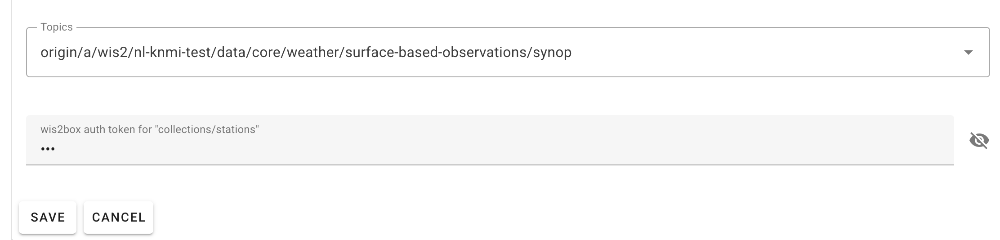

# Загрузка данных для публикации

!!! abstract "Результаты обучения"

    По завершении этого практического занятия вы сможете:
    
    - Запускать рабочий процесс wis2box путём загрузки данных в MinIO через командную строку, веб-интерфейс MinIO, SFTP или Python-скрипт.
    - Использовать панель Grafana для мониторинга статуса загрузки данных и просмотра логов вашего экземпляра wis2box.
    - Просматривать уведомления о данных WIS2, опубликованные вашим wis2box, используя MQTT Explorer.

## Введение

В WIS2 данные передаются в реальном времени с помощью уведомлений о данных WIS2, которые содержат "канонические" ссылки, по которым можно загрузить данные.

Для запуска рабочего процесса данных в WIS2 Node с использованием программного обеспечения wis2box, данные должны быть загружены в корзину **wis2box-incoming** в **MinIO**, что инициирует рабочий процесс wis2box. В результате этого процесса данные публикуются через уведомление о данных WIS2. В зависимости от настроек сопоставления данных в вашем экземпляре wis2box, данные могут быть преобразованы в формат BUFR перед публикацией.

В этом упражнении мы будем использовать примеры файлов данных для запуска рабочего процесса wis2box и **публикации уведомлений о данных WIS2** для набора данных, который вы настроили в предыдущем практическом занятии.

Во время упражнения мы будем отслеживать статус загрузки данных с помощью **панели Grafana** и **MQTT Explorer**. Панель Grafana использует данные из Prometheus и Loki для отображения статуса вашего wis2box, в то время как MQTT Explorer позволяет видеть уведомления о данных WIS2, опубликованные вашим экземпляром wis2box.

Обратите внимание, что wis2box преобразует примеры данных в формат BUFR перед публикацией в MQTT-брокере, согласно предварительно настроенным сопоставлениям данных в вашем наборе данных. В этом упражнении мы сосредоточимся на различных методах загрузки данных в ваш экземпляр wis2box и проверке успешной загрузки и публикации. Преобразование данных будет рассмотрено позже в практическом занятии [Инструменты преобразования данных](../data-conversion-tools).

## Подготовка

Этот раздел использует набор данных "surface-based-observations/synop", ранее созданный в практическом занятии [Настройка наборов данных в wis2box](/practical-sessions/configuring-wis2box-datasets). Также требуются знания о настройке станций в **wis2box-webapp**, как описано в практическом занятии [Настройка метаданных станций](/practical-sessions/configuring-station-metadata).

Убедитесь, что вы можете войти в свою учебную виртуальную машину с помощью SSH-клиента (например, PuTTY).

Убедитесь, что wis2box запущен и работает:

```bash
cd ~/wis2box/
python3 wis2box-ctl.py start
python3 wis2box-ctl.py status
```

Убедитесь, что MQTT Explorer запущен и подключен к вашему экземпляру с использованием публичных учетных данных `everyone/everyone` с подпиской на тему `origin/a/wis2/#`.

Убедитесь, что у вас открыт веб-браузер с панелью Grafana для вашего экземпляра, перейдя по адресу `http://YOUR-HOST:3000`.

### Подготовка примеров данных

Скопируйте каталог `exercise-materials/data-ingest-exercises` в каталог, который вы определили как `WIS2BOX_HOST_DATADIR` в вашем файле `wis2box.env`:

```bash
cp -r ~/exercise-materials/data-ingest-exercises ~/wis2box-data/
```

!!! note
    `WIS2BOX_HOST_DATADIR` монтируется как `/data/wis2box/` внутри контейнера wis2box-management через файл `docker-compose.yml`, включенный в каталог `wis2box`.
    
    Это позволяет обмениваться данными между хостом и контейнером.

### Добавление тестовой станции

Добавьте станцию с идентификатором WIGOS `0-20000-0-64400` в ваш экземпляр wis2box, используя редактор станций в wis2box-webapp.

Получите станцию из OSCAR:


Добавьте станцию в наборы данных, которые вы создали для публикации в "../surface-based-observations/synop", и сохраните изменения, используя ваш токен аутентификации:



Обратите внимание, что вы можете удалить эту станцию из вашего набора данных после практического занятия.

[Продолжение перевода следует в следующей части из-за ограничений по длине ответа]