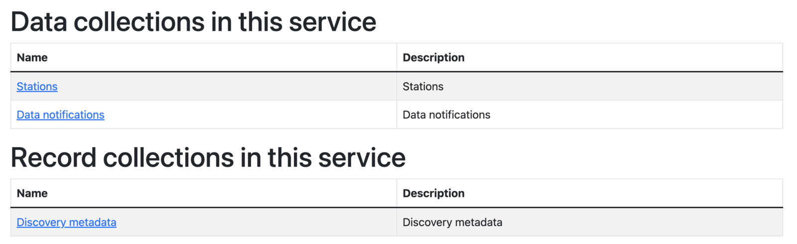

# Инициализация wis2box

!!! abstract "Результаты обучения"

    По завершении этого практического занятия вы сможете:

    - запустить скрипт `wis2box-create-config.py` для создания начальной конфигурации
    - запустить wis2box и проверить статус его компонентов
    - просматривать содержимое **wis2box-api**
    - получить доступ к **wis2box-webapp**
    - подключиться к локальному **wis2box-broker** используя MQTT Explorer

!!! note

    Текущие учебные материалы основаны на wis2box-release 1.0.0.
    
    Смотрите [accessing-your-student-vm](accessing-your-student-vm.md) для получения инструкций по загрузке и установке программного стека wis2box, если вы проходите это обучение вне локальной учебной сессии.

## Подготовка

Войдите в вашу назначенную виртуальную машину с вашим именем пользователя и паролем и убедитесь, что вы находитесь в директории `wis2box`:

```bash
cd ~/wis2box
```

## Создание начальной конфигурации

Для начальной конфигурации wis2box требуется:

- файл окружения `wis2box.env`, содержащий параметры конфигурации
- директория на хост-машине для совместного использования между хост-машиной и контейнерами wis2box, определяемая переменной окружения `WIS2BOX_HOST_DATADIR`

Скрипт `wis2box-create-config.py` можно использовать для создания начальной конфигурации вашего wis2box.

Он задаст вам ряд вопросов, чтобы помочь настроить вашу конфигурацию.

После завершения работы скрипта вы сможете просмотреть и обновить конфигурационные файлы.

Запустите скрипт следующим образом:

```bash
python3 wis2box-create-config.py
```

### Директория wis2box-host-data

Скрипт попросит вас ввести директорию, которая будет использоваться для переменной окружения `WIS2BOX_HOST_DATADIR`.

Обратите внимание, что необходимо указать полный путь к этой директории.

Например, если ваше имя пользователя `username`, полный путь к директории будет `/home/username/wis2box-data`:

```{.copy}
username@student-vm-username:~/wis2box$ python3 wis2box-create-config.py
Please enter the directory to be used for WIS2BOX_HOST_DATADIR:
/home/username/wis2box-data
The directory to be used for WIS2BOX_HOST_DATADIR will be set to:
    /home/username/wis2box-data
Is this correct? (y/n/exit)
y
The directory /home/username/wis2box-data has been created.
```

### URL wis2box

Далее вас попросят ввести URL для вашего wis2box. Это URL, который будет использоваться для доступа к веб-приложению, API и пользовательскому интерфейсу wis2box.

Пожалуйста, используйте `http://<your-hostname-or-ip>` в качестве URL.

```{.copy}
Please enter the URL of the wis2box:
 For local testing the URL is http://localhost
 To enable remote access, the URL should point to the public IP address or domain name of the server hosting the wis2box.
http://username.wis2.training
The URL of the wis2box will be set to:
  http://username.wis2.training
Is this correct? (y/n/exit)
```

### Пароли для WEBAPP, STORAGE и BROKER

При запросе `WIS2BOX_WEBAPP_PASSWORD`, `WIS2BOX_STORAGE_PASSWORD`, `WIS2BOX_BROKER_PASSWORD` вы можете использовать опцию генерации случайных паролей или задать свои собственные.

Не беспокойтесь о запоминании этих паролей, они будут сохранены в файле `wis2box.env` в вашей директории wis2box.

### Просмотр `wis2box.env`

После завершения работы скрипта проверьте содержимое файла `wis2box.env` в текущей директории:

```bash
cat ~/wis2box/wis2box.env
```

Или проверьте содержимое файла через WinSCP.

!!! question

    Какое значение WISBOX_BASEMAP_URL в файле wis2box.env?

??? success "Нажмите, чтобы увидеть ответ"

    Значение по умолчанию для WIS2BOX_BASEMAP_URL - `https://{s}.tile.openstreetmap.org/{z}/{x}/{y}.png`.

    Этот URL ссылается на тайловый сервер OpenStreetMap. Если вы хотите использовать другого провайдера карт, вы можете изменить этот URL на другой тайловый сервер.

!!! question 

    Какое значение переменной окружения WIS2BOX_STORAGE_DATA_RETENTION_DAYS в файле wis2box.env?

??? success "Нажмите, чтобы увидеть ответ"

    Значение по умолчанию для WIS2BOX_STORAGE_DATA_RETENTION_DAYS составляет 30 дней. Вы можете изменить это значение на другое количество дней по желанию.
    
    Контейнер wis2box-management запускает cronjob ежедневно для удаления данных старше количества дней, определенного WIS2BOX_STORAGE_DATA_RETENTION_DAYS, из бакета `wis2box-public` и бэкенда API:
    
    ```{.copy}
    0 0 * * * su wis2box -c "wis2box data clean --days=$WIS2BOX_STORAGE_DATA_RETENTION_DAYS"
    ```

!!! note

    Файл `wis2box.env` содержит переменные окружения, определяющие конфигурацию вашего wis2box. Для получения дополнительной информации обратитесь к [wis2box-documentation](https://docs.wis2box.wis.wmo.int/en/latest/reference/configuration.html).

    Не редактируйте файл `wis2box.env`, если вы не уверены в вносимых изменениях. Неправильные изменения могут привести к прекращению работы вашего wis2box.

    Не делитесь содержимым вашего файла `wis2box.env` ни с кем, так как он содержит конфиденциальную информацию, такую как пароли.

## Запуск wis2box

Убедитесь, что вы находитесь в директории, содержащей файлы определения программного стека wis2box:

```{.copy}
cd ~/wis2box
```

Запустите wis2box следующей командой:

```{.copy}
python3 wis2box-ctl.py start
```

При первом запуске этой команды вы увидите следующий вывод:

```
No docker-compose.images-*.yml files found, creating one
Current version=Undefined, latest version=1.0.0
Would you like to update ? (y/n/exit)
```

Выберите ``y``, и скрипт создаст файл ``docker-compose.images-1.0.0.yml``, загрузит необходимые Docker-образы и запустит сервисы.

Загрузка образов может занять некоторое время в зависимости от скорости вашего интернет-соединения. Этот шаг требуется только при первом запуске wis2box.

Проверьте статус следующей командой:

```{.copy}
python3 wis2box-ctl.py status
```

Повторяйте эту команду, пока все сервисы не будут запущены и работающими.

!!! note "wis2box и Docker"
    wis2box работает как набор Docker-контейнеров, управляемых docker-compose.
    
    Сервисы определены в различных файлах `docker-compose*.yml`, которые можно найти в директории `~/wis2box/`.
    
    Python-скрипт `wis2box-ctl.py` используется для выполнения базовых команд Docker Compose, которые управляют сервисами wis2box.

    Вам не нужно знать детали Docker-контейнеров для запуска программного стека wis2box, но вы можете изучить файлы `docker-compose*.yml`, чтобы увидеть, как определены сервисы. Если вы хотите узнать больше о Docker, вы можете найти дополнительную информацию в [документации Docker](https://docs.docker.com/).

Для входа в контейнер wis2box-management используйте следующую команду:

```{.copy}
python3 wis2box-ctl.py login
```

Внутри контейнера wis2box-management вы можете выполнять различные команды для управления вашим wis2box, например:

- `wis2box auth add-token --path processes/wis2box` : для создания токена авторизации для конечной точки `processes/wis2box`
- `wis2box data clean --days=<number-of-days>` : для очистки данных старше определенного количества дней из бакета `wis2box-public`

Для выхода из контейнера и возврата на хост-машину используйте следующую команду:

```{.copy}
exit
```

Выполните следующую команду, чтобы увидеть docker-контейнеры, работающие на вашей хост-машине:

```{.copy}
docker ps
```

Вы должны увидеть следующие работающие контейнеры:

- wis2box-management
- wis2box-api
- wis2box-minio
- wis2box-webapp
- wis2box-auth
- wis2box-ui
- wis2downloader
- elasticsearch
- elasticsearch-exporter
- nginx
- mosquitto
- prometheus
- grafana
- loki

Эти контейнеры являются частью программного стека wis2box и предоставляют различные сервисы, необходимые для работы wis2box.

Выполните следующую команду, чтобы увидеть docker-тома, работающие на вашей хост-машине:

```{.copy}
docker volume ls
```

Вы должны увидеть следующие тома:

- wis2box_project_auth-data
- wis2box_project_es-data
- wis2box_project_htpasswd
- wis2box_project_minio-data
- wis2box_project_prometheus-data
- wis2box_project_loki-data
- wis2box_project_mosquitto-config

А также некоторые анонимные тома, используемые различными контейнерами.

Тома, начинающиеся с `wis2box_project_`, используются для хранения постоянных данных для различных сервисов в программном стеке wis2box.

## API wis2box

wis2box содержит API (интерфейс программирования приложений), который обеспечивает доступ к данным и процессам для интерактивной визуализации, преобразования данных и публикации.

Откройте новую вкладку и перейдите на страницу `http://YOUR-HOST/oapi`.


Это главная страница API wis2box (работающего через контейнер **wis2box-api**).

!!! question
     
     Какие коллекции сейчас доступны?

??? success "Нажмите, чтобы увидеть ответ"
    
    Чтобы просмотреть коллекции, доступные через API, нажмите `View the collections in this service`:

    

    Доступны следующие коллекции:

    - Stations
    - Data notifications
    - Discovery metadata


!!! question

    Сколько уведомлений о данных было опубликовано?

??? success "Нажмите, чтобы увидеть ответ"

    Нажмите на "Data notifications", затем нажмите на `Browse through the items of "Data Notifications"`. 
    
    Вы заметите, что на странице написано "No items", так как уведомления о данных еще не публиковались.

## Веб-приложение wis2box

Откройте веб-браузер и перейдите на страницу `http://YOUR-HOST/wis2box-webapp`.

Вы увидите всплывающее окно, запрашивающее ваше имя пользователя и пароль. Используйте имя пользователя по умолчанию `wis2box-user` и `WIS2BOX_WEBAPP_PASSWORD`, определенный в файле `wis2box.env`, и нажмите "Sign in":

!!! note 

    Проверьте ваш wis2box.env для значения WIS2BOX_WEBAPP_PASSWORD. Вы можете использовать следующую команду для проверки значения этой переменной окружения:

    ```{.copy}
    cat ~/wis2box/wis2box.env | grep WIS2BOX_WEBAPP_PASSWORD
    ```

После входа в систему переместите мышь к меню слева, чтобы увидеть доступные опции в веб-приложении wis2box:


Это веб-приложение wis2box, позволяющее взаимодействовать с вашим wis2box:

- создавать и