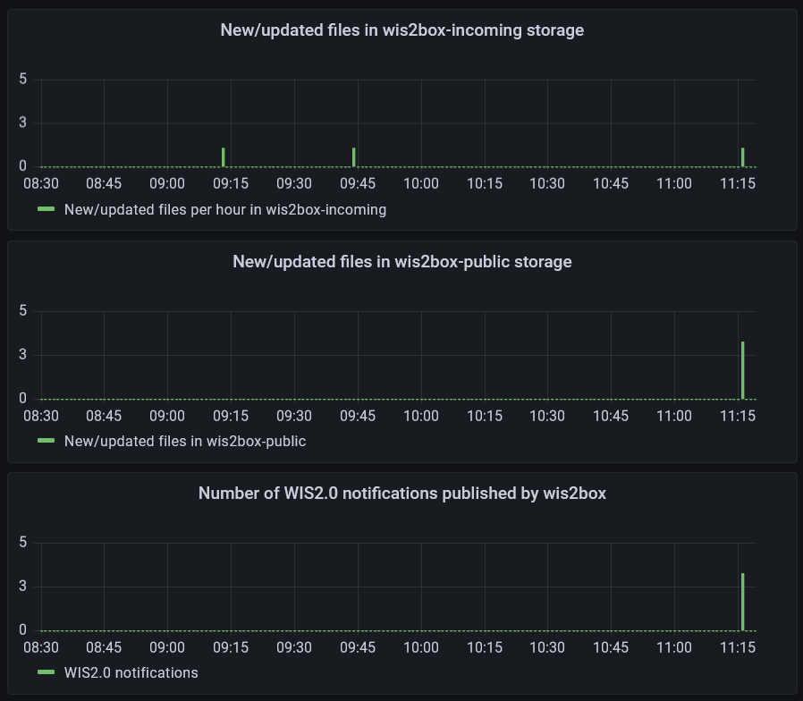

# Мониторинг уведомлений WIS2

!!! abstract "Учебные результаты"

    По окончании этого практического занятия вы сможете:
    
    - инициировать рабочий процесс wis2box, загружая данные в MinIO с помощью команды `wis2box data ingest`
    - просматривать предупреждения и ошибки, отображаемые на панели Grafana
    - проверять содержимое публикуемых данных

## Введение

**Панель Grafana** использует данные из Prometheus и Loki для отображения статуса вашего wis2box. Prometheus хранит временные ряды из собранных метрик, в то время как Loki хранит логи из контейнеров, работающих на вашем экземпляре wis2box. Эти данные позволяют вам проверять, сколько данных получено на MinIO и сколько уведомлений WIS2 опубликовано, а также обнаруживать любые ошибки в логах.

Чтобы увидеть содержимое уведомлений WIS2, которые публикуются по разным темам вашего wis2box, вы можете использовать вкладку 'Monitor' в **wis2box-webapp**.

## Подготовка

В этом разделе будет использоваться набор данных "surface-based-observations/synop", созданный ранее на практическом занятии [Настройка наборов данных в wis2box](/practical-sessions/configuring-wis2box-datasets).

Войдите в свою студенческую виртуальную машину с помощью вашего SSH-клиента (PuTTY или другого).

Убедитесь, что wis2box работает:

```bash
cd ~/wis2box-1.0.0rc1/
python3 wis2box-ctl.py start
python3 wis2box-ctl.py status
```

Убедитесь, что у вас запущен MQTT Explorer и подключен к вашему экземпляру с использованием публичных учетных данных `everyone/everyone` с подпиской на тему `origin/a/wis2/#`.

Убедитесь, что у вас есть доступ к веб-интерфейсу MinIO, перейдя по адресу `http://<your-host>:9000`, и вы вошли в систему (используя `WIS2BOX_STORAGE_USERNAME` и `WIS2BOX_STORAGE_PASSWORD` из вашего файла `wis2box.env`).

Убедитесь, что у вас открыт веб-браузер с панелью Grafana для вашего экземпляра, перейдя по адресу `http://<your-host>:3000`.

## Ввод данных

Пожалуйста, выполните следующие команды из вашей SSH-клиентской сессии:

Скопируйте файл с примером данных `aws-example.csv` в каталог, который вы определили как `WI2BOX_HOST_DATADIR` в вашем файле `wis2box.env`.

```bash
cp ~/exercise-materials/monitoring-exercises/aws-example.csv ~/wis2box-data/
```

Убедитесь, что вы находитесь в каталоге `wis2box-1.0.0rc1` и войдите в контейнер **wis2box-management**:

```bash
cd ~/wis2box-1.0.0rc1
python3 wis2box-ctl.py login
```

Проверьте, доступны ли примеры данных в каталоге `/data/wis2box/` внутри контейнера **wis2box-management**:

```bash
ls -lh /data/wis2box/aws-example.csv
```

!!! note
    `WIS2BOX_HOST_DATADIR` монтируется как `/data/wis2box/` внутри контейнера wis2box-management с помощью файла `docker-compose.yml`, включенного в каталог `wis2box-1.0.0rc1`.
    
    Это позволяет вам обмениваться данными между хостом и контейнером.

!!! question "Упражнение 1: ввод данных с использованием `wis2box data ingest`"

    Выполните следующую команду для ввода файла с примером данных `aws-example.csv` в ваш экземпляр wis2box:

    ```bash
    wis2box data ingest -p /data/wis2box/aws-example.csv --metadata-id urn:wmo:md:not-my-centre:core.surface-based-observations.synop
    ```

    Были ли данные успешно введены? Если нет, какое сообщение об ошибке вы получили и как можно это исправить?

??? success "Нажмите, чтобы увидеть ответ"

    Вы увидите следующий вывод:

    ```bash
    Error: metadata_id=urn:wmo:md:not-my-centre:core.surface-based-observations.synop not found in data mappings
    ```

    Сообщение об ошибке указывает, что идентификатор метаданных, который вы предоставили, не соответствует ни одному из наборов данных, которые вы настроили в вашем экземпляре wis2box.

    Укажите правильный metadata-id, который соответствует набору данных, созданному на предыдущем практическом занятии, и повторите команду ввода данных, пока не увидите следующий вывод:

    ```bash 
    Processing /data/wis2box/aws-example.csv
    Done
    ```

Перейдите в консоль MinIO в вашем браузере и проверьте, был ли загружен файл `aws-example.csv` в корзину `wis2box-incoming`. Вы должны увидеть новый каталог с именем набора данных, который вы указали в опции `--metadata-id`:


!!! note
    Команда `wis2box data ingest` загрузила файл в корзину `wis2box-incoming` в MinIO в каталог, названный в соответствии с идентификатором метаданных, который вы предоставили.

Перейдите на панель Grafana в вашем браузере и проверьте статус ввода данных.

!!! question "Упражнение 2: проверьте статус ввода данных"
    
    Перейдите на панель Grafana в вашем браузере и проверьте статус ввода данных.
    
    Были ли данные успешно введены?

??? success "Нажмите, чтобы увидеть ответ"
    На нижней панели домашней страницы Grafana отображаются следующие предупреждения:    
    
    `WARNING - input=aws-example.csv warning=Station 0-20000-0-60355 not in station list; skipping`
    `WARNING - input=aws-example.csv warning=Station 0-20000-0-60360 not in station list; skipping`

    Это предупреждение указывает, что станции не определены в списке станций вашего wis2box. Уведомления WIS2 не будут публиковаться для этой станции, пока вы не добавите ее в список станций и не свяжете ее с темой для вашего набора данных.

!!! question "Упражнение 3: добавьте тестовые станции и повторите ввод данных"

    Добавьте станции в ваш wis2box с помощью редактора станций в **wis2box-webapp** и свяжите станции с темой для вашего набора данных.

    Теперь повторно загрузите файл с примером данных `aws-example.csv` по тому же пути в MinIO, который вы использовали в предыдущем упражнении.

    Проверьте панель Grafana, есть ли новые ошибки или предупреждения? Как можно увидеть, что тестовые данные были успешно введены и опубликованы?

??? success "Нажмите, чтобы увидеть ответ"

    Вы можете проверить графики на домашней панели Grafana, чтобы увидеть, были ли тестовые данные успешно введены и опубликованы.
    
    Если успешно, вы должны увидеть следующее:

    

!!! question "Упражнение 4: проверьте брокер MQTT на наличие уведомлений WIS2"
    
    Перейдите в MQTT Explorer и проверьте, видите ли вы сообщение уведомления WIS2 о данных, которые вы только что ввели.
    
    Сколько уведомлений данных WIS2 было опубликовано вашим wis2box?
    
    Как получить доступ к содержимому публикуемых данных?

??? success "Нажмите, чтобы увидеть ответ"

    Вы должны увидеть 6 уведомлений данных WIS2, опубликованных вашим wis2box.

    Чтобы получить доступ к содержимому публикуемых данных, вы можете развернуть структуру темы, чтобы увидеть разные уровни сообщения, пока не дойдете до последнего уровня и не просмотрите содержимое одного из сообщений.

    Содержимое сообщения имеет раздел "links" с ключом "rel" "canonical" и ключом "href" с URL для загрузки данных. URL будет в формате `http://<your-host>/data/...`.
    
    Обратите внимание, что формат данных - BUFR, и вам понадобится парсер BUFR для просмотра содержимого данных. Формат BUFR - это бинарный формат, используемый метеорологическими службами для обмена данными. Плагины данных внутри wis2box преобразовали данные из CSV в BUFR перед публикацией.

## Просмотр содержимого опубликованных вами данных

Вы можете использовать **wis2box-webapp** для просмотра содержимого уведомлений данных WIS2, которые были опубликованы вашим wis2box.

Откройте **wis2box-webapp** в вашем браузере, перейдя по адресу `http://<your-host>/wis2box-webapp` и выберите вкладку **Monitoring**:


На вкладке мониторинга выберите идентификатор вашего набора данных и нажмите "UPDATE"

??? question "Упражнение 5: просмотрите уведомления WIS2 в wis2box-webapp"
    
    Сколько уведомлений данных WIS2 было опубликовано вашим wis2box? 

    Какая температура воздуха указана в последнем уведомлении на станции с идентификатором WIGOS=0-20000-0-60355?

??? success "Нажмите, чтобы увидеть ответ"

    Если вы успешно ввели тестовые данные, вы должны увидеть 6 уведомлений данных WIS2, опубликованных вашим wis2box.

    Чтобы увидеть температуру воздуха, измеренную на станции с идентификатором WIGOS=0-20000-0-60355, нажмите кнопку "INSPECT" рядом с файлом для этой станции, чтобы открыть всплывающее окно с разобранным содержимым файла данных. Температура воздуха на этой станции составила 25.0 градусов Цельсия.

!!! Note
    Контейнер wis2box-api включает инструменты для разбора файлов BUFR и отображения содержимого в удобочитаемом формате. Это не является основным требованием для реализации WIS2.0, но было включено в wis2box для помощи издателям данных в проверке содержимого публикуемых данных.

## Заключение

!!! success "Поздравляем!"
    На этом практическом занятии вы научились:

    - инициировать рабочий процесс wis2box, загружая данные в MinIO с помощью команды `wis2box data ingest`
    - просматривать опубликованные уведомления WIS2 вашего wis2box на панели Grafana и в MQTT Explorer
    - проверять содержимое публикуемых данных с помощью **wis2box-webapp**