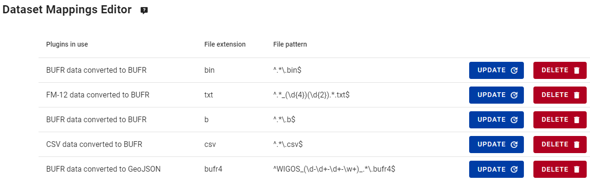
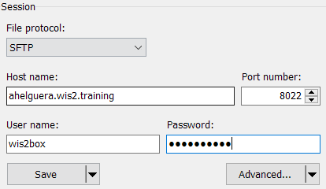

# 自动化数据摄取

!!! abstract "学习成果"

    通过本实践课程，您将能够：
    
    - 理解您的数据集的数据插件如何决定数据摄取工作流
    - 使用 MinIO Python 客户端脚本将数据摄取到 wis2box
    - 通过 SFTP 访问 MinIO 将数据摄取到 wis2box

## 引言

**wis2box-management** 容器监听来自 MinIO 存储服务的事件，根据为您的数据集配置的数据插件触发数据摄取。这允许您将数据上传到 MinIO 存储桶，并触发 wis2box 工作流以在 WIS2 代理上发布数据。

数据插件定义了由 **wis2box-management** 容器加载的 Python 模块，并确定如何转换和发布数据。

在上一个练习中，您应该使用模板 `surface-based-observations/synop` 创建了一个数据集，其中包括以下数据插件：



当文件被上传到 MinIO 时，wis2box 将根据文件路径包含的数据集 id (`metadata_id`) 匹配文件到一个数据集，并根据在数据集映射中定义的文件扩展名和文件模式确定使用哪些数据插件。

在之前的课程中，我们通过使用 wis2box 命令行功能触发了数据摄取工作流，该功能将数据上传到正确路径的 MinIO 存储中。

同样的步骤可以通过使用任何 MinIO 或 S3 客户端软件以编程方式完成，允许您将数据摄取自动化为您的运营工作流的一部分。

或者，您也可以使用 SFTP 协议访问 MinIO 上传数据并触发数据摄取工作流。

## 准备工作

使用您的 SSH 客户端（PuTTY 或其他）登录到您的学生 VM。

确保 wis2box 正在运行：

```bash
cd ~/wis2box-1.0.0rc1/
python3 wis2box-ctl.py start
python3 wis2box-ctl.py status
```

确保 MQTT Explorer 正在运行并连接到您的实例。如果您仍然从上一次会话连接，清除您可能从队列收到的任何先前消息。
这可以通过断开连接并重新连接或点击给定主题的垃圾桶图标来完成。

确保您的 Web 浏览器打开了您实例的 Grafana 仪表板，通过访问 `http://<your-host>:3000`

同时确保您打开了第二个标签页，其中显示了 MinIO 用户界面 `http://<your-host>:9001`。记住您需要使用在 `wis2box.env` 文件中定义的 `WIS2BOX_STORAGE_USER` 和 `WIS2BOX_STORAGE_PASSWORD` 登录。

## 练习 1：设置 Python 脚本将数据摄取到 MinIO

在这个练习中，我们将使用 MinIO Python 客户端将数据复制到 MinIO。

MinIO 提供了一个 Python 客户端，可以按如下方式安装：

```bash
pip3 install minio
```

在您的学生 VM 上，Python 的 'minio' 包已经安装好了。

转到目录 `exercise-materials/data-ingest-exercises`；这个目录包含一个使用 MinIO Python 客户端将文件复制到 MinIO 的示例脚本 `copy_file_to_incoming.py`。

尝试运行脚本将样本数据文件 `csv-aws-example.csv` 复制到 MinIO 的 `wis2box-incoming` 存储桶中，如下所示：

```bash
cd ~/exercise-materials/data-ingest-exercises
python3 copy_file_to_incoming.py csv-aws-example.csv
```

!!! note

    您将收到一个错误，因为脚本尚未配置为访问您的 wis2box 上的 MinIO 端点。

脚本需要知道访问您的 wis2box 上的 MinIO 的正确端点。如果 wis2box 在您的主机上运行，MinIO 端点可在 `http://<your-host>:9000` 获得。脚本还需要更新您的存储密码和存储数据的 MinIO 存储桶中的路径。

!!! question "更新脚本并摄取 CSV 数据"
    
    编辑脚本 `copy_file_to_incoming.py` 以解决错误，使用以下方法之一：
    - 从命令行：使用 `nano` 或 `vim` 文本编辑器编辑脚本
    - 使用 WinSCP：使用文件协议 `SCP` 启动一个新连接，并使用与您的 SSH 客户端相同的凭据。导航到目录 `exercise-materials/data-ingest-exercises` 并使用内置文本编辑器编辑 `copy_file_to_incoming.py`
    
    确保您：
    
    - 定义了您的主机的正确 MinIO 端点
    - 为您的 MinIO 实例提供了正确的存储密码
    - 提供了存储数据的 MinIO 存储桶中的正确路径

    重新运行脚本将样本数据文件 `csv-aws-example.csv` 摄取到 MinIO：

    ```bash
    python3 copy_file_to_incoming.py csv-aws-example.csv
    ```

    并确保错误已解决。

您可以通过检查 MinIO 用户界面来验证数据是否正确上传，并查看样本数据是否在 `wis2box-incoming` 存储桶的正确目录中。

您可以使用 Grafana 仪表板来检查数据摄取工作流的状态。

最后，您可以使用 MQTT Explorer 检查是否为您摄取的数据发布了通知。您应该看到 CSV 数据被转换为 BUFR 格式，并且发布了一个带有 "canonical" url 的 WIS2 数据通知，以启用下载 BUFR 数据。

## 练习 2：摄取二进制数据

接下来，我们尝试使用 MinIO Python 客户端摄取 BUFR 格式的二进制数据。

wis2box 可以使用 `wis2box.data.bufr4.ObservationDataBUFR` 插件摄取 BUFR 格式的二进制数据。

此插件将 BUFR 文件拆分为单个 BUFR 消息，并将每个消息发布到 MQTT 代理。如果相应的 BUFR 消息的站点未在 wis2box 站点元数据中定义，则不会发布该消息。

由于您在上一次会话中使用了 `surface-based-observations/synop` 模板，您的数据映射包括了插件 `FM-12 数据转换为 BUFR`。此插件加载模块 `wis2box.data.synop2bufr.ObservationDataSYNOP2BUFR` 来摄取数据。

!!! question "摄取 BUFR 格式的二进制数据"

    运行以下命令将二进制数据文件 `bufr-example.bin` 复制到 MinIO 的 `wis2box-incoming` 存储桶中：

    ```bash
    python3 copy_file_to_incoming.py bufr-example.bin
    ```

检查 Grafana 仪表板和 MQTT Explorer，看看测试数据是否成功摄取和发布，如果您看到任何错误，请尝试解决它们。

!!! question "验证数据摄取"

    这个数据样本发布了多少条消息到 MQTT 代理？

??? success "点击以显示答案"

    如果您成功摄取并发布了最后一个数据样本，您应该在 wis2box MQTT 代理上收到了 10 条新通知。每条通知对应一次观测时间戳的一个站点的数据。

    插件 `wis2box.data.bufr4.ObservationDataBUFR` 将 BUFR 文件拆分为单个 BUFR 消息，并为每个站点和观测时间戳发布一条消息。

## 练习 3：摄取 ASCII 格式的 SYNOP 数据

在上一次会话中，我们使用 **wis2box-webapp** 中的 SYNOP 表单摄取了 ASCII 格式的 SYNOP 数据。您也可以通过将数据上传到 MinIO 来摄取 ASCII 格式的 SYNOP 数据。

在上一次会话中，您应该已经创建了一个包括插件 'FM-12 数据转换为 BUFR' 的数据集：


此插件加载模块 `wis2box.data.synop2bufr.ObservationDataSYNOP2BUFR` 来摄取数据。

尝试使用 MinIO Python 客户端摄取测试数据 `synop-202307.txt` 和 `synop-202308.txt` 到您的 wis2box 实例中。

注意这两个文件包含相同的内容，但文件名不同。文件名用于确定数据样本的日期。

synop2bufr 插件依赖于一个文件模式来从文件名中提取日期。正则表达式中的第一个组用于提取年份，第二个组用于提取月份。

!!! question "摄取 FM-12 SYNOP ASCII 格式数据"

    回到您的浏览器中的 MinIO 界面，导航到 `wis2box-incoming` 存储桶并进入您在上一个练习中上传测试数据的路径。
    
    上传新文件到 MinIO 的 `wis2box-incoming` 存储桶中正确的路径以触发数据摄取工作流。

    检查 Grafana 仪表板和 MQTT Explorer，看看测试数据是否成功摄取和发布。

    发布到 MQTT 代理的两条消息中的 `properties.datetime` 有什么不同？

??? success "点击以显示答案"

    检查 MQTT Explorer 中最后两个通知的属性，您将注意到一个通知有：

    ```{.copy}
    "properties": {
        "data_id": "wis2/urn:wmo:md:nl-knmi-test:surface-based-observations.synop/WIGOS_0-20000-0-60355_20230703T090000",
        "datetime": "2023-07-03T09:00:00Z",
        ...
    ```

    而另一个通知有：

    ```{.copy}
    "properties": {
        "data_id": "wis2/urn:wmo:md:nl-knmi-test:surface-based-observations.synop/WIGOS_0-20000-0-60355_20230803T090000",
        "datetime": "2023-08-03T09:00:00Z",
        ...
    ```

    文件名被用来确定数据样本的年份和月份。

## 练习 4：使用 SFTP 将数据摄取到 MinIO

数据也可以通过 SFTP 摄取到 MinIO。

wis2box 堆栈中启用的 MinIO 服务在端口 8022 上启用了 SFTP。您可以使用与 MinIO 用户界面相同的凭据通过 SFTP 访问 MinIO。在这个练习中，我们将使用 MinIO 服务中定义的 `wis2box.env` 中的管理员凭据，但您也可以在 MinIO 用户界面中创建额外的用户。

要通过 SFTP 访问 MinIO，您可以使用任何 SFTP 客户端软件。在这个练习中，我们将使用 WinSCP，这是一个适用于 Windows 的免费 SFTP 客户端。

使用 WinSCP，您的连接如下所示：



对于用户名和密码，请使用您的 `wis2box.env` 文件中的 `WIS2BOX_STORAGE_USERNAME` 和 `WIS2BOX_STORAGE_PASSWORD` 环境变量的值。点击 'save' 保存会话，然后点击 'login' 连接。

登录后，您将看到根目录中的 MinIO 存储桶 `wis2box-incoming` 和 `wis2box-public`。您可以将数据上传到 `wis2box-incoming` 存储桶以触发数据摄取工作流。

点击 `wis2box-incoming` 存储桶进入此存储桶，然后右键选择 *New*->*Directory* 在 `wis2box-incoming` 存储桶中创建一个新目录。

创建目录 *not-a-valid-path* 并上传文件 *randomfile.txt* 到此目录中（您可以使用您喜欢的任何文件）。

然后检查端口 3000 的 Grafana 仪表板，看看是否触发了数据摄取工作流。您应该看到：

*ERROR - Path validation error: Could not match http://minio:9000/wis2box-incoming/not-a-valid-path/randomfile.txt to dataset, path should include one of the following: ...*

错误表明文件已上传到 MinIO 并触发了数据摄取工作流，但由于路径与 wis2box 实例中的任何数据集不匹配，数据映射失败。

您也可以使用命令行中的 `sftp`：

```bash
sftp -P 8022 -oBatchMode=no -o StrictHostKeyChecking=no <my-hostname-or-ip>
```
使用在 `wis2box.env` 中为 `WIS2BOX_STORAGE_USERNAME` 和 `WIS2BOX_STORAGE_PASSWORD` 环境变量定义的凭据登录，导航到 `wis2box-incoming` 存储桶，然后创建一个目录并按如下方式上传一个文件：

```bash
cd wis2box-incoming
mkdir not-a-valid-path
cd not-a-valid-path
put ~/exercise-materials/data-ingest-exercises/synop.txt .
```

这将在 Grafana 仪表板中导致一个“路径验证错误”，表明文件已上传到 MinIO。

要退出 sftp 客户端，请输入 `exit`。

!!! Question "使用 SFTP 将数据摄取到 MinIO"

    尝试使用 SFTP 将文件 `synop.txt` 摄取到您的 wis2box 实例中以触发数据摄取工作流。

    检查 MinIO 用户界面，看看文件是否上传到 `wis2box-incoming` 存储桶中的正确路径。
    
    检查 Grafana 仪表板，看看数据摄取工作流是否被触发或是否有任何错误。

为确保您的数据正确摄取，请确保文件上传到与您数据集的数据集 id 或主题匹配的 `wis2box-incoming` 存储桶中的目录。

## 结论

!!! success "恭喜！"
    在这个实践课程中，您学会了如何：

    - 使用 Python 脚本和 MinIO Python 客户端触发 wis2box 工作流
    - 使用不同的数据插件摄取不同的数据格式
    - 使用 SFTP 上传数据到 MinIO