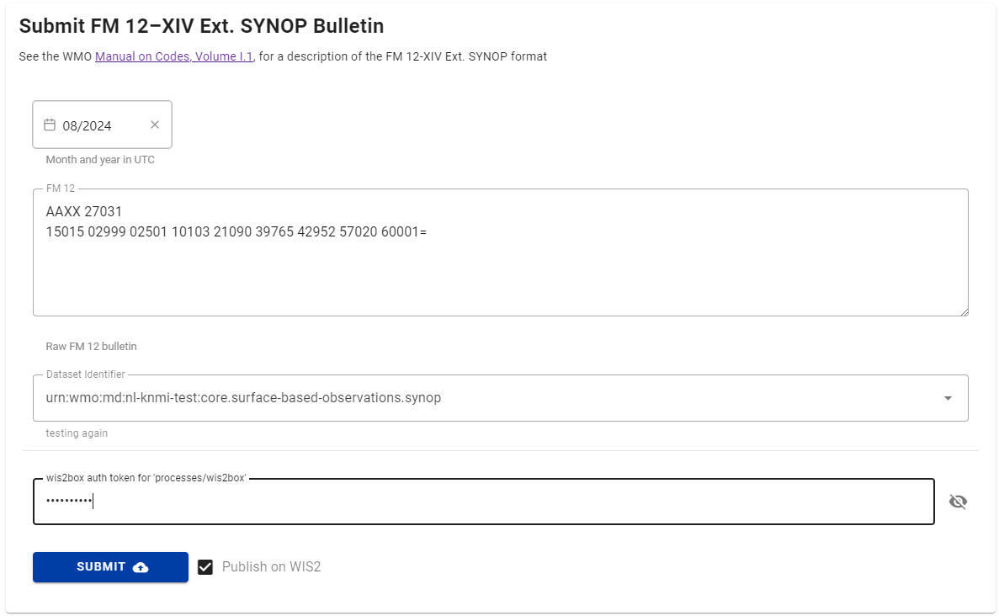
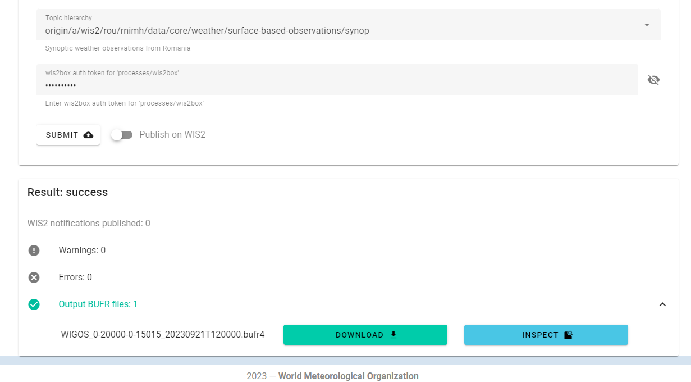
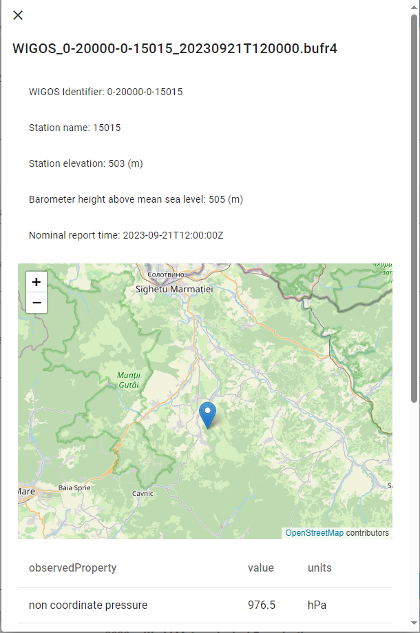

# 使用wis2box-webapp将SYNOP数据转换为BUFR

!!! abstract "学习成果"
    在本实践课程结束时，您将能够：

    - 通过wis2box网络应用程序提交有效的FM-12 SYNOP公告，以转换为BUFR并通过WIS2.0交换
    - 在格式转换和交换之前，验证、诊断并修复FM-12 SYNOP公告中的简单编码错误
    - 确保所需的站点元数据在wis2box中可用
    - 确认并检查成功转换的公告

## 引言

为了允许手动观察者直接向WIS2.0提交数据，wis2box-webapp有一个表单用于将FM-12 SYNOP公告转换为BUFR。该表单还允许用户在格式转换和交换之前诊断并修复FM-12 SYNOP公告中的简单编码错误，并检查生成的BUFR数据。

## 准备工作

!!! warning "先决条件"

    - 确保您的wis2box已配置并启动。
    - 打开终端并使用SSH连接到您的学生VM。
    - 使用MQTT Explorer连接到您的wis2box实例的MQTT代理。
    - 打开wis2box网络应用程序（``http://<your-host-name>/wis2box-webapp``）并确保您已登录。

## 使用wis2box-webapp将FM-12 SYNOP转换为BUFR

### 练习1 - 使用wis2box-webapp将FM-12 SYNOP转换为BUFR

确保您拥有在上一个练习中生成的“processes/wis2box”的授权令牌，并且您已连接到MQTT Explorer中的wis2box代理。

复制以下消息：

``` {.copy}
AAXX 27031
15015 02999 02501 10103 21090 39765 42952 57020 60001=
```

打开wis2box网络应用程序，使用左侧导航抽屉导航到synop2bufr页面，然后按照以下步骤操作：

- 将您复制的内容粘贴到文本输入框中。
- 使用日期选择器选择月份和年份，假设本练习为当前月份。
- 从下拉菜单中选择一个主题（选项基于wis2box中配置的数据集）。
- 输入您之前生成的“processes/wis2box”授权令牌
- 确保“在WIS2上发布”已开启
- 点击“提交”

<center></center>

点击提交。您将收到一个警告消息，因为站点未在wis2box中注册。转到station-editor并导入以下站点：

``` {.copy}
0-20000-0-15015
```

确保站点与您在上一步中选择的主题相关联，然后返回到synop2bufr页面并重复之前的过程。

!!! question
    您如何查看从FM-12 SYNOP到BUFR的转换结果？

??? success "点击以显示答案"
    页面的结果部分显示警告、错误和输出BUFR文件。

    点击“输出BUFR文件”以查看已生成的文件列表。您应该看到一个文件列表。

    下载按钮允许将BUFR数据直接下载到您的计算机。

    检查按钮运行一个过程来转换和提取BUFR中的数据。

    <center></center>

!!! question
    FM-12 SYNOP输入数据未包括站点位置、海拔或气压计高度。
    确认这些是否在输出BUFR数据中，这些数据从何而来？

??? success "点击以显示答案"
    点击检查按钮应显示如下所示的对话框。

    <center></center>

    这包括在地图上显示的站点位置和基本元数据，以及消息中的观测结果。
    
    作为从FM-12 SYNOP到BUFR的转换的一部分，额外的元数据被添加到BUFR文件中。
    
    BUFR文件也可以通过下载文件并使用如ECMWF ecCodes BUFR验证器等工具进行验证。

转到MQTT Explorer并检查已发布的WIS2通知主题，以查看已发布的WIS2通知。

### 练习2 - 理解站点列表

在下一个练习中，您将转换包含多个报告的文件，见下面的数据：

``` {.copy}
AAXX 27031
15015 02999 02501 10103 21090 39765 42952 57020 60001=
15020 02997 23104 10130 21075 30177 40377 58020 60001 81041=
15090 02997 53102 10139 21075 30271 40364 58031 60001 82046=
```

!!! question
    根据之前的练习，查看FM-12 SYNOP消息并预测将生成多少个输出BUFR消息。
    
    现在将此消息复制粘贴到SYNOP表单并提交数据。

    生成的消息数量是否符合您的预期，如果不符合，为什么？

??? warning "点击以显示答案"
    
    您可能预期会生成三个BUFR消息，每个天气报告一个。然而，您实际上得到了2个警告和只有一个BUFR文件。
    
    为了将天气报告转换为BUFR，需要站点列表中包含的基本元数据。尽管上述示例包括三个天气报告，但其中三个站点中的两个未在您的wis2box中注册。
    
    因此，三个天气报告中只有一个结果生成了BUFR文件并发布了WIS2通知。其他两个天气报告被忽略并生成了警告。

!!! hint
    注意WIGOS标识符与BUFR输出中包含的传统站点标识符之间的关系。在许多情况下，对于在迁移到WIGOS站点标识符时已列在WMO-No. 9第A卷的站点，WIGOS站点标识符由传统站点标识符前加上``0-20000-0``给出，
    例如``15015``已变为``0-20000-0-15015``。

使用站点列表页面，导入以下站点：

``` {.copy}
0-20000-0-15020
0-20000-0-15090
```

确保站点与您在上一个练习中选择的主题相关联，然后返回到synop2bufr页面并重复过程。

现在应该生成三个BUFR文件，并且网页应用程序中不应列出任何警告或错误。

除了基本站点信息外，还需要额外的元数据，如站点海拔高度和海平面上的气压计高度，这些字段包含在站点列表和站点编辑器页面中。

### 练习3 - 调试

在这最后一个练习中，您将识别并纠正在使用此工具将FM-12 SYNOP转换为BUFR时遇到的两个最常见的问题。

下面的框中显示了示例数据，检查数据并尝试在通过网络应用程序提交数据之前解决任何问题。

!!! hint
    您可以在网页应用程序页面的输入框中编辑数据。如果您遗漏了任何问题，这些应该在点击提交按钮后被检测到并突出显示为警告或错误。

``` {.copy}
AAXX 27031
15015 02999 02501 10103 21090 39765 42952 57020 60001
15020 02997 23104 10130 21075 30177 40377 58020 60001 81041=
15090 02997 53102 10139 21075 30271 40364 58031 60001 82046=
```

!!! question
    在将数据转换为BUFR时，您预期会遇到哪些问题，您是如何克服它们的？有没有您没有预料到的问题？

??? success "点击以显示答案"
    在第一个示例中，“文本结束”符号（=），或记录分隔符，在第一和第二个天气报告之间缺失。因此，第2行和第3行被视为单个报告，导致消息解析出错。

下面的第二个示例包含FM-12 SYNOP报告中发现的几个常见问题。检查数据并尝试识别问题，然后通过网络应用程序提交更正后的数据。

```{.copy}
AAXX 27031
15020 02997 23104 10/30 21075 30177 40377 580200 60001 81041=
```

!!! question
    您发现了哪些问题，您是如何解决这些问题的？

??? success "点击以显示答案"
    天气报告中有两个问题。
    
    第一个问题出现在带符号的气温组中，十位字符设置为缺失（/），导致组无效。在这个示例中，我们知道温度是13.0摄氏度（从上面的示例中得知），因此可以纠正这个问题。在操作中，正确的值需要与观察者确认。

    第二个问题出现在第5组中，有一个额外的字符，最后一个字符重复了。这个问题可以通过移除额外的字符来解决。

## 清理

在本次会议的练习中，您将导入几个文件到您的站点列表中。导航到站点列表页面并点击垃圾桶图标删除站点。您可能需要刷新页面才能在删除后从列表中移除站点。

<center></center>

## 结论

!!! success "恭喜！"

    在这个实践课程中，您学到了：

    - 如何使用synop2bufr工具将FM-12 SYNOP报告转换为BUFR；
    - 如何通过网络应用提交FM-12 SYNOP报告；
    - 如何诊断并纠正FM-12 SYNOP报告中的简单错误；
    - 在wis2box（和OSCAR/Surface）中注册站点的重要性；
    - 如何使用检查按钮查看BUFR数据的内容。