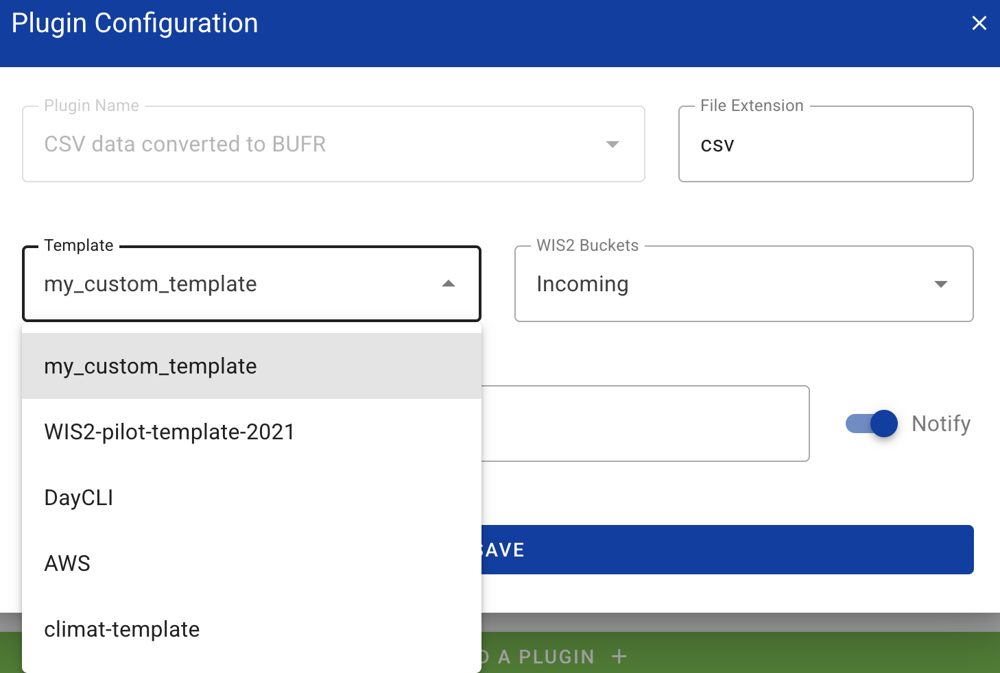

# CSV至BUFR映射模板

!!! abstract "学习成果"
    通过本实践课程，您将能够：

    - 为您的CSV数据创建一个新的BUFR映射模板
    - 从命令行编辑和调试您的自定义BUFR映射模板
    - 配置CSV至BUFR数据插件以使用自定义BUFR映射模板
    - 使用内置的AWS和DAYCLI模板将CSV数据转换为BUFR

## 引言

逗号分隔值（CSV）数据文件常用于以表格格式记录观测数据和其他数据。
大多数用于记录传感器输出的数据记录器能够导出观测数据为分隔文件，包括CSV格式。
同样，当数据被摄入数据库时，很容易以CSV格式导出所需数据。

wis2box的csv2bufr模块提供了一个命令行工具，用于将CSV数据转换为BUFR格式。使用csv2bufr时，您需要提供一个BUFR映射模板，该模板将CSV列映射到相应的BUFR元素。如果您不想创建自己的映射模板，您可以使用内置的AWS和DAYCLI模板将CSV数据转换为BUFR，但您需要确保所使用的CSV数据格式适用于这些模板。如果您想解码AWS和DAYCLI模板中未包含的参数，您将需要创建自己的映射模板。

在本课程中，您将学习如何为将CSV数据转换为BUFR创建自己的映射模板。您还将学习如何使用内置的AWS和DAYCLI模板将CSV数据转换为BUFR。

## 准备工作

确保已使用`python3 wis2box.py start`启动wis2box-stack。

确保您的浏览器已打开并通过访问`http://YOUR-HOST:9000`连接到您实例的MinIO UI。
如果您忘记了MinIO凭据，可以在学生VM的`wis2box`目录下的`wis2box.env`文件中找到它们。

确保您已打开MQTT Explorer并使用凭据`everyone/everyone`连接到您的broker。

## 创建映射模板

csv2bufr模块附带一个命令行工具，使用一组BUFR序列和/或BUFR元素作为输入来创建您自己的映射模板。

要查找特定的BUFR序列和元素，您可以参考BUFR表格网址[https://confluence.ecmwf.int/display/ECC/BUFR+tables](https://confluence.ecmwf.int/display/ECC/BUFR+tables)。

### csv2bufr映射命令行工具

要访问csv2bufr命令行工具，您需要登录到wis2box-api容器：

```bash
cd ~/wis2box
python3 wis2box-ctl.py login wis2box-api
```

要打印命令`csv2bufr mapping`的帮助页面：

```bash
csv2bufr mappings --help
```

帮助页面显示2个子命令：

- `csv2bufr mappings create`：创建一个新的映射模板
- `csv2bufr mappings list`：列出系统中可用的映射模板

!!! Note "csv2bufr映射列表"

    `csv2bufr mapping list`命令将向您显示系统中可用的映射模板。
    默认模板存储在容器中的目录`/opt/wis2box/csv2bufr/templates`。

    要与系统共享自定义映射模板，您可以将它们存储在由`$CSV2BUFR_TEMPLATES`定义的目录中，该目录在容器中默认设置为`/data/wis2box/mappings`。由于容器中的目录`/data/wis2box/mappings`挂载到主机上的目录`$WIS2BOX_HOST_DATADIR/mappings`，您将在主机上的目录`$WIS2BOX_HOST_DATADIR/mappings`中找到您的自定义映射模板。

让我们尝试使用命令`csv2bufr mapping create`创建一个新的自定义映射模板，输入BUFR序列301150加上BUFR元素012101。

```bash
csv2bufr mappings create 301150 012101 --output /data/wis2box/mappings/my_custom_template.json
```

您可以使用`cat`命令检查您刚刚创建的映射模板的内容：

```bash
cat /data/wis2box/mappings/my_custom_template.json
```

!!! question "检查映射模板"

    有多少CSV列被映射到BUFR元素？每个BUFR元素的CSV标题是什么？

??? success "点击显示答案"
    
    您创建的映射模板映射了**5**个CSV列到BUFR元素，即序列301150中的4个BUFR元素加上BUFR元素012101。

    下列CSV列被映射到BUFR元素：

    - **wigosIdentifierSeries** 映射到 `"eccodes_key": "#1#wigosIdentifierSeries"` (BUFR元素001125)
    - **wigosIssuerOfIdentifier** 映射到 `"eccodes_key": "#1#wigosIssuerOfIdentifier` (BUFR元素001126)
    - **wigosIssueNumber** 映射到 `"eccodes_key": "#1#wigosIssueNumber"` (BUFR元素001127)
    - **wigosLocalIdentifierCharacter** 映射到 `"eccodes_key": "#1#wigosLocalIdentifierCharacter"` (BUFR元素001128)
    - **airTemperature** 映射到 `"eccodes_key": "#1#airTemperature"` (BUFR元素012101)

您创建的映射模板缺少有关观测的重要元数据，观测的日期和时间，以及站点的纬度和经度。

接下来我们将更新映射模板并添加以下序列：
    
- **301011** 日期（年、月、日）
- **301012** 时间（小时、分钟）
- **301023** 位置（粗略精度的纬度/经度）

以及以下元素：

- **010004** 压力
- **007031** 气压计高于平均海平面的高度

执行以下命令以更新映射模板：

```bash
csv2bufr mappings create 301150 301011 301012 301023 007031 012101 010004  --output /data/wis2box/mappings/my_custom_template.json
```

再次检查映射模板的内容：

```bash
cat /data/wis2box/mappings/my_custom_template.json
```

!!! question "检查更新后的映射模板"

    现在有多少CSV列被映射到BUFR元素？每个BUFR元素的CSV标题是什么？

??? success "点击显示答案"
    
    您创建的映射模板现在映射了**18**个CSV列到BUFR元素：
    - 4个BUFR元素来自BUFR序列301150
    - 3个BUFR元素来自BUFR序列301011
    - 2个BUFR元素来自BUFR序列301012
    - 2个BUFR元素来自BUFR序列301023
    - BUFR元素007031
    - BUFR元素012101

    下列CSV列被映射到BUFR元素：

    - **wigosIdentifierSeries** 映射到 `"eccodes_key": "#1#wigosIdentifierSeries"` (BUFR元素001125)
    - **wigosIssuerOfIdentifier** 映射到 `"eccodes_key": "#1#wigosIssuerOfIdentifier` (BUFR元素001126)
    - **wigosIssueNumber** 映射到 `"eccodes_key": "#1#wigosIssueNumber"` (BUFR元素001127)
    - **wigosLocalIdentifierCharacter** 映射到 `"eccodes_key": "#1#wigosLocalIdentifierCharacter"` (BUFR元素001128)
    - **year** 映射到 `"eccodes_key": "#1#year"` (BUFR元素004001)
    - **month** 映射到 `"eccodes_key": "#1#month"` (BUFR元素004002)
    - **day** 映射到 `"eccodes_key": "#1#day"` (BUFR元素004003)
    - **hour** 映射到 `"eccodes_key": "#1#hour"` (BUFR元素004004)
    - **minute** 映射到 `"eccodes_key": "#1#minute"` (BUFR元素004005)
    - **latitude** 映射到 `"eccodes_key": "#1#latitude"` (BUFR元素005002)
    - **longitude** 映射到 `"eccodes_key": "#1#longitude"` (BUFR元素006002)
    - **heightOfBarometerAboveMeanSeaLevel"** 映射到 `"eccodes_key": "#1#heightOfBarometerAboveMeanSeaLevel"` (BUFR元素007031)
    - **airTemperature** 映射到 `"eccodes_key": "#1#airTemperature"` (BUFR元素012101)

- **nonCoordinatePressure** 映射为 `"eccodes_key": "#1#nonCoordinatePressure"`（BUFR 元素 010004）

检查文件夹 `/root/data-conversion-exercises` 中的 `custom_template_data.csv` 文件内容：

```bash
cat /root/data-conversion-exercises/custom_template_data.csv
```

注意，此 CSV 文件的表头与您创建的映射模板中的 CSV 表头相同。

要测试数据转换，我们可以使用 `csv2bufr` 命令行工具，利用我们创建的映射模板将 CSV 文件转换为 BUFR：

```bash
csv2bufr data transform --bufr-template my_custom_template /root/data-conversion-exercises/custom_template_data.csv
```

您应该看到以下输出：

```bash
CLI:    ... Transforming /root/data-conversion-exercises/custom_template_data.csv to BUFR ...
CLI:    ... Processing subsets:
CLI:    ..... 94 bytes written to ./WIGOS_0-20000-0-15015_20250412T210000.bufr4
CLI:    End of processing, exiting.
```

!!! question "检查 BUFR 文件的内容"
    
    如何检查您刚创建的 BUFR 文件的内容，并验证其是否正确编码了数据？

??? success "点击查看答案"

    您可以使用 `bufr_dump -p` 命令来检查您刚创建的 BUFR 文件的内容。
    该命令将以人类可读的格式显示 BUFR 文件的内容。

    ```bash
    bufr_dump -p ./WIGOS_0-20000-0-15015_20250412T210000.bufr4
    ```

    在输出中，您将看到您在模板中映射的 BUFR 元素的值，例如 "airTemperature" 将显示：
    
    ```bash
    airTemperature=298.15
    ```

您现在可以退出容器：

```bash
exit
```

### 在 wis2box 中使用映射模板

为确保 wis2box-api 容器识别新的映射模板，您需要重启容器：

```bash
docker restart wis2box-api
```

您现在可以在 wis2box-webapp 中配置您的数据集，以使用自定义映射模板进行 CSV 到 BUFR 的转换插件。

wis2box-webapp 将自动检测您创建的映射模板，并在 CSV 到 BUFR 转换插件的模板列表中提供。

点击您在上一个实践课程中创建的数据集，然后点击插件名称为 "CSV data converted to BUFR" 旁边的 "UPDATE"：


您应该在可用模板列表中看到您创建的新模板：



!!! hint

    注意，如果您没有看到您创建的新模板，请尝试刷新页面或在新的隐身窗口中打开。

现在保持默认选择 AWS 模板（点击右上角关闭插件配置）。

### 更新示例文件

示例文件包含一个月中每天的一行数据，并报告一个站点的数据。更新您下载的示例文件，使用今天的日期和时间，并更改 WIGOS 站点标识符，以使用您在 `wis2box-webapp` 中注册的站点。

### 将数据上传到 MinIO 并检查结果

与之前一样，您需要将数据上传到 MinIO 中的 `wis2box-incoming` 存储桶，以便由 csv2bufr 转换器处理。这次您需要在 MinIO 存储桶中创建一个新文件夹，该文件夹与您使用模板 `'climate/surface-based-observations/daily'` 创建的数据集的 dataset-id 匹配，这将与您在上一个练习中使用的 dataset-id 不同：

</center>

上传数据后，检查 Grafana 仪表板中是否有警告或错误，并检查 MQTT Explorer 以查看是否收到 WIS2 数据通知。

如果您成功摄取了数据，您应该在 MQTT explorer 上的主题 `origin/a/wis2/<centre-id>/data/climate/surface-based-observations/daily` 上看到 30 条通知，对应您报告的月份中的 30 天：


## 结论

!!! success "恭喜"
    在这个实践环节中，您已经学会了：

    - 如何为将 CSV 数据转换为 BUFR 创建自定义映射模板
    - 如何使用内置的 AWS 和 DAYCLI 模板将 CSV 数据转换为 BUFR