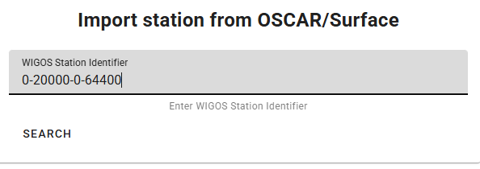
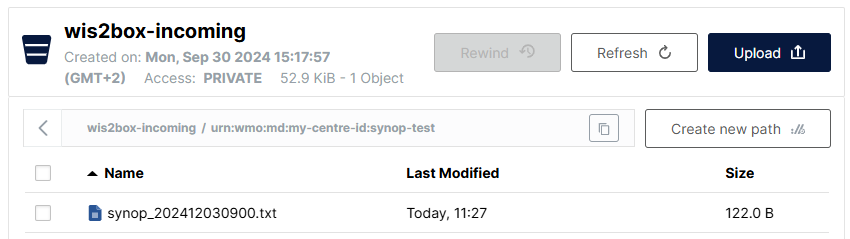
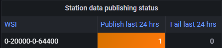
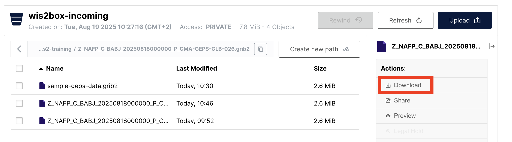
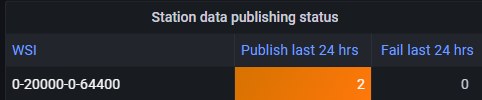
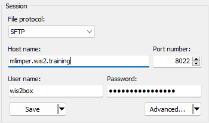
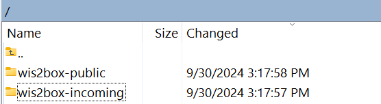
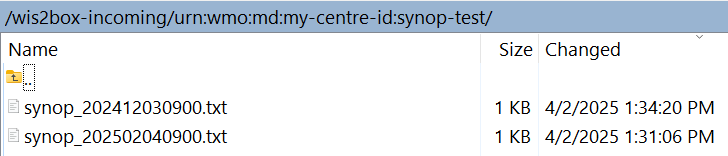

# 数据摄入与发布

!!! abstract "学习目标"

    完成本实践课程后，您将能够：
    
    - 通过命令行、MinIO网页界面、SFTP或Python脚本上传数据到MinIO来触发 wis2box 工作流。
    - 访问 Grafana 仪表板来监控数据摄入状态并查看 wis2box 实例的日志。
    - 使用 MQTT Explorer 查看您的 wis2box 发布的 WIS2 数据通知。

## 简介

在 WIS2 中,数据通过包含"规范"下载链接的 WIS2 数据通知实时共享。

要在使用 wis2box 软件的 WIS2 Node 中触发数据工作流,必须将数据上传到 **MinIO** 中的 **wis2box-incoming** 存储桶,这将启动 wis2box 工作流。此过程会通过 WIS2 数据通知发布数据。根据您的 wis2box 实例中配置的数据映射,数据可能会在发布前转换为 BUFR 格式。

在本练习中,我们将使用示例数据文件来触发 wis2box 工作流,并为您在上一个实践课程中配置的数据集**发布 WIS2 数据通知**。

在练习过程中,我们将使用 **Grafana 仪表板**和 **MQTT Explorer** 监控数据摄入状态。Grafana 仪表板使用来自 Prometheus 和 Loki 的数据显示 wis2box 的状态,而 MQTT Explorer 允许您查看 wis2box 实例发布的 WIS2 数据通知。

请注意,根据数据集中预配置的数据映射,wis2box 会在将示例数据发布到 MQTT 代理之前将其转换为 BUFR 格式。在本练习中,我们将重点关注向 wis2box 实例上传数据的不同方法,并验证成功摄入和发布。数据转换将在后续的[数据转换工具](../data-conversion-tools)实践课程中介绍。

## 准备工作

本节使用在[配置 wis2box 数据集](/practical-sessions/configuring-wis2box-datasets)实践课程中先前创建的"surface-based-observations/synop"数据集。它还需要了解如何在 **wis2box-webapp** 中配置站点,如[配置站点元数据](/practical-sessions/configuring-station-metadata)实践课程中所述。

确保您可以使用 SSH 客户端(如 PuTTY)登录到您的学生虚拟机。

确保 wis2box 正在运行:

```bash
cd ~/wis2box/
python3 wis2box-ctl.py start
python3 wis2box-ctl.py status
```

确保 MQTT Explorer 正在运行并使用公共凭据 `everyone/everyone` 连接到您的实例,订阅主题 `origin/a/wis2/#`。

确保您已打开网页浏览器并通过导航到 `http://YOUR-HOST:3000` 访问实例的 Grafana 仪表板。

### 准备示例数据

将目录 `exercise-materials/data-ingest-exercises` 复制到您在 `wis2box.env` 文件中定义为 `WIS2BOX_HOST_DATADIR` 的目录:

```bash
cp -r ~/exercise-materials/data-ingest-exercises ~/wis2box-data/
```

!!! note
    `WIS2BOX_HOST_DATADIR` 通过 `wis2box` 目录中包含的 `docker-compose.yml` 文件挂载为 wis2box-management 容器内的 `/data/wis2box/`。
    
    这允许您在主机和容器之间共享数据。

### 添加测试站点

使用 wis2box-webapp 中的站点编辑器将 WIGOS 标识符为 `0-20000-0-64400` 的站点添加到您的 wis2box 实例。

从 OSCAR 检索站点:



将站点添加到您为在"../surface-based-observations/synop"上发布而创建的数据集中,并使用您的身份验证令牌保存更改:


请注意,您可以在实践课程结束后从数据集中删除此站点。

## 从命令行测试数据摄入

在本练习中,我们将使用 `wis2box data ingest` 命令将数据上传到 MinIO。

确保您在 `wis2box` 目录中并登录到 **wis2box-management** 容器:

```bash
cd ~/wis2box
python3 wis2box-ctl.py login
```

验证以下示例数据在 **wis2box-management** 容器内的 `/data/wis2box/` 目录中可用:

```bash
ls -lh /data/wis2box/data-ingest-exercises/synop_202412030900.txt
```

!!! question "使用 `wis2box data ingest` 摄入数据"

    执行以下命令将示例数据文件摄入到您的 wis2box 实例:

    ```bash
    wis2box data ingest -p /data/wis2box/data-ingest-exercises/synop_202412030900.txt --metadata-id urn:wmo:md:not-my-centre:synop-test
    ```

    数据是否成功摄入?如果没有,错误消息是什么,您如何修复它?

??? success "点击查看答案"

    数据**未**成功摄入。您应该看到以下内容:

    ```bash
    Error: metadata_id=urn:wmo:md:not-my-centre:synop-test not found in data mappings
    ```

    错误消息表明您提供的元数据标识符与您在 wis2box 实例中配置的任何数据集都不匹配。

    提供与您在上一个实践课程中创建的数据集匹配的正确元数据 ID,并重复数据摄入命令,直到看到以下输出:

    ```bash 
    Processing /data/wis2box/data-ingest-exercises/synop_202412030900.txt
    Done
    ```

转到浏览器中的 MinIO 控制台,检查文件 `synop_202412030900.txt` 是否已上传到 `wis2box-incoming` 存储桶。您应该看到一个以您在 `--metadata-id` 选项中提供的数据集名称命名的新目录,在该目录中,您将找到文件 `synop_202412030900.txt`:



!!! note
    `wis2box data ingest` 命令将文件上传到 MinIO 中的 `wis2box-incoming` 存储桶,存储在以您提供的元数据标识符命名的目录中。

转到浏览器中的 Grafana 仪表板,检查数据摄入状态。

!!! question "在 Grafana 上检查数据摄入状态"
    
    在浏览器中转到 **http://your-host:3000** 的 Grafana 仪表板,检查数据摄入状态。
    
    您如何查看数据是否成功摄入和发布?

??? success "点击查看答案"
    
    如果您成功摄入数据,您应该看到以下内容:
    
      
    
    如果您没有看到这个,请检查仪表板底部显示的警告或错误消息,并尝试解决它们。

!!! question "检查 MQTT 代理的 WIS2 通知"
    
    转到 MQTT Explorer,检查是否可以看到您刚刚摄入的数据的 WIS2 通知消息。
    
    您的 wis2box 发布了多少个 WIS2 数据通知?
    
    您如何访问正在发布的数据内容?

??? success "点击查看答案"

    您应该看到您的 wis2box 发布了 1 个 WIS2 数据通知。

    要访问正在发布的数据内容,您可以展开主题结构以查看消息的不同层级,直到达到最后一级并查看消息内容。

    消息内容有一个"links"部分,其中包含"rel"键为"canonical"和"href"键,其中包含下载数据的 URL。URL 的格式将为 `http://YOUR-HOST/data/...`。
    
    请注意,数据格式为 BUFR,您需要 BUFR 解析器才能查看数据内容。BUFR 格式是气象服务用于交换数据的二进制格式。wis2box 内部的数据插件在发布之前将数据转换为 BUFR。

完成此练习后,退出 **wis2box-management** 容器:

```bash
exit
```

## 使用 MinIO 网页界面上传数据

在前面的练习中,您使用 `wis2box data ingest` 命令将 wis2box 主机上可用的数据上传到 MinIO。

接下来,我们将使用 MinIO 网页界面,它允许您使用网页浏览器下载和上传数据到 MinIO。

!!! question "使用 MinIO 网页界面重新上传数据"

    在浏览器中转到 MinIO 网页界面并浏览到 `wis2box-incoming` 存储桶。您将看到在前面的练习中上传的文件 `synop_202412030900.txt`。

    点击该文件,您将有选项下载它:

    

    您可以下载此文件并将其重新上传到 MinIO 中的相同路径,以重新触发 wis2box 工作流。

    检查 Grafana 仪表板和 MQTT Explorer,查看数据是否成功摄入和发布。

??? success "点击查看答案"

    您将看到一条消息,指示 wis2box 已经发布了此数据:

    ```bash
    ERROR - Data already published for WIGOS_0-20000-0-64400_20241203T090000-bufr4; not publishing
    ``` 
    
    这表明数据工作流被触发,但数据未重新发布。wis2box 不会重复发布相同的数据。
    
!!! question "使用 MinIO 网页界面上传新数据"
    
    下载此示例文件 [synop_202502040900.txt](/sample-data/synop_202502040900.txt)(右键单击并选择"另存为"以下载文件)。
    
    使用网页界面将您下载的文件上传到 MinIO 中与前一个文件相同的路径。

    数据是否成功摄入和发布?

??? success "点击查看答案"

    转到 Grafana 仪表板,检查数据是否成功摄入和发布。

    如果使用错误的路径,您将在日志中看到错误消息。

    如果使用正确的路径,您将看到为测试站点 `0-20000-0-64400` 发布的另一个 WIS2 数据通知,表明数据已成功摄入和发布。

     

## 使用 SFTP 上传数据

wis2box 中的 MinIO 服务也可以通过 SFTP 访问。MinIO 的 SFTP 服务器绑定到主机的 8022 端口(端口 22 用于 SSH)。

在本练习中,我们将演示如何使用 WinSCP 通过 SFTP 将数据上传到 MinIO。

您可以按照此截图所示设置新的 WinSCP 连接:



SFTP 连接的凭据由您的 `wis2box.env` 文件中的 `WIS2BOX_STORAGE_USERNAME` 和 `WIS2BOX_STORAGE_PASSWORD` 定义,与您用于连接 MinIO UI 的凭据相同。

登录后,您将看到 wis2box 在 MinIO 中使用的存储桶:



您可以导航到 `wis2box-incoming` 存储桶,然后到您的数据集文件夹。您将看到在前面的练习中上传的文件:



!!! question "使用 SFTP 上传数据"

    将此示例文件下载到您的本地计算机:

    [synop_202503030900.txt](/sample-data/synop_202503030900.txt)(右键单击并选择