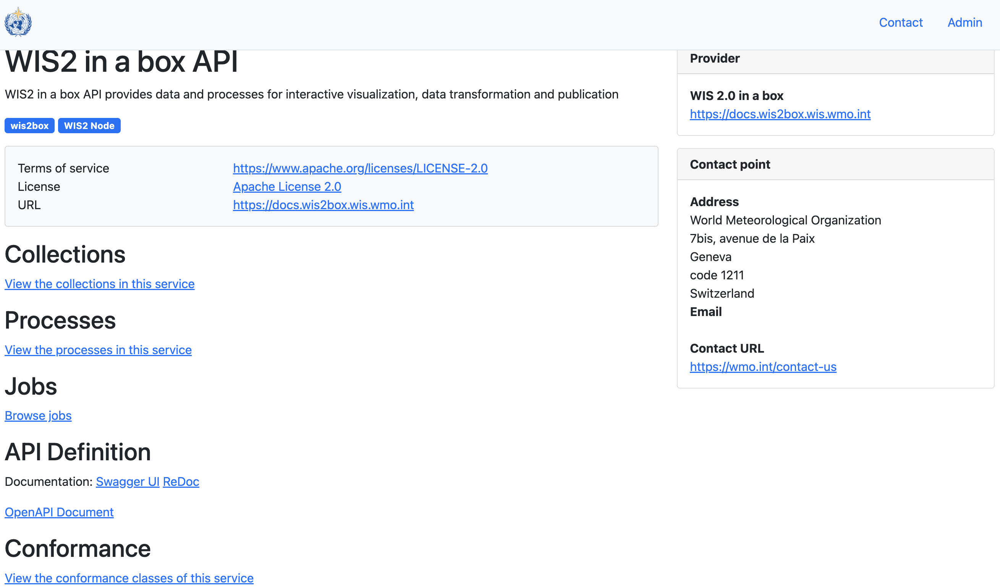
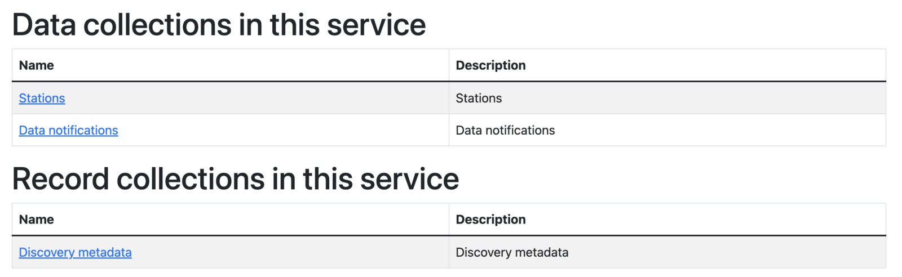
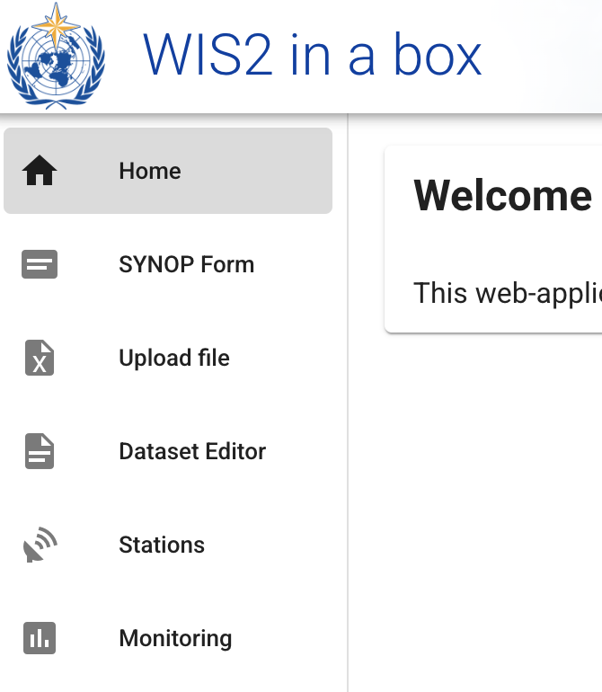
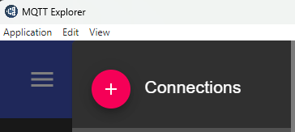
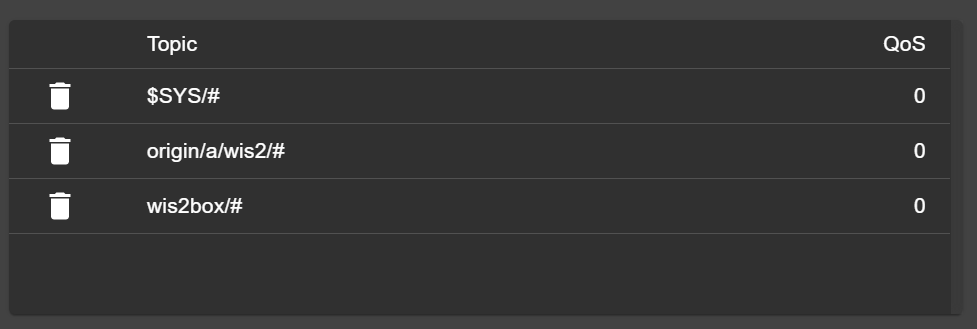

# 初始化 wis2box

!!! abstract "学习目标"

    完成本实践课程后，您将能够：

    - 运行 `wis2box-create-config.py` 脚本创建初始配置
    - 启动 wis2box 并检查其组件状态
    - 查看 **wis2box-api** 的内容
    - 访问 **wis2box-webapp**
    - 使用 MQTT Explorer 连接到本地 **wis2box-broker**

!!! note

    当前培训材料基于 wis2box-release 1.0.0。
    
    如果您在本地培训课程之外运行此培训，请参阅 [accessing-your-student-vm](accessing-your-student-vm.md) 了解如何下载和安装 wis2box 软件栈的说明。

## 准备工作

使用您的用户名和密码登录指定的虚拟机，并确保您在 `wis2box` 目录中：

```bash
cd ~/wis2box
```

## 创建初始配置

wis2box 的初始配置需要：

- 包含配置参数的环境文件 `wis2box.env`
- 主机上用于在主机和 wis2box 容器之间共享的目录，由 `WIS2BOX_HOST_DATADIR` 环境变量定义

可以使用 `wis2box-create-config.py` 脚本创建 wis2box 的初始配置。

它会问您一系列问题来帮助设置配置。

脚本完成后，您可以查看和更新配置文件。

按如下方式运行脚本：

```bash
python3 wis2box-create-config.py
```

### wis2box-host-data 目录

脚本会要求您输入用于 `WIS2BOX_HOST_DATADIR` 环境变量的目录。

请注意，您需要定义此目录的完整路径。

例如，如果您的用户名是 `username`，则目录的完整路径为 `/home/username/wis2box-data`：

```{.copy}
username@student-vm-username:~/wis2box$ python3 wis2box-create-config.py
Please enter the directory to be used for WIS2BOX_HOST_DATADIR:
/home/username/wis2box-data
The directory to be used for WIS2BOX_HOST_DATADIR will be set to:
    /home/username/wis2box-data
Is this correct? (y/n/exit)
y
The directory /home/username/wis2box-data has been created.
```

### wis2box URL

接下来，您需要输入 wis2box 的 URL。这是用于访问 wis2box 网络应用程序、API 和 UI 的 URL。

请使用 `http://<your-hostname-or-ip>` 作为 URL。

```{.copy}
Please enter the URL of the wis2box:
 For local testing the URL is http://localhost
 To enable remote access, the URL should point to the public IP address or domain name of the server hosting the wis2box.
http://username.wis2.training
The URL of the wis2box will be set to:
  http://username.wis2.training
Is this correct? (y/n/exit)
```

### WEBAPP、STORAGE 和 BROKER 密码

当系统提示输入 `WIS2BOX_WEBAPP_PASSWORD`、`WIS2BOX_STORAGE_PASSWORD`、`WIS2BOX_BROKER_PASSWORD` 时，您可以选择使用随机密码生成或自定义密码。

不用担心记住这些密码，它们会存储在 wis2box 目录中的 `wis2box.env` 文件中。

### 检查 `wis2box.env`

脚本完成后，检查当前目录中 `wis2box.env` 文件的内容：

```bash
cat ~/wis2box/wis2box.env
```

或通过 WinSCP 检查文件内容。

!!! question

    wis2box.env 文件中 WISBOX_BASEMAP_URL 的值是什么？

??? success "点击查看答案"

    WIS2BOX_BASEMAP_URL 的默认值是 `https://{s}.tile.openstreetmap.org/{z}/{x}/{y}.png`。

    此 URL 指向 OpenStreetMap 瓦片服务器。如果您想使用其他地图提供商，可以将此 URL 更改为指向不同的瓦片服务器。

!!! question 

    wis2box.env 文件中 WIS2BOX_STORAGE_DATA_RETENTION_DAYS 环境变量的值是多少？

??? success "点击查看答案"

    WIS2BOX_STORAGE_DATA_RETENTION_DAYS 的默认值是 30 天。如果需要，您可以将此值更改为不同的天数。
    
    wis2box-management 容器每天运行一个 cronjob，从 `wis2box-public` 存储桶和 API 后端删除超过 WIS2BOX_STORAGE_DATA_RETENTION_DAYS 定义天数的数据：
    
    ```{.copy}
    0 0 * * * su wis2box -c "wis2box data clean --days=$WIS2BOX_STORAGE_DATA_RETENTION_DAYS"
    ```

!!! note

    `wis2box.env` 文件包含定义 wis2box 配置的环境变量。更多信息请参考 [wis2box-documentation](https://docs.wis2box.wis.wmo.int/en/latest/reference/configuration.html)。

    除非您确定要进行的更改，否则不要编辑 `wis2box.env` 文件。不正确的更改可能导致 wis2box 停止工作。

    不要与任何人共享 `wis2box.env` 文件的内容，因为它包含密码等敏感信息。

## 启动 wis2box

确保您在包含 wis2box 软件栈定义文件的目录中：

```{.copy}
cd ~/wis2box
```

使用以下命令启动 wis2box：

```{.copy}
python3 wis2box-ctl.py start
```

首次运行此命令时，您将看到以下输出：

```
No docker-compose.images-*.yml files found, creating one
Current version=Undefined, latest version=1.0.0
Would you like to update ? (y/n/exit)
```

选择 `y`，脚本将创建文件 `docker-compose.images-1.0.0.yml`，下载所需的 Docker 镜像并启动服务。

下载镜像可能需要一些时间，具体取决于您的互联网连接速度。此步骤仅在首次启动 wis2box 时需要。

使用以下命令检查状态：

```{.copy}
python3 wis2box-ctl.py status
```

重复此命令，直到所有服务都启动并运行。

!!! note "wis2box 和 Docker"
    wis2box 作为一组由 docker-compose 管理的 Docker 容器运行。
    
    这些服务在 `~/wis2box/` 目录中的各个 `docker-compose*.yml` 文件中定义。
    
    Python 脚本 `wis2box-ctl.py` 用于运行控制 wis2box 服务的底层 Docker Compose 命令。

    您不需要了解 Docker 容器的详细信息就可以运行 wis2box 软件栈，但您可以检查 `docker-compose*.yml` 文件以查看服务是如何定义的。如果您想了解更多关于 Docker 的信息，可以在 [Docker 文档](https://docs.docker.com/) 中找到更多信息。

要登录到 wis2box-management 容器，请使用以下命令：

```{.copy}
python3 wis2box-ctl.py login
```

在 wis2box-management 容器内，您可以运行各种命令来管理您的 wis2box，例如：

- `wis2box auth add-token --path processes/wis2box`：为 `processes/wis2box` 端点创建授权令牌
- `wis2box data clean --days=<number-of-days>`：从 `wis2box-public` 存储桶中清理超过指定天数的数据

要退出容器并返回到主机，请使用以下命令：

```{.copy}
exit
```

运行以下命令查看主机上运行的 docker 容器：

```{.copy}
docker ps
```

您应该看到以下容器正在运行：

- wis2box-management
- wis2box-api
- wis2box-minio
- wis2box-webapp
- wis2box-auth
- wis2box-ui
- wis2downloader
- elasticsearch
- elasticsearch-exporter
- nginx
- mosquitto
- prometheus
- grafana
- loki

这些容器是 wis2box 软件栈的一部分，提供运行 wis2box 所需的各种服务。

运行以下命令查看主机上运行的 docker 卷：

```{.copy}
docker volume ls
```

您应该看到以下卷：

- wis2box_project_auth-data
- wis2box_project_es-data
- wis2box_project_htpasswd
- wis2box_project_minio-data
- wis2box_project_prometheus-data
- wis2box_project_loki-data
- wis2box_project_mosquitto-config

以及各个容器使用的一些匿名卷。

以 `wis2box_project_` 开头的卷用于存储 wis2box 软件栈中各种服务的持久数据。

## wis2box API

wis2box 包含一个 API（应用程序编程接口），提供数据访问和用于交互式可视化、数据转换和发布的处理功能。

打开新标签页并导航到 `http://YOUR-HOST/oapi` 页面。



这是 wis2box API（通过 **wis2box-api** 容器运行）的登录页面。

!!! question
     
     当前有哪些可用的集合？

??? success "点击查看答案"
    
    要查看当前通过 API 可用的集合，请点击 `View the collections in this service`：

    

    当前可用以下集合：

    - Stations
    - Data notifications
    - Discovery metadata


!!! question

    已发布了多少数据通知？

??? success "点击查看答案"

    点击 "Data notifications"，然后点击 `Browse through the items of "Data Notifications"`。
    
    您会注意到页面显示 "No items"，因为尚未发布任何数据通知。

## wis2box webapp

打开网络浏览器并访问 `http://YOUR-HOST/wis2box-webapp` 页面。

您会看到一个弹出窗口，要求输入用户名和密码。使用默认用户名 `wis2box-user` 和 `wis2box.env` 文件中定义的 `WIS2BOX_WEBAPP_PASSWORD`，然后点击"登录"：

!!! note 

    检查您的 wis2box.env 以获取 WIS2BOX_WEBAPP_PASSWORD 的值。您可以使用以下命令检查此环境变量的值：

    ```{.copy}
    cat ~/wis2box/wis2box.env | grep WIS2BOX_WEBAPP_PASSWORD
    ```

登录后，将鼠标移到左侧菜单上，查看 wis2box 网络应用程序中可用的选项：



这是 wis2box 网络应用程序，使您能够与 wis2box 交互：

- 创建和管理数据集
- 更新/审查站点元数据
- 使用 FM-12 synop 表单上传手动观测数据
- 监控在 wis2box-broker 上发布的通知

我们将在后续课程中使用此网络应用程序。

## wis2box-broker

在您的计算机上打开 MQTT Explorer，准备新的连接以连接到您的代理（通过 **wis2box-broker** 容器运行）。

点击 `+` 添加新连接：



您可以点击"ADVANCED"按钮，验证您是否订阅了以下主题：

- `#`
- `$SYS/#`



!!! note

    `#` 主题是一个通配符订阅，将订阅代理上发布的所有主题。

    在 `$SYS` 主题下发布的消息是 mosquitto 服务本身发布的系统消息。

使用以下连接详细信息，确保将 `<your-host>` 替换为您的主机名，将 `<WIS2BOX_BROKER_PASSWORD>` 替换为 `wis2box.env` 文件中的值：

- **Protocol: mqtt://**
- **Host: `<your-host>`**
- **Port: 1883**
- **Username: wis2box**
- **Password: `<WIS2BOX_BROKER_PASSWORD>`**

!!! note 

    您可以检查您的 wis2box.